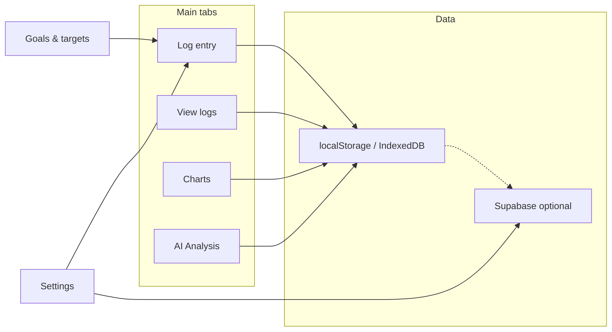
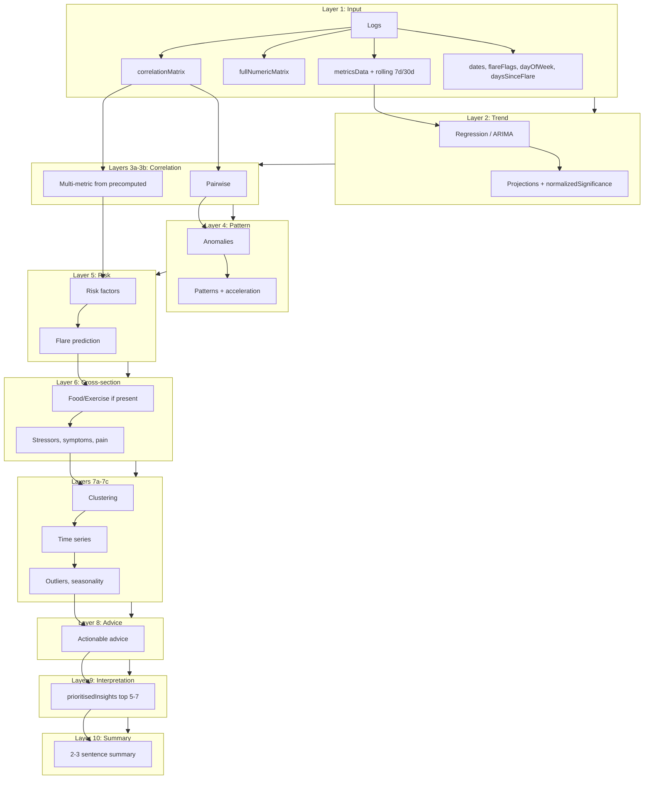
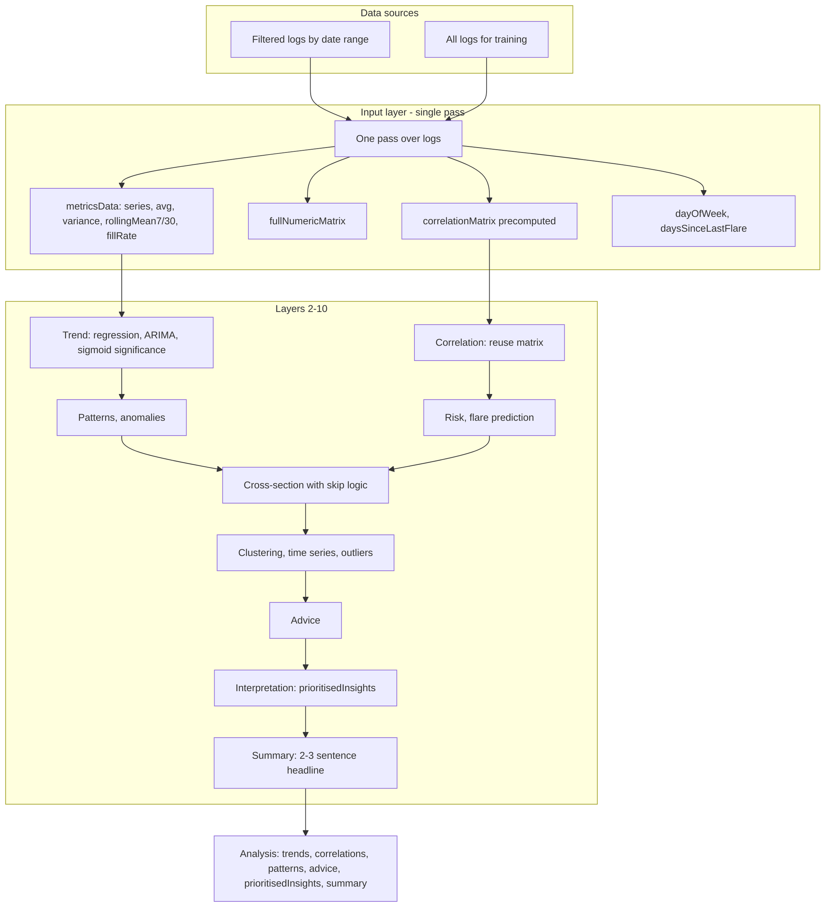

# Health App - Personal Health Dashboard

A comprehensive web-based health tracking application with data visualisation, analytics, and cloud synchronisation capabilities.

**Repository**: [https://github.com/Metaheurist/Health-app](https://github.com/Metaheurist/Health-app)

## App overview



## Features

### Core Functionality
- **Health Data Tracking**: Log daily health metrics including:
  - Heart rate (BPM)
  - Weight
  - Fatigue levels
  - Pain and stiffness ratings
  - Sleep quality
  - Mood and mental health indicators
  - Food intake and nutrition
  - Exercise activities
  - Medical condition tracking

- **Data visualisation**: Interactive charts and graphs showing:
  - Trends over time
  - Correlation analysis
  - Health pattern recognition
  - Seasonal and weekly patterns

- **Data Management**:
  - Export data to CSV/JSON
  - Import data from backups
  - Print reports
  - Clear/reset functionality

- **Cloud Sync**: 
  - Anonymised data contribution to Supabase
  - GDPR-compliant data sharing
  - Medical condition-based data aggregation
  - Goals and targets synced with app settings when signed in

- **Optional AI & Goals**: In Settings, "Enable AI features & Goals" can be turned off to hide the AI Analysis tab, chart predictions, and Goals. Tutorial first card lets new users enable or skip AI/Goals; skipping removes AI-related slides.

- **Reminders & sound**: Daily reminders at a configurable time; "Enable sound notifications" controls system notification sound and an in-app heartbeat-style sound when the app is in the foreground (including on mobile).

### Server Features (Testing & Development)
- **Local Development Server**: HTTP server for local testing
- **Supabase Integration**: Direct database management
- **Tkinter Dashboard**: GUI for server controls and data management
- **Data Operations**:
  - Search anonymised data by medical condition
  - Delete data (all, by condition, or by IDs)
  - Export data to CSV
  - Real-time database viewer

## Project structure

- **`web/`** – Static web app: HTML, CSS, JavaScript, icons, and assets. The server serves this directory at the root URL.
- **`server/`** – Python server package (main server logic in `main.py`, plus config, encryption, Supabase client, sample data, requirements checks). Run from repo root: **`python -m server`**.

## Installation

### Prerequisites
- Python 3.8 or higher
- Modern web browser (Chrome, Firefox, Edge, Safari)
- Supabase account (for cloud sync features)

### Setup

1. **Clone the repository**
   ```bash
   git clone https://github.com/Metaheurist/Health-app.git
   cd Health-app
   ```

2. **Install Python dependencies**
   ```bash
   pip install -r requirements.txt
   ```

3. **Configure environment variables**
   - Copy `.env.example` to `.env`
   - Edit `.env` and add your Supabase credentials:
     ```env
     PORT=8080
     HOST=
     SUPABASE_URL=your_supabase_url_here
     SUPABASE_ANON_KEY=your_supabase_anon_key_here
     ```

4. **Configure Supabase (for frontend)**
   - Edit `supabase-config.js` with your Supabase credentials
   - ⚠️ **Important**: Use the PUBLISHABLE/ANON key, NOT the secret key!

## Usage

### Running the Server

Start the development server:

```bash
python -m server
```

The server will:
- Start on `http://localhost:8080` (or your configured PORT)
- Open your browser automatically
- Display a Tkinter dashboard for server controls
- Enable file watching for auto-reload (if watchdog is installed)

### Accessing the App

1. **Local Development**: Open `http://localhost:8080` in your browser
2. **Network Access**: Use your local IP address (shown in server console)
3. **Production**: Deploy files to a web server (no local server needed)

### GitHub Pages (app at repo root)

The app lives in **`web/`**, so GitHub Pages will not see `index.html` if the source is the repo root. To serve the app from GitHub Pages (e.g. `https://<user>.github.io/Health-app/`):

1. In the repo: **Settings → Pages**
2. Under **Build and deployment**, set **Source** to **GitHub Actions**
3. The workflow [`.github/workflows/deploy-pages.yml`](.github/workflows/deploy-pages.yml) runs on push to `main` and deploys the contents of **`web/`** as the site root, so `index.html` is served correctly.

**Cloud sync on the live site:** To use Supabase (login, cloud backup, anonymised data) on the GitHub Pages site, add **Repository secrets** (or **Environment secrets** for the `pages` environment): **`SUPABASE_URL`** (your project URL, e.g. `https://xxxx.supabase.co`) and **`SUPABASE_ANON_KEY`** (your publishable anon key). The deploy workflow injects these into the built site at deploy time so they are never committed. If these secrets are not set, the site still deploys; cloud features will work only after you add them.

After the first push (or a manual **Run workflow**), the site will show the Health Dashboard instead of the README.

## React shell & Android APK

The app can be run as a **React (Vite) app** that wraps the existing web UI and be built into an **Android APK** via Capacitor. The GitHub Action **Build Android APK** runs on every push to `main`/`master`, output to **`App build/Android/`** and **`App build/iOS/`**, and makes it available in the app’s Settings.

### In-app installation (Settings)

- **Install web app** (globe icon): Install the app as a PWA / standalone web app.
- **Install on Android** (Android icon): Download the latest Android APK. When the app is served from the same origin (e.g. GitHub Pages), the link uses the newest build from **`App build/Android/`** (see `latest.json`).
- **Install on iOS / iPhone / iPad**: On iPhone or iPad, open the site in Safari and use **“Install on this iPhone”** or **“Install on this iPad”** in Settings to add the app to your Home Screen (one-tap flow; works offline like a native app). Alternatively, download the Xcode project zip from **Install on iOS** and build to your device in Xcode. If a signed .ipa is provided in **`App build/iOS/`** (with `installUrl` in `latest.json`), **Install on iOS** becomes a one-tap native install from the site.

### Local setup (optional)

- **Node.js 18+**
- From repo root:
  ```bash
  npm install
  cd react-app && npm install
  npm run copy-webapp   # copies web app into react-app/public/legacy
  npm run build        # builds React app into react-app/dist
  ```
- To add the Android project (one-time, then commit `react-app/android/` if you want):
  ```bash
  cd react-app && npx cap add android
  node patch-android-sdk.js   # optional: set minSdk 22, targetSdk 34
  npx cap sync android
  ```
- Open in Android Studio: `cd react-app && npx cap open android`

### Android targets

- **minSdk 22** (Android 5.1) for broad device support.
- **targetSdk 34** (Android 14) for current store requirements.  
Controlled in `react-app/android/variables.gradle` (or via `react-app/patch-android-sdk.js`).

### CI: App builds on each commit

- **Android** workflow: [`.github/workflows/build-android-apk.yml`](.github/workflows/build-android-apk.yml)
- **iOS** workflow: [`.github/workflows/build-ios.yml`](.github/workflows/build-ios.yml) — builds a **simulator .app** (no Apple account; test in Xcode Simulator on a Mac) and zips the Xcode project to `App build/iOS/` for device sideloading (open in Xcode, sign with your Apple ID). Device signing for direct install (OTA) requires an Apple Developer account ($99/year).
- On **push** or **pull_request** to `main` or `master`: builds the web app, syncs Capacitor, builds a **debug APK**, copies it into **`App build/Android/`**, and uploads the **android** artifact (zip containing `apk/app-debug.apk`).
- On **push** (not PR) to `main`/`master`: the workflow also **commits** the `App build/Android/` folder to the repo with `[skip ci]`, so the “Install on Android” link in Settings works when the app is served from the same repo (e.g. GitHub Pages).
- Download the APK from the run’s **Summary → Artifacts** (name **android**), or use **Settings → Install on Android / Install on iOS** in the deployed app.

### Using the Health Dashboard

1. **Add Daily Entries**:
   - Click "Add Entry" button
   - Fill in health metrics for the day
   - Add food items and exercises
   - Save the entry

2. **View Analytics**:
   - Navigate to the Analytics section
   - View charts showing trends
   - Analyse correlations between metrics

3. **Manage Data**:
   - Export data: Settings → Export Data
   - Import data: Settings → Import Data
   - Clear all data: Settings → Clear All Data

4. **Cloud Sync**:
   - Enable "Contribute anonymised data" in Settings
   - Accept GDPR agreement
   - Data will be anonymised and synced to Supabase

### Server Dashboard Features

The Tkinter dashboard provides:

1. **Server Status**:
   - View server URL and status
   - Restart server without closing dashboard

2. **Supabase Database Management**:
   - **Search**: Search anonymised data by medical condition
   - **Delete**: Remove data (all, by condition, or specific IDs)
   - **Export**: Export data to CSV files
   - **Viewer**: Real-time database viewer showing last 100 records

3. **Server Logs**: Real-time log viewer

## Testing Data

### Generate Sample Data

The server includes sample data generation:

1. **CSV Export**: Generate sample CSV files for testing
   - Use the "Generate CSV File" button in the server dashboard
   - Configure number of days and base weight
   - Output saved to `health_data_sample.csv`

2. **Database Testing**: 
   - Use Supabase search to find test data
   - Export data for analysis
   - Delete test data when done

### Sample Data Structure

Sample data includes realistic patterns:
- Seasonal variations (winter worse, summer better)
- Weekly patterns (weekends better)
- Flare-up cycles for chronic conditions
- Correlated metrics (sleep affects fatigue, etc.)

## Configuration

### Environment Variables (.env)

| Variable | Description | Default |
|----------|-------------|---------|
| `PORT` | Server port | `8080` |
| `HOST` | Server host (empty = all interfaces) | `` |
| `SUPABASE_URL` | Your Supabase project URL | Required |
| `SUPABASE_ANON_KEY` | Your Supabase anon/publishable key | Required |

### Supabase Setup

1. Create a Supabase project at [supabase.com](https://supabase.com)
2. Get your project URL and anon key from Settings → API
3. Create the `anonymized_data` table:
   ```sql
   CREATE TABLE anonymized_data (
     id BIGSERIAL PRIMARY KEY,
     medical_condition TEXT NOT NULL,
     anonymized_log JSONB NOT NULL,
     created_at TIMESTAMP DEFAULT NOW(),
     updated_at TIMESTAMP DEFAULT NOW()
   );
   ```
4. Add your credentials to `.env` and `supabase-config.js`

## AI Analysis: Neural Network Architecture

The AI analysis engine runs as a **neural-style pipeline**: each layer applies existing logic (regression, correlation, prediction, etc.) as activator functions. The design aims to **use as much of your collected data as possible** to deliver **meaningful health insights** (trends, early signals, correlations, and actionable advice). A detailed expansion and optimisation plan is in [docs/NEURAL_NETWORK_PLAN.md](docs/NEURAL_NETWORK_PLAN.md).

### Planned objectives

- **Richer input**: One pass over all logs to build metricsData, rolling 7d/30d baselines, day-of-week, days-since-flare, fill-rate, and a **precomputed correlation matrix** so downstream layers avoid redundant work.
- **Optimisation**: Correlation matrix computed once in the input layer; correlation layers **reuse** it. Cross-section layer **skips** food/exercise analysis when no food or exercise entries exist.
- **Interpretation**: A dedicated layer **ranks and deduplicates** anomalies, risk factors, correlations, and patterns into **prioritisedInsights** (top 5–7 items) so “what matters most” is clear.
- **Summary**: A **summary** layer produces a short 2–3 sentence plain-language headline from trends, risk, and advice.
- **Activations**: Trend significance is normalised (e.g. sigmoid(r²)) for consistent scoring; activations (sigmoid, tanh, relu, softmax) are available for bounding and ranking.

### Analysis pipeline (forward pass)



### Data flow: from logs to insights



### Layer summary

| Layer | Role | Data used | Activator functions |
|-------|------|-----------|---------------------|
| 1 Input | Feature space in one pass | All training + recent logs | metricsData (with rollingMean7/30, fillRate), fullNumericMatrix, correlationMatrix, dates, flareFlags, dayOfWeek, daysSinceLastFlare |
| 2 Trend | Per-metric trends and predictions | Full training series per metric | Linear/polynomial regression, ARIMA, predictFutureValues, normalizedSignificance (sigmoid) |
| 3a–3b | Pairwise + multi-metric correlation | Precomputed matrix or training logs | detectCorrelations, detectMultiMetricCorrelations (uses precomputed when available) |
| 4 Pattern | Anomalies and patterns | Recent logs | detectAnomalies, detectPatterns, detectTrendAcceleration |
| 5 Risk | Risk factors and flare prediction | Training logs | assessRiskFactors, predictFlareUps |
| 6 Cross-section | Food, exercise, stressors, symptoms | Larger of training/recent; **skip** food/exercise if none logged | analyzeFoodExerciseImpact (guarded), analyzeStressorsImpact, analyzeSymptomsAndPainLocation, analyzeCrossSectionCorrelations |
| 7a–7c | Clustering, time series, outliers | Training logs | performClustering, performTimeSeriesAnalysis, detectOutliers, detectSeasonality |
| 8 Output | Advice | Recent logs + trends | generateActionableAdvice |
| 9 Interpretation | Prioritise and dedupe | analysis.anomalies, riskFactors, correlations, patterns | Score, dedupe, set prioritisedInsights (top 7) |
| 10 Summary | Plain-language headline | trends, risk, patterns, advice | Set analysis.summary (2–3 sentences) |

### How we use your data for meaningful insights

- **Full history**: Training logs (all available data) are used for regression, correlation matrix, clustering, time series, and flare prediction so insights reflect long-term patterns, not just the last few days.
- **Rolling baselines**: 7-day and 30-day rolling means per metric support future “vs your baseline” comparisons and stability checks.
- **Temporal context**: Day-of-week and days-since-last-flare are computed once and available for pattern and seasonality layers.
- **Prioritised list**: Anomalies and risk factors are ranked above correlations and patterns; duplicates are removed so the UI can show a short “what matters most” list.
- **Summary**: The final summary sentence is generated from improving/worsening trends, the top risk or pattern, and one piece of advice so the user gets a quick takeaway.

Activation functions (sigmoid, tanh, relu, softmax) are available as `AIEngine.activations`. The network constructor is `AIEngine.NeuralAnalysisNetwork`. Detailed plan: [docs/NEURAL_NETWORK_PLAN.md](docs/NEURAL_NETWORK_PLAN.md).

---

## Project Structure

```
Health-app/
├── index.html              # Main application HTML
├── app.js                  # Core application logic
├── AIEngine.js             # AI analysis (neural pipeline, regression, correlation, predictions)
├── styles.css              # Application styles
├── cloud-sync.js           # Supabase synchronisation
├── supabase-config.js      # Supabase configuration
├── summary-llm.js          # In-browser LLM for AI summary note (Transformers.js)
├── notifications.js        # Reminders, notification permission, heartbeat sound
├── notification-helpers.js # Permission UI and reminder time
├── requirements.txt        # Python dependencies
├── package.json            # Root scripts (build, sync, android)
├── docs/                   # Documentation
│   └── NEURAL_NETWORK_PLAN.md   # AI expansion and optimisation plan
├── .github/workflows/      # CI (e.g. Build Android APK)
├── react-app/              # React (Vite) + Capacitor shell for Android
│   ├── src/                # React entry and iframe wrapper
│   ├── android/            # Capacitor Android project (optional to commit)
│   ├── copy-webapp.js      # Copies web app into public/legacy
│   ├── patch-android-sdk.js
│   └── capacitor.config.ts
├── App build/              # Built apps (filled by CI; committed for download links)
│   ├── Android/           # APK + latest.json
│   └── iOS/               # Xcode project zip + latest.json
├── .env                    # Environment variables (not in git)
├── .env.example            # Environment template
├── logs/                   # Server logs
└── [other JS files]        # Additional functionality
```

## Dependencies

### Python (server package)
- `supabase>=2.0.0` - Supabase client library
- `watchdog>=3.0.0` - File watching for auto-reload
- `python-dotenv>=1.0.0` - Environment variable management

### JavaScript (Frontend)
- No external dependencies required for the main web app (vanilla JavaScript)
- Uses browser APIs and Supabase JS client
- Font Awesome 6 (CDN) for icons

### Node.js (optional: React & Android)
- Used only for the React/Capacitor build and Android APK. See **React shell & Android APK**.
- Root `package.json`: scripts for `build`, `build:android`, `sync`, `dev`
- `react-app/`: Vite, React, Capacitor; run `npm run build` from repo root

## Development

### File Watching
The server automatically reloads when files change (if watchdog is installed):
```bash
pip install watchdog
```

### Logging
Server logs are saved to `logs/health_app_YYYYMMDD.log`

### Browser Compatibility
- Chrome/Edge (recommended)
- Firefox
- Safari
- Mobile browsers (responsive design)

## GDPR Compliance

The app includes GDPR-compliant data sharing:
- Explicit user consent required
- Data anonymisation before upload
- Clear privacy agreement
- User can disable at any time

## Troubleshooting

### Server Issues

**Port already in use**:
- Change `PORT` in `.env` or close the application using port 8080

**Supabase connection failed**:
- Verify credentials in `.env` and `supabase-config.js`
- Check Supabase project is active
- Ensure using publishable key, not secret key

**Tkinter dashboard not opening**:
- Install tkinter: `sudo apt-get install python3-tk` (Linux)
- On Windows/Mac, tkinter usually comes with Python

### App Issues

**Data not saving**:
- Check browser console for errors
- Verify localStorage is enabled
- Check browser storage quota

**Charts not displaying**:
- Check browser console for JavaScript errors
- Ensure data entries exist
- Try clearing browser cache

## Security Notes

⚠️ **Important Security Considerations**:

1. **Never commit sensitive files**:
   - `.env` (contains Supabase credentials)
   - `supabase-config.js` (contains API keys)

2. **Use environment variables** for production deployments

3. **Supabase Keys**: Always use PUBLISHABLE/ANON keys in frontend code, never secret keys

4. **Data Privacy**: Anonymised data sharing is opt-in only

## Author

**Metaheurist** - Sole developer and maintainer

- GitHub: [@Metaheurist](https://github.com/Metaheurist)
- Repository: [https://github.com/Metaheurist/Health-app](https://github.com/Metaheurist/Health-app)

## Licence

This project is open source and available under an open source licence.

## Repository

**GitHub**: [https://github.com/Metaheurist/Health-app](https://github.com/Metaheurist/Health-app)

## Support

For issues and questions:
- Check the troubleshooting section
- Review server logs in `logs/` directory
- Check browser console for frontend errors

## Changelog

Changelog is derived from project commit history. Versions follow semantic versioning (major.minor.patch). Expand a section to see details.

<details>
<summary><strong>v1.13.9</strong> — 2026-02-23 — Throttle preload to avoid UI freeze</summary>

- **Chart preload**: Combined chart and individual charts no longer run in one blocking burst. Combined chart is deferred with `requestIdleCallback` (or `setTimeout(0)`); a 220 ms gap follows before the first individual chart; each subsequent chart is staggered by 180 ms (was 80 ms) so the app stays responsive.
- **AI preload**: An extra idle callback (or short delay) before running AI preload ensures the sync work does not block the same frame as chart preload or startup.

</details>

<details>
<summary><strong>v1.13.8</strong> — 2026-02-23 — Device-based optimisation, chart & AI preload</summary>

- **Device opts**: `PerformanceUtils.getDeviceOpts()` in `performance-utils.js` returns `{ reduceAnimations, maxChartPoints, deferAI, batchDOM }` from device class and `prefersReducedMotion`. Low: 30 chart points, animations off, AI deferred; medium: 80 points, batch DOM; high: 200 points, full features.
- **Charts**: All chart options (combined, balance, individual) preload in the background when the Charts tab is opened so switching view is instant. Chart data point caps and animation toggles use `getDeviceOpts()` (and existing viewport caps). Combined and balance charts respect `reduceAnimations`; individual charts use device-based max points.
- **AI analysis**: AI analysis runs in the background (e.g. after load) and is cached so opening the AI tab shows results immediately when the cache matches the date range. On low devices (`deferAI`), the summary note uses the rule-based fallback only (no in-browser LLM load); AI tab open delay is increased to avoid blocking.
- **Log list**: `renderLogEntries` uses `domBatcher.schedule()` when `batchDOM` is true (low/medium) for fewer layout thrashing and smoother scrolling.
- **UI motion**: Heartbeat animation and AI summary UI respect `reduceAnimations` (and existing `prefersReducedMotion` / optimisation profile) so low-end and reduced-motion users get a calmer experience.

</details>

<details>
<summary><strong>v1.13.7</strong> — 2026-02-23 — Version bump</summary>

- **Version**: Bump to 1.13.7 for release tracking.

</details>

<details>
<summary><strong>v1.13.6</strong> — 2026-02-23 — README and changelog</summary>

- **README**: Changelog updated with version summaries; UK English retained.
- **Versioning**: Bump to v1.13.6 for documentation and release tracking.

</details>

<details>
<summary><strong>v1.13.5</strong> — 2026-02-23 — Per-platform optimisation and hardware detection</summary>

- **Platform and capabilities**: Central layer in `performance-utils.js` exposes `PerformanceUtils.platform` (and `window.PlatformCapabilities`) with `deviceClass` ('low' | 'medium' | 'high'), `platform` (ios/android/desktop), `isTouch`, `isStandalone`, `prefersReducedMotion`, and optional `connection`. Single source of truth for hardware and platform used by LLM and charts.
- **Lazy-load LLM on low-end**: On low device class, `summary-llm.js` is not loaded in initial page; it is loaded on demand when the user first uses AI (Summary note or Suggest note). Medium/high devices load it up front for snappier AI.
- **Chart optimisations**: Charts use `deviceClass` to cap data points (low → max 30 points; medium/high keep existing 50/30 by viewport). When `prefersReducedMotion` is true, ApexCharts animations are disabled for that chart.

</details>

<details>
<summary><strong>v1.13.4</strong> — 2026-02-23 — LLM model by device performance</summary>

- **Summary/Suggest LLM**: In-browser model is now chosen by device performance (RAM, CPU cores, mobile heuristic). Low-end and mobile use flan-t5-small; medium/high use flan-t5-base for better quality. Pipeline is cached by model id. If flan-t5-base fails to load, the app retries once with flan-t5-small before falling back to rule-based note.

</details>

<details>
<summary><strong>v1.13.3</strong> — 2026-02-23 — Summary note and Suggest note LLM improvements</summary>

- **Summary note**: Improved LLM prompt and context for a clearer, patient-friendly 2–3 sentence summary; optional line from top stressor in context; strip trailing incomplete sentences from output.
- **Suggest note (log entry)**: "Suggest note" now uses the in-browser LLM (same model as Summary note) when available, with rule-based fallback; short timeout and token limit for snappy response; "Generating…" on button during LLM call.
- **Optimisation**: Shared LLM pipeline for both Summary and Suggest note; no duplicate model load.

</details>

<details>
<summary><strong>v1.13.2</strong> — 2026-02-23 — CI: fix iOS/Android build push</summary>

- **CI**: iOS and Android build workflows now fetch and rebase onto `origin/main` before committing, so the "Update iOS build" / "Update Android APK" push no longer fails when `main` has moved (remote rejected: expected older commit). Removed stash-based rebase; commit is made on top of latest `main`.

</details>

<details>
<summary><strong>v1.13.1</strong> — 2026-02-23 — AI summary value highlighting, README UK English</summary>

- **AI summary readability**: Stress and triggers, Symptoms and where you had pain, Pain patterns, Pain by body part, Nutrition, Exercise, Top foods, and Top exercises now use the same value markup as “What we found” (e.g. `ai-brackets-highlight` for parenthesised values, percentages, and counts) so key figures are easier to scan.
- **README**: Converted to UK English (e.g. visualisation, synchronisation, anonymised, analyse, licence).

</details>

<details>
<summary><strong>v1.13.0</strong> — 2026-02-23 — AI optional, summary LLM, notifications</summary>

- **AI optional**: Settings toggle "Enable AI features & Goals" – when off, hides AI Analysis tab, chart predictions, and Goals (targets button and progress). Stored in settings and synced to cloud.
- **Tutorial**: First card "Enable AI & Goals?" (Enable / Skip for now). If skipped, all AI-related tutorial slides are omitted (View & AI, Settings & data, Data options, Goals).
- **Summary LLM**: In-browser small LLM (Transformers.js, flan-t5-small) for the AI summary note; data-rich context (trends, flares, insights) for short, insightful 2–3 sentence summary. Fallback to rule-based note on error or timeout.
- **Goals & cloud**: Goals and targets saved to cloud (Supabase app_settings) with localStorage; sync on save and on load when signed in.
- **Notifications**: "Enable sound notifications" now respected – notifications use `silent: false` when sound is on (including on mobile). Heartbeat-monitor style sound (Web Audio, lub-dub) plays when reminder fires and app is in foreground, and when enabling sound in Settings. AudioContext unlocked on permission request for mobile.
- **Server**: No server files in repo root; run with `python -m server` (see v1.12.0).

</details>

<details>
<summary><strong>v1.12.0</strong> — 2026-02-23 — Security, CI & docs</summary>

- **Security**: Remove exposed Supabase URL/keys and default encryption key from repo; rewrite git history to redact secrets; document connecting your own API and encryption keys.
- **GitHub Pages**: Deploy workflow injects Supabase config from repository secrets so production site works without committing credentials.
- **Server**: Move server logic into `server/` package; root entry point removed (run with `python -m server`).
- **Install modal**: Post-tutorial install modal (shown once) with web/Android/iOS install options; added to God mode – test all UI.
- **UK English**: User-facing copy and docs use UK spelling (anonymised, optimisation, centre, etc.); schema/code identifiers unchanged.
- **CI**: Android/iOS workflows use pull–rebase before push and stash to avoid unstaged-changes errors; Android compileSdk set to 36.
- **Builds**: Android APK and iOS (Xcode project zip, simulator) output to `App build/Android/` and `App build/iOS/` with `latest.json`; Settings modal uses newest build.
- **README**: Changelog in collapsible sections; God mode and post-tutorial install modal documented.

</details>

<details>
<summary><strong>v1.11.0</strong> — 2026-02-22 — React shell & neural pipeline</summary>

- **React & Android**: React (Vite) shell wrapping web app in iframe; Capacitor 6 for Android; GitHub Actions build APK on push to `main`, output to `App build/Android/`.
- **AI**: Neural-style pipeline for AIEngine (layers: input, trend, correlation, pattern, risk, cross-section, advice, interpretation, summary).
- **UI**: Install web app (PWA) and Install on Android in Settings; styles and README updates.

</details>

<details>
<summary><strong>v1.10.0</strong> — 2026-02-19 — Goals, medications & sharing</summary>

- **Features**: Goals and targets (steps, hydration, sleep, good days); medications; offline queue; sharing.
- **Demo**: Improved flare modelling and smoothing in demo data.

</details>

<details>
<summary><strong>v1.9.0</strong> — 2026-02-18 — Settings & modals</summary>

- **Settings**: Refactor settings modal, tabs and UI styles.
- **Modals**: Fix modal open/close, expose handlers, delegate clicks correctly.

</details>

<details>
<summary><strong>v1.8.0</strong> — 2026-02-03 — Sharing, consent & God mode</summary>

- **Sharing**: Sharing UI and AI PDF export.
- **Consent**: Cookie consent banner; GDPR/cookie policy.
- **Testing**: God mode – test all UI (backtick ` key) to trigger tabs, modals, charts, AI range, form sections.
- **AI**: Enhanced AI analysis and flare detection; UI improvements.

</details>

<details>
<summary><strong>v1.7.0</strong> — 2026-02-02 — Tutorial</summary>

- **Onboarding**: Tutorial for new users; UI updates; tutorial mode (slides: Welcome, Log Entry, View & AI, Settings & data, Data options, Goals, You're all set).

</details>

<details>
<summary><strong>v1.6.0</strong> — 2026-02-01 — Food, pain & UI</summary>

- **Food**: New food log input via tiles; food variety update.
- **Pain**: New pain diagram model; joints in pain diagram.
- **UI**: General UI fixes and app.js updates.

</details>

<details>
<summary><strong>v1.5.0</strong> — 2026-01-05 — Setup</summary>

- Setup added (documentation/setup flow).

</details>

<details>
<summary><strong>v1.4.0</strong> — 2026-01-03 — Cloud & server</summary>

- **Cloud**: User-specific encryption and cloud data management.
- **Server**: Server UI with DB control; bug fixes.
- **Repo**: Remove ignored files from Git tracking.

</details>

<details>
<summary><strong>v1.3.0</strong> — 2026-01-02 — AI & anonymised data</summary>

- **AI**: Optimised AI engine with new models and model selection.
- **Data**: Anonymous dataserver for global prediction models.
- **Server**: Test server multithread; filters fixed.
- **Docs**: README and app documentation updates.

</details>

<details>
<summary><strong>v1.2.0</strong> — 2026-01-01 — Stability & security</summary>

- **Security**: Security update.
- **UI**: Settings modal consistent layer; mobile UI optimisation; UI fixes; UI glitches fixed.
- **Server**: Logger error fixed for multithread.
- **Misc**: Caching bug fixed; demo mode logger updates; log file updates.

</details>

<details>
<summary><strong>v1.1.0</strong> — 2025-12-31 — Cloud, AI models & demo</summary>

- **Cloud**: Cloud sync; SHA-256 for data; Google Drive sync.
- **AI**: Custom condition and tailored LLM; new models (Xenova/LaMini-Flan-T5-783M, GPT, ONNX medical notes); model caching and config; prediction models and data filters; model reset; filters for graphs; BPM animation and AI analysis in view logs.
- **Data**: Data sample script; handling for no data; data deletion protocol; incompatibility fix on imported data.
- **Features**: Demo mode; exercise and food track; optimised prediction patterns and log cards.
- **Fixes**: Stack overflow for encryption solved; AIEngine and app.js updates.

</details>

<details>
<summary><strong>v1.0.0</strong> — 2025-12-30 — Initial release</summary>

- **Core**: Initial commit; health tracking; data visualisation; server for development/testing.
- **AI**: New container for AI logic; AI modal (fixed and UI updates).
- **UI**: Settings and text highlight fix; UI updates; old build added.

</details>


