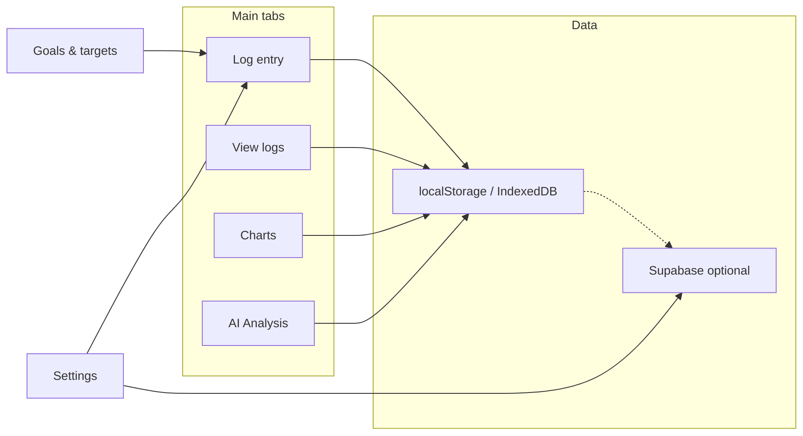
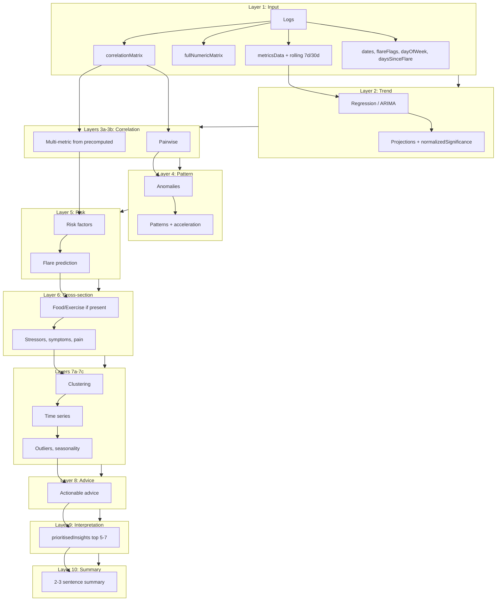
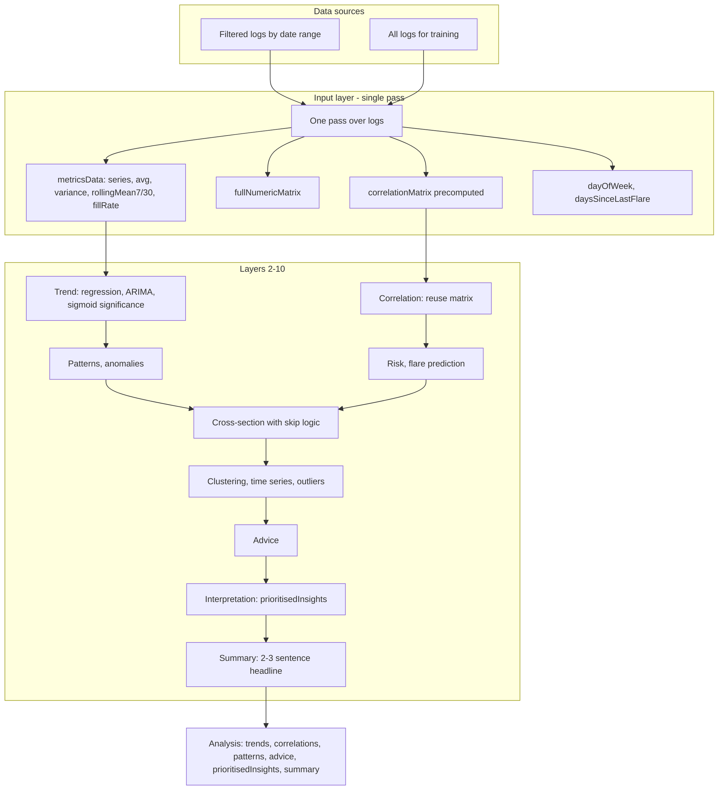

# Health App - Personal Health Dashboard

A comprehensive web-based health tracking application with data visualization, analytics, and cloud synchronization capabilities.

**Repository**: [https://github.com/Metaheurist/Health-app](https://github.com/Metaheurist/Health-app)

## App overview



## Features

### Core Functionality
- **Health Data Tracking**: Log daily health metrics including:
  - Heart rate (BPM)
  - Weight
  - Fatigue levels
  - Pain and stiffness ratings
  - Sleep quality
  - Mood and mental health indicators
  - Food intake and nutrition
  - Exercise activities
  - Medical condition tracking

- **Data Visualization**: Interactive charts and graphs showing:
  - Trends over time
  - Correlation analysis
  - Health pattern recognition
  - Seasonal and weekly patterns

- **Data Management**:
  - Export data to CSV/JSON
  - Import data from backups
  - Print reports
  - Clear/reset functionality

- **Cloud Sync**: 
  - Anonymized data contribution to Supabase
  - GDPR-compliant data sharing
  - Medical condition-based data aggregation

### Server Features (Testing & Development)
- **Local Development Server**: HTTP server for local testing
- **Supabase Integration**: Direct database management
- **Tkinter Dashboard**: GUI for server controls and data management
- **Data Operations**:
  - Search anonymized data by medical condition
  - Delete data (all, by condition, or by IDs)
  - Export data to CSV
  - Real-time database viewer

## Project structure

- **`web/`** – Static web app: HTML, CSS, JavaScript, icons, and assets. The server serves this directory at the root URL.
- **`server/`** – Python server package (main server logic in `main.py`, plus config, encryption, Supabase client, sample data, requirements checks). Entry point from repo root: **`python server.py`** or **`python -m server`**.

## Installation

### Prerequisites
- Python 3.8 or higher
- Modern web browser (Chrome, Firefox, Edge, Safari)
- Supabase account (for cloud sync features)

### Setup

1. **Clone the repository**
   ```bash
   git clone https://github.com/Metaheurist/Health-app.git
   cd Health-app
   ```

2. **Install Python dependencies**
   ```bash
   pip install -r requirements.txt
   ```

3. **Configure environment variables**
   - Copy `.env.example` to `.env`
   - Edit `.env` and add your Supabase credentials:
     ```env
     PORT=8080
     HOST=
     SUPABASE_URL=your_supabase_url_here
     SUPABASE_ANON_KEY=your_supabase_anon_key_here
     ```

4. **Configure Supabase (for frontend)**
   - Edit `supabase-config.js` with your Supabase credentials
   - ⚠️ **Important**: Use the PUBLISHABLE/ANON key, NOT the secret key!

## Usage

### Running the Server

Start the development server:

```bash
python server.py
```

The server will:
- Start on `http://localhost:8080` (or your configured PORT)
- Open your browser automatically
- Display a Tkinter dashboard for server controls
- Enable file watching for auto-reload (if watchdog is installed)

### Accessing the App

1. **Local Development**: Open `http://localhost:8080` in your browser
2. **Network Access**: Use your local IP address (shown in server console)
3. **Production**: Deploy files to a web server (no server.py needed)

### GitHub Pages (app at repo root)

The app lives in **`web/`**, so GitHub Pages will not see `index.html` if the source is the repo root. To serve the app from GitHub Pages (e.g. `https://<user>.github.io/Health-app/`):

1. In the repo: **Settings → Pages**
2. Under **Build and deployment**, set **Source** to **GitHub Actions**
3. The workflow [`.github/workflows/deploy-pages.yml`](.github/workflows/deploy-pages.yml) runs on push to `main` and deploys the contents of **`web/`** as the site root, so `index.html` is served correctly

After the first push (or a manual **Run workflow**), the site will show the Health Dashboard instead of the README.

## React shell & Android APK

The app can be run as a **React (Vite) app** that wraps the existing web UI and be built into an **Android APK** via Capacitor. The GitHub Action **Build Android APK** runs on every push to `main`/`master`, output to **`App build/Android/`** and **`App build/iOS/`**, and makes it available in the app’s Settings.

### In-app installation (Settings)

- **Install web app** (globe icon): Install the app as a PWA / standalone web app.
- **Install on Android** (Android icon): Download the latest Android APK. When the app is served from the same origin (e.g. GitHub Pages), the link uses the newest build from **`App build/Android/`** (see `latest.json`).
- **Install on iOS / iPhone / iPad**: On iPhone or iPad, open the site in Safari and use **“Install on this iPhone”** or **“Install on this iPad”** in Settings to add the app to your Home Screen (one-tap flow; works offline like a native app). Alternatively, download the Xcode project zip from **Install on iOS** and build to your device in Xcode. If a signed .ipa is provided in **`App build/iOS/`** (with `installUrl` in `latest.json`), **Install on iOS** becomes a one-tap native install from the site.

### Local setup (optional)

- **Node.js 18+**
- From repo root:
  ```bash
  npm install
  cd react-app && npm install
  npm run copy-webapp   # copies web app into react-app/public/legacy
  npm run build        # builds React app into react-app/dist
  ```
- To add the Android project (one-time, then commit `react-app/android/` if you want):
  ```bash
  cd react-app && npx cap add android
  node patch-android-sdk.js   # optional: set minSdk 22, targetSdk 34
  npx cap sync android
  ```
- Open in Android Studio: `cd react-app && npx cap open android`

### Android targets

- **minSdk 22** (Android 5.1) for broad device support.
- **targetSdk 34** (Android 14) for current store requirements.  
Controlled in `react-app/android/variables.gradle` (or via `react-app/patch-android-sdk.js`).

### CI: App builds on each commit

- **Android** workflow: [`.github/workflows/build-android-apk.yml`](.github/workflows/build-android-apk.yml)
- **iOS** workflow: [`.github/workflows/build-ios.yml`](.github/workflows/build-ios.yml) — builds a **simulator .app** (no Apple account; test in Xcode Simulator on a Mac) and zips the Xcode project to `App build/iOS/` for device sideloading (open in Xcode, sign with your Apple ID). Device signing for direct install (OTA) requires an Apple Developer account ($99/year).
- On **push** or **pull_request** to `main` or `master`: builds the web app, syncs Capacitor, builds a **debug APK**, copies it into **`App build/Android/`**, and uploads the **android** artifact (zip containing `apk/app-debug.apk`).
- On **push** (not PR) to `main`/`master`: the workflow also **commits** the `App build/Android/` folder to the repo with `[skip ci]`, so the “Install on Android” link in Settings works when the app is served from the same repo (e.g. GitHub Pages).
- Download the APK from the run’s **Summary → Artifacts** (name **android**), or use **Settings → Install on Android / Install on iOS** in the deployed app.

### Using the Health Dashboard

1. **Add Daily Entries**:
   - Click "Add Entry" button
   - Fill in health metrics for the day
   - Add food items and exercises
   - Save the entry

2. **View Analytics**:
   - Navigate to the Analytics section
   - View charts showing trends
   - Analyze correlations between metrics

3. **Manage Data**:
   - Export data: Settings → Export Data
   - Import data: Settings → Import Data
   - Clear all data: Settings → Clear All Data

4. **Cloud Sync**:
   - Enable "Contribute anonymised data" in Settings
   - Accept GDPR agreement
   - Data will be anonymized and synced to Supabase

### Server Dashboard Features

The Tkinter dashboard provides:

1. **Server Status**:
   - View server URL and status
   - Restart server without closing dashboard

2. **Supabase Database Management**:
   - **Search**: Search anonymized data by medical condition
   - **Delete**: Remove data (all, by condition, or specific IDs)
   - **Export**: Export data to CSV files
   - **Viewer**: Real-time database viewer showing last 100 records

3. **Server Logs**: Real-time log viewer

## Testing Data

### Generate Sample Data

The server includes sample data generation:

1. **CSV Export**: Generate sample CSV files for testing
   - Use the "Generate CSV File" button in the server dashboard
   - Configure number of days and base weight
   - Output saved to `health_data_sample.csv`

2. **Database Testing**: 
   - Use Supabase search to find test data
   - Export data for analysis
   - Delete test data when done

### Sample Data Structure

Sample data includes realistic patterns:
- Seasonal variations (winter worse, summer better)
- Weekly patterns (weekends better)
- Flare-up cycles for chronic conditions
- Correlated metrics (sleep affects fatigue, etc.)

## Configuration

### Environment Variables (.env)

| Variable | Description | Default |
|----------|-------------|---------|
| `PORT` | Server port | `8080` |
| `HOST` | Server host (empty = all interfaces) | `` |
| `SUPABASE_URL` | Your Supabase project URL | Required |
| `SUPABASE_ANON_KEY` | Your Supabase anon/publishable key | Required |

### Supabase Setup

1. Create a Supabase project at [supabase.com](https://supabase.com)
2. Get your project URL and anon key from Settings → API
3. Create the `anonymized_data` table:
   ```sql
   CREATE TABLE anonymized_data (
     id BIGSERIAL PRIMARY KEY,
     medical_condition TEXT NOT NULL,
     anonymized_log JSONB NOT NULL,
     created_at TIMESTAMP DEFAULT NOW(),
     updated_at TIMESTAMP DEFAULT NOW()
   );
   ```
4. Add your credentials to `.env` and `supabase-config.js`

## AI Analysis: Neural Network Architecture

The AI analysis engine runs as a **neural-style pipeline**: each layer applies existing logic (regression, correlation, prediction, etc.) as activator functions. The design aims to **use as much of your collected data as possible** to deliver **meaningful health insights** (trends, early signals, correlations, and actionable advice). A detailed expansion and optimisation plan is in [docs/NEURAL_NETWORK_PLAN.md](docs/NEURAL_NETWORK_PLAN.md).

### Planned objectives

- **Richer input**: One pass over all logs to build metricsData, rolling 7d/30d baselines, day-of-week, days-since-flare, fill-rate, and a **precomputed correlation matrix** so downstream layers avoid redundant work.
- **Optimisation**: Correlation matrix computed once in the input layer; correlation layers **reuse** it. Cross-section layer **skips** food/exercise analysis when no food or exercise entries exist.
- **Interpretation**: A dedicated layer **ranks and deduplicates** anomalies, risk factors, correlations, and patterns into **prioritisedInsights** (top 5–7 items) so “what matters most” is clear.
- **Summary**: A **summary** layer produces a short 2–3 sentence plain-language headline from trends, risk, and advice.
- **Activations**: Trend significance is normalised (e.g. sigmoid(r²)) for consistent scoring; activations (sigmoid, tanh, relu, softmax) are available for bounding and ranking.

### Analysis pipeline (forward pass)



### Data flow: from logs to insights



### Layer summary

| Layer | Role | Data used | Activator functions |
|-------|------|-----------|---------------------|
| 1 Input | Feature space in one pass | All training + recent logs | metricsData (with rollingMean7/30, fillRate), fullNumericMatrix, correlationMatrix, dates, flareFlags, dayOfWeek, daysSinceLastFlare |
| 2 Trend | Per-metric trends and predictions | Full training series per metric | Linear/polynomial regression, ARIMA, predictFutureValues, normalizedSignificance (sigmoid) |
| 3a–3b | Pairwise + multi-metric correlation | Precomputed matrix or training logs | detectCorrelations, detectMultiMetricCorrelations (uses precomputed when available) |
| 4 Pattern | Anomalies and patterns | Recent logs | detectAnomalies, detectPatterns, detectTrendAcceleration |
| 5 Risk | Risk factors and flare prediction | Training logs | assessRiskFactors, predictFlareUps |
| 6 Cross-section | Food, exercise, stressors, symptoms | Larger of training/recent; **skip** food/exercise if none logged | analyzeFoodExerciseImpact (guarded), analyzeStressorsImpact, analyzeSymptomsAndPainLocation, analyzeCrossSectionCorrelations |
| 7a–7c | Clustering, time series, outliers | Training logs | performClustering, performTimeSeriesAnalysis, detectOutliers, detectSeasonality |
| 8 Output | Advice | Recent logs + trends | generateActionableAdvice |
| 9 Interpretation | Prioritise and dedupe | analysis.anomalies, riskFactors, correlations, patterns | Score, dedupe, set prioritisedInsights (top 7) |
| 10 Summary | Plain-language headline | trends, risk, patterns, advice | Set analysis.summary (2–3 sentences) |

### How we use your data for meaningful insights

- **Full history**: Training logs (all available data) are used for regression, correlation matrix, clustering, time series, and flare prediction so insights reflect long-term patterns, not just the last few days.
- **Rolling baselines**: 7-day and 30-day rolling means per metric support future “vs your baseline” comparisons and stability checks.
- **Temporal context**: Day-of-week and days-since-last-flare are computed once and available for pattern and seasonality layers.
- **Prioritised list**: Anomalies and risk factors are ranked above correlations and patterns; duplicates are removed so the UI can show a short “what matters most” list.
- **Summary**: The final summary sentence is generated from improving/worsening trends, the top risk or pattern, and one piece of advice so the user gets a quick takeaway.

Activation functions (sigmoid, tanh, relu, softmax) are available as `AIEngine.activations`. The network constructor is `AIEngine.NeuralAnalysisNetwork`. Detailed plan: [docs/NEURAL_NETWORK_PLAN.md](docs/NEURAL_NETWORK_PLAN.md).

---

## Project Structure

```
Health-app/
├── index.html              # Main application HTML
├── app.js                  # Core application logic
├── AIEngine.js             # AI analysis (neural pipeline, regression, correlation, predictions)
├── styles.css              # Application styles
├── cloud-sync.js           # Supabase synchronization
├── supabase-config.js      # Supabase configuration
├── server.py                # Entry point (runs server.main.main)
├── requirements.txt        # Python dependencies
├── package.json            # Root scripts (build, sync, android)
├── docs/                   # Documentation
│   └── NEURAL_NETWORK_PLAN.md   # AI expansion and optimisation plan
├── .github/workflows/      # CI (e.g. Build Android APK)
├── react-app/              # React (Vite) + Capacitor shell for Android
│   ├── src/                # React entry and iframe wrapper
│   ├── android/            # Capacitor Android project (optional to commit)
│   ├── copy-webapp.js      # Copies web app into public/legacy
│   ├── patch-android-sdk.js
│   └── capacitor.config.ts
├── App build/              # Built apps (filled by CI; committed for download links)
│   ├── Android/           # APK + latest.json
│   └── iOS/               # Xcode project zip + latest.json
├── .env                    # Environment variables (not in git)
├── .env.example            # Environment template
├── logs/                   # Server logs
└── [other JS files]        # Additional functionality
```

## Dependencies

### Python (server package)
- `supabase>=2.0.0` - Supabase client library
- `watchdog>=3.0.0` - File watching for auto-reload
- `python-dotenv>=1.0.0` - Environment variable management

### JavaScript (Frontend)
- No external dependencies required for the main web app (vanilla JavaScript)
- Uses browser APIs and Supabase JS client
- Font Awesome 6 (CDN) for icons

### Node.js (optional: React & Android)
- Used only for the React/Capacitor build and Android APK. See **React shell & Android APK**.
- Root `package.json`: scripts for `build`, `build:android`, `sync`, `dev`
- `react-app/`: Vite, React, Capacitor; run `npm run build` from repo root

## Development

### File Watching
The server automatically reloads when files change (if watchdog is installed):
```bash
pip install watchdog
```

### Logging
Server logs are saved to `logs/health_app_YYYYMMDD.log`

### Browser Compatibility
- Chrome/Edge (recommended)
- Firefox
- Safari
- Mobile browsers (responsive design)

## GDPR Compliance

The app includes GDPR-compliant data sharing:
- Explicit user consent required
- Data anonymization before upload
- Clear privacy agreement
- User can disable at any time

## Troubleshooting

### Server Issues

**Port already in use**:
- Change `PORT` in `.env` or close the application using port 8080

**Supabase connection failed**:
- Verify credentials in `.env` and `supabase-config.js`
- Check Supabase project is active
- Ensure using publishable key, not secret key

**Tkinter dashboard not opening**:
- Install tkinter: `sudo apt-get install python3-tk` (Linux)
- On Windows/Mac, tkinter usually comes with Python

### App Issues

**Data not saving**:
- Check browser console for errors
- Verify localStorage is enabled
- Check browser storage quota

**Charts not displaying**:
- Check browser console for JavaScript errors
- Ensure data entries exist
- Try clearing browser cache

## Security Notes

⚠️ **Important Security Considerations**:

1. **Never commit sensitive files**:
   - `.env` (contains Supabase credentials)
   - `supabase-config.js` (contains API keys)

2. **Use environment variables** for production deployments

3. **Supabase Keys**: Always use PUBLISHABLE/ANON keys in frontend code, never secret keys

4. **Data Privacy**: Anonymized data sharing is opt-in only

## Author

**Metaheurist** - Sole developer and maintainer

- GitHub: [@Metaheurist](https://github.com/Metaheurist)
- Repository: [https://github.com/Metaheurist/Health-app](https://github.com/Metaheurist/Health-app)

## License

This project is open source and available under an open source license.

## Repository

**GitHub**: [https://github.com/Metaheurist/Health-app](https://github.com/Metaheurist/Health-app)

## Support

For issues and questions:
- Check the troubleshooting section
- Review server logs in `logs/` directory
- Check browser console for frontend errors

## Changelog

### Version 1.0
- Initial release
- Health tracking features
- Data visualization
- Supabase cloud sync
- Server dashboard for testing

### React & Android
- React (Vite) shell that wraps the existing web app in an iframe; Capacitor 6 for Android.
- GitHub Actions build Android APK and iOS (Xcode project zip) on every push/PR to `main`/`master`, output to **`App build/Android/`** and **`App build/iOS/`**, upload **android** and **ios** artifacts, and on push commit those folders to the repo so Settings “Install on Android” and “Install on iOS” point to the newest build.
- Settings → **App Installation**: **Install web app** (PWA) and **Install on Android** (download APK), with web and Android icons.

