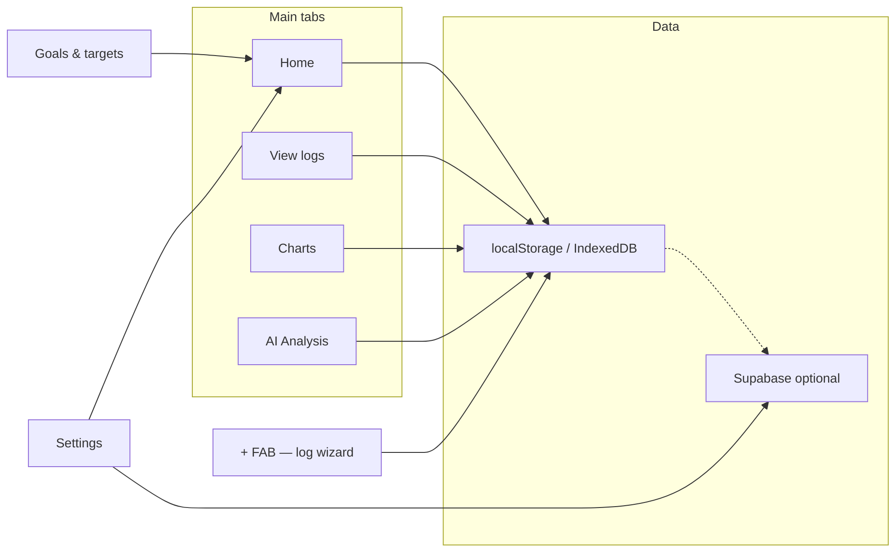
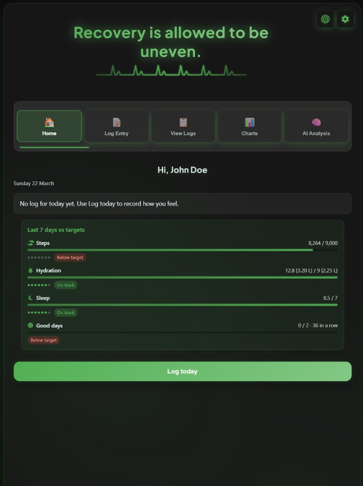
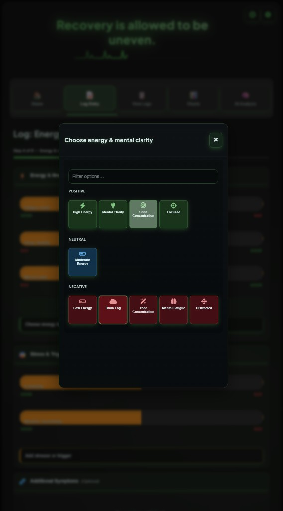
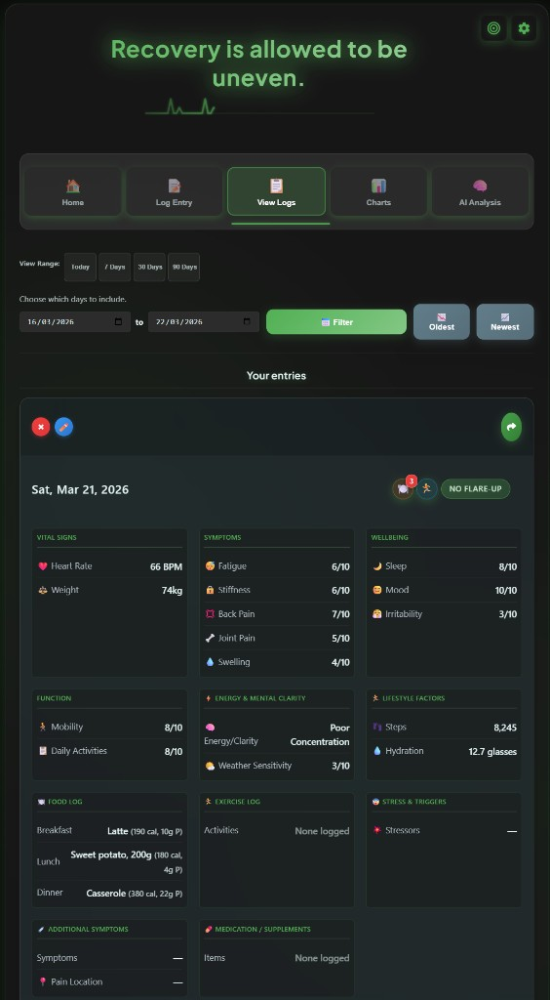
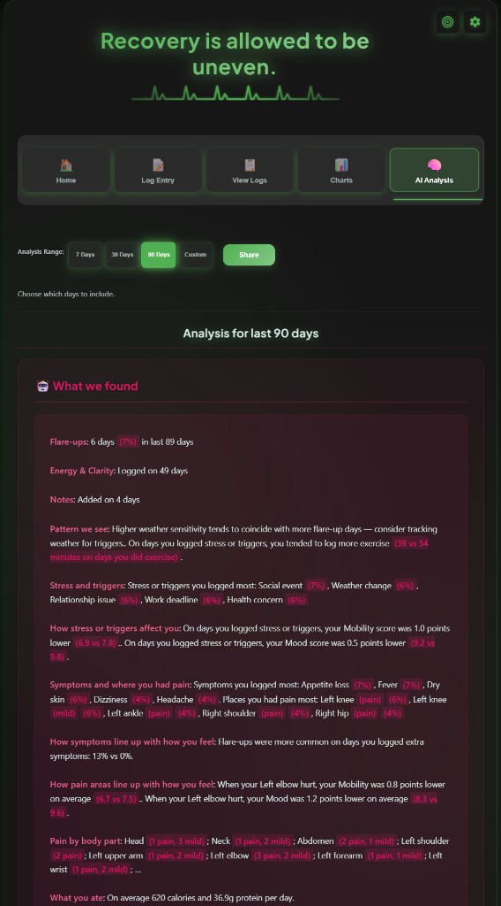
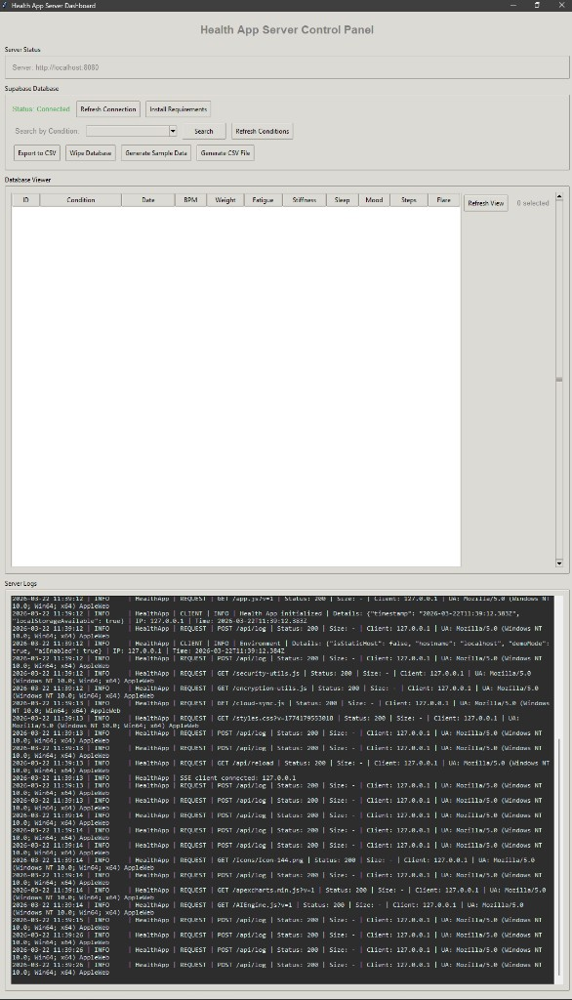
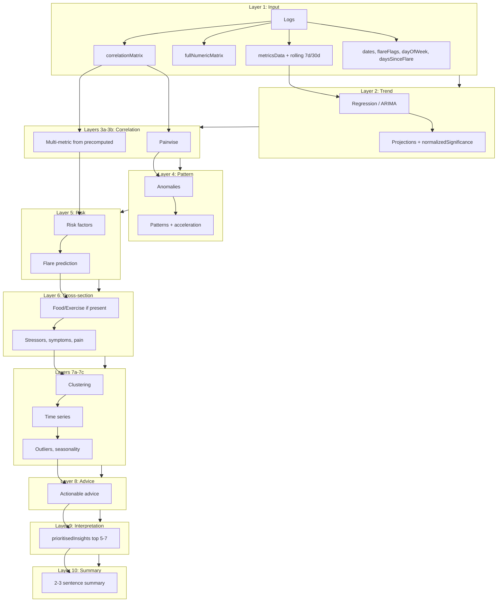
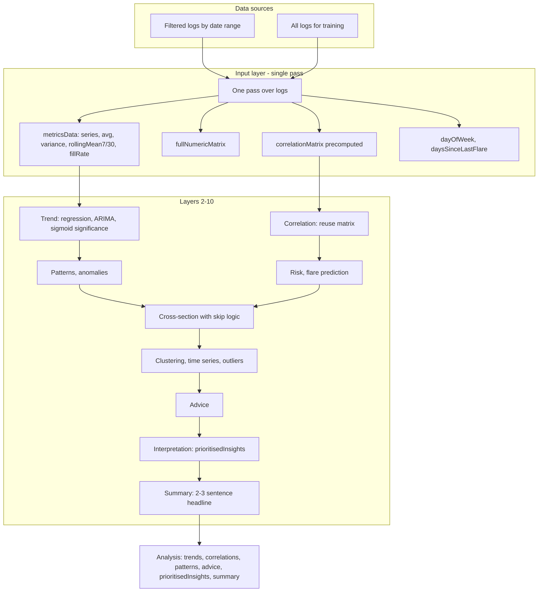

# Rianell — personal health dashboard

**Rianell** is a web-based health tracking app (live site **[rianell.com](https://rianell.com/)**). This repository builds the same UI for web, PWA, and Capacitor (Android/iOS project zips), with data visualisation, analytics, and optional cloud sync.

**Repository**: [github.com/Metaheurist/Rianell](https://github.com/Metaheurist/Rianell)

<!-- RIANELL_BUILD_INFO_START -->

[](https://github.com/Metaheurist/Rianell/actions/runs/23415217811)

**CI builds**

 — Android & Web/PWA ·  — iOS native (Xcode zip)

| Channel | Build |
| :--- | :---: |
|  **Android** APK | **55** |
|  **iOS** (Xcode project zip) | **55** |
|  **Web / PWA** (GitHub Pages deploy) | **55** |

Latest: [`App build/Android/app-debug-beta-55.apk`](App%20build/Android/latest.json) · [`App build/iOS/Health-Tracker-ios-beta-build-55.zip`](App%20build/iOS/latest.json) · [Workflow #55](https://github.com/Metaheurist/Rianell/actions/runs/23415217811) · `52f51cf`

<!-- RIANELL_BUILD_INFO_END -->

---

### 📑 Navigate

Use these links (explicit anchors — works reliably on GitHub with emoji headings):

| | |
| :--- | :--- |
| 🔒 | **[Security](#nav-security)** |
| 🏠 | **[App overview](#nav-app-overview)** |
| ✨ | **[Features](#nav-features)** |
| 📁 | **[Project structure](#nav-project-structure)** (quick list) |
| ⚙️ | **[Installation](#nav-installation)** |
| 🚀 | **[Usage](#nav-usage)** |
| 📱 | **[React shell & Android APK](#nav-react-android)** |
| 🧪 | **[Testing Data](#nav-testing-data)** |
| 🔧 | **[Configuration](#nav-configuration)** |
| 🧠 | **[AI Analysis: Neural Network Architecture](#nav-ai-architecture)** |
| 🗂️ | **[Project Structure](#nav-repo-tree)** (full repo tree) |
| 📦 | **[Dependencies](#nav-dependencies)** |
| 🛠️ | **[Development](#nav-development)** |
| 🛡️ | **[GDPR Compliance](#nav-gdpr)** |
| 💡 | **[Troubleshooting](#nav-troubleshooting)** |
| 🔐 | **[Security notes](#nav-security-notes)** |
| 👤 | **[Author](#nav-author)** |
| 📄 | **[Licence](#nav-licence)** |
| 📂 | **[Repository](#nav-repository)** |
| 💬 | **[Support](#nav-support)** |
| 📜 | **[Changelog](#nav-changelog)** |

---

<a id="nav-security"></a>

## 🔒 Security

The authoritative security guide is **[docs/SECURITY.md](docs/SECURITY.md)**. It describes the threat model across the **web app**, **Android (Capacitor)**, and **Python dev server**, including:

- Default **`HOST=127.0.0.1`** (loopback) and when to use **`HOST=0.0.0.0`** for LAN testing  
- Gated sensitive routes: **`/api/encryption-key`**, **`/api/anonymized-data`**, and **`HEALTH_APP_SENSITIVE_APIS_ON_LAN`**  
- Encryption key lifecycle (`security/.encryption_key`, `ENCRYPTION_KEY` in `security/.env`, client behaviour)  
- **Supabase RLS** expectations and [docs/supabase-rls-recommended.sql](docs/supabase-rls-recommended.sql)  
- **CSP**, Android **`allowMixedContent`**, dependency audits ([`.github/workflows/ci.yml`](.github/workflows/ci.yml) — `security-audit` job), and client-side storage risks  

Operational “do not commit secrets” reminders stay in [Security notes](#security-notes) below.

**Contact:** For general questions about security or this project, use [Contact and reporting](docs/SECURITY.md#contact-and-reporting) in **SECURITY.md** (LinkedIn).

**Local secrets folder:** [`security/`](security/) holds **`security/.env`** and **`security/.encryption_key`** (gitignored). Copy [`security/.env.example`](security/.env.example) → `security/.env`. Details: [docs/SECURITY.md](docs/SECURITY.md#local-secrets-directory-security). **Back up** `security/.encryption_key` to a safe place if the Python server created it and you need the same key on another machine.

**Static hosting (e.g. GitHub Pages):** the app runs **without** the Python server; encryption uses a **per-browser** key in `localStorage` (not synced with `security/.encryption_key`). See [docs/SECURITY.md](docs/SECURITY.md#encryption-key-lifecycle).


<a id="nav-app-overview"></a>

## 🏠 App overview




<a id="nav-features"></a>

## ✨ Features

### Health data tracking
- **Daily log entry**: Record per-day health metrics: resting heart rate (BPM), weight, fatigue, stiffness, back pain, sleep quality, joint pain, mobility, daily function, joint swelling, mood, irritability, weather sensitivity, steps, hydration (glasses).
- **Structured data**: Flare (yes/no), stressors, symptoms, pain location, notes; food log (meals with items); exercise log (activities with duration).
- **Medical condition**: Optional label stored in settings and used for anonymised data aggregation and AI context; user can change or clear it.

### App shell and log experience (web UI)



- **Home / Today**: Default tab with greeting, date, logging status, and goals snippet when enabled. Use the floating **+** button to open the log entry wizard from any main tab (Home, Logs, Charts, AI).
- **Log entry wizard**: Step-by-step flow (date & flare → vitals → symptoms & pain → energy & day → food → exercise → medication & notes → review) with step indicator, **Back** / **Skip** / **Next**, and **Save entry** on the last step. The bottom nav row keeps three equal slots (hidden steps use invisibility, not `display:none`) so **Next** does not stretch full width on early steps. Drafts are debounced to `sessionStorage`; URL hash `#log/step/<1-based step>` restores step when opening the log flow. The **+** is hidden while the wizard is active.
- **Navigation**: Top tab strip on wider screens; **bottom navigation bar** on viewports ≤768px (**Home**, **Logs**, **Charts**, **AI** — no separate Log tab). On phones, **`html`/`body` do not scroll**; **`.app-shell`** fills the viewport and **`.container.app-main-scroll`** is the only vertical scroll area so every tab behaves the same. The **+** button is **`position: fixed`**, overlays the main content, and sits just above the tab bar (not in the scroll flow). The tab bar lives in **`.app-mobile-bottom-chrome`** as a flex footer below the scroll region. Only one nav chrome shows per breakpoint.
- **Layout**: Extra horizontal padding in the log wizard on small screens; **`--card-content-padding-x`** in `styles.css` sets consistent horizontal inset inside bordered cards (`.form-section` / `.section-content`), including wizard vitals and other steps, log date/flare blocks, and review—so labels, inputs, and controls (e.g. weight unit toggle) are not flush to the card edge. **Tile pickers** (energy & mental clarity, stressors, symptoms, food by meal, exercise by category) open in a **full-screen `<dialog>` bottom sheet** on phones and a centred max-width sheet on wider viewports; chip content is moved into the sheet and restored on close (same IDs and handlers as before). Optional **per-section search** filters chips on the client. Sticky wizard actions use a flat bar (no heavy drop shadow behind the button row). **Selected items** (stressors, symptoms, edit-entry lists) use a **glass** sticky strip on mobile and **row chips** (`.item-tag`) that match the card surfaces—not a flat black panel.



- **View logs**: Date range shortcuts (Today / 7 / 30 / 90 days) or custom dates, **Filter** and **Oldest** / **Newest** sort; **Your entries** lists per-day cards with vitals, symptoms, wellbeing, food, exercise, flare status, and edit / delete / share.



### Charts and visualisation
- **Combined chart**: Multi-metric line chart with date range filter; optional AI-powered trend predictions (when AI enabled); metric selector; balance and single-chart views.
- **Individual metric charts**: Per-metric ApexCharts (e.g. fatigue, stiffness, BPM, sleep, steps, hydration) with lazy loading and device-based point caps.
- **Chart view modes**: Use **Balance**, **Combined**, or **Individual** in the Charts tab. Only the active mode’s layout is shown (combined, balance radar, or per-metric charts). Saved preference uses **`chartView`** as the source of truth; legacy **`combinedChart`** is kept in sync when settings load.
- **Select metrics to display** (combined / balance): On small screens the full metric list **scrolls with the main chart column** (no separate inner scroll panel on narrow phones).
- **Chart behaviour**: Date range (7/30/90 days) and prediction range; predictions can be toggled off; empty state when no data; animations respect reduced-motion and device class. Charts tab opens in balance view; View Logs tab opens with last 7 days.
- **Tier 5 / GPU-accelerated charts**: On tier 5 (or tier 4 with a good GPU), chart containers use GPU-friendly compositor layers and maximum point limits; critical chart and AI preload run with high scheduler priority when supported.
- **Loading behaviour**: App shows a loading overlay until the combined chart and summary LLM preload are ready (or 12s timeout), then reveals the UI so heavy work does not stutter the first paint.

### Performance (optimisation stack)

- **Logs**: Central reads via `getAllHistoricalLogsSync()` (avoids repeated `JSON.parse` of `healthLogs` on hot paths); optional **IndexedDB** mirror in `web/logs-idb.js` (async backup; localStorage remains primary); cache invalidation on save/import.
- **Charts**: In-place **ApexCharts** updates when view/data signatures match (combined, balance, individual); chart-specific styles load on demand from **`styles-charts.css`** when opening the Charts tab (or when the chart section is shown on load).
- **AI**: In-flight **deduplication** of `analyzeHealthMetrics`; guarded AI preload and chart **precompute** (idle / debounced; slower when the tab is hidden).
- **View logs**: For very large histories, **IntersectionObserver** loads additional entries as you scroll (windowed append).
- **Scripts**: **`summary-llm.js`** loads with `requestIdleCallback` on non–low devices (no `document.write`); Font Awesome remains deferred.
- **Build**: Root **`npm run build:web`** runs **`web/build-site.mjs`**: AST instrumentation (function trace hooks) for first-party scripts into **`web/.trace-build/`**, then esbuild minifies **`app.js`** → **`web/app.min.js`** (gitignored). **GitHub Pages** deploy runs the same script on the copied **`site/`** tree (see [GitHub Pages](#github-pages-app-at-repo-root)).
- **Web Workers**: `web/workers/io-worker.js` — large JSON **parse** / **stringify** when the optimisation profile has **`useWorkers`** (import / export paths).
- **Service worker**: **Off** by default; opt-in with `localStorage.setItem('rianellEnableStaticSW','1')` or **`?sw=1`** — `web/sw.js` uses cache-first for static file extensions (test on your host; CSP is same-origin).
- **Python server**: **gzip** for compressible static files when the client sends `Accept-Encoding: gzip`; **Cache-Control** tuned for common static extensions (`server/main.py`).
- **Observability**: Optional **Long Task** logging via `localStorage.setItem('rianellPerfLongTasks','1')` or debug mode; `performance.mark('rianell-init')` during init.

### Browser console (what is and is not Rianell)

- **Expected `DEBUG` messages**: Empty charts or an empty AI range are logged at **debug** level (enable *Verbose* in DevTools if you want to see them). They are not errors.
- **Extension noise**: Messages from **`vendor.js`**, **`tabs:outgoing.message.ready`**, **`serviceWorker.js`** (when the filename is not this app’s `sw.js`), or **`Frame with ID … was removed`** usually come from **browser extensions** (password managers, Grammarly, devtools helpers), not from Rianell. The app includes handlers to ignore common extension promise rejections where possible.
- **Third-party / browser**: **SES / lockdown** lines, **Grammarly / i18next** tips, **WebGPU `powerPreference` on Windows**, and **PWA** DevTools notes about `beforeinstallprompt` are outside app control or informational.
- **Hugging Face / CDN**: If the on-device LLM fails to download model shards (`ERR_CONTENT_LENGTH_MISMATCH`, `ERR_CONNECTION_RESET`), the app falls back to a smaller model or rule-based text; that is usually **network or CDN** related, not a bug in the repo.

### AI analysis



- **Optional AI**: Settings toggle "Enable AI features & Goals" hides or shows the AI Analysis tab, chart predictions, and Goals.
- **Neural-style pipeline**: Trend regression, correlations, patterns, risk factors, flare prediction, cross-section (food/exercise/stressors/symptoms), clustering, time series, actionable advice, prioritised insights, and a 2–3 sentence summary (see [AI Analysis](#ai-analysis-neural-network-architecture)).
- **Summary note**: In-browser LLM (Transformers.js, flan-t5 by device class) or rule-based fallback; context from analysis and logs; value highlighting in the UI.
- **Dashboard title (MOTD)**: Main header shows a **message of the day** only (no user name). Preset lines are loaded from **`web/motd.json`** at startup (short attributed quotations); **one line is chosen at random on each full page load** (stable for that session until the LLM may replace it). If the file is missing or offline, a minimal fallback is used. When AI is enabled and not deferred, the on-device LLM may replace the preset after load. Browser tab title stays **Rianell**. Edit **`web/motd.json`** to change copy without editing **`app.js`**.
- **GPU-accelerated LLM**: When the performance benchmark detects a capable GPU (WebGPU or WebGL), the summary/suggest pipeline loads with GPU acceleration; the app falls back to CPU automatically if GPU loading fails. Uses Transformers.js 3.3.2 for stable WebGPU/WebGL support.
- **On-device AI model selection**: Settings → Performance → **On-device AI model** lets you choose **Use recommended (for this device)** (from the performance benchmark), **Small (faster, lower memory)**, or **Base (better quality)**. The benchmark recommends flan-t5-small or flan-t5-base by tier; changing the setting clears the LLM cache so the next summary or suggest note uses the selected model.
- **Suggest note**: LLM or rule-based suggestion for the day’s log note; "Generating…" state on button.
- **Chart predictions**: Combined (and balance) chart can show predicted series from the analysis pipeline; "Calculating predictions…" overlay when computing; cache by date range and log count.
- **Responsiveness**: Analysis yields to the main thread between layers; loading states ("Analyzing…", "Calculating predictions…"); optional Web Worker for AI preload on multi-core devices.

### Goals and targets
- **Goals**: Targets for steps, hydration, sleep quality, and "good days"; progress visible in a dedicated Goals view; stored in settings and synced to cloud when signed in.
- **Medications**: Optional medications list in settings (stored locally and in cloud with settings).

### Data management
- **Export**: CSV and JSON export of health logs from Settings.
- **Import**: Restore from JSON backup; handles compressed (gzip) format.
- **Print**: Print-friendly view of logs and reports.
- **Clear/reset**: Option to clear all local data (with confirmation).

### Cloud sync (Supabase)
- **Anonymised contribution**: Optional "Contribute anonymised data" in Settings; GDPR-compliant consent; data anonymised before upload; medical condition used for server-side aggregation only.
- **Auth**: Sign in / sign out; session state; auth state reflected in sync and settings sync.
- **Settings sync**: Goals and app settings synced to Supabase when signed in (e.g. app_settings table).
- **Deploy**: On GitHub Pages, Supabase URL and anon key are injected at deploy time from repository secrets (`SUPABASE_URL`, `SUPABASE_ANON_KEY`); no credentials in the repo.

### Notifications and reminders
- **Daily reminder**: Configurable time; system notification when the app is in the background.
- **Sound**: "Enable sound notifications" controls system notification sound and an in-app heartbeat-style sound when the app is in the foreground (including on mobile).

### Install and run options
- **PWA / Install web app**: Add to home screen from Settings (globe icon); runs standalone and works offline. Shown in the UI with a **Beta** tag (same channel as the Android APK).
- **Install on Android**: Download APK from Settings (or Install modal); CI builds debug APK on push and commits to `App build/Android/` for same-origin download links. Shown with a **Beta** tag.
- **Install on iOS (device)**: Add to Home Screen from Safari (Settings or Install modal)—**Beta** (PWA install path).
- **iOS native build (Xcode zip / optional OTA)**: Download the zip from Settings when offered; this path is **Alpha** in the UI. Build metadata lives in `App build/iOS/latest.json`.

#### Release channels (Beta vs Alpha) and build numbers

| Channel | Meaning in this app | Where the build number comes from |
|--------|---------------------|-----------------------------------|
| **Beta** | Android debug APK, **Install web app** / Add to Home Screen (PWA), and **Install on this iPhone/iPad** (Safari PWA). | `App build/Android/latest.json` → `version` for the APK; the Settings UI shows `(build N)` next to the Android link after fetch. |
| **Alpha** | **iOS native** artifact only: Xcode project zip (and optional one-tap install URL when `installUrl` is set in the manifest). Not the Safari “Add to Home Screen” flow. | `App build/iOS/latest.json` → `version`; the Settings UI shows `(build N)` next to the iOS download link after fetch. |

**Build numbers in this README:** The **Beta** badge and table near the top of this file are **updated automatically** on each successful CI run to match `App build/Android/latest.json`, `App build/iOS/latest.json`, and the current workflow run (web/PWA deploy).

The web app reads these manifests at runtime (`web/app.js`, `refreshBuildDownloadLinks`) so the label **(build N)** on install links stays in sync after each CI deploy. **Beta** / **Alpha** pills are fixed labels in the UI: every install/download path except the **iOS native zip/OTA** link is **Beta**; the **iOS native** download is **Alpha**.

### Tutorial and onboarding
- **Tutorial**: First-run slides (Welcome, Log entry, View & AI, Settings & data, Data options, Goals, You're all set); first card "Enable AI & Goals?" (Enable / Skip); skipping hides AI-related slides.
- **Install modal**: Post-tutorial modal (once) with web/Android/iOS install options; can be retriggered from God mode.

### Settings and UI
- **Settings**: Weight unit (kg/lb), medical condition, date filters, chart visibility, AI & Goals toggle, contribution toggle, reminder time, sound notifications, cookie/consent; **Demo mode** toggle (sample “John Doe” data for exploration; export/cloud contribution disabled); when demo mode is **on**, demo health logs are **regenerated on each full page load** so sample values and dates stay fresh (desktop: procedural generation; mobile: premade dataset with dates shifted to the recent window). **Share link for demo**: anyone can open the app with **`#Demo`** in the URL (case-insensitive, e.g. `https://rianell.com/#Demo`); the app enables demo mode and reloads, or reloads with fresh demo data if demo was already on. **First visit via this link only** (once per browser profile, tracked in `localStorage`): after reload, **Goals & targets** are filled with random non-zero values and the **first-run tutorial** opens if it has not been seen yet—this does **not** run when demo mode is turned on from Settings alone. **Donate** (Support Rianell): opens a modal. If you set a PayPal **REST Client ID** (`<meta name="paypal-client-id" content="…">` in `web/index.html`, or `window.__PAYPAL_CLIENT_ID__` before load), the **PayPal JavaScript SDK** renders **Smart Payment Buttons** in-app (PayPal, card, **Apple Pay** / **Google Pay** when the browser and PayPal account support them); choose an amount, then pay. If no Client ID is set, a **hosted donate link** opens PayPal in a new tab. Dismiss with **×**, backdrop, or **Escape**. CSP in `index.html` allows `https://www.paypal.com` for script and the API calls the SDK needs. **God mode** (backtick `` ` `` with **demo mode** on): test UI, install modal, etc. **Developer** (God mode): **Function trace** — optional checkbox to log every **instrumented** function to the browser console (`console.debug` only; **no** network; production uses the built site from `npm run build:web` / CI); **Clear performance benchmark cache** / **View last benchmark details**.
- **Keyboard**: On desktop, **Escape** key opens or closes Settings when no other modal is open.
- **Theme**: Dark mode by default; light mode optional.
- **Responsive**: Layout and charts adapt to viewport and device; device-based optimisation (chart points, animations, AI preload).
- **Device performance (benchmark)**: On first load a short CPU benchmark classifies the device as mobile or desktop and assigns a performance tier (1–5). A **GPU detection and benchmark** (WebGPU/WebGL) runs after the CPU suite with stability samples (5 runs) for a **GPU stability graph**; the result is cached and used to accelerate the on-device AI (Transformers.js) when a GPU is available, with fallback to CPU. **Tier 5** is maxed for resources: highest chart point limits, fastest preload delays, and full UI/chart animation; devices with a good GPU and tier 4 are treated as effective tier 5 for charts and AI. The result is cached in localStorage and drives expansive optimisation profiles (chart points, AI preload, DOM batching, demo data size, **recommended on-device AI model**, etc.). **During the benchmark**, the loading overlay shows a **progress bar** and percentage (e.g. "Measuring performance… 45% · CPU arithmetic"). When the benchmark runs (first run or after cache clear), a **Performance & AI benchmark** modal shows a **brief** result (device, tier, class, recommended AI model, **GPU status**) with an optional **"See detailed benchmark results"** section (test bars, Stability (CPU) and Stability (GPU) sparklines with stats, OS/device/CPU/memory, full profile JSON). Settings → Performance includes **On-device AI model** (Use recommended / Small / Base) with a recommendation hint from the benchmark. God mode (` key) Developer tools: “Clear performance benchmark cache” and "View last benchmark details" let you re-run or inspect the last result. **Note:** Browsers do not expose CPU frequency or turbo boost; the app uses tier + GPU (high-performance preference where supported) to maximise performance and optionally the Scheduler API for critical-path prioritisation.

### Server (testing and development)
- **Local server**: Python HTTP server for local testing (`python -m server`); serves `web/` at root; optional file watching and auto-reload.
- **Windows launcher**: From the repo root, `powershell -ExecutionPolicy Bypass -File .\server\launch-server.ps1` (or `pwsh -File .\server\launch-server.ps1`) runs the same server; optional `$env:PORT` / `$env:HOST` before invoking.
- **Supabase integration**: Server can use Supabase for anonymised data and app_settings; credentials from **`security/.env`** (or legacy root `.env`).
- **Tkinter dashboard**: GUI for server controls: start/restart server, view URL and status, Supabase search/delete/export, real-time database viewer, server logs. **Console** uses ANSI-coloured **`[LEVEL]`** tags when stdout is a TTY (blue for `[INFO]`, red for `[ERROR]`, etc.; respects `NO_COLOR` / `FORCE_COLOR`). **Log files** keep per-level **emoji** prefixes (no escape codes). The dashboard **Server Logs** pane uses ASCII **`[LEVEL]`** tags with Tk colour tags—see [Logging](#logging).


<a id="nav-project-structure"></a>

## 📁 Project structure

- **`web/`** – Static web app: HTML, CSS, JavaScript, icons, and assets. The server serves this directory at the root URL.
- **`server/`** – Python server package (main server logic in `main.py`, plus config, encryption, Supabase client, sample data, requirements checks). Run from repo root: **`python -m server`**, or on Windows **`server/launch-server.ps1`** (see [Running the Server](#running-the-server)).


<a id="nav-installation"></a>

## ⚙️ Installation

### Prerequisites
- Python 3.8 or higher
- Modern web browser (Chrome, Firefox, Edge, Safari)
- Supabase account (for cloud sync features)

### Setup

1. **Clone the repository**
   ```bash
   git clone https://github.com/Metaheurist/Rianell.git
   cd Rianell
   ```

2. **Install Python dependencies**
   ```bash
   pip install -r requirements.txt
   ```

3. **Configure environment variables**
   - Copy [`security/.env.example`](security/.env.example) to **`security/.env`** (see [docs/SECURITY.md](docs/SECURITY.md#local-secrets-directory-security)). If that file is missing, the server still loads a legacy `.env` at the repo root.
   - Edit **`security/.env`** and add your Supabase credentials:
     ```env
     PORT=8080
     HOST=127.0.0.1
     SUPABASE_URL=your_supabase_url_here
     SUPABASE_ANON_KEY=your_supabase_anon_key_here
     ```

4. **Configure Supabase (for frontend)**
   - Edit `supabase-config.js` with your Supabase credentials
   - ⚠️ **Important**: Use the PUBLISHABLE/ANON key, NOT the secret key!


<a id="nav-usage"></a>

## 🚀 Usage

### Running the Server

Start the development server from the **repository root** (so the `server` package resolves correctly):

```bash
python -m server
```

On **Windows**, you can use the helper script (same behaviour as `python -m server`):

```powershell
powershell -ExecutionPolicy Bypass -File .\server\launch-server.ps1
```

If you use PowerShell 7+:

```powershell
pwsh -File .\server\launch-server.ps1
```

Optional port:

```powershell
$env:PORT = "9000"
powershell -ExecutionPolicy Bypass -File .\server\launch-server.ps1
```

The server will:
- Start on `http://localhost:8080` (or your configured PORT)
- Open your browser automatically
- Display a Tkinter dashboard for server controls
- Enable file watching for auto-reload (if watchdog is installed)

### Accessing the App

1. **Local Development**: Open `http://localhost:8080` in your browser
2. **Network Access**: The server defaults to **loopback** (`127.0.0.1`). To open the app from another device on your LAN, set **`HOST=0.0.0.0`** in **`security/.env`** (or legacy root `.env`) and use your PC’s LAN IP (see [docs/SECURITY.md](docs/SECURITY.md)). For sensitive dev APIs from non-loopback clients, set **`HEALTH_APP_SENSITIVE_APIS_ON_LAN=1`** (trusted networks only). Optional **`HEALTH_APP_SENSITIVE_APIS_LAN_SECRET`**: when set, clients must send **`X-Rianell-LAN-Secret`** for those APIs. Server logs use **rotation** (size-capped); see [docs/SECURITY.md](docs/SECURITY.md).
3. **Production**: Deploy files to a web server (no local server needed)

**Install manifest URLs (Android / iOS `latest.json`):** On `localhost`, `127.0.0.1`, and `::1`, the app does **not** fetch `App build/Android/latest.json` or `App build/iOS/latest.json`, because those files are produced by CI and deployed with the site. Default install links still point at fallback paths. To test manifest-driven links locally, open the devtools console and run `sessionStorage.setItem('forceAppBuildManifest','1')`, then reload.

### GitHub Pages (app at repo root)

The app lives in **`web/`**, so GitHub Pages will not see `index.html` if the source is the repo root. The public site is **[rianell.com](https://rianell.com/)**; GitHub Actions can also deploy the same build to Pages (e.g. `https://<user>.github.io/Rianell/`).

1. In the repo: **Settings → Pages**
2. Under **Build and deployment**, set **Source** to **GitHub Actions**
3. The unified workflow [`.github/workflows/ci.yml`](.github/workflows/ci.yml) runs the **`deploy-pages`** job on push to `main`/`master` and deploys a prepared **`site/`** folder as the site root (copy of **`web/`** plus `App build/` if present), so `index.html` is served correctly. The job runs **`npm ci`** (with lockfile cache), then **`node web/build-site.mjs --site site`** — same pipeline as local **`npm run build:web`**: instrument first-party JS (optional function trace hooks), minify **`app.js`** → **`app.min.js`** — then rewrites **`index.html`** to load the minified bundle for smaller downloads.

**Custom domain (`rianell.com`):** In **Settings → Pages**, set the custom domain and keep **Enforce HTTPS** on. At your DNS provider, use GitHub’s documented records (apex: four **A** records to `185.199.108.153`–`185.199.111.153`; **www**: **CNAME** to `<user>.github.io`). This repo includes **`web/CNAME`** (contents: `rianell.com`) so each deploy publishes the domain hint at the site root, alongside the GitHub UI setting.

If the site works elsewhere but your PC shows **`ERR_CONNECTION_REFUSED`**, DNS is often fine globally while your machine still has a stale cache, a bad **AAAA**, or a firewall/VPN path. Run **`powershell -ExecutionPolicy Bypass -File .\scripts\check-rianell-dns.ps1`** from the repo to verify **A**/**AAAA**/**www**, then try **`ipconfig /flushdns`**, another network (e.g. phone on cellular), or remove incorrect **AAAA** records for the apex.

**Cloud sync on the live site:** To use Supabase (login, cloud backup, anonymised data) on the GitHub Pages site, add **Repository secrets** (or **Environment secrets** for the `pages` environment): **`SUPABASE_URL`** (your project URL, e.g. `https://xxxx.supabase.co`) and **`SUPABASE_ANON_KEY`** (your publishable anon key). The deploy workflow injects these into the built site at deploy time so they are never committed. If these secrets are not set, the site still deploys; cloud features will work only after you add them.

After the first push (or a manual **Run workflow**), the deployed site will show **Rianell** instead of the README.

<a id="nav-react-android"></a>

## 📱 React shell & Android APK

The app can be run as a **React (Vite) app** that wraps the existing web UI and be built into an **Android APK** via Capacitor. The GitHub Action **Build Android APK** runs on every push to `main`/`master`, output to **`App build/Android/`** and **`App build/iOS/`**, and makes it available in the app’s Settings.

### In-app installation (Settings)

- **Install web app** (globe icon): Install the app as a PWA / standalone web app.
- **Install on Android** (Android icon): Download the latest Android APK. When the app is served from the same origin (e.g. GitHub Pages), the link uses the newest build from **`App build/Android/`** (see `latest.json`).
- **Install on iOS / iPhone / iPad**: On iPhone or iPad, open the site in Safari and use **“Install on this iPhone”** or **“Install on this iPad”** in Settings to add the app to your Home Screen (one-tap flow; works offline like a native app). Alternatively, download the Xcode project zip from **Install on iOS** and build to your device in Xcode. If a signed .ipa is provided in **`App build/iOS/`** (with `installUrl` in `latest.json`), **Install on iOS** becomes a one-tap native install from the site.

### Local setup (optional)

- **Node.js 20+**
- From repo root:
  ```bash
  npm install
  cd react-app && npm install
  npm run copy-webapp   # copies web app into react-app/public/legacy
  npm run build        # builds React app into react-app/dist
  ```
- To add the Android project (one-time, then commit `react-app/android/` if you want):
  ```bash
  cd react-app && npx cap add android
  npx cap sync android
  node patch-android-sdk.js   # minSdk/targetSdk/compileSdk, R8, notifications, portrait, network_security_config + manifest cleartext cleanup
  ```
- **Launcher icon & splash (APK / iOS):** Raster PWA icons live under **`web/Icons/`** (generated from **`logo-source.png`** and committed). They are **not** copied into native projects by `cap sync`. **`npm run build:android`** runs **`scripts/prepare-android-assets.mjs`** (builds **`react-app/assets/logo.png`**) then **`@capacitor/assets`** for Android mipmaps/splash before **`cap sync`**. For iOS, add the platform and run **`cd react-app && npx @capacitor/assets generate --ios`** (with **`logo.png`** present) or align assets in Xcode.
- **Performance (APK):** Use **`npm run build:apk`** (or **`npm run build:android`**) so the legacy bundle is built with **`web/build-site.mjs --skip-trace`** — same minified **`app.min.js`** as **`npm run build:web`**, but **without** function-trace instrumentation (noticeably smaller JS inside the APK). Production still uses **`react-app/copy-webapp.js --min`**. **`react-app/patch-android-sdk.js`** adds **`network_security_config.xml`** (cleartext off by default), wires it in **`AndroidManifest.xml`**, strips **`usesCleartextTraffic="true"`** if present, enables **R8** (`minifyEnabled true`) and **resource shrinking** for the **release** Gradle build type, and appends **ProGuard** keep rules for Capacitor; run **`./gradlew assembleRelease`** in **`react-app/android`** with your signing config for a smaller store-ready APK/AAB than **debug**. GitHub Pages / default **`npm run build`** keeps function-trace for the deployed site.
- Open in Android Studio: `cd react-app && npx cap open android`

### Android targets

- **minSdk 22** (Android 5.1) for broad device support.
- **targetSdk 34** (Android 14) for current store requirements.  
Controlled in `react-app/android/variables.gradle` (or via `react-app/patch-android-sdk.js`).

### CI: App builds on each commit

- **Android / iOS** CI: [`.github/workflows/ci.yml`](.github/workflows/ci.yml) — `android` and `ios` jobs (PR builds; on `main`/`master` pushes also commit `App build/`, release assets, and Pages). iOS builds a **simulator .app** (no Apple account; test in Xcode Simulator on a Mac) and zips the Xcode project to `App build/iOS/` for device sideloading (open in Xcode, sign with your Apple ID). Device signing for direct install (OTA) requires an Apple Developer account ($99/year).
- On **push** or **pull_request** to `main` or `master`: builds the web app, syncs Capacitor, builds a **debug APK**, copies it into **`App build/Android/`** as **`app-debug-beta.apk`** (and a run-numbered copy), and uploads the **android** artifact.
- On **push** (not PR) to `main`/`master`: the workflow also **commits** the `App build/Android/` folder to the repo with `[skip ci]`, so the “Install on Android” link in Settings works when the app is served from the same repo (e.g. GitHub Pages).
- Download the APK from the run’s **Summary → Artifacts** (name **android**), or use **Settings → Install on Android / Install on iOS** in the deployed app.

### Using Rianell

1. **Add Daily Entries**:
   - Click "Add Entry" button
   - Fill in health metrics for the day
   - Add food items and exercises
   - Save the entry

2. **View Analytics**:
   - Navigate to the Analytics section
   - View charts showing trends
   - Analyse correlations between metrics

3. **Manage Data**:
   - Export data: Settings → Export Data
   - Import data: Settings → Import Data
   - Clear all data: Settings → Clear All Data

4. **Cloud Sync**:
   - Enable "Contribute anonymised data" in Settings
   - Accept GDPR agreement
   - Data will be anonymised and synced to Supabase

### Server Dashboard Features



The Tkinter dashboard provides:

1. **Server Status**:
   - View server URL and status
   - Restart server without closing dashboard

2. **Supabase Database Management**:
   - **Search**: Search anonymised data by medical condition
   - **Delete**: Remove data (all, by condition, or specific IDs)
   - **Export**: Export data to CSV files
   - **Viewer**: Real-time database viewer showing last 100 records

3. **Server Logs**: Real-time log viewer using **`[DEBUG]`** / **`[INFO]`** / **`[WARNING]`** / **`[ERROR]`** / **`[CRITICAL]`** at the start of each line (two spaces after the bracket), with colour on that tag (e.g. blue for `[INFO]`, red bold for `[ERROR]`). The terminal and `logs/*.log` files still use **emoji** prefixes—see [Logging](#logging).

<a id="nav-testing-data"></a>

## 🧪 Testing Data

### Generate Sample Data

The server includes sample data generation:

1. **CSV Export**: Generate sample CSV files for testing
   - Use the "Generate CSV File" button in the server dashboard
   - Configure number of days and base weight
   - Output saved to `health_data_sample.csv`

2. **Database Testing**: 
   - Use Supabase search to find test data
   - Export data for analysis
   - Delete test data when done

### Sample Data Structure

Sample data includes realistic patterns:
- Seasonal variations (winter worse, summer better)
- Weekly patterns (weekends better)
- Flare-up cycles for chronic conditions
- Correlated metrics (sleep affects fatigue, etc.)

<a id="nav-configuration"></a>

## 🔧 Configuration

### Environment Variables (`security/.env`)

Define variables in **`security/.env`** (copy from [`security/.env.example`](security/.env.example)). If that file is absent, a legacy **`.env`** at the repository root is still read.

| Variable | Description | Default |
|----------|-------------|---------|
| `PORT` | Server port | `8080` |
| `HOST` | Bind address (`127.0.0.1` = local only; `0.0.0.0` = all interfaces / LAN) | `127.0.0.1` |
| `HEALTH_APP_SENSITIVE_APIS_ON_LAN` | Allow `/api/encryption-key` and `/api/anonymized-data` from non-loopback IPs | unset (off) |
| `SUPABASE_URL` | Your Supabase project URL | Required |
| `SUPABASE_ANON_KEY` | Your Supabase anon/publishable key | Required |

### Supabase Setup

1. Create a Supabase project at [supabase.com](https://supabase.com)
2. Get your project URL and anon key from Settings → API
3. Create the `anonymized_data` table:
   ```sql
   CREATE TABLE anonymized_data (
     id BIGSERIAL PRIMARY KEY,
     medical_condition TEXT NOT NULL,
     anonymized_log JSONB NOT NULL,
     created_at TIMESTAMP DEFAULT NOW(),
     updated_at TIMESTAMP DEFAULT NOW()
   );
   ```
4. Add your credentials to **`security/.env`** (or legacy root `.env`) and `supabase-config.js`

<a id="nav-ai-architecture"></a>

## 🧠 AI Analysis: Neural Network Architecture

The AI analysis engine runs as a **neural-style pipeline**: each layer applies existing logic (regression, correlation, prediction, etc.) as activator functions. The design aims to **use as much of your collected data as possible** to deliver **meaningful health insights** (trends, early signals, correlations, and actionable advice). A detailed expansion and optimisation plan is in [docs/NEURAL_NETWORK_PLAN.md](docs/NEURAL_NETWORK_PLAN.md).

### Planned objectives

- **Richer input**: One pass over all logs to build metricsData, rolling 7d/30d baselines, day-of-week, days-since-flare, fill-rate, and a **precomputed correlation matrix** so downstream layers avoid redundant work.
- **Optimisation**: Correlation matrix computed once in the input layer; correlation layers **reuse** it. Cross-section layer **skips** food/exercise analysis when no food or exercise entries exist.
- **Interpretation**: A dedicated layer **ranks and deduplicates** anomalies, risk factors, correlations, and patterns into **prioritisedInsights** (top 5–7 items) so “what matters most” is clear.
- **Summary**: A **summary** layer produces a short 2–3 sentence plain-language headline from trends, risk, and advice.
- **Activations**: Trend significance is normalised (e.g. sigmoid(r²)) for consistent scoring; activations (sigmoid, tanh, relu, softmax) are available for bounding and ranking.

### Analysis pipeline (forward pass)



### Data flow: from logs to insights



### Layer summary

| Layer | Role | Data used | Activator functions |
|-------|------|-----------|---------------------|
| 1 Input | Feature space in one pass | All training + recent logs | metricsData (with rollingMean7/30, fillRate), fullNumericMatrix, correlationMatrix, dates, flareFlags, dayOfWeek, daysSinceLastFlare |
| 2 Trend | Per-metric trends and predictions | Full training series per metric | Linear/polynomial regression, ARIMA, predictFutureValues, normalizedSignificance (sigmoid) |
| 3a–3b | Pairwise + multi-metric correlation | Precomputed matrix or training logs | detectCorrelations, detectMultiMetricCorrelations (uses precomputed when available) |
| 4 Pattern | Anomalies and patterns | Recent logs | detectAnomalies, detectPatterns, detectTrendAcceleration |
| 5 Risk | Risk factors and flare prediction | Training logs | assessRiskFactors, predictFlareUps |
| 6 Cross-section | Food, exercise, stressors, symptoms | Larger of training/recent; **skip** food/exercise if none logged | analyzeFoodExerciseImpact (guarded), analyzeStressorsImpact, analyzeSymptomsAndPainLocation, analyzeCrossSectionCorrelations |
| 7a–7c | Clustering, time series, outliers | Training logs | performClustering, performTimeSeriesAnalysis, detectOutliers, detectSeasonality |
| 8 Output | Advice | Recent logs + trends | generateActionableAdvice |
| 9 Interpretation | Prioritise and dedupe | analysis.anomalies, riskFactors, correlations, patterns | Score, dedupe, set prioritisedInsights (top 7) |
| 10 Summary | Plain-language headline | trends, risk, patterns, advice | Set analysis.summary (2–3 sentences) |

### How we use your data for meaningful insights

- **Full history**: Training logs (all available data) are used for regression, correlation matrix, clustering, time series, and flare prediction so insights reflect long-term patterns, not just the last few days.
- **Rolling baselines**: 7-day and 30-day rolling means per metric support future “vs your baseline” comparisons and stability checks.
- **Temporal context**: Day-of-week and days-since-last-flare are computed once and available for pattern and seasonality layers.
- **Prioritised list**: Anomalies and risk factors are ranked above correlations and patterns; duplicates are removed so the UI can show a short “what matters most” list.
- **Summary**: The final summary sentence is generated from improving/worsening trends, the top risk or pattern, and one piece of advice so the user gets a quick takeaway.

Activation functions (sigmoid, tanh, relu, softmax) are available as `AIEngine.activations`. The network constructor is `AIEngine.NeuralAnalysisNetwork`. Detailed plan: [docs/NEURAL_NETWORK_PLAN.md](docs/NEURAL_NETWORK_PLAN.md).

---


<a id="nav-repo-tree"></a>

## 🗂️ Project Structure

```
Rianell/
├── web/                    # Static web app (served at site root on GitHub Pages)
│   ├── index.html          # Main application HTML
│   ├── app.js              # Core application logic
│   ├── app.min.js          # (generated) esbuild minify — gitignored; use npm run build:web
│   ├── build-site.mjs      # esbuild script → app.min.js
│   ├── logs-idb.js         # IndexedDB mirror for health logs (optional async backup)
│   ├── styles-charts.css   # Deferred chart + ApexCharts styles (loaded on demand)
│   ├── sw.js               # Optional service worker (static asset cache)
│   ├── workers/            # Web Workers (e.g. large JSON parse/stringify)
│   ├── AIEngine.js         # AI analysis (neural pipeline, …)
│   ├── styles.css          # Application styles
│   ├── Icons/              # App icons (PWA, favicon, Apple touch); `logo-source.png` master + committed `Icon-*.png` sizes
│   ├── cloud-sync.js       # Supabase synchronisation
│   ├── supabase-config.js  # Supabase configuration
│   ├── summary-llm.js      # In-browser LLM (summary, suggest note, dashboard MOTD)
│   ├── notifications.js    # Reminders, heartbeat sound
│   └── …                   # Other JS/CSS/assets
├── requirements.txt        # Python dependencies
├── package.json            # Root scripts (build, sync, android, build:web, …)
├── scripts/                # e.g. `prepare-android-assets.mjs`, `smoke-function-trace.mjs`
├── docs/                   # Documentation
│   ├── images/             # README screenshots (Home, View logs, AI Analysis, card selector, server dashboard, …)
│   └── NEURAL_NETWORK_PLAN.md   # AI expansion and optimisation plan
├── .github/workflows/      # Unified CI: `ci.yml` (mobile, Pages, release, audits)
├── react-app/              # React (Vite) + Capacitor shell for Android
│   ├── src/                # React entry and iframe wrapper
│   ├── android/            # Capacitor Android project (optional to commit)
│   ├── copy-webapp.js      # Copies web app into public/legacy
│   ├── patch-android-sdk.js
│   └── capacitor.config.ts
├── App build/              # Built apps (filled by CI; committed for download links)
│   ├── Android/           # APK + latest.json
│   └── iOS/               # Xcode project zip + latest.json
├── server/                 # Python HTTP server (`python -m server`)
│   └── launch-server.ps1   # Windows launcher (optional)
├── security/               # Local secrets (not in git): `.env`, `.encryption_key`; see docs/SECURITY.md
│   └── .env.example        # Template → copy to security/.env
└── logs/                   # Server logs
```

<a id="nav-dependencies"></a>

## 📦 Dependencies

### Python (server package)
- `supabase>=2.0.0` - Supabase client library
- `watchdog>=3.0.0` - File watching for auto-reload
- `python-dotenv>=1.0.0` - Environment variable management

### JavaScript (Frontend)
- No external dependencies required for the main web app (vanilla JavaScript)
- Uses browser APIs and Supabase JS client
- Font Awesome 6 (CDN) for icons

### Node.js (optional: React & Android)
- Used only for the React/Capacitor build and Android APK. See **React shell & Android APK**.
- Root `package.json`: scripts for `build`, `build:android`, `build:web` (minify `web/app.js` → `web/app.min.js`), `sync`, `dev`
- `react-app/`: Vite 6, React, Capacitor 7; run `npm run build` from repo root

<a id="nav-development"></a>

## 🛠️ Development

### File Watching
The server automatically reloads when files change (if watchdog is installed):
```bash
pip install watchdog
```

### Logging
Server logs are saved to `logs/rianell_YYYYMMDD.log`. The `Rianell` logger uses these formatters in `server/config.py`:

- **`EmojiLogFormatter`** (handler: **file** only): each line starts with a level emoji (`🐛` DEBUG, `ℹ️` INFO, `⚠️` WARNING, `❌` ERROR, `💥` CRITICAL; anything else `📋`), **two spaces**, then the usual timestamp, level name, logger name, and message. Plain text so logs stay grep-friendly.
- **`ConsoleColorBracketFormatter`** (handler: **console** / `StreamHandler`): each line starts with a coloured **`[LEVEL]`** prefix (ANSI: e.g. blue for INFO, red for ERROR) when stdout is a TTY; **no** escape codes when `NO_COLOR` is set (or when not a TTY). Set **`FORCE_COLOR=1`** to force colour when piping if your terminal supports it.
- **`BracketLevelFormatter`** (handler: **Tkinter dashboard** `TextHandler` in `server/main.py` only): each line starts with **`[LEVEL]`** and two spaces, then the same timestamp / level / name / message body. The UI applies **colour tags** to the bracket so logs stay readable without relying on emoji in Tk’s `Text` widget (**Consolas** is used for the log pane).

### Browser Compatibility
- Chrome/Edge (recommended)
- Firefox
- Safari
- Mobile browsers (responsive design)

<a id="nav-gdpr"></a>

## 🛡️ GDPR Compliance

The app includes GDPR-compliant data sharing:
- Explicit user consent required
- Data anonymisation before upload
- Clear privacy agreement
- User can disable at any time

<a id="nav-troubleshooting"></a>

## 💡 Troubleshooting

### Server Issues

**Port already in use**:
- Change `PORT` in **`security/.env`** (or legacy root `.env`) or close the application using port 8080

**Supabase connection failed**:
- Verify credentials in **`security/.env`** (or legacy root `.env`) and `supabase-config.js`
- Check Supabase project is active
- Ensure using publishable key, not secret key

**Tkinter dashboard not opening**:
- Install tkinter: `sudo apt-get install python3-tk` (Linux)
- On Windows/Mac, tkinter usually comes with Python

### App Issues

**Data not saving**:
- Check browser console for errors
- Verify localStorage is enabled
- Check browser storage quota

**Charts not displaying**:
- Check browser console for JavaScript errors
- Ensure data entries exist
- Try clearing browser cache

**Console: `tabs:outgoing.message.ready`, `No Listener`, or `vendor.js` (VM…)**:
- Usually **browser extensions** injecting into the page, not the Health app. The app **suppresses** matching **`unhandledrejection`** events (see early script in `web/index.html` and `web/app.js`). If messages persist, try a **clean profile** or **disable extensions** on the site.

<a id="nav-security-notes"></a>

## 🔐 Security notes

Start with the full guide: **[docs/SECURITY.md](docs/SECURITY.md)** (same content as linked from [Security](#nav-security) at the top of this file). Supplementary references: [docs/supabase-rls-recommended.sql](docs/supabase-rls-recommended.sql), CI workflow [`.github/workflows/ci.yml`](.github/workflows/ci.yml) — `security-audit` job (Gitleaks, `npm audit`, `pip-audit`).

⚠️ **Important security considerations**:

1. **Never commit sensitive files**:
   - **`security/.env`** (or legacy root `.env`) — Supabase credentials
   - **`security/.encryption_key`** — encryption key material
   - `supabase-config.js` (contains API keys)

2. **Use environment variables** for production deployments

3. **Supabase Keys**: Always use PUBLISHABLE/ANON keys in frontend code, never secret keys

4. **Data Privacy**: Anonymised data sharing is opt-in only

<a id="nav-author"></a>

## 👤 Author

**Metaheurist** - Sole developer and maintainer

- GitHub: [@Metaheurist](https://github.com/Metaheurist)
- Repository: [https://github.com/Metaheurist/Rianell](https://github.com/Metaheurist/Rianell)

<a id="nav-licence"></a>

## 📄 Licence

This project is open source and available under an open source licence.

<a id="nav-repository"></a>

## 📂 Repository

**GitHub**: [https://github.com/Metaheurist/Rianell](https://github.com/Metaheurist/Rianell)

<a id="nav-support"></a>

## 💬 Support

For issues and questions:
- Check the troubleshooting section
- Review server logs in `logs/` directory
- Check browser console for frontend errors


<a id="nav-changelog"></a>

## 📜 Changelog

Changelog is derived from project commit history. Versions follow semantic versioning (major.minor.patch).

**Latest: v1.38.0** — MOTD preset: random per page load (not fixed per calendar day).

### v1.38.0 — 2026-03-23 — MOTD selection

- **Web**: Dashboard preset MOTD (when the on-device LLM does not replace it) picks a **random** line from **`web/motd.json`** **once per full page load**; the same line is reused for repeated `updateDashboardTitle` calls in that session. **`web/motd.json`** `description` updated.


### v1.37.0 — 2026-03-22 — Icons, repo cleanup

- **Web**: Regenerated **`web/Icons/Icon-*.png`** from **`logo-source.png`**; **`scripts/generate-icons.mjs`** and **`scripts/generate-native-icons.mjs`** removed (use **`npm run build:android`** / **`prepare-android-assets.mjs`** + **`@capacitor/assets`** for native; edit **`web/Icons/`** and **`logo-source.png`** directly for future PWA changes).
- **Repo**: Removed legacy **`web/Icons/generate_icons.py`**. Root **`package.json`**: dropped **`generate:icons`** / **`generate:native-icons`** scripts.


### v1.36.0 — 2026-03-22 — APK / native shell performance

- **Legacy web bundle (iframe)**: Root **`npm run build`** runs **`build:web`** first, then **`react-app`** copies **`web/app.min.js`** into **`public/legacy/`** and rewrites **`legacy/index.html`** to load it instead of **`app.js`** (production/`vite build` only; **`npm run dev`** still uses full **`app.js`** for debugging). Much smaller script download and parse on device.
- **React shell (Vite)**: **`manualChunks`** for React and **`@capacitor/*`**; **`target: es2020`**, esbuild minify for the shell bundle.
- **Capacitor**: **`backgroundColor`**, **`android.webContentsDebuggingEnabled: false`** (less WebView debugging overhead on debug APKs; set **`true`** in **`capacitor.config.ts`** when you need Chrome `chrome://inspect`).
- **Gradle (patch)**: **`patch-android-sdk.js`** appends parallel build + cache + JVM heap hints when missing (speeds **`assembleDebug`** in CI).


### v1.35.0 — 2026-03-22 — Android launcher icon pipeline

- **Android / Capacitor**: PWA icons under `web/Icons/` are not applied to the native project by `cap sync` alone. **`scripts/prepare-android-assets.mjs`** builds **`react-app/assets/logo.png`** (from **`web/Icons/logo-source.png`**, or **`Icon-512.png`**, or a flat placeholder), then **`@capacitor/assets`** generates **mipmap** / adaptive icon and splash assets before **`cap sync`**. Root **`npm run build:android`** and CI **`android`** job run this sequence.
- **Dependencies**: **`react-app`**: devDependency **`@capacitor/assets`**. **`.gitignore`**: **`react-app/assets/logo.png`** (generated locally/CI).


### v1.34.0 — 2026-03-22 — MOTD quotations content

- **Web**: **`web/motd.json`** preset list replaced with **144 attributed quotations** (historical / widely published sources). Licensing for redistribution remains your responsibility; see the file’s `description` field.
- **Repo**: No redundant scripts to remove beyond what **v1.33.0** already dropped; **`scripts/`** retains **`smoke-function-trace.mjs`** and related tooling.


### v1.33.0 — 2026-03-22 — MOTD JSON, legacy copy

- **Web**: Dashboard MOTD fallback lines load from **`web/motd.json`** (fetched before `loadSettings()`); minimal inline fallback if fetch fails. Preset list still rotates per calendar day until the on-device LLM replaces it (when AI is enabled).
- **React / Capacitor**: **`motd.json`** is included in **`react-app/copy-webapp.js`** static root files so **`/legacy/`** builds serve the file.
- **Repo**: Removed redundant **`scripts/extract-motd-to-json.mjs`** (edit **`web/motd.json`** directly or use your editor’s JSON formatter).


### v1.32.0 — 2026-03-22 — Function trace, CI web build

- **Web (debug)**: Build-time **function trace** (Babel AST) for first-party `web/**/*.js` with excludes (vendor/min bundles, workers, service worker, `trace-runtime.js`). **`web/trace-runtime.js`** loads before other app scripts; **`trace-runtime.js`** is never instrumented so hooks exist before any wrapped code. Toggle **Function trace** (verbose `console.debug` per function) only in **God mode** (backtick `` ` `` **with demo mode on**); persisted as `localStorage.rianellFunctionTrace`. Gated by **`window.__rianellFnTraceOn`** (demo + toggle); **console-only** — no `Logger`, no `fetch` (no network for tracing).
- **Build**: Root **`npm run build:web`** runs **`web/build-site.mjs`** (mirror to **`web/.trace-build/`** + minify **`app.js`** → **`app.min.js`**). **`npm run smoke:trace`** checks the transform output parses.
- **CI**: **`deploy-pages`** runs **`npm ci`** (cached from **`package-lock.json`**) then **`node web/build-site.mjs --site site`** so the live site matches the local web build (instrument + minify), then rewrites **`index.html`** to **`app.min.js`**.
- **README**: Changelog and [GitHub Pages](#github-pages-app-at-repo-root) / [Performance](#performance-optimisation-stack) updated for this pipeline.


### v1.31.0 — 2026-03-22 — Donate, wizard buttons, selected lists

- **Donate**: PayPal **JavaScript SDK** with Smart Payment Buttons when `paypal-client-id` (or `window.__PAYPAL_CLIENT_ID__`) is set; amount chips; fallback hosted donate URL if unset. CSP extended for PayPal script and API hosts.
- **Log wizard**: **Back** / **Skip** / **Next** use a **three-column grid** and visibility (not `display:none`) so the row does not collapse to one full-width button on early steps; step 0 **Back** acts as **Close** (home).
- **UI**: Selected stressors/symptoms (and edit lists) **`.item-tag`** rows match card styling; mobile **selection-summary-sticky** uses glass blur instead of flat `#0a0a0a`.


### v1.30.0 — 2026-03-22 — Mobile shell, charts metrics, console hygiene

- **Web (mobile)**: Viewport-locked **`.app-shell`**, single scroll on **`.container`**; **+** FAB **fixed** over content above bottom tabs; bottom bar as flex footer. Tab switching resets main scroll for consistency.
- **Web (charts)**: “Select metrics to display” uses the **main scroll** on narrow screens (no inner metric panel scroll).
- **Web (console)**: Broader **`unhandledrejection`** filters for extension noise (`tabs:outgoing.message.ready`, `VM… vendor.js`, etc.).
- **Web (nav)**: Neutral focus rings on bottom tab buttons (avoid global green `--shadow-focus` glow).


### v1.28.3 — 2026-03-22 — Dashboard bracket log format

- **Server**: **`BracketLevelFormatter`** (`server/config.py`) prefixes dashboard lines with **`[LEVEL]`** (two spaces before the timestamp); **`EmojiLogFormatter`** remains for **file** and **stream** handlers only. Console and `logs/*.log` keep emoji; Tkinter **Server Logs** uses ASCII brackets and coloured tags (`BRACKET_*` in `server/main.py`).
- **Server**: Log pane font set back to **Consolas**; leading `[INFO]` / `[ERROR]` / etc. highlight with level-appropriate colours.


### v1.28.2 — 2026-03-22 — Server dashboard log emoji

- **Server**: Tkinter **Server Logs** pane uses a Segoe UI–family font (`Segoe UI`, `Segoe UI Emoji`, or `Segoe UI Symbol` when installed) so level emojis render; monospace **Consolas** does not show emoji in Tk `Text` on Windows (`server/main.py`).
- **Server**: `EmojiLogFormatter` inserts **two spaces** after the emoji for a clear gap before the timestamp (`server/config.py`).


### v1.29.0 — 2026-03-22 — Mobile nav, console log colours, README

- **Web**: Bottom **Home / Logs / Charts / AI** bar and floating **+** are **siblings** of `.app-shell` in `index.html` so fixed tab labels and icons render correctly on mobile WebKit; minor stacking CSS (`isolation` / `z-index` on tab buttons). Log entry is opened via **+** (no Log tab).
- **Server**: `ConsoleColorBracketFormatter` colours **`[LEVEL]`** in the terminal (blue INFO, red ERROR, etc.); `EmojiLogFormatter` remains for **file** logs only (no ANSI in files). Respects `NO_COLOR` and `FORCE_COLOR`.
- **README**: App overview diagram and [App shell](#app-shell-and-log-experience-web-ui) / [Logging](#logging) sections updated to match.


### v1.28.1 — 2026-03-22 — Server logs & charts visibility

- **Server**: `EmojiLogFormatter` in `server/config.py` prepends a per-level emoji to every `Rianell` log line (file, console, Tkinter dashboard); `server/main.py` uses the same formatter for the dashboard `TextHandler`.
- **Charts tab**: `updateChartEmptyState` calls `enforceChartSectionView` when data appears; `.chart-container.hidden` and chart container IDs use `display: none !important` so Combined / Balance / Individual panels do not stack visibly when switching modes.


### v1.28.0 — 2026-03-22 — Performance overhaul

- **Web**: Centralised log reads, chart in-place updates, AI/precompute dedupe and scheduling, virtualised View Logs append, deferred chart CSS and idle `summary-llm` load, IndexedDB mirror, IO workers, optional SW, perf marks / long-task observer.
- **Server**: gzip static assets; cache headers for static extensions.
- **CI**: esbuild minify + HTML rewrite on GitHub Pages deploy; root `npm run build:web` for local minified bundle.


### v1.27.5 — 2026-03-22 — Documentation

- **README**: Added AI Analysis tab screenshot under [AI analysis](#ai-analysis); image stored at `docs/images/ai-analysis.png`.


### v1.27.4 — 2026-03-22 — Documentation

- **README**: Added **View logs** bullet and screenshot (date filters and entry card) under [App shell and log experience (web UI)](#app-shell-and-log-experience-web-ui); image stored at `docs/images/view-logs.png`.


### v1.27.3 — 2026-03-22 — Documentation

- **README**: Added tile picker (card selector) screenshot for **energy & mental clarity** under [App shell and log experience (web UI)](#app-shell-and-log-experience-web-ui); image stored at `docs/images/card-selector-energy-clarity.png`.


### v1.27.2 — 2026-03-22 — Documentation

- **README**: Added Home tab screenshot under [App shell and log experience (web UI)](#app-shell-and-log-experience-web-ui); image stored at `docs/images/home-dashboard.png`.


### v1.27.1 — 2026-03-22 — Documentation

- **README**: Added screenshot of the Health App Server Dashboard (Tkinter control panel) under [Server Dashboard Features](#server-dashboard-features); image stored at `docs/images/server-dashboard.png`.


### v1.28.0 — 2026-03-22 — #Demo onboarding, donate modal, MOTD

- **`#Demo` deep link**: The first time a user opens the app via **`/#Demo`** (not via the Settings demo toggle alone), after demo mode loads they get **random Goals & targets** once and the **tutorial** if it was not already completed (`rianellDemoHashOnboardingDone`, `rianellDemoHashPendingOnboarding` in sessionStorage across the reload).
- **Donate**: Settings **Donate** opens the PayPal modal reliably (wired in `event-handlers.js`); floating **×** on the iframe; optional auto-close on PayPal `postMessage` heuristics.
- **Dashboard MOTD**: Preset line rotates **once per calendar day**; shimmer/fade animation removed so text updates are an instant swap.


### v1.27.0 — 2026-03-22 — Charts tab views, demo mode

- **Charts tab**: Balance / Combined / Individual now show **only** the active chart layout. Visibility is enforced after chart builds and background preload; **`chartView`** drives refresh (legacy **`combinedChart`** is normalised on settings load). Individual lazy charts stay hidden when another mode is active.
- **Demo mode**: With demo mode enabled, **each full page load** regenerates demo health logs (same rules as enabling demo: desktop `generateDemoData`, mobile premade + date rebase). Initial load skips reading stored `healthLogs` in demo mode so async decompression cannot overwrite fresh demo data.


### v1.26.0 — 2026-03-22 — UI, MOTD, first paint, extensions

- **Mobile bottom nav**: Increased flex `gap` between items so tab buttons are not visually squashed on small screens.
- **Mobile header**: Goals and Settings controls use **in-flow layout** above the green dashboard title (≤768px) instead of overlapping long/wrapped MOTD text.
- **Dashboard MOTD**: Removed personalised “Welcome to {name}'s health”; header uses **preset lines** (one per calendar day) plus optional LLM line **after** `body.loaded` so startup does not double-load the Transformers pipeline with `preloadSummaryLLM`. Tab title remains **Rianell**.
- **First paint**: Inline critical CSS in `index.html` for `html`/`body` and `#loadingOverlay` so the loading screen is **dark with spinner** before `styles.css` loads (avoids a white flash).
- **Extensions**: Early `unhandledrejection` listener plus a stronger handler in `app.js` to **suppress noisy extension promise rejections** (e.g. `tabs:outgoing.message.ready`, `vendor.js`). Optional: use a profile without extensions for a clean console when debugging.


### v1.25.0 — 2026-03-22 — `server/launch-server.ps1` for Windows

- **Windows launcher**: Added `server/launch-server.ps1` to start the Health App server from the repo root (`python -m server` or `py -3 -m server` when `python` is not on PATH). README documents usage with Windows PowerShell and `pwsh`, and optional `$env:PORT` / `$env:HOST`.


### v1.24.0 — 2026-03-21 — Tile picker dialog, mobile chips, dashboard MOTD

- **Tile picker (`<dialog>`)**: Replaced native `<details>` chip sections with a shared **full-screen bottom sheet** (centred max-width panel from 768px up). Triggers use buttons with `aria-expanded`; content is **teleported** into `#tilePickerSheet` and restored on close so chip grids keep stable IDs. Food/exercise modals and the edit-entry form use the same pattern; closing a parent modal closes the sheet. `collapseSectionContent` closes the sheet when collapsing a section. Removed the old `makeAccordion` / one-open-details wiring.
- **Mobile-centric chips**: Horizontal scroll strips, scroll snap, denser tiles, and softer open shadows on small viewports; optional debounced **filter** inputs per chip area (food, stressors, symptoms, exercise).
- **Dashboard MOTD**: `summary-llm.js` exposes `generateMotdWithLLM`; `updateDashboardTitle()` loads the script when needed and sets a short on-device motivational line per full page load (skipped when `deferAI` is true).


### v1.23.0 — 2026-02-24 — Developer in God mode, GPU stability graph, better GPU utilisation

- **Developer settings moved to God mode**: The "Clear performance benchmark cache" and "View last benchmark details" buttons (and hint) are no longer in Settings; they now live in **God mode** (press <kbd>`</kbd>). Benchmark modal and empty-state copy updated to say "God mode (` key)" instead of "Settings → Developer". README Settings and Device performance sections updated.
- **GPU stability graph**: The Performance & AI benchmark modal (brief and "View last benchmark details") now includes a **Stability (GPU)** panel when detailed results are expanded. The benchmark runs the GPU test 5 times and stores `gpu.scoreSamples`; a sparkline and stats (Backend, Samples, Mean ms) are shown. Layout: three panels (Test results, Stability CPU, Stability GPU) on wide screens; grid wraps on smaller viewports.
- **Better GPU utilisation**: WebGPU adapter and WebGL context request **high-performance** power preference. TensorFlow.js WebGL backend uses `WEBGL_POWER_PREFERENCE: 'high-performance'` and is enabled when the benchmark reports a good GPU (not only on desktop). TF WebGL is warmed early (idle callback or timeout) when GPU is good and AI is enabled so the first analysis avoids cold init. AIEngine exposes `warmGPUBackend()`.


### v1.22.0 — 2026-02-24 — Tier 5 maxed, GPU detection & acceleration, accelerated UI

- **Tier 5 maxed**: Desktop and mobile tier 5 profiles now use maximum resources—highest chart point limits (400/450 desktop, 280/300 mobile), fastest preload and stagger delays (300 ms chart, 400 ms AI, 15–18 ms lazy stagger), and full animations. Overrides (e.g. tablet) no longer reduce chart capacity below tier 5 when the effective tier is 5.
- **GPU detection and benchmark**: After the CPU benchmark, a quick GPU check runs (WebGPU adapter request or WebGL clear loop). Result is cached with the benchmark (cache version bumped to 4). Profile exposes `gpuBackend` ('webgpu' | 'webgl' | 'none') and `gpuGood`; tier 4 devices with a good GPU are treated as effective tier 5 for charts and AI.
- **GPU-accelerated AI**: Summary/suggest LLM (Transformers.js) loads with `device: 'webgpu'` or `device: 'webgl'` when the benchmark reports GPU available; on failure the app falls back to CPU (WASM). Same model IDs and in-memory cache behaviour; no cache migration.
- **Transformers.js upgrade**: Upgraded from @huggingface/transformers@3.2.0 to **@3.3.2** for stable WebGPU/WebGL device support; 3.4.x is avoided due to a known ONNX Runtime Web issue (`n.env is not a function`).
- **Accelerated UI and charts**: When tier is 5 or GPU is good, the chart section gets class `chart-gpu-accelerated` so chart containers use `translateZ(0)` for compositor layer promotion. Critical-path work (combined chart build and AI preload) is scheduled with `scheduler.postTask(..., { priority: 'user-blocking' })` when available (Chrome), otherwise deferred once.
- **Benchmark modal**: New line shows GPU status—e.g. "GPU: WebGPU available, used for AI" or "GPU: Not available (using CPU for AI)". Profile JSON in details includes `gpuBackend` and `gpuGood`.
- **Docs**: README Device performance section describes GPU and tier 5; on-device LLM uses Xenova FLAN-T5 small/base by tier (tier 5 uses **base** because **large** can 401 from the browser); browsers do not expose CPU frequency/turbo (app uses tier + GPU and optional Scheduler API).


### v1.21.0 — 2026-02-24 — Escape toggles Settings on desktop, benchmark progress bar, device hardware detection

- **Escape key on desktop**: Escape now **opens** Settings when it is closed and no other modal is open; it still **closes** Settings when open. On mobile, Escape continues to close Settings only. Desktop is detected via `DeviceModule.platform.platform === 'desktop'` or non-mobile User-Agent.
- **Benchmark progress indicator**: While the performance benchmark runs on first load, the loading overlay shows a **progress bar** (0–100%) and the existing text ("Measuring performance… X% · &lt;current test&gt;"). The bar is visible only during the benchmark phase and completes to 100% before the overlay is removed.
- **Device hardware detection**: Optional UAParser.js v1.x for OS, device type/vendor/model, and CPU architecture; **estimated memory bucket** when `navigator.deviceMemory` is missing (e.g. iOS). Benchmark modal and env snapshot show OS, device, CPU, and "estimated: low/medium/high" RAM. Tier heuristic and profile memory overrides use the estimated bucket so iOS and other no–deviceMemory environments get better default tiers.
- **README**: Settings & UI now document Escape key behaviour; Device performance section updated with progress bar and tier range; changelog v1.21.0 added.


### v1.20.0 — 2026-02-24 — Benchmark-driven AI model selection and brief benchmark UI

- **Performance & AI benchmark modal**: Modal title and framing updated to "Performance & AI benchmark". Default view is **brief**: one-line summary (device, tier, class, **Recommended AI model: small/base**) and a line stating the device can run the recommended on-device model (flan-t5-small/base). **"See detailed benchmark results"** expandable section contains the test bars, stability (CPU) panel, and "Chosen optimisation profile" JSON so details are optional.
- **AI-oriented benchmark**: Benchmark messaging and profiles are oriented around **on-device AI runnability**; each tier profile includes `llmModelSize` ('small' | 'base') used for the summary/suggest LLM. Device-benchmark comment and UI copy reflect this.
- **On-device AI model in Settings**: Settings → Performance → **On-device AI model** dropdown: "Use recommended (for this device)", "Small (faster, lower memory)", "Base (better quality)". Stored as `appSettings.preferredLlmModelSize`; hint shows "Recommended: flan-t5-…" when the benchmark is ready, or "Run benchmark (reload app) to see recommendation."
- **Model resolution and cache**: `summary-llm.js` resolves model in order: user override (`preferredLlmModelSize` 'small'/'base') → benchmark profile `llmModelSize` → deviceClass fallback. `getOptimizationProfile()` in `performance-utils.js` now returns `llmModelSize`. Changing the setting calls `clearSummaryLLMCache()` so the next summary/suggest loads the chosen model.
- **README**: AI analysis and Device performance sections updated; changelog v1.20.0 added.


### v1.19.0 — 2026-02-23 — Benchmark-driven device classifier and expansive settings

- **Device benchmark module** (`web/device-benchmark.js`): Classifies platform as **mobile** or **desktop** (including Capacitor native app), runs a short CPU benchmark to determine a performance **tier (1–4)**, and caches the result in localStorage. Exposes `DeviceBenchmark.runBenchmarkIfNeeded`, `isBenchmarkReady`, `getPerformanceTier`, `getFullProfile`, `getLegacyDeviceClass`, `clearBenchmarkCache`, etc.
- **Expansive profiles**: Separate **MOBILE_PROFILES** and **DESKTOP_PROFILES** tables (4 tiers each) drive chart points, AI preload, DOM batching, demo data days, load timeout, LLM model size, and related options. When the benchmark is ready, `performance-utils.js` uses these profiles via `getOptimizationProfile()` and `getDeviceOpts()` and syncs `platform.deviceClass` from the benchmark tier.
- **Load gating**: App load handler runs the benchmark first (when `DeviceBenchmark` is present). Loading text shows “Measuring performance…” during the run. If the result was **not** cached (first run), a modal shows the detected device class (platform + tier + class) for user acknowledgment; on OK the result is saved and the app continues. If cached, the app proceeds without the modal.
- **Developer**: (Moved to God mode in v1.23.0.) Clearing “Clear performance benchmark cache” forces the benchmark and device-class modal to run again on next reload.
- **Alert modal callback**: `showAlertModal(message, title, onClose)` now accepts an optional third argument; when provided, the OK button (and overlay/Escape close) invokes the callback before closing, used for the device-class acknowledgment flow.
- **README**: New “Device performance (benchmark)” and Developer setting documented; changelog entry for v1.19.0.


### v1.18.0 — 2026-02-23 — Tab defaults and chart first-load fix

- **Charts tab**: Always opens in balance view when the tab is clicked; preference is saved so balance is the default each time.
- **View Logs tab**: Defaults to last 7 days when the tab is opened (was today).
- **Individual charts first load**: Only the combined chart is built during the loading overlay; the 14 individual charts are built after the overlay is removed and layout is complete (rAF + 80 ms delay when view is individual), so they get correct dimensions and no longer appear blank until the user switches view and back.


### v1.17.0 — 2026-02-23 — Dependencies: Dependabot alerts resolved

- **npm (react-app)**: Upgraded Vite 5 → 6.4 (esbuild 0.25+, fixes moderate CORS advisory) and all @capacitor/* 6 → 7 (fixes high: minimatch ReDoS, tar path traversal). Regenerated package-lock.json; `npm audit` reports 0 vulnerabilities.
- **Node**: Root `package.json` engines set to Node >=20 for Vite 6 compatibility. README and local setup now state Node.js 20+.
- **React/Capacitor**: @vitejs/plugin-react ^4.5.0; build and audit verified.


### v1.16.0 — 2026-02-23 — Performance, memory caps, loading UX, disclaimer, CSP

- **Loading overlay**: Kept visible until combined chart and summary LLM preload are ready (or 12s timeout); loading text set to "Loading charts and AI…". Ensures the app does not appear until the main heavy work is done.
- **CPU and polling fixes**: Chart container readiness in `loadChart` now capped at 40 retries (2s) to avoid unbounded 50ms polling and 100% main-thread usage. `updateCharts` ApexCharts retry capped at 24 (12s) when the library is not yet loaded.
- **Memory caps**: `DOMBatcher` in `performance-utils.js` flushes when pending updates exceed 150 to avoid unbounded growth when the tab is backgrounded (rAF throttled). `DataCache` limited to 80 keys with LRU eviction. Periodic cleanup (60s) also clears `PerformanceMonitor.marks` when size exceeds 20 to prevent leak.
- **Supabase**: `initSupabase` in `cloud-sync.js` skips creating the client when URL or anon key is missing or placeholder; logs one warning instead of repeated "supabaseUrl is required" errors.
- **CSP**: `connect-src` in `index.html` updated to allow `https://cas-bridge.xethub.hf.co` and `https://*.xethub.hf.co` so the in-browser summary LLM can fetch Hugging Face model assets.
- **Disclaimer**: Full disclaimer text ("For patterns only… You can share this at your next visit. AI data (e.g. prediction weights) is stored on your device and, when signed in, backed up to your cloud account.") applied to plain-text export, print report footer, and both PDF export paths in `export-utils.js` and `app.js` so it matches the AI Analysis on-screen disclaimer.


### v1.15.0 — 2026-02-23 — Defer app reveal, chart fix, config resilience, docs

- **Defer app reveal until charts and AI ready**: The loading overlay stays visible until the combined chart (and its data/predictions) and the summary LLM pipeline are ready, or a 12s timeout. This avoids the UI stuttering while heavy chart and AI work run on first load. `summary-llm.js` exposes `window.preloadSummaryLLM()`; the load handler in `app.js` awaits charts + AI with `Promise.race([ Promise.allSettled([chartsReady, aiReady]), timeout ])` then reveals the app and runs the rest of init.
- **Combined chart fix**: `deviceOpts` was used in `createCombinedChart` without being defined, causing `ReferenceError` and breaking balance/combined charts. It is now set at the start of the function via `PerformanceUtils.getDeviceOpts()` with a safe fallback.
- **Supabase config resilience**: Inline script in `index.html` sets `window.SUPABASE_CONFIG` to a fallback before loading `supabase-config.js`, so a syntax error in that file (e.g. smart quotes) no longer breaks the page. Non-ASCII characters (emoji) in `supabase-config.js` comments were replaced with ASCII so the file parses everywhere.
- **GitHub secrets**: Deploy workflow already injects `SUPABASE_URL` and `SUPABASE_ANON_KEY` from repository secrets into the built site; README and comments clarify that tokens come from GitHub secrets at deploy time.
- **README**: Features section expanded to document all app features (tracking, charts, AI, goals, cloud, install options, server, security). Version set to 1.15.0.


### v1.14.1 — 2026-02-23 — Neural network optimisation and loading states

- **Neural network optimisation** (`web/AIEngine.js`): Added `yieldToMain()` and yield between analysis layers in `NeuralAnalysisNetwork.forward()` so the main thread can update the UI during analysis, reducing perceived lag and avoiding a frozen page.
- **AI Summary loading**: Loading state shows "Analyzing your health data…" and waits one frame (`requestAnimationFrame` + `setTimeout`) before starting analysis so the message is visible; existing pulse animation on the loading icon retained.
- **Combined chart loading**: When predictions are computed (cache miss), a "Calculating predictions…" overlay with spinner is shown on the combined chart container and removed when done, so chart view no longer feels stuck during prediction runs.
- **Suggest note**: Already showed "Generating…" for the LLM path; no change.


### v1.14.0 — 2026-02-23 — Background loader module, slower rate, optional worker

- **Background loader module** (`web/background-loader.js`): Device-aware scheduling for chart and AI preload; loads after `performance-utils.js`, exposes `BackgroundLoader.scheduleChartPreload` and `BackgroundLoader.scheduleAIPreload`.
- **Slower preload rate**: Chart preload uses device-based stagger (low 280 ms, medium 200 ms, high 120 ms) and gap after combined (350 / 260 / 180 ms); profile `chartPreloadDelayMs` for initial delay.
- **performance-utils.js**: `platform.hardwareConcurrency` and `getOptimizationProfile().useWorkers` added for loader (worker path was never wired; AI preload runs on main thread only).
- **app.js**: Chart and AI preload delegate to `BackgroundLoader` when present; `getAIPreloadData`/`setAICache` for worker path; fallbacks when loader missing.


### v1.13.9 — 2026-02-23 — Throttle preload to avoid UI freeze

- **Chart preload**: Combined chart and individual charts no longer run in one blocking burst. Combined chart is deferred with `requestIdleCallback` (or `setTimeout(0)`); a 220 ms gap follows before the first individual chart; each subsequent chart is staggered by 180 ms (was 80 ms) so the app stays responsive.
- **AI preload**: An extra idle callback (or short delay) before running AI preload ensures the sync work does not block the same frame as chart preload or startup.


### v1.13.8 — 2026-02-23 — Device-based optimisation, chart & AI preload

- **Device opts**: `PerformanceUtils.getDeviceOpts()` in `performance-utils.js` returns `{ reduceAnimations, maxChartPoints, deferAI, batchDOM }` from device class and `prefersReducedMotion`. Low: 30 chart points, animations off, AI deferred; medium: 80 points, batch DOM; high: 200 points, full features.
- **Charts**: All chart options (combined, balance, individual) preload in the background when the Charts tab is opened so switching view is instant. Chart data point caps and animation toggles use `getDeviceOpts()` (and existing viewport caps). Combined and balance charts respect `reduceAnimations`; individual charts use device-based max points.
- **AI analysis**: AI analysis runs in the background (e.g. after load) and is cached so opening the AI tab shows results immediately when the cache matches the date range. On low devices (`deferAI`), the summary note uses the rule-based fallback only (no in-browser LLM load); AI tab open delay is increased to avoid blocking.
- **Log list**: `renderLogEntries` uses `domBatcher.schedule()` when `batchDOM` is true (low/medium) for fewer layout thrashing and smoother scrolling.
- **UI motion**: Heartbeat animation and AI summary UI respect `reduceAnimations` (and existing `prefersReducedMotion` / optimisation profile) so low-end and reduced-motion users get a calmer experience.


### v1.13.7 — 2026-02-23 — Version bump

- **Version**: Bump to 1.13.7 for release tracking.


### v1.13.6 — 2026-02-23 — README and changelog

- **README**: Changelog updated with version summaries; UK English retained.
- **Versioning**: Bump to v1.13.6 for documentation and release tracking.


### v1.13.5 — 2026-02-23 — Per-platform optimisation and hardware detection

- **Platform and capabilities**: Central layer in `performance-utils.js` exposes `PerformanceUtils.platform` (and `window.PlatformCapabilities`) with `deviceClass` ('low' | 'medium' | 'high'), `platform` (ios/android/desktop), `isTouch`, `isStandalone`, `prefersReducedMotion`, and optional `connection`. Single source of truth for hardware and platform used by LLM and charts.
- **Lazy-load LLM on low-end**: On low device class, `summary-llm.js` is not loaded in initial page; it is loaded on demand when the user first uses AI (Summary note or Suggest note). Medium/high devices load it up front for snappier AI.
- **Chart optimisations**: Charts use `deviceClass` to cap data points (low → max 30 points; medium/high keep existing 50/30 by viewport). When `prefersReducedMotion` is true, ApexCharts animations are disabled for that chart.


### v1.13.4 — 2026-02-23 — LLM model by device performance

- **Summary/Suggest LLM**: In-browser model is now chosen by device performance (RAM, CPU cores, mobile heuristic). Low-end and mobile use flan-t5-small; medium/high use flan-t5-base for better quality. Pipeline is cached by model id. If flan-t5-base fails to load, the app retries once with flan-t5-small before falling back to rule-based note.


### v1.13.3 — 2026-02-23 — Summary note and Suggest note LLM improvements

- **Summary note**: Improved LLM prompt and context for a clearer, patient-friendly 2–3 sentence summary; optional line from top stressor in context; strip trailing incomplete sentences from output.
- **Suggest note (log entry)**: "Suggest note" now uses the in-browser LLM (same model as Summary note) when available, with rule-based fallback; short timeout and token limit for snappy response; "Generating…" on button during LLM call.
- **Optimisation**: Shared LLM pipeline for both Summary and Suggest note; no duplicate model load.


### v1.13.2 — 2026-02-23 — CI: fix iOS/Android build push

- **CI**: iOS and Android build workflows now fetch and rebase onto `origin/main` before committing, so the "Update iOS build" / "Update Android APK" push no longer fails when `main` has moved (remote rejected: expected older commit). Removed stash-based rebase; commit is made on top of latest `main`.


### v1.13.1 — 2026-02-23 — AI summary value highlighting, README UK English

- **AI summary readability**: Stress and triggers, Symptoms and where you had pain, Pain patterns, Pain by body part, Nutrition, Exercise, Top foods, and Top exercises now use the same value markup as “What we found” (e.g. `ai-brackets-highlight` for parenthesised values, percentages, and counts) so key figures are easier to scan.
- **README**: Converted to UK English (e.g. visualisation, synchronisation, anonymised, analyse, licence).


### v1.13.0 — 2026-02-23 — AI optional, summary LLM, notifications

- **AI optional**: Settings toggle "Enable AI features & Goals" – when off, hides AI Analysis tab, chart predictions, and Goals (targets button and progress). Stored in settings and synced to cloud.
- **Tutorial**: First card "Enable AI & Goals?" (Enable / Skip for now). If skipped, all AI-related tutorial slides are omitted (View & AI, Settings & data, Data options, Goals).
- **Summary LLM**: In-browser small LLM (Transformers.js, flan-t5-small) for the AI summary note; data-rich context (trends, flares, insights) for short, insightful 2–3 sentence summary. Fallback to rule-based note on error or timeout.
- **Goals & cloud**: Goals and targets saved to cloud (Supabase app_settings) with localStorage; sync on save and on load when signed in.
- **Notifications**: "Enable sound notifications" now respected – notifications use `silent: false` when sound is on (including on mobile). Heartbeat-monitor style sound (Web Audio, lub-dub) plays when reminder fires and app is in foreground, and when enabling sound in Settings. AudioContext unlocked on permission request for mobile.
- **Server**: No server files in repo root; run with `python -m server` (see v1.12.0).


### v1.12.0 — 2026-02-23 — Security, CI & docs

- **Security**: Remove exposed Supabase URL/keys and default encryption key from repo; rewrite git history to redact secrets; document connecting your own API and encryption keys.
- **GitHub Pages**: Deploy workflow injects Supabase config from repository secrets so production site works without committing credentials.
- **Server**: Move server logic into `server/` package; root entry point removed (run with `python -m server`).
- **Install modal**: Post-tutorial install modal (shown once) with web/Android/iOS install options; added to God mode – test all UI.
- **UK English**: User-facing copy and docs use UK spelling (anonymised, optimisation, centre, etc.); schema/code identifiers unchanged.
- **CI**: Android/iOS workflows use pull–rebase before push and stash to avoid unstaged-changes errors; Android compileSdk set to 36.
- **Builds**: Android APK and iOS (Xcode project zip, simulator) output to `App build/Android/` and `App build/iOS/` with `latest.json`; Settings modal uses newest build.
- **README**: Changelog in collapsible sections; God mode and post-tutorial install modal documented.


### v1.11.0 — 2026-02-22 — React shell & neural pipeline

- **React & Android**: React (Vite) shell wrapping web app in iframe; Capacitor 6 for Android; GitHub Actions build APK on push to `main`, output to `App build/Android/`.
- **AI**: Neural-style pipeline for AIEngine (layers: input, trend, correlation, pattern, risk, cross-section, advice, interpretation, summary).
- **UI**: Install web app (PWA) and Install on Android in Settings; styles and README updates.


### v1.10.0 — 2026-02-19 — Goals, medications & sharing

- **Features**: Goals and targets (steps, hydration, sleep, good days); medications; offline queue; sharing.
- **Demo**: Improved flare modelling and smoothing in demo data.


### v1.9.0 — 2026-02-18 — Settings & modals

- **Settings**: Refactor settings modal, tabs and UI styles.
- **Modals**: Fix modal open/close, expose handlers, delegate clicks correctly.


### v1.8.0 — 2026-02-03 — Sharing, consent & God mode

- **Sharing**: Sharing UI and AI PDF export.
- **Consent**: Cookie consent banner; GDPR/cookie policy.
- **Testing**: God mode – test all UI (backtick ` key) to trigger tabs, modals, charts, AI range, form sections.
- **AI**: Enhanced AI analysis and flare detection; UI improvements.


### v1.7.0 — 2026-02-02 — Tutorial

- **Onboarding**: Tutorial for new users; UI updates; tutorial mode (slides: Welcome, Log Entry, View & AI, Settings & data, Data options, Goals, You're all set).


### v1.6.0 — 2026-02-01 — Food, pain & UI

- **Food**: New food log input via tiles; food variety update.
- **Pain**: New pain diagram model; joints in pain diagram.
- **UI**: General UI fixes and app.js updates.


### v1.5.0 — 2026-01-05 — Setup

- Setup added (documentation/setup flow).


### v1.4.0 — 2026-01-03 — Cloud & server

- **Cloud**: User-specific encryption and cloud data management.
- **Server**: Server UI with DB control; bug fixes.
- **Repo**: Remove ignored files from Git tracking.


### v1.3.0 — 2026-01-02 — AI & anonymised data

- **AI**: Optimised AI engine with new models and model selection.
- **Data**: Anonymous dataserver for global prediction models.
- **Server**: Test server multithread; filters fixed.
- **Docs**: README and app documentation updates.


### v1.2.0 — 2026-01-01 — Stability & security

- **Security**: Security update.
- **UI**: Settings modal consistent layer; mobile UI optimisation; UI fixes; UI glitches fixed.
- **Server**: Logger error fixed for multithread.
- **Misc**: Caching bug fixed; demo mode logger updates; log file updates.


### v1.1.0 — 2025-12-31 — Cloud, AI models & demo

- **Cloud**: Cloud sync; SHA-256 for data; Google Drive sync.
- **AI**: Custom condition and tailored LLM; new models (Xenova/LaMini-Flan-T5-783M, GPT, ONNX medical notes); model caching and config; prediction models and data filters; model reset; filters for graphs; BPM animation and AI analysis in view logs.
- **Data**: Data sample script; handling for no data; data deletion protocol; incompatibility fix on imported data.
- **Features**: Demo mode; exercise and food track; optimised prediction patterns and log cards.
- **Fixes**: Stack overflow for encryption solved; AIEngine and app.js updates.


### v1.0.0 — 2025-12-30 — Initial release

- **Core**: Initial commit; health tracking; data visualisation; server for development/testing.
- **AI**: New container for AI logic; AI modal (fixed and UI updates).
- **UI**: Settings and text highlight fix; UI updates; old build added.


