# Benchmark comparison (history)

Generated at **2026-03-29T18:36:52.140Z**.

To change the default number of runs in the primary sections below, edit **[compare.config.json](./compare.config.json)** (`window`). GitHub does not support interactive dropdowns in Markdown; optional **collapsed sections** list alternate window sizes.

---

### Web / PWA

| date | sha | status | LCP_ms | FCP_ms | TBT_ms | run |
| --- | --- | --- | --- | --- | --- | --- |
| 2026-03-29 18:35:41 | 0e5a7e3 | ok | 11571 | 10145 | 53 | 23716096346 |
| 2026-03-29 18:24:37 | 00535b0 | ok | 11711 | 10124 | 60 | 23715875249 |
| 2026-03-29 18:05:11 | c27c51e | ok | 11699 | 10125 | 68 | 23715480357 |
| 2026-03-29 17:41:17 | 2c90097 | ok | 11703 | 10127 | 69 | 23715003414 |
| 2026-03-29 15:37:19 | e99a306 | ok | 11722 | 10139 | 68 | 23712530867 |
| 2026-03-29 12:06:23 | b11ca5d | ok | 11697 | 10123 | 68 | 23708607059 |

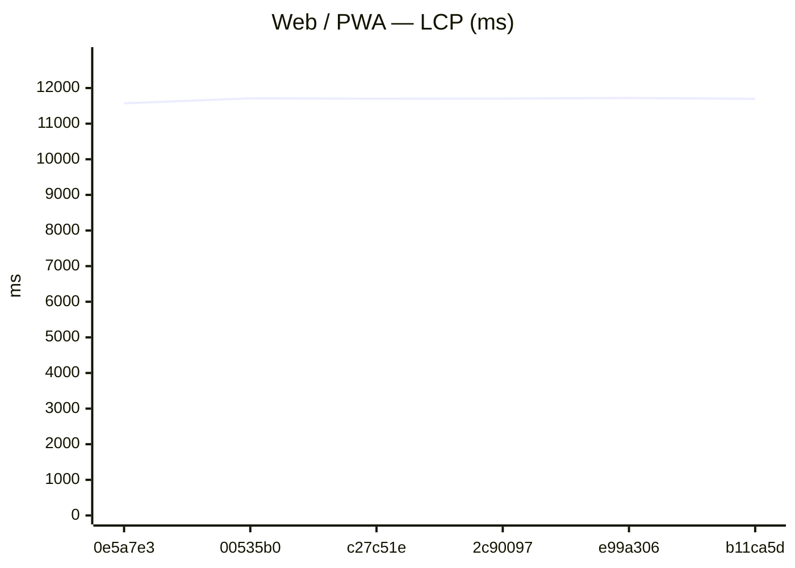
```mermaid
xychart-beta
    title "Web / PWA — LCP (ms)"
    x-axis ["0e5a7e3", "00535b0", "c27c51e", "2c90097", "e99a306", "b11ca5d"]
    y-axis "ms" 0 --> 12895
    line [11571, 11711, 11699, 11703, 11722, 11697]
```
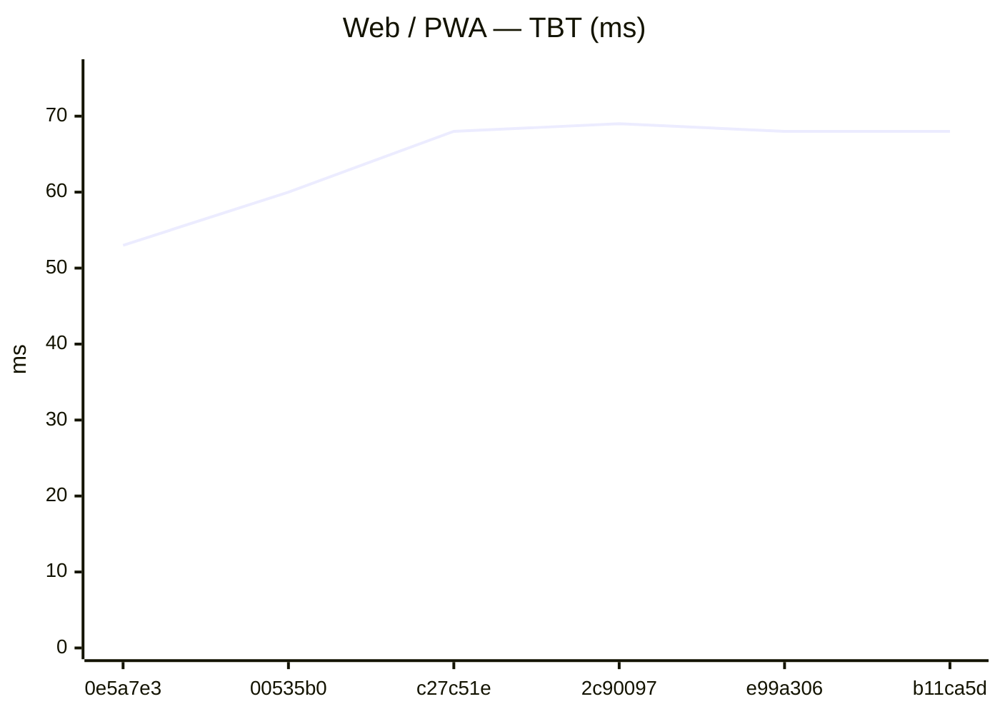
```mermaid
xychart-beta
    title "Web / PWA — TBT (ms)"
    x-axis ["0e5a7e3", "00535b0", "c27c51e", "2c90097", "e99a306", "b11ca5d"]
    y-axis "ms" 0 --> 76
    line [53, 60, 68, 69, 68, 68]
```

### GitHub Pages

| date | sha | status | LCP_ms | FCP_ms | TBT_ms | run |
| --- | --- | --- | --- | --- | --- | --- |
| 2026-03-29 18:36:07 | 0e5a7e3 | ok | 11561 | 10128 | 57 | 23716096346 |
| 2026-03-29 18:25:03 | 00535b0 | ok | 11705 | 10125 | 52 | 23715875249 |
| 2026-03-29 18:05:37 | c27c51e | ok | 11718 | 10138 | 62 | 23715480357 |
| 2026-03-29 17:41:47 | 2c90097 | ok | 11715 | 10138 | 61 | 23715003414 |
| 2026-03-29 15:37:45 | e99a306 | ok | 11701 | 10138 | 60 | 23712530867 |
| 2026-03-29 12:06:49 | b11ca5d | ok | 11707 | 10124 | 54 | 23708607059 |

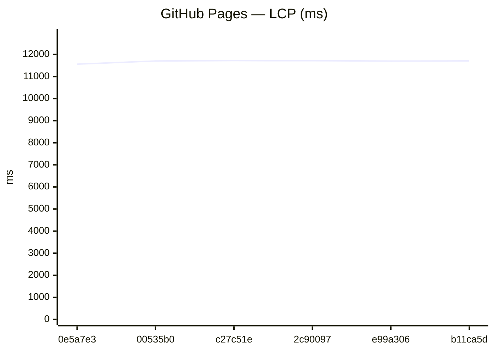
```mermaid
xychart-beta
    title "GitHub Pages — LCP (ms)"
    x-axis ["0e5a7e3", "00535b0", "c27c51e", "2c90097", "e99a306", "b11ca5d"]
    y-axis "ms" 0 --> 12890
    line [11561, 11705, 11718, 11715, 11701, 11707]
```
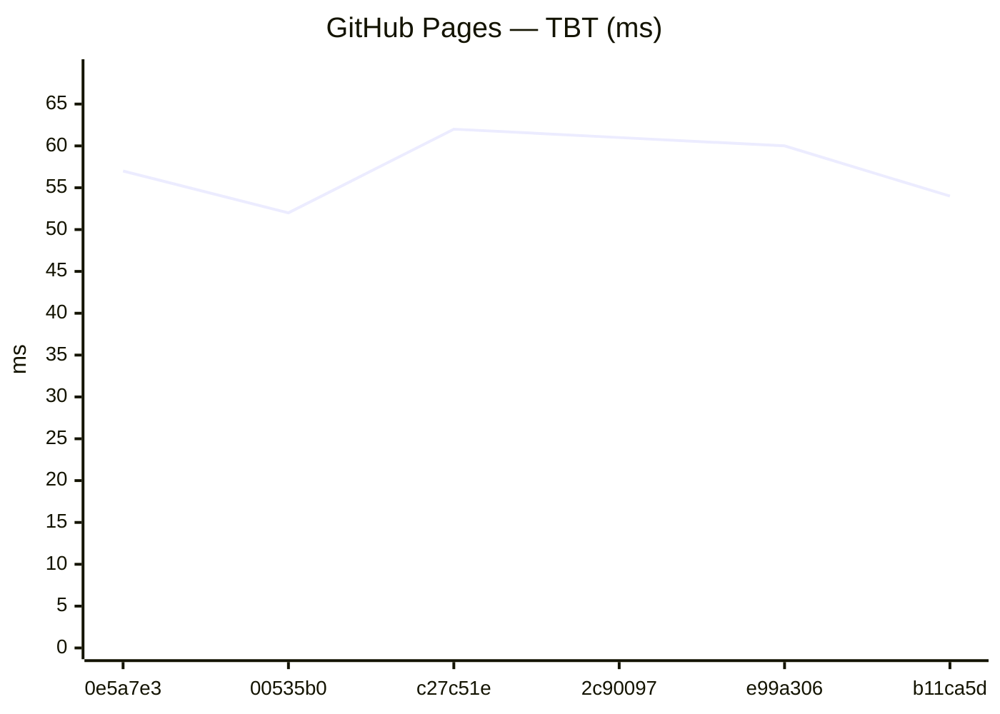
```mermaid
xychart-beta
    title "GitHub Pages — TBT (ms)"
    x-axis ["0e5a7e3", "00535b0", "c27c51e", "2c90097", "e99a306", "b11ca5d"]
    y-axis "ms" 0 --> 69
    line [57, 52, 62, 61, 60, 54]
```

### Capacitor (legacy)

| date | sha | status | LCP_ms | FCP_ms | TBT_ms | run |
| --- | --- | --- | --- | --- | --- | --- |
| 2026-03-29 18:36:32 | 0e5a7e3 | ok | 8693 | 7482 | 26 | 23716096346 |
| 2026-03-29 18:25:28 | 00535b0 | ok | 8834 | 7491 | 38 | 23715875249 |
| 2026-03-29 18:06:02 | c27c51e | ok | 8838 | 7410 | 34 | 23715480357 |
| 2026-03-29 17:42:14 | 2c90097 | ok | 8835 | 7414 | 31 | 23715003414 |
| 2026-03-29 15:38:10 | e99a306 | ok | 8833 | 7484 | 32 | 23712530867 |
| 2026-03-29 12:07:15 | b11ca5d | ok | 8830 | 7408 | 27 | 23708607059 |

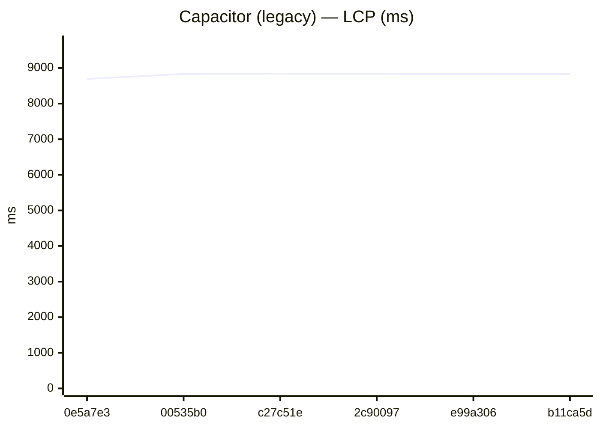
```mermaid
xychart-beta
    title "Capacitor (legacy) — LCP (ms)"
    x-axis ["0e5a7e3", "00535b0", "c27c51e", "2c90097", "e99a306", "b11ca5d"]
    y-axis "ms" 0 --> 9722
    line [8693, 8834, 8838, 8835, 8833, 8830]
```
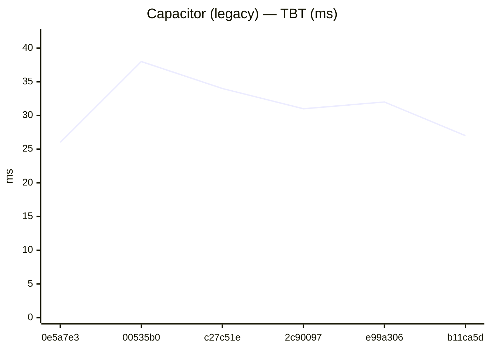
```mermaid
xychart-beta
    title "Capacitor (legacy) — TBT (ms)"
    x-axis ["0e5a7e3", "00535b0", "c27c51e", "2c90097", "e99a306", "b11ca5d"]
    y-axis "ms" 0 --> 42
    line [26, 38, 34, 31, 32, 27]
```

### Expo / RN bundles

Aggregates: **sum of gzip bytes** across all `.hbc` files per platform (stable for trends when chunk hashes change).

| date | sha | status | android_gzip | ios_gzip | run |
| --- | --- | --- | --- | --- | --- |
| 2026-03-29 18:36:02 | 0e5a7e3 | ok | 2356472 | 2350041 | 23716096346 |
| 2026-03-29 18:25:24 | 00535b0 | ok | 2356301 | 2349868 | 23715875249 |
| 2026-03-29 18:05:27 | c27c51e | ok | 2356304 | 2349864 | 23715480357 |
| 2026-03-29 17:41:49 | 2c90097 | ok | 2356302 | 2349868 | 23715003414 |
| 2026-03-29 15:37:54 | e99a306 | ok | 2356302 | 2349869 | 23712530867 |
| 2026-03-29 12:06:38 | b11ca5d | ok | 2356299 | 2349865 | 23708607059 |

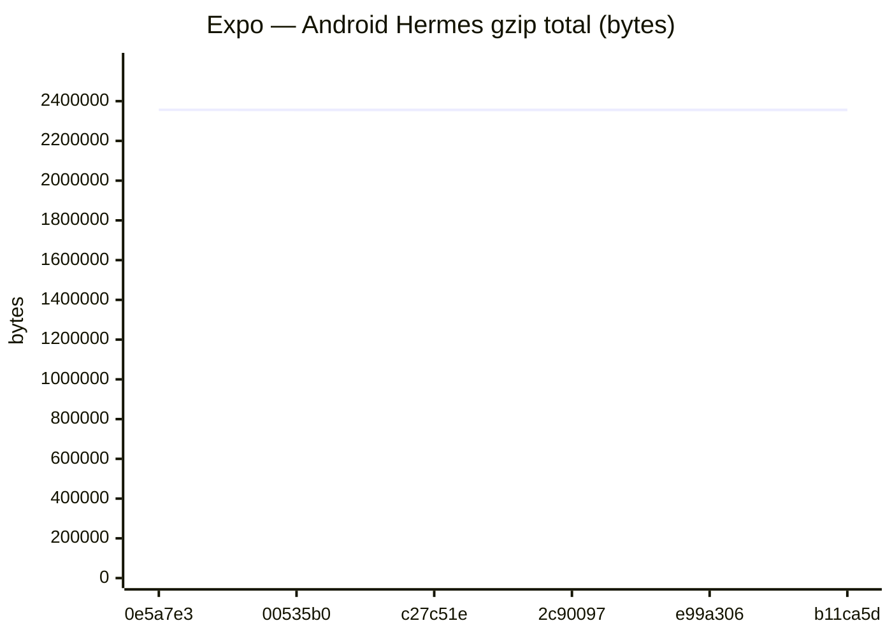
```mermaid
xychart-beta
    title "Expo — Android Hermes gzip total (bytes)"
    x-axis ["0e5a7e3", "00535b0", "c27c51e", "2c90097", "e99a306", "b11ca5d"]
    y-axis "bytes" 0 --> 2592120
    line [2356472, 2356301, 2356304, 2356302, 2356302, 2356299]
```
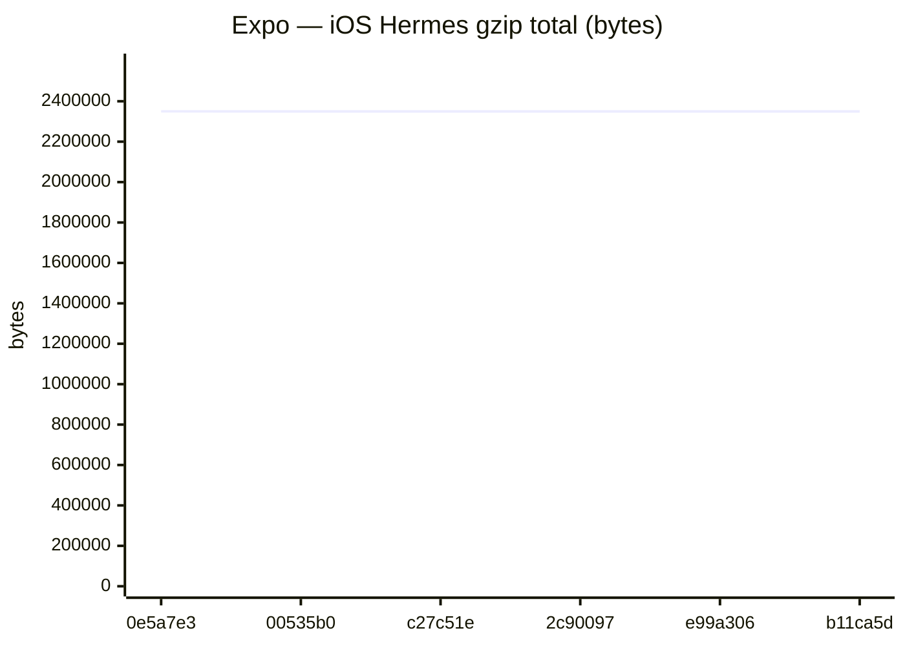
```mermaid
xychart-beta
    title "Expo — iOS Hermes gzip total (bytes)"
    x-axis ["0e5a7e3", "00535b0", "c27c51e", "2c90097", "e99a306", "b11ca5d"]
    y-axis "bytes" 0 --> 2585046
    line [2350041, 2349868, 2349864, 2349868, 2349869, 2349865]
```

Last <strong>5</strong> runs (all platforms)

### Web / PWA

| date | sha | status | LCP_ms | FCP_ms | TBT_ms | run |
| --- | --- | --- | --- | --- | --- | --- |
| 2026-03-29 18:35:41 | 0e5a7e3 | ok | 11571 | 10145 | 53 | 23716096346 |
| 2026-03-29 18:24:37 | 00535b0 | ok | 11711 | 10124 | 60 | 23715875249 |
| 2026-03-29 18:05:11 | c27c51e | ok | 11699 | 10125 | 68 | 23715480357 |
| 2026-03-29 17:41:17 | 2c90097 | ok | 11703 | 10127 | 69 | 23715003414 |
| 2026-03-29 15:37:19 | e99a306 | ok | 11722 | 10139 | 68 | 23712530867 |

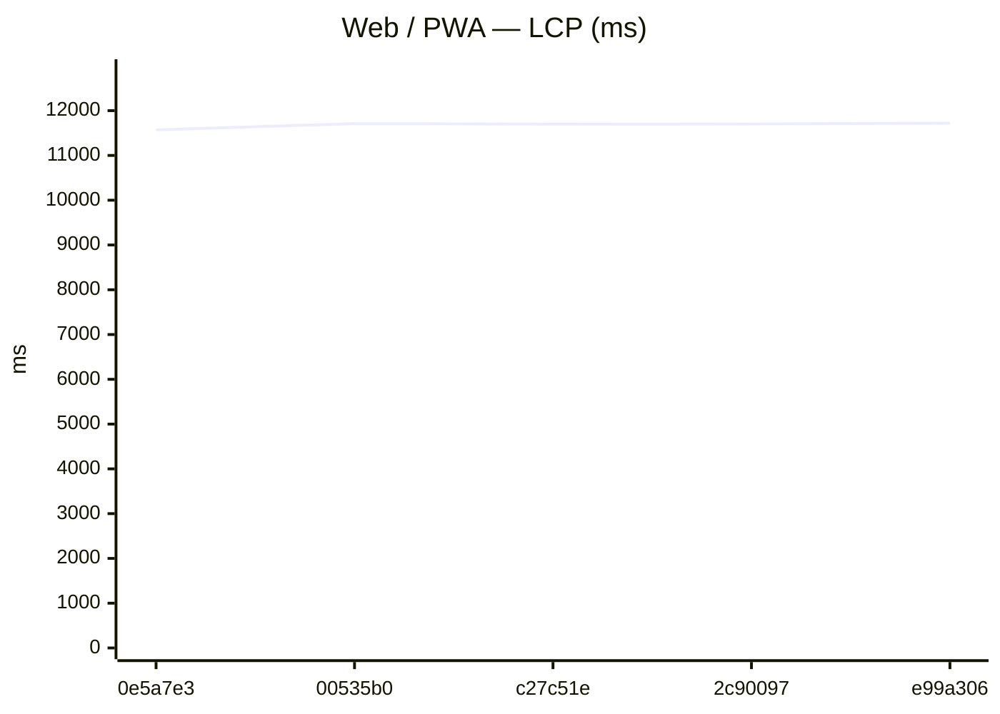
```mermaid
xychart-beta
    title "Web / PWA — LCP (ms)"
    x-axis ["0e5a7e3", "00535b0", "c27c51e", "2c90097", "e99a306"]
    y-axis "ms" 0 --> 12895
    line [11571, 11711, 11699, 11703, 11722]
```
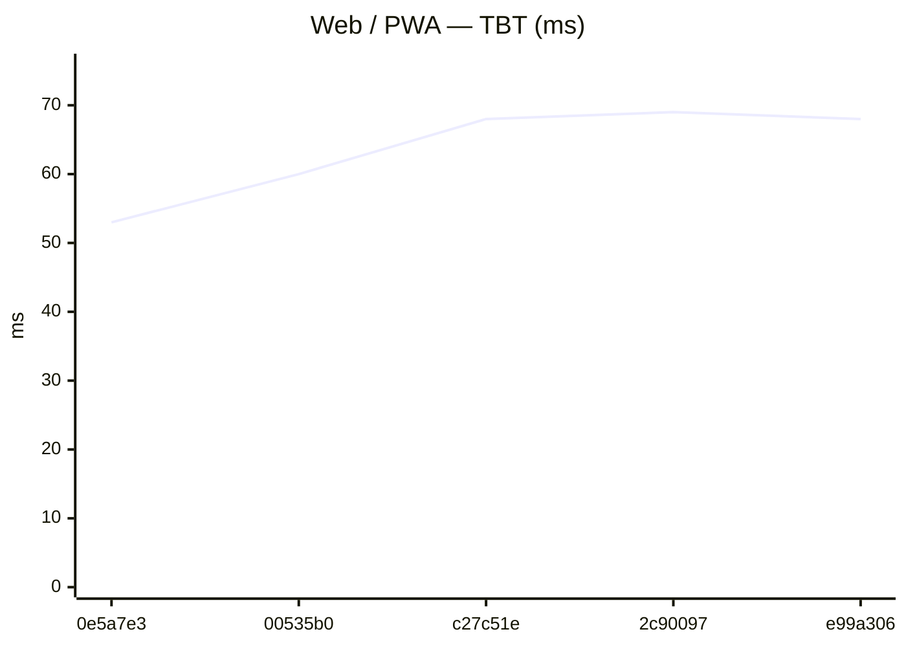
```mermaid
xychart-beta
    title "Web / PWA — TBT (ms)"
    x-axis ["0e5a7e3", "00535b0", "c27c51e", "2c90097", "e99a306"]
    y-axis "ms" 0 --> 76
    line [53, 60, 68, 69, 68]
```

### GitHub Pages

| date | sha | status | LCP_ms | FCP_ms | TBT_ms | run |
| --- | --- | --- | --- | --- | --- | --- |
| 2026-03-29 18:36:07 | 0e5a7e3 | ok | 11561 | 10128 | 57 | 23716096346 |
| 2026-03-29 18:25:03 | 00535b0 | ok | 11705 | 10125 | 52 | 23715875249 |
| 2026-03-29 18:05:37 | c27c51e | ok | 11718 | 10138 | 62 | 23715480357 |
| 2026-03-29 17:41:47 | 2c90097 | ok | 11715 | 10138 | 61 | 23715003414 |
| 2026-03-29 15:37:45 | e99a306 | ok | 11701 | 10138 | 60 | 23712530867 |

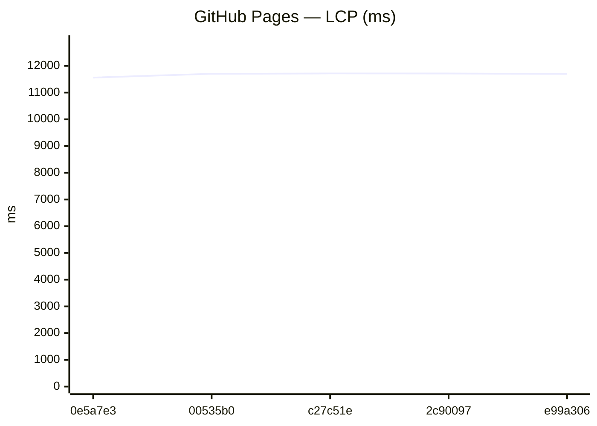
```mermaid
xychart-beta
    title "GitHub Pages — LCP (ms)"
    x-axis ["0e5a7e3", "00535b0", "c27c51e", "2c90097", "e99a306"]
    y-axis "ms" 0 --> 12890
    line [11561, 11705, 11718, 11715, 11701]
```
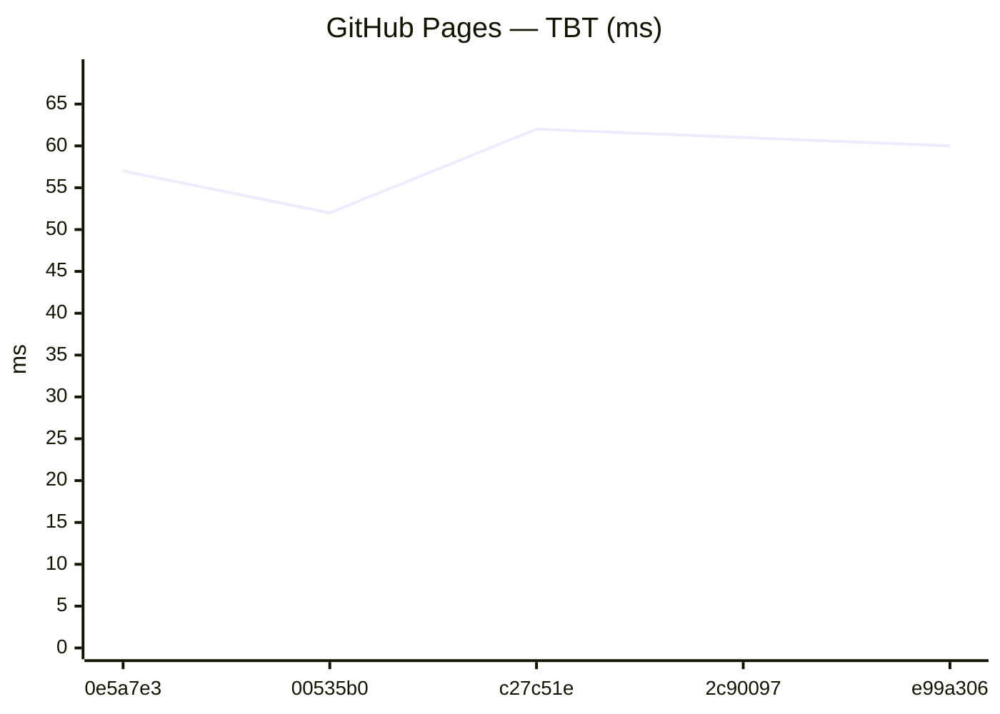
```mermaid
xychart-beta
    title "GitHub Pages — TBT (ms)"
    x-axis ["0e5a7e3", "00535b0", "c27c51e", "2c90097", "e99a306"]
    y-axis "ms" 0 --> 69
    line [57, 52, 62, 61, 60]
```

### Capacitor (legacy)

| date | sha | status | LCP_ms | FCP_ms | TBT_ms | run |
| --- | --- | --- | --- | --- | --- | --- |
| 2026-03-29 18:36:32 | 0e5a7e3 | ok | 8693 | 7482 | 26 | 23716096346 |
| 2026-03-29 18:25:28 | 00535b0 | ok | 8834 | 7491 | 38 | 23715875249 |
| 2026-03-29 18:06:02 | c27c51e | ok | 8838 | 7410 | 34 | 23715480357 |
| 2026-03-29 17:42:14 | 2c90097 | ok | 8835 | 7414 | 31 | 23715003414 |
| 2026-03-29 15:38:10 | e99a306 | ok | 8833 | 7484 | 32 | 23712530867 |

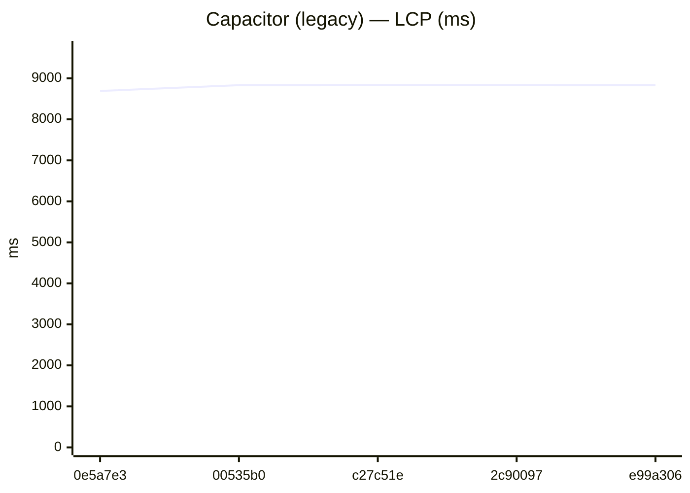
```mermaid
xychart-beta
    title "Capacitor (legacy) — LCP (ms)"
    x-axis ["0e5a7e3", "00535b0", "c27c51e", "2c90097", "e99a306"]
    y-axis "ms" 0 --> 9722
    line [8693, 8834, 8838, 8835, 8833]
```
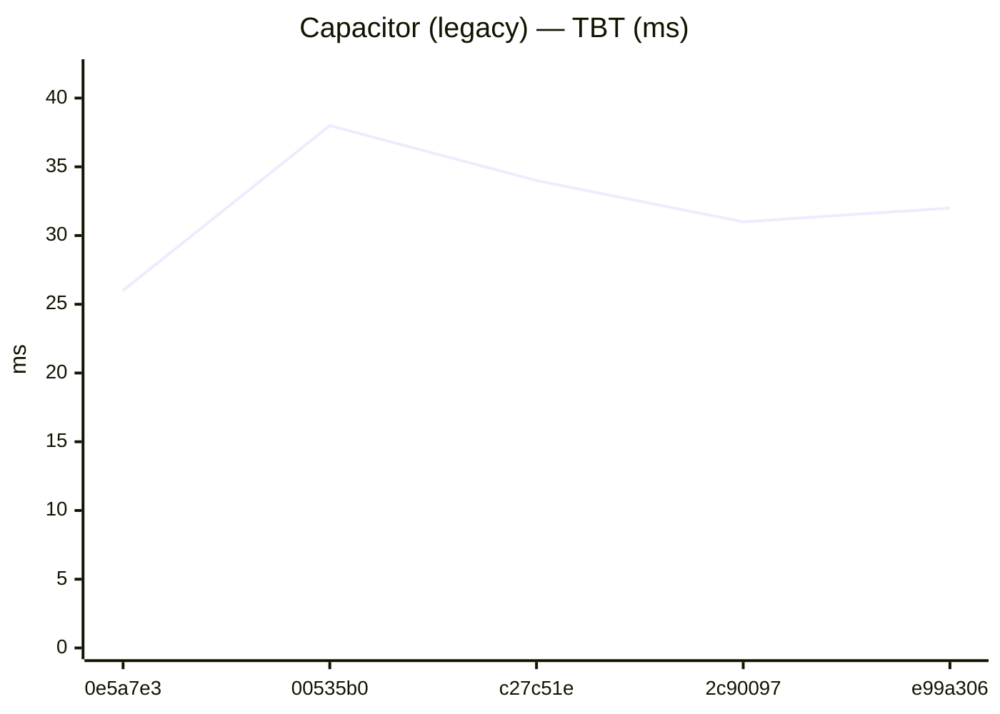
```mermaid
xychart-beta
    title "Capacitor (legacy) — TBT (ms)"
    x-axis ["0e5a7e3", "00535b0", "c27c51e", "2c90097", "e99a306"]
    y-axis "ms" 0 --> 42
    line [26, 38, 34, 31, 32]
```

### Expo / RN bundles

Aggregates: **sum of gzip bytes** across all `.hbc` files per platform (stable for trends when chunk hashes change).

| date | sha | status | android_gzip | ios_gzip | run |
| --- | --- | --- | --- | --- | --- |
| 2026-03-29 18:36:02 | 0e5a7e3 | ok | 2356472 | 2350041 | 23716096346 |
| 2026-03-29 18:25:24 | 00535b0 | ok | 2356301 | 2349868 | 23715875249 |
| 2026-03-29 18:05:27 | c27c51e | ok | 2356304 | 2349864 | 23715480357 |
| 2026-03-29 17:41:49 | 2c90097 | ok | 2356302 | 2349868 | 23715003414 |
| 2026-03-29 15:37:54 | e99a306 | ok | 2356302 | 2349869 | 23712530867 |

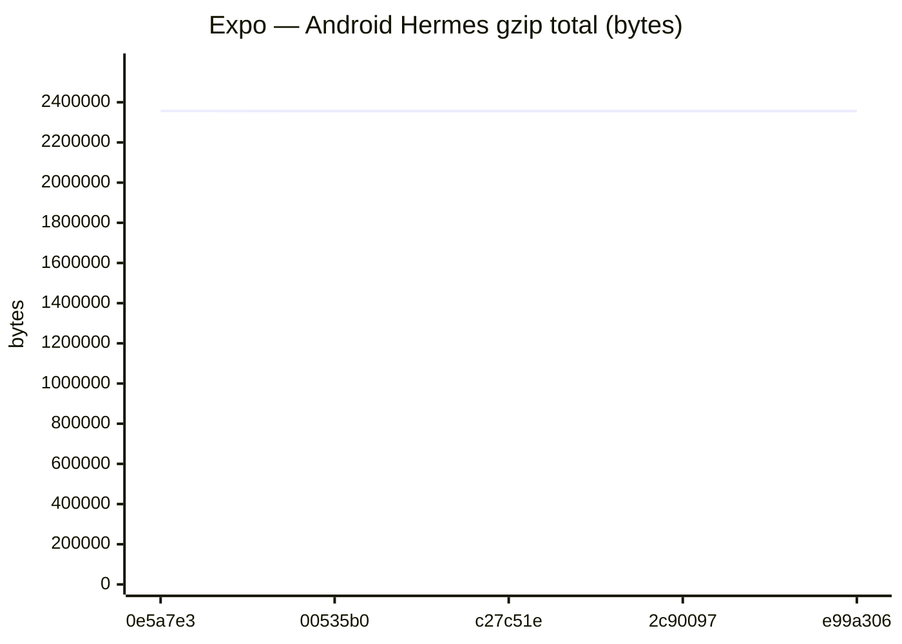
```mermaid
xychart-beta
    title "Expo — Android Hermes gzip total (bytes)"
    x-axis ["0e5a7e3", "00535b0", "c27c51e", "2c90097", "e99a306"]
    y-axis "bytes" 0 --> 2592120
    line [2356472, 2356301, 2356304, 2356302, 2356302]
```
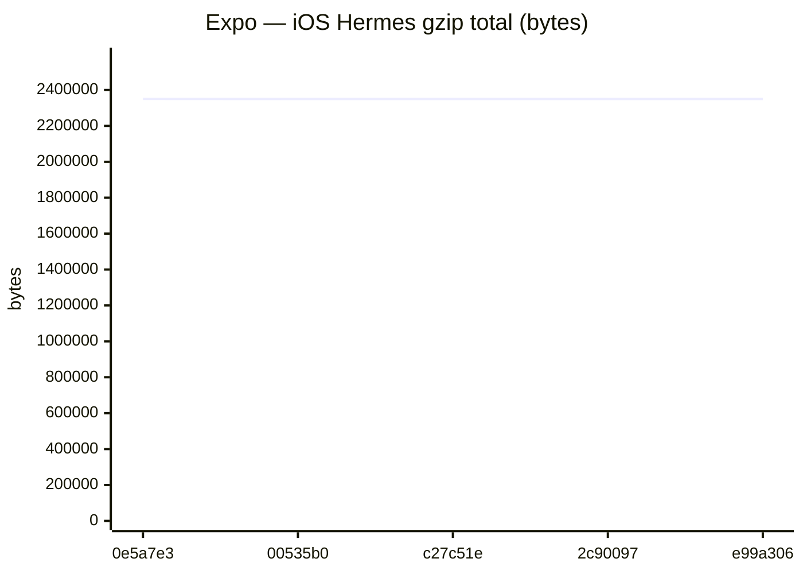
```mermaid
xychart-beta
    title "Expo — iOS Hermes gzip total (bytes)"
    x-axis ["0e5a7e3", "00535b0", "c27c51e", "2c90097", "e99a306"]
    y-axis "bytes" 0 --> 2585046
    line [2350041, 2349868, 2349864, 2349868, 2349869]
```

Last <strong>20</strong> runs (all platforms)

### Web / PWA

| date | sha | status | LCP_ms | FCP_ms | TBT_ms | run |
| --- | --- | --- | --- | --- | --- | --- |
| 2026-03-29 18:35:41 | 0e5a7e3 | ok | 11571 | 10145 | 53 | 23716096346 |
| 2026-03-29 18:24:37 | 00535b0 | ok | 11711 | 10124 | 60 | 23715875249 |
| 2026-03-29 18:05:11 | c27c51e | ok | 11699 | 10125 | 68 | 23715480357 |
| 2026-03-29 17:41:17 | 2c90097 | ok | 11703 | 10127 | 69 | 23715003414 |
| 2026-03-29 15:37:19 | e99a306 | ok | 11722 | 10139 | 68 | 23712530867 |
| 2026-03-29 12:06:23 | b11ca5d | ok | 11697 | 10123 | 68 | 23708607059 |

```mermaid
xychart-beta
    title "Web / PWA — LCP (ms)"
    x-axis ["0e5a7e3", "00535b0", "c27c51e", "2c90097", "e99a306", "b11ca5d"]
    y-axis "ms" 0 --> 12895
    line [11571, 11711, 11699, 11703, 11722, 11697]
```

```mermaid
xychart-beta
    title "Web / PWA — TBT (ms)"
    x-axis ["0e5a7e3", "00535b0", "c27c51e", "2c90097", "e99a306", "b11ca5d"]
    y-axis "ms" 0 --> 76
    line [53, 60, 68, 69, 68, 68]
```

### GitHub Pages

| date | sha | status | LCP_ms | FCP_ms | TBT_ms | run |
| --- | --- | --- | --- | --- | --- | --- |
| 2026-03-29 18:36:07 | 0e5a7e3 | ok | 11561 | 10128 | 57 | 23716096346 |
| 2026-03-29 18:25:03 | 00535b0 | ok | 11705 | 10125 | 52 | 23715875249 |
| 2026-03-29 18:05:37 | c27c51e | ok | 11718 | 10138 | 62 | 23715480357 |
| 2026-03-29 17:41:47 | 2c90097 | ok | 11715 | 10138 | 61 | 23715003414 |
| 2026-03-29 15:37:45 | e99a306 | ok | 11701 | 10138 | 60 | 23712530867 |
| 2026-03-29 12:06:49 | b11ca5d | ok | 11707 | 10124 | 54 | 23708607059 |

```mermaid
xychart-beta
    title "GitHub Pages — LCP (ms)"
    x-axis ["0e5a7e3", "00535b0", "c27c51e", "2c90097", "e99a306", "b11ca5d"]
    y-axis "ms" 0 --> 12890
    line [11561, 11705, 11718, 11715, 11701, 11707]
```

```mermaid
xychart-beta
    title "GitHub Pages — TBT (ms)"
    x-axis ["0e5a7e3", "00535b0", "c27c51e", "2c90097", "e99a306", "b11ca5d"]
    y-axis "ms" 0 --> 69
    line [57, 52, 62, 61, 60, 54]
```

### Capacitor (legacy)

| date | sha | status | LCP_ms | FCP_ms | TBT_ms | run |
| --- | --- | --- | --- | --- | --- | --- |
| 2026-03-29 18:36:32 | 0e5a7e3 | ok | 8693 | 7482 | 26 | 23716096346 |
| 2026-03-29 18:25:28 | 00535b0 | ok | 8834 | 7491 | 38 | 23715875249 |
| 2026-03-29 18:06:02 | c27c51e | ok | 8838 | 7410 | 34 | 23715480357 |
| 2026-03-29 17:42:14 | 2c90097 | ok | 8835 | 7414 | 31 | 23715003414 |
| 2026-03-29 15:38:10 | e99a306 | ok | 8833 | 7484 | 32 | 23712530867 |
| 2026-03-29 12:07:15 | b11ca5d | ok | 8830 | 7408 | 27 | 23708607059 |

```mermaid
xychart-beta
    title "Capacitor (legacy) — LCP (ms)"
    x-axis ["0e5a7e3", "00535b0", "c27c51e", "2c90097", "e99a306", "b11ca5d"]
    y-axis "ms" 0 --> 9722
    line [8693, 8834, 8838, 8835, 8833, 8830]
```
```mermaid
xychart-beta
    title "Capacitor (legacy) — TBT (ms)"
    x-axis ["0e5a7e3", "00535b0", "c27c51e", "2c90097", "e99a306", "b11ca5d"]
    y-axis "ms" 0 --> 42
    line [26, 38, 34, 31, 32, 27]
```

### Expo / RN bundles

Aggregates: **sum of gzip bytes** across all `.hbc` files per platform (stable for trends when chunk hashes change).

| date | sha | status | android_gzip | ios_gzip | run |
| --- | --- | --- | --- | --- | --- |
| 2026-03-29 18:36:02 | 0e5a7e3 | ok | 2356472 | 2350041 | 23716096346 |
| 2026-03-29 18:25:24 | 00535b0 | ok | 2356301 | 2349868 | 23715875249 |
| 2026-03-29 18:05:27 | c27c51e | ok | 2356304 | 2349864 | 23715480357 |
| 2026-03-29 17:41:49 | 2c90097 | ok | 2356302 | 2349868 | 23715003414 |
| 2026-03-29 15:37:54 | e99a306 | ok | 2356302 | 2349869 | 23712530867 |
| 2026-03-29 12:06:38 | b11ca5d | ok | 2356299 | 2349865 | 23708607059 |

```mermaid
xychart-beta
    title "Expo — Android Hermes gzip total (bytes)"
    x-axis ["0e5a7e3", "00535b0", "c27c51e", "2c90097", "e99a306", "b11ca5d"]
    y-axis "bytes" 0 --> 2592120
    line [2356472, 2356301, 2356304, 2356302, 2356302, 2356299]
```
```mermaid
xychart-beta
    title "Expo — iOS Hermes gzip total (bytes)"
    x-axis ["0e5a7e3", "00535b0", "c27c51e", "2c90097", "e99a306", "b11ca5d"]
    y-axis "bytes" 0 --> 2585046
    line [2350041, 2349868, 2349864, 2349868, 2349869, 2349865]
```

