# Benchmark comparison (history)

Generated at **2026-06-14T08:09:13.502Z**.

To change the default number of runs in the primary sections below, edit **[compare.config.json](./compare.config.json)** (`window`). GitHub does not support interactive dropdowns in Markdown; optional **collapsed sections** list alternate window sizes.

---

### Web / PWA

| date | sha | status | LCP_ms | FCP_ms | TBT_ms | run |
| --- | --- | --- | --- | --- | --- | --- |
| 2026-06-14 08:07:54 | 36e0b4b | ok | 13563 | 8738 | 140 | 27492730321 |
| 2026-06-14 01:01:58 | 5095a3b | ok | 13394 | 8646 | 158 | 27484132166 |
| 2026-06-13 16:55:37 | 84f6619 | ok | 12124 | 8314 | 20 | 27473022439 |
| 2026-06-13 11:09:28 | 68b4b12 | ok | 12007 | 8334 | 54 | 27465001801 |
| 2026-06-13 10:46:59 | d6308aa | ok | 12072 | 8348 | 110 | 27464520051 |
| 2026-06-12 19:00:16 | 75b5f2d | ok | 11911 | 7881 | 55 | 27436558960 |
| 2026-06-12 18:34:20 | b24157b | ok | 11695 | 8030 | 38 | 27435038702 |
| 2026-06-12 18:17:41 | c5293a0 | ok | 11707 | 8115 | 48 | 27434368650 |
| 2026-06-12 17:13:29 | ad35dc3 | ok | 11844 | 10268 | 41 | 27430856806 |
| 2026-06-12 16:57:26 | 78b9979 | ok | 11862 | 10360 | 58 | 27430191956 |

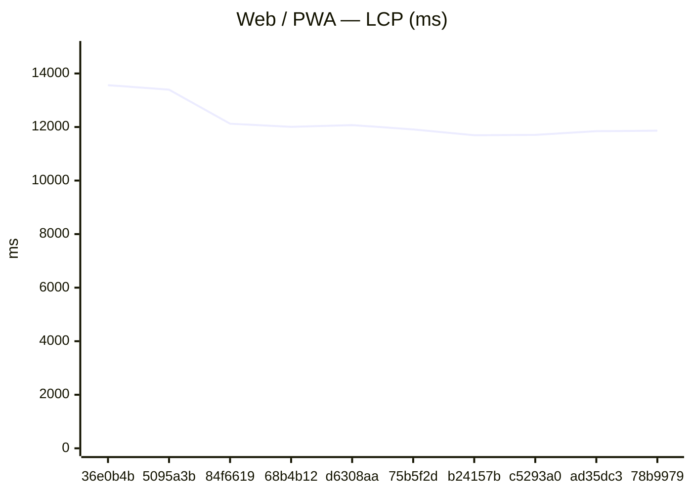
```mermaid
xychart-beta
    title "Web / PWA — LCP (ms)"
    x-axis ["36e0b4b", "5095a3b", "84f6619", "68b4b12", "d6308aa", "75b5f2d", "b24157b", "c5293a0", "ad35dc3", "78b9979"]
    y-axis "ms" 0 --> 14920
    line [13563, 13394, 12124, 12007, 12072, 11911, 11695, 11707, 11844, 11862]
```
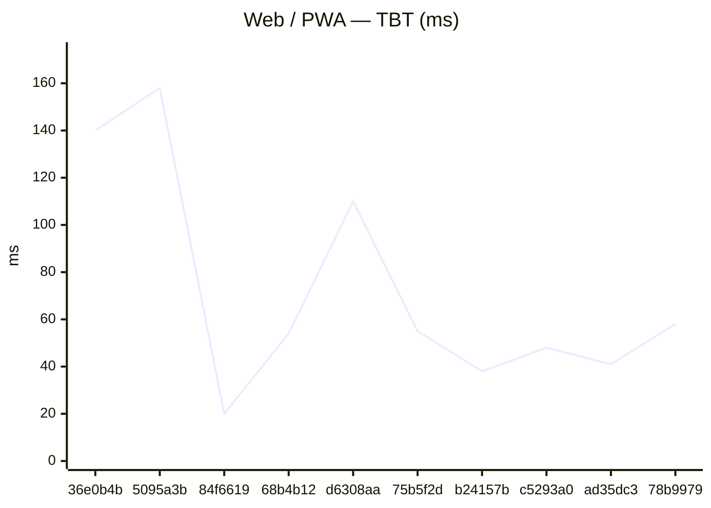
```mermaid
xychart-beta
    title "Web / PWA — TBT (ms)"
    x-axis ["36e0b4b", "5095a3b", "84f6619", "68b4b12", "d6308aa", "75b5f2d", "b24157b", "c5293a0", "ad35dc3", "78b9979"]
    y-axis "ms" 0 --> 174
    line [140, 158, 20, 54, 110, 55, 38, 48, 41, 58]
```

### GitHub Pages

| date | sha | status | LCP_ms | FCP_ms | TBT_ms | run |
| --- | --- | --- | --- | --- | --- | --- |
| 2026-06-14 08:08:20 | 36e0b4b | ok | 13383 | 8717 | 94 | 27492730321 |
| 2026-06-14 01:02:24 | 5095a3b | ok | 13388 | 8713 | 87 | 27484132166 |
| 2026-06-13 16:56:01 | 84f6619 | ok | 12127 | 8168 | 39 | 27473022439 |
| 2026-06-13 11:09:53 | 68b4b12 | ok | 12028 | 8175 | 77 | 27465001801 |
| 2026-06-13 10:47:24 | d6308aa | ok | 11904 | 8339 | 53 | 27464520051 |
| 2026-06-12 19:00:41 | 75b5f2d | ok | 11863 | 7882 | 46 | 27436558960 |
| 2026-06-12 18:34:45 | b24157b | ok | 11768 | 7903 | 47 | 27435038702 |
| 2026-06-12 18:18:06 | c5293a0 | ok | 11742 | 8022 | 40 | 27434368650 |
| 2026-06-12 17:13:54 | ad35dc3 | ok | 11838 | 10286 | 39 | 27430856806 |
| 2026-06-12 16:57:52 | 78b9979 | ok | 11855 | 10284 | 52 | 27430191956 |

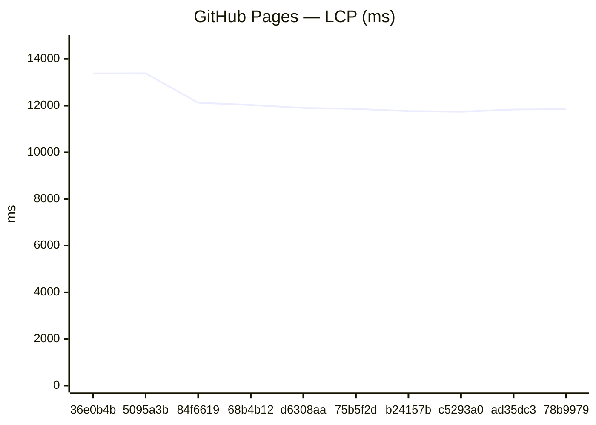
```mermaid
xychart-beta
    title "GitHub Pages — LCP (ms)"
    x-axis ["36e0b4b", "5095a3b", "84f6619", "68b4b12", "d6308aa", "75b5f2d", "b24157b", "c5293a0", "ad35dc3", "78b9979"]
    y-axis "ms" 0 --> 14727
    line [13383, 13388, 12127, 12028, 11904, 11863, 11768, 11742, 11838, 11855]
```
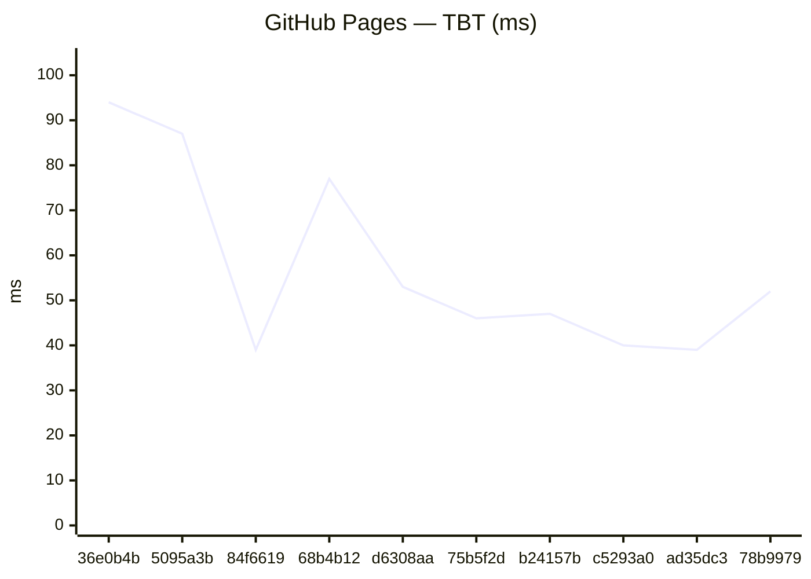
```mermaid
xychart-beta
    title "GitHub Pages — TBT (ms)"
    x-axis ["36e0b4b", "5095a3b", "84f6619", "68b4b12", "d6308aa", "75b5f2d", "b24157b", "c5293a0", "ad35dc3", "78b9979"]
    y-axis "ms" 0 --> 104
    line [94, 87, 39, 77, 53, 46, 47, 40, 39, 52]
```

### Capacitor (legacy)
_No history yet._

### Expo / RN bundles

Aggregates: **sum of gzip bytes** across all `.hbc` files per platform (stable for trends when chunk hashes change).

| date | sha | status | android_gzip | ios_gzip | run |
| --- | --- | --- | --- | --- | --- |
| 2026-06-14 08:08:52 | 36e0b4b | ok | 3240548 | 3230712 | 27492730321 |
| 2026-06-14 01:03:17 | 5095a3b | ok | 2511667 | 2504401 | 27484132166 |
| 2026-06-13 16:56:41 | 84f6619 | ok | 2411913 | 2405024 | 27473022439 |
| 2026-06-13 11:09:53 | 68b4b12 | ok | 2377489 | 2370491 | 27465001801 |
| 2026-06-13 10:47:46 | d6308aa | ok | 2377488 | 2370493 | 27464520051 |
| 2026-06-12 19:00:37 | 75b5f2d | ok | 2370632 | 2363429 | 27436558960 |
| 2026-06-12 18:34:50 | b24157b | ok | 2370632 | 2363431 | 27435038702 |
| 2026-06-12 18:18:19 | c5293a0 | ok | 2370634 | 2363430 | 27434368650 |
| 2026-06-12 17:14:12 | ad35dc3 | ok | 2362082 | 2356086 | 27430856806 |
| 2026-06-12 16:58:10 | 78b9979 | ok | 2362084 | 2356086 | 27430191956 |

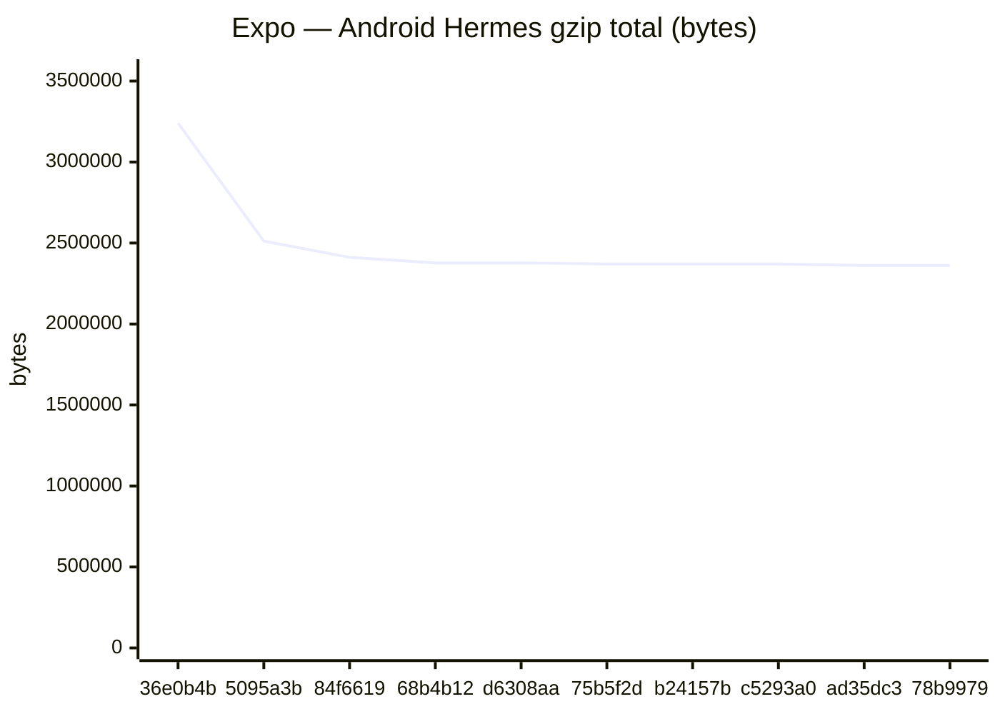
```mermaid
xychart-beta
    title "Expo — Android Hermes gzip total (bytes)"
    x-axis ["36e0b4b", "5095a3b", "84f6619", "68b4b12", "d6308aa", "75b5f2d", "b24157b", "c5293a0", "ad35dc3", "78b9979"]
    y-axis "bytes" 0 --> 3564603
    line [3240548, 2511667, 2411913, 2377489, 2377488, 2370632, 2370632, 2370634, 2362082, 2362084]
```

```mermaid
xychart-beta
    title "Expo — iOS Hermes gzip total (bytes)"
    x-axis ["36e0b4b", "5095a3b", "84f6619", "68b4b12", "d6308aa", "75b5f2d", "b24157b", "c5293a0", "ad35dc3", "78b9979"]
    y-axis "bytes" 0 --> 3553784
    line [3230712, 2504401, 2405024, 2370491, 2370493, 2363429, 2363431, 2363430, 2356086, 2356086]
```

Last <strong>5</strong> runs (all platforms)

### Web / PWA

| date | sha | status | LCP_ms | FCP_ms | TBT_ms | run |
| --- | --- | --- | --- | --- | --- | --- |
| 2026-06-14 08:07:54 | 36e0b4b | ok | 13563 | 8738 | 140 | 27492730321 |
| 2026-06-14 01:01:58 | 5095a3b | ok | 13394 | 8646 | 158 | 27484132166 |
| 2026-06-13 16:55:37 | 84f6619 | ok | 12124 | 8314 | 20 | 27473022439 |
| 2026-06-13 11:09:28 | 68b4b12 | ok | 12007 | 8334 | 54 | 27465001801 |
| 2026-06-13 10:46:59 | d6308aa | ok | 12072 | 8348 | 110 | 27464520051 |

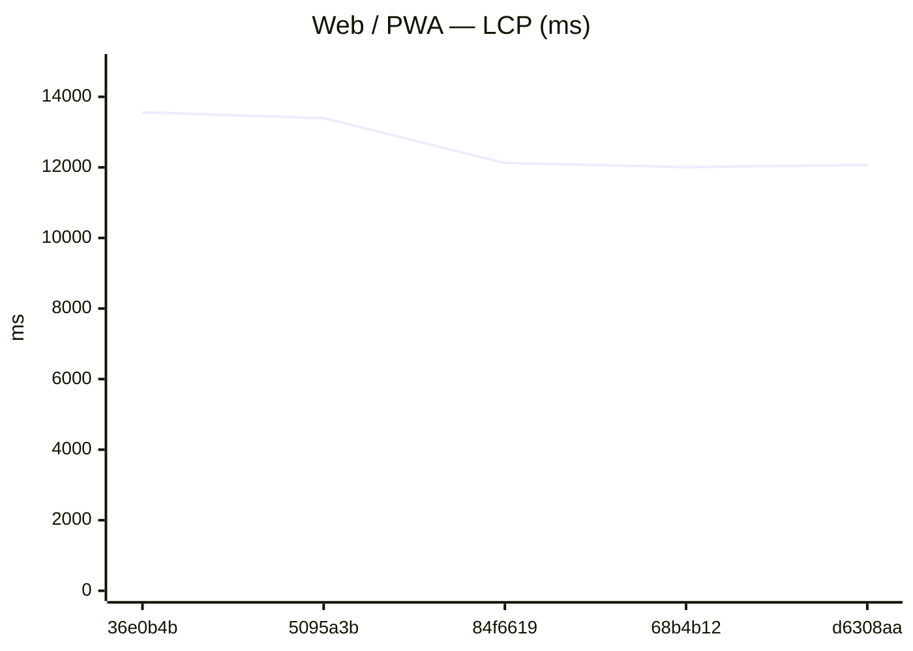
```mermaid
xychart-beta
    title "Web / PWA — LCP (ms)"
    x-axis ["36e0b4b", "5095a3b", "84f6619", "68b4b12", "d6308aa"]
    y-axis "ms" 0 --> 14920
    line [13563, 13394, 12124, 12007, 12072]
```
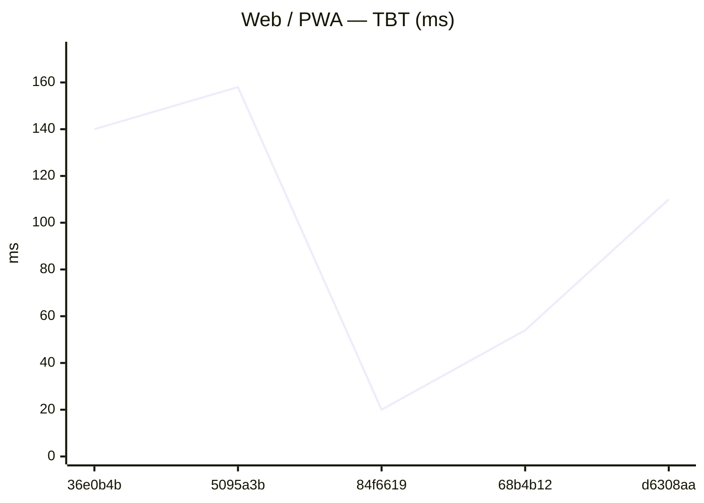
```mermaid
xychart-beta
    title "Web / PWA — TBT (ms)"
    x-axis ["36e0b4b", "5095a3b", "84f6619", "68b4b12", "d6308aa"]
    y-axis "ms" 0 --> 174
    line [140, 158, 20, 54, 110]
```

### GitHub Pages

| date | sha | status | LCP_ms | FCP_ms | TBT_ms | run |
| --- | --- | --- | --- | --- | --- | --- |
| 2026-06-14 08:08:20 | 36e0b4b | ok | 13383 | 8717 | 94 | 27492730321 |
| 2026-06-14 01:02:24 | 5095a3b | ok | 13388 | 8713 | 87 | 27484132166 |
| 2026-06-13 16:56:01 | 84f6619 | ok | 12127 | 8168 | 39 | 27473022439 |
| 2026-06-13 11:09:53 | 68b4b12 | ok | 12028 | 8175 | 77 | 27465001801 |
| 2026-06-13 10:47:24 | d6308aa | ok | 11904 | 8339 | 53 | 27464520051 |

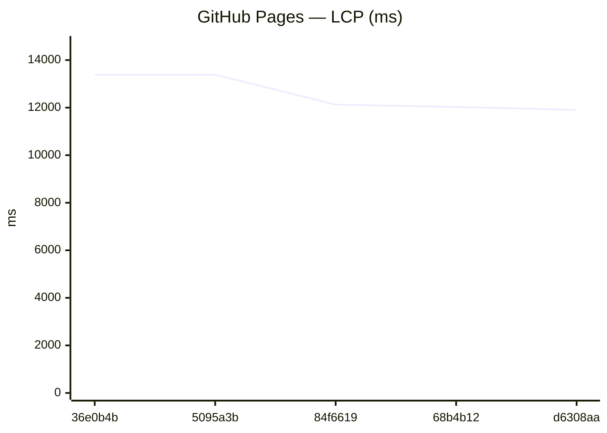
```mermaid
xychart-beta
    title "GitHub Pages — LCP (ms)"
    x-axis ["36e0b4b", "5095a3b", "84f6619", "68b4b12", "d6308aa"]
    y-axis "ms" 0 --> 14727
    line [13383, 13388, 12127, 12028, 11904]
```
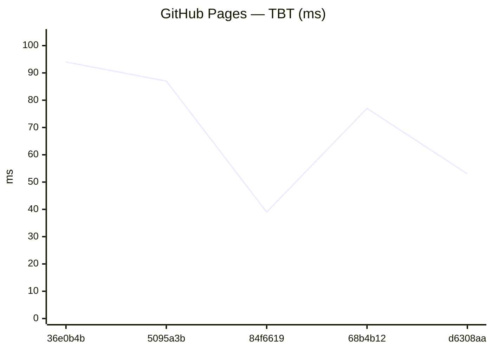
```mermaid
xychart-beta
    title "GitHub Pages — TBT (ms)"
    x-axis ["36e0b4b", "5095a3b", "84f6619", "68b4b12", "d6308aa"]
    y-axis "ms" 0 --> 104
    line [94, 87, 39, 77, 53]
```

### Capacitor (legacy)
_No history yet._

### Expo / RN bundles

Aggregates: **sum of gzip bytes** across all `.hbc` files per platform (stable for trends when chunk hashes change).

| date | sha | status | android_gzip | ios_gzip | run |
| --- | --- | --- | --- | --- | --- |
| 2026-06-14 08:08:52 | 36e0b4b | ok | 3240548 | 3230712 | 27492730321 |
| 2026-06-14 01:03:17 | 5095a3b | ok | 2511667 | 2504401 | 27484132166 |
| 2026-06-13 16:56:41 | 84f6619 | ok | 2411913 | 2405024 | 27473022439 |
| 2026-06-13 11:09:53 | 68b4b12 | ok | 2377489 | 2370491 | 27465001801 |
| 2026-06-13 10:47:46 | d6308aa | ok | 2377488 | 2370493 | 27464520051 |

```mermaid
xychart-beta
    title "Expo — Android Hermes gzip total (bytes)"
    x-axis ["36e0b4b", "5095a3b", "84f6619", "68b4b12", "d6308aa"]
    y-axis "bytes" 0 --> 3564603
    line [3240548, 2511667, 2411913, 2377489, 2377488]
```
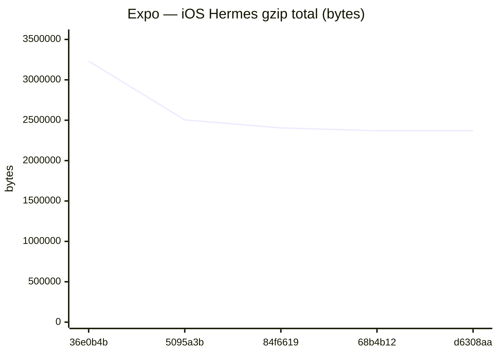
```mermaid
xychart-beta
    title "Expo — iOS Hermes gzip total (bytes)"
    x-axis ["36e0b4b", "5095a3b", "84f6619", "68b4b12", "d6308aa"]
    y-axis "bytes" 0 --> 3553784
    line [3230712, 2504401, 2405024, 2370491, 2370493]
```

Last <strong>20</strong> runs (all platforms)

### Web / PWA

| date | sha | status | LCP_ms | FCP_ms | TBT_ms | run |
| --- | --- | --- | --- | --- | --- | --- |
| 2026-06-14 08:07:54 | 36e0b4b | ok | 13563 | 8738 | 140 | 27492730321 |
| 2026-06-14 01:01:58 | 5095a3b | ok | 13394 | 8646 | 158 | 27484132166 |
| 2026-06-13 16:55:37 | 84f6619 | ok | 12124 | 8314 | 20 | 27473022439 |
| 2026-06-13 11:09:28 | 68b4b12 | ok | 12007 | 8334 | 54 | 27465001801 |
| 2026-06-13 10:46:59 | d6308aa | ok | 12072 | 8348 | 110 | 27464520051 |
| 2026-06-12 19:00:16 | 75b5f2d | ok | 11911 | 7881 | 55 | 27436558960 |
| 2026-06-12 18:34:20 | b24157b | ok | 11695 | 8030 | 38 | 27435038702 |
| 2026-06-12 18:17:41 | c5293a0 | ok | 11707 | 8115 | 48 | 27434368650 |
| 2026-06-12 17:13:29 | ad35dc3 | ok | 11844 | 10268 | 41 | 27430856806 |
| 2026-06-12 16:57:26 | 78b9979 | ok | 11862 | 10360 | 58 | 27430191956 |
| 2026-06-12 15:56:06 | a32d90c | ok | 11845 | 10276 | 47 | 27426915206 |
| 2026-06-12 04:40:18 | df44b11 | ok | 11860 | 10272 | 57 | 27394811733 |
| 2026-04-12 11:41:04 | 4da014f | ok | 11572 | 10144 | 68 | 24305848610 |
| 2026-04-12 11:14:04 | 738c1fd | ok | 11701 | 10200 | 47 | 24305340387 |
| 2026-04-12 10:02:35 | bf7d465 | ok | 11691 | 10120 | 39 | 24304047351 |
| 2026-03-29 20:59:43 | a728c40 | ok | 11716 | 10213 | 62 | 23718893763 |
| 2026-03-29 19:49:55 | 37034e2 | ok | 11698 | 10200 | 46 | 23717325744 |
| 2026-03-29 19:34:14 | 00595d4 | ok | 11566 | 10139 | 63 | 23717238946 |
| 2026-03-29 18:35:41 | 0e5a7e3 | ok | 11571 | 10145 | 53 | 23716096346 |
| 2026-03-29 18:24:37 | 00535b0 | ok | 11711 | 10124 | 60 | 23715875249 |

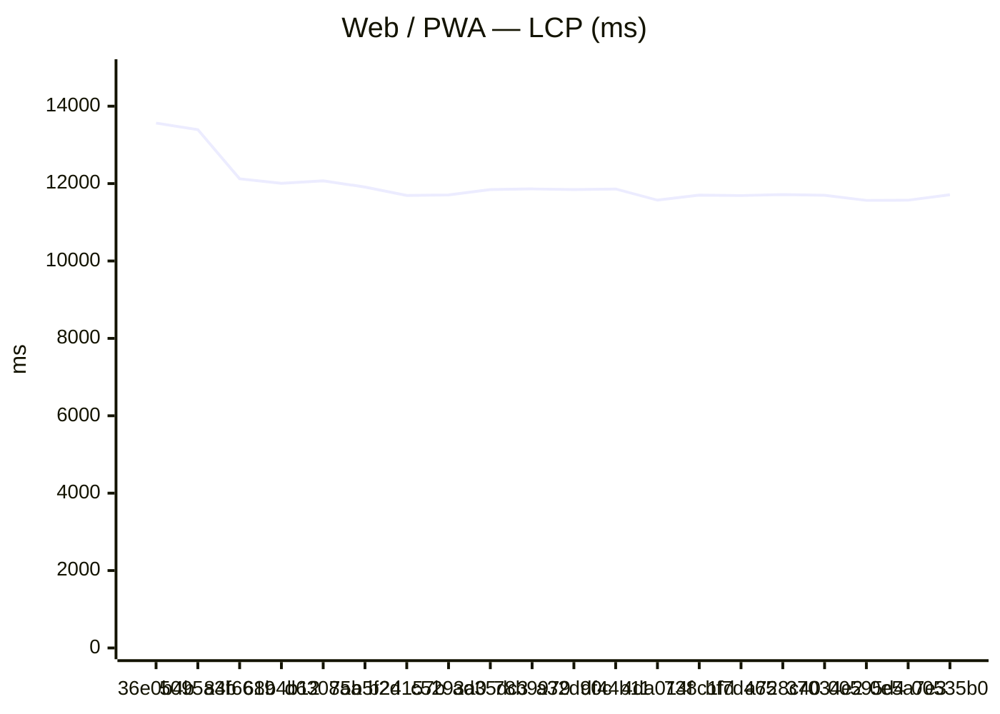
```mermaid
xychart-beta
    title "Web / PWA — LCP (ms)"
    x-axis ["36e0b4b", "5095a3b", "84f6619", "68b4b12", "d6308aa", "75b5f2d", "b24157b", "c5293a0", "ad35dc3", "78b9979", "a32d90c", "df44b11", "4da014f", "738c1fd", "bf7d465", "a728c40", "37034e2", "00595d4", "0e5a7e3", "00535b0"]
    y-axis "ms" 0 --> 14920
    line [13563, 13394, 12124, 12007, 12072, 11911, 11695, 11707, 11844, 11862, 11845, 11860, 11572, 11701, 11691, 11716, 11698, 11566, 11571, 11711]
```
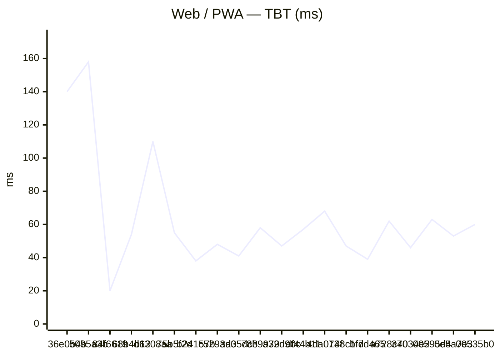
```mermaid
xychart-beta
    title "Web / PWA — TBT (ms)"
    x-axis ["36e0b4b", "5095a3b", "84f6619", "68b4b12", "d6308aa", "75b5f2d", "b24157b", "c5293a0", "ad35dc3", "78b9979", "a32d90c", "df44b11", "4da014f", "738c1fd", "bf7d465", "a728c40", "37034e2", "00595d4", "0e5a7e3", "00535b0"]
    y-axis "ms" 0 --> 174
    line [140, 158, 20, 54, 110, 55, 38, 48, 41, 58, 47, 57, 68, 47, 39, 62, 46, 63, 53, 60]
```

### GitHub Pages

| date | sha | status | LCP_ms | FCP_ms | TBT_ms | run |
| --- | --- | --- | --- | --- | --- | --- |
| 2026-06-14 08:08:20 | 36e0b4b | ok | 13383 | 8717 | 94 | 27492730321 |
| 2026-06-14 01:02:24 | 5095a3b | ok | 13388 | 8713 | 87 | 27484132166 |
| 2026-06-13 16:56:01 | 84f6619 | ok | 12127 | 8168 | 39 | 27473022439 |
| 2026-06-13 11:09:53 | 68b4b12 | ok | 12028 | 8175 | 77 | 27465001801 |
| 2026-06-13 10:47:24 | d6308aa | ok | 11904 | 8339 | 53 | 27464520051 |
| 2026-06-12 19:00:41 | 75b5f2d | ok | 11863 | 7882 | 46 | 27436558960 |
| 2026-06-12 18:34:45 | b24157b | ok | 11768 | 7903 | 47 | 27435038702 |
| 2026-06-12 18:18:06 | c5293a0 | ok | 11742 | 8022 | 40 | 27434368650 |
| 2026-06-12 17:13:54 | ad35dc3 | ok | 11838 | 10286 | 39 | 27430856806 |
| 2026-06-12 16:57:52 | 78b9979 | ok | 11855 | 10284 | 52 | 27430191956 |
| 2026-06-12 15:56:31 | a32d90c | ok | 11852 | 10279 | 48 | 27426915206 |
| 2026-06-12 04:40:44 | df44b11 | ok | 11847 | 10270 | 58 | 27394811733 |
| 2026-04-12 11:41:32 | 4da014f | ok | 11548 | 10124 | 44 | 24305848610 |
| 2026-04-12 11:14:29 | 738c1fd | ok | 11710 | 10178 | 54 | 24305340387 |
| 2026-04-12 10:03:01 | bf7d465 | ok | 11718 | 10144 | 65 | 24304047351 |
| 2026-03-29 21:00:09 | a728c40 | ok | 11707 | 10127 | 54 | 23718893763 |
| 2026-03-29 19:50:21 | 37034e2 | ok | 11710 | 10139 | 58 | 23717325744 |
| 2026-03-29 19:34:40 | 00595d4 | ok | 11560 | 9984 | 56 | 23717238946 |
| 2026-03-29 18:36:07 | 0e5a7e3 | ok | 11561 | 10128 | 57 | 23716096346 |
| 2026-03-29 18:25:03 | 00535b0 | ok | 11705 | 10125 | 52 | 23715875249 |

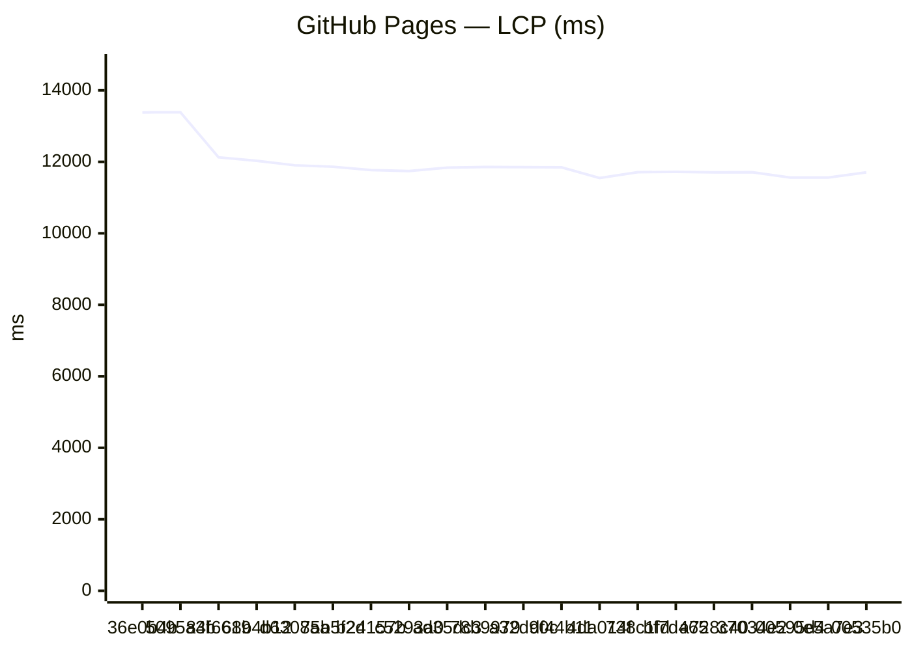
```mermaid
xychart-beta
    title "GitHub Pages — LCP (ms)"
    x-axis ["36e0b4b", "5095a3b", "84f6619", "68b4b12", "d6308aa", "75b5f2d", "b24157b", "c5293a0", "ad35dc3", "78b9979", "a32d90c", "df44b11", "4da014f", "738c1fd", "bf7d465", "a728c40", "37034e2", "00595d4", "0e5a7e3", "00535b0"]
    y-axis "ms" 0 --> 14727
    line [13383, 13388, 12127, 12028, 11904, 11863, 11768, 11742, 11838, 11855, 11852, 11847, 11548, 11710, 11718, 11707, 11710, 11560, 11561, 11705]
```
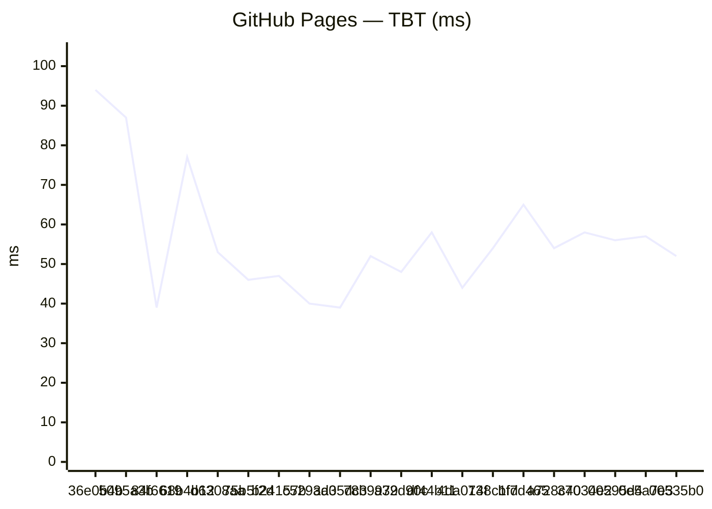
```mermaid
xychart-beta
    title "GitHub Pages — TBT (ms)"
    x-axis ["36e0b4b", "5095a3b", "84f6619", "68b4b12", "d6308aa", "75b5f2d", "b24157b", "c5293a0", "ad35dc3", "78b9979", "a32d90c", "df44b11", "4da014f", "738c1fd", "bf7d465", "a728c40", "37034e2", "00595d4", "0e5a7e3", "00535b0"]
    y-axis "ms" 0 --> 104
    line [94, 87, 39, 77, 53, 46, 47, 40, 39, 52, 48, 58, 44, 54, 65, 54, 58, 56, 57, 52]
```

### Capacitor (legacy)
_No history yet._

### Expo / RN bundles

Aggregates: **sum of gzip bytes** across all `.hbc` files per platform (stable for trends when chunk hashes change).

| date | sha | status | android_gzip | ios_gzip | run |
| --- | --- | --- | --- | --- | --- |
| 2026-06-14 08:08:52 | 36e0b4b | ok | 3240548 | 3230712 | 27492730321 |
| 2026-06-14 01:03:17 | 5095a3b | ok | 2511667 | 2504401 | 27484132166 |
| 2026-06-13 16:56:41 | 84f6619 | ok | 2411913 | 2405024 | 27473022439 |
| 2026-06-13 11:09:53 | 68b4b12 | ok | 2377489 | 2370491 | 27465001801 |
| 2026-06-13 10:47:46 | d6308aa | ok | 2377488 | 2370493 | 27464520051 |
| 2026-06-12 19:00:37 | 75b5f2d | ok | 2370632 | 2363429 | 27436558960 |
| 2026-06-12 18:34:50 | b24157b | ok | 2370632 | 2363431 | 27435038702 |
| 2026-06-12 18:18:19 | c5293a0 | ok | 2370634 | 2363430 | 27434368650 |
| 2026-06-12 17:14:12 | ad35dc3 | ok | 2362082 | 2356086 | 27430856806 |
| 2026-06-12 16:58:10 | 78b9979 | ok | 2362084 | 2356086 | 27430191956 |
| 2026-06-12 15:56:51 | a32d90c | ok | 2362047 | 2356058 | 27426915206 |
| 2026-06-12 04:40:23 | df44b11 | ok | 2362047 | 2356058 | 27394811733 |
| 2026-04-12 11:41:34 | 4da014f | ok | 2362048 | 2356060 | 24305848610 |
| 2026-04-12 11:14:37 | 738c1fd | ok | 2362047 | 2356059 | 24305340387 |
| 2026-04-12 10:02:52 | bf7d465 | ok | 2356686 | 2350178 | 24304047351 |
| 2026-03-29 21:00:17 | a728c40 | ok | 2356685 | 2350175 | 23718893763 |
| 2026-03-29 19:50:14 | 37034e2 | ok | 2356472 | 2350043 | 23717325744 |
| 2026-03-29 19:34:37 | 00595d4 | ok | 2356474 | 2350046 | 23717238946 |
| 2026-03-29 18:36:02 | 0e5a7e3 | ok | 2356472 | 2350041 | 23716096346 |
| 2026-03-29 18:25:24 | 00535b0 | ok | 2356301 | 2349868 | 23715875249 |

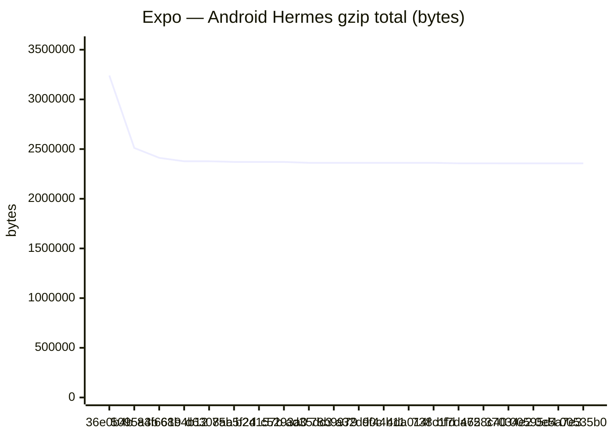
```mermaid
xychart-beta
    title "Expo — Android Hermes gzip total (bytes)"
    x-axis ["36e0b4b", "5095a3b", "84f6619", "68b4b12", "d6308aa", "75b5f2d", "b24157b", "c5293a0", "ad35dc3", "78b9979", "a32d90c", "df44b11", "4da014f", "738c1fd", "bf7d465", "a728c40", "37034e2", "00595d4", "0e5a7e3", "00535b0"]
    y-axis "bytes" 0 --> 3564603
    line [3240548, 2511667, 2411913, 2377489, 2377488, 2370632, 2370632, 2370634, 2362082, 2362084, 2362047, 2362047, 2362048, 2362047, 2356686, 2356685, 2356472, 2356474, 2356472, 2356301]
```
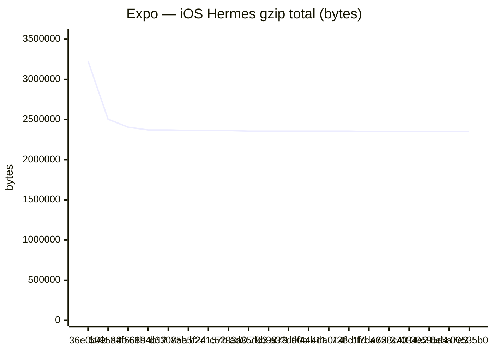
```mermaid
xychart-beta
    title "Expo — iOS Hermes gzip total (bytes)"
    x-axis ["36e0b4b", "5095a3b", "84f6619", "68b4b12", "d6308aa", "75b5f2d", "b24157b", "c5293a0", "ad35dc3", "78b9979", "a32d90c", "df44b11", "4da014f", "738c1fd", "bf7d465", "a728c40", "37034e2", "00595d4", "0e5a7e3", "00535b0"]
    y-axis "bytes" 0 --> 3553784
    line [3230712, 2504401, 2405024, 2370491, 2370493, 2363429, 2363431, 2363430, 2356086, 2356086, 2356058, 2356058, 2356060, 2356059, 2350178, 2350175, 2350043, 2350046, 2350041, 2349868]
```

