# Benchmark comparison (history)

Generated at **2026-06-21T21:52:24.389Z**.

To change the default number of runs in the primary sections below, edit **[compare.config.json](./compare.config.json)** (`window`). GitHub does not support interactive dropdowns in Markdown; optional **collapsed sections** list alternate window sizes.

---

### Web / PWA

| date | sha | status | LCP_ms | FCP_ms | TBT_ms | run |
| --- | --- | --- | --- | --- | --- | --- |
| 2026-06-21 21:50:29 | 22c28c1 | ok | 18722 | 9439 | 336 | 27918516609 |
| 2026-06-21 20:49:11 | 02d5be4 | ok | 18436 | 9281 | 225 | 27916990825 |
| 2026-06-21 20:32:52 | 3429b26 | ok | 18270 | 9584 | 210 | 27916581700 |
| 2026-06-21 20:09:49 | cb374b6 | ok | 18278 | 9299 | 218 | 27916012962 |
| 2026-06-21 19:25:08 | 31e56b8 | ok | 18267 | 9143 | 207 | 27914661913 |
| 2026-06-21 19:09:29 | 398a643 | ok | 18242 | 9136 | 182 | 27914523096 |
| 2026-06-21 18:43:53 | 6f14815 | ok | 18254 | 9137 | 163 | 27913865432 |
| 2026-06-20 20:15:12 | ba1b8bc | ok | 14947 | 9383 | 59 | 27882586489 |
| 2026-06-20 16:24:36 | 3a63ea4 | ok | 14588 | 9107 | 132 | 27876954012 |
| 2026-06-20 15:01:53 | d4d43f1 | ok | 14818 | 9108 | 117 | 27874796920 |

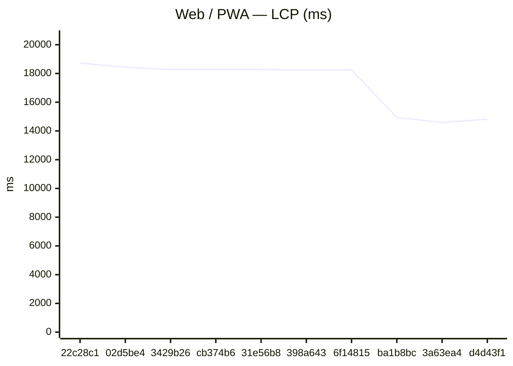
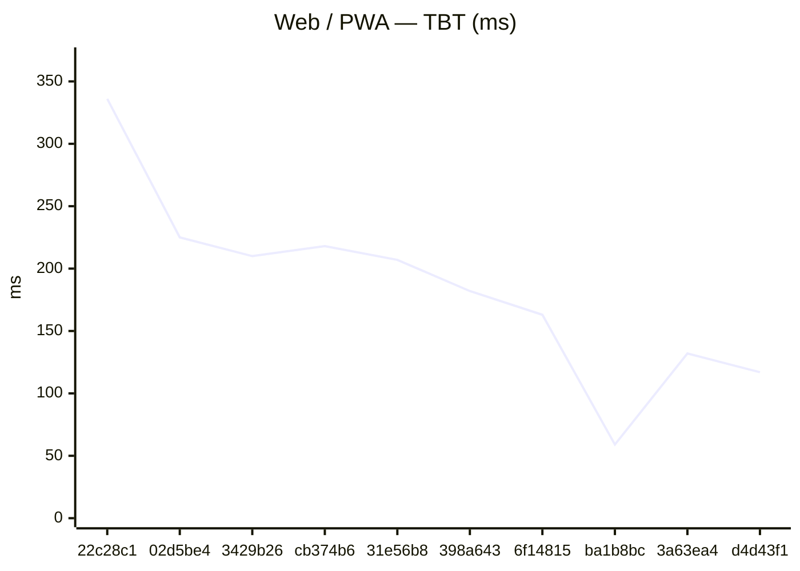

### GitHub Pages

| date | sha | status | LCP_ms | FCP_ms | TBT_ms | run |
| --- | --- | --- | --- | --- | --- | --- |
| 2026-06-21 21:50:56 | 22c28c1 | ok | 18704 | 9438 | 229 | 27918516609 |
| 2026-06-21 20:49:37 | 02d5be4 | ok | 18438 | 9000 | 227 | 27916990825 |
| 2026-06-21 20:33:19 | 3429b26 | ok | 18287 | 9284 | 221 | 27916581700 |
| 2026-06-21 20:10:17 | cb374b6 | ok | 18290 | 9305 | 230 | 27916012962 |
| 2026-06-21 19:25:34 | 31e56b8 | ok | 18265 | 9140 | 221 | 27914661913 |
| 2026-06-21 19:09:57 | 398a643 | ok | 18222 | 9134 | 159 | 27914523096 |
| 2026-06-21 18:44:20 | 6f14815 | ok | 18275 | 9225 | 209 | 27913865432 |
| 2026-06-20 20:15:34 | ba1b8bc | ok | 14936 | 9158 | 61 | 27882586489 |
| 2026-06-20 16:25:00 | 3a63ea4 | ok | 14957 | 9254 | 106 | 27876954012 |
| 2026-06-20 15:02:17 | d4d43f1 | ok | 13769 | 8960 | 121 | 27874796920 |

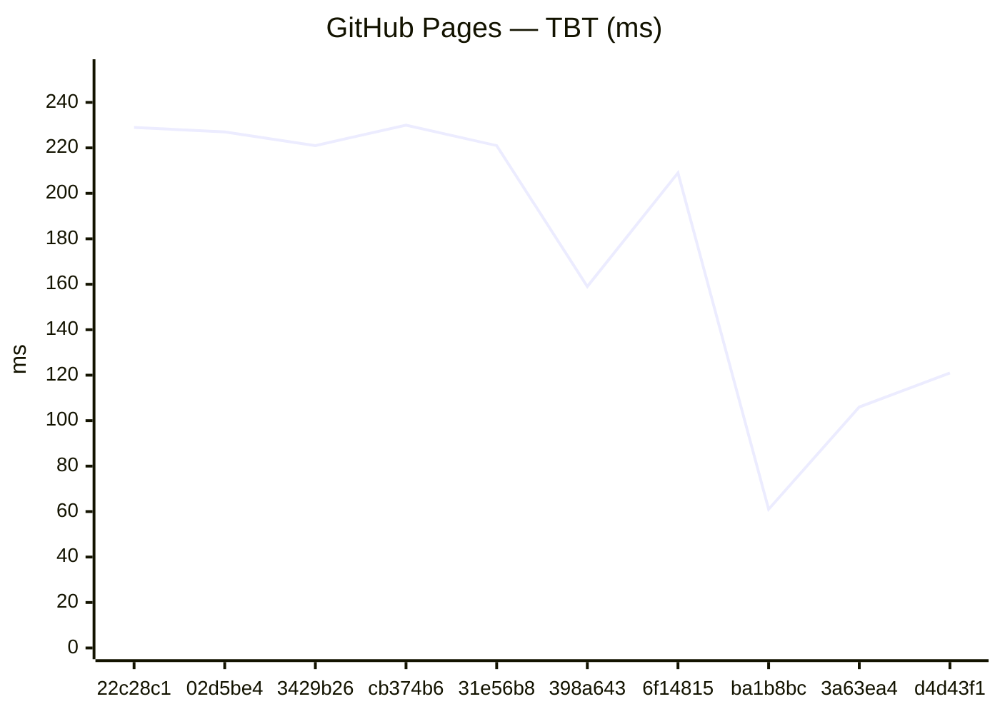

### Capacitor (legacy)
_No history yet._

### Expo / RN bundles

Aggregates: **sum of gzip bytes** across all `.hbc` files per platform (stable for trends when chunk hashes change).

| date | sha | status | android_gzip | ios_gzip | run |
| --- | --- | --- | --- | --- | --- |
| 2026-06-21 21:52:00 | 22c28c1 | ok | 3836645 | 3828818 | 27918516609 |
| 2026-06-21 20:50:44 | 02d5be4 | ok | 3819535 | 3810818 | 27916990825 |
| 2026-06-21 20:34:16 | 3429b26 | ok | 3807947 | 3801309 | 27916581700 |
| 2026-06-21 20:11:59 | cb374b6 | ok | 3807947 | 3801305 | 27916012962 |
| 2026-06-21 19:26:43 | 31e56b8 | ok | 3802529 | 3796002 | 27914661913 |
| 2026-06-21 19:11:07 | 398a643 | ok | 3802528 | 3796002 | 27914523096 |
| 2026-06-21 18:45:24 | 6f14815 | ok | 3802527 | 3796005 | 27913865432 |
| 2026-06-20 20:17:09 | ba1b8bc | ok | 3796378 | 3788525 | 27882586489 |
| 2026-06-20 16:26:14 | 3a63ea4 | ok | 3791714 | 3783517 | 27876954012 |
| 2026-06-20 15:03:47 | d4d43f1 | ok | 3791716 | 3783520 | 27874796920 |

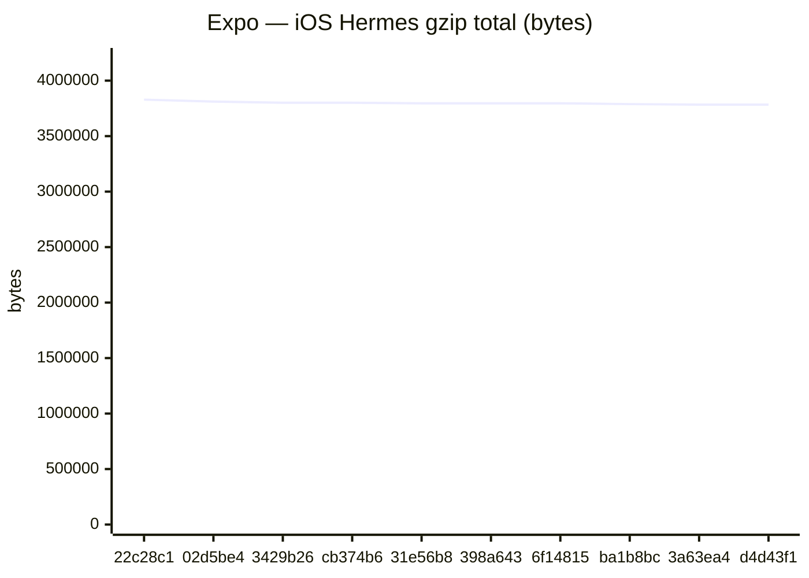

Last <strong>5</strong> runs (all platforms)

### Web / PWA

| date | sha | status | LCP_ms | FCP_ms | TBT_ms | run |
| --- | --- | --- | --- | --- | --- | --- |
| 2026-06-21 21:50:29 | 22c28c1 | ok | 18722 | 9439 | 336 | 27918516609 |
| 2026-06-21 20:49:11 | 02d5be4 | ok | 18436 | 9281 | 225 | 27916990825 |
| 2026-06-21 20:32:52 | 3429b26 | ok | 18270 | 9584 | 210 | 27916581700 |
| 2026-06-21 20:09:49 | cb374b6 | ok | 18278 | 9299 | 218 | 27916012962 |
| 2026-06-21 19:25:08 | 31e56b8 | ok | 18267 | 9143 | 207 | 27914661913 |

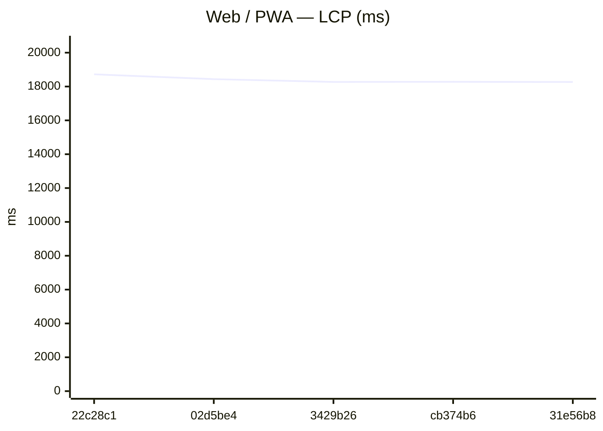
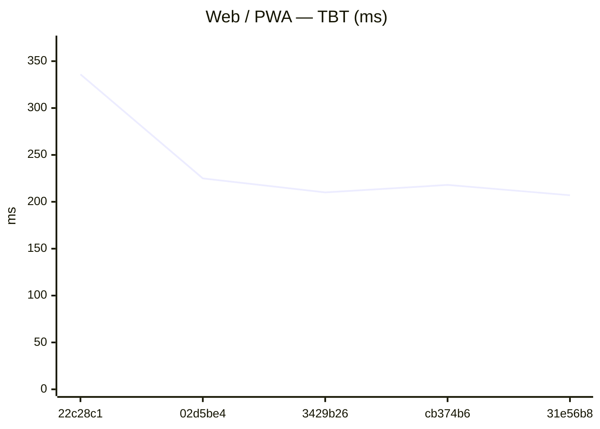

### GitHub Pages

| date | sha | status | LCP_ms | FCP_ms | TBT_ms | run |
| --- | --- | --- | --- | --- | --- | --- |
| 2026-06-21 21:50:56 | 22c28c1 | ok | 18704 | 9438 | 229 | 27918516609 |
| 2026-06-21 20:49:37 | 02d5be4 | ok | 18438 | 9000 | 227 | 27916990825 |
| 2026-06-21 20:33:19 | 3429b26 | ok | 18287 | 9284 | 221 | 27916581700 |
| 2026-06-21 20:10:17 | cb374b6 | ok | 18290 | 9305 | 230 | 27916012962 |
| 2026-06-21 19:25:34 | 31e56b8 | ok | 18265 | 9140 | 221 | 27914661913 |

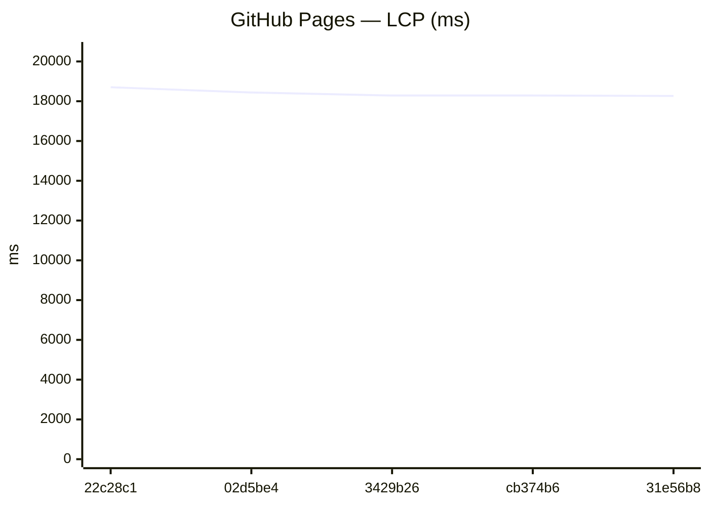
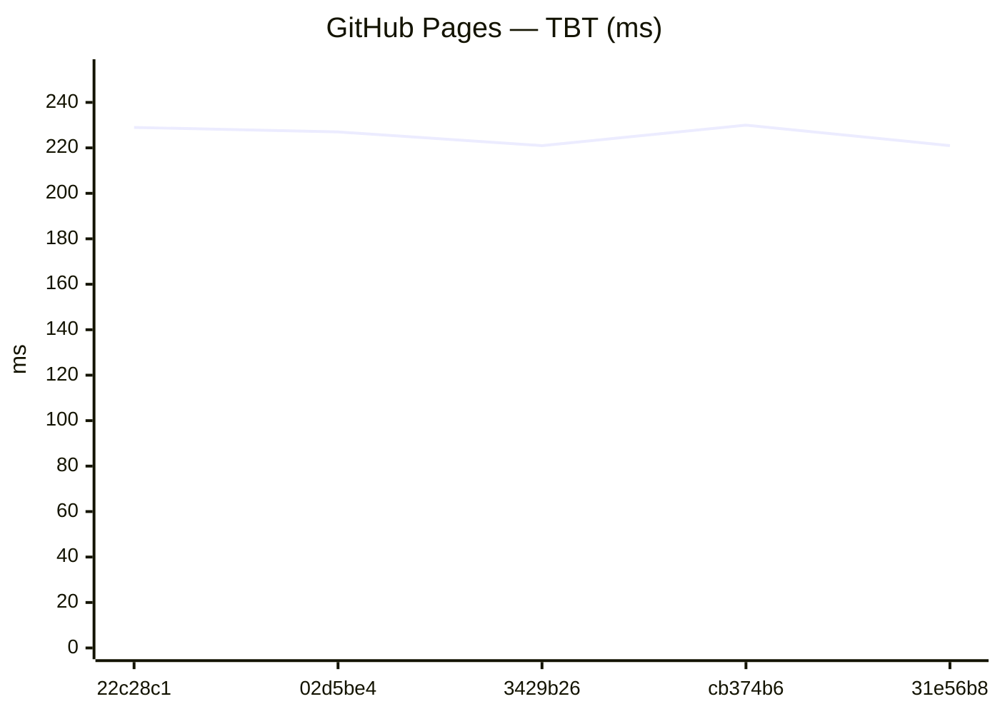

### Capacitor (legacy)
_No history yet._

### Expo / RN bundles

Aggregates: **sum of gzip bytes** across all `.hbc` files per platform (stable for trends when chunk hashes change).

| date | sha | status | android_gzip | ios_gzip | run |
| --- | --- | --- | --- | --- | --- |
| 2026-06-21 21:52:00 | 22c28c1 | ok | 3836645 | 3828818 | 27918516609 |
| 2026-06-21 20:50:44 | 02d5be4 | ok | 3819535 | 3810818 | 27916990825 |
| 2026-06-21 20:34:16 | 3429b26 | ok | 3807947 | 3801309 | 27916581700 |
| 2026-06-21 20:11:59 | cb374b6 | ok | 3807947 | 3801305 | 27916012962 |
| 2026-06-21 19:26:43 | 31e56b8 | ok | 3802529 | 3796002 | 27914661913 |

Last <strong>20</strong> runs (all platforms)

### Web / PWA

| date | sha | status | LCP_ms | FCP_ms | TBT_ms | run |
| --- | --- | --- | --- | --- | --- | --- |
| 2026-06-21 21:50:29 | 22c28c1 | ok | 18722 | 9439 | 336 | 27918516609 |
| 2026-06-21 20:49:11 | 02d5be4 | ok | 18436 | 9281 | 225 | 27916990825 |
| 2026-06-21 20:32:52 | 3429b26 | ok | 18270 | 9584 | 210 | 27916581700 |
| 2026-06-21 20:09:49 | cb374b6 | ok | 18278 | 9299 | 218 | 27916012962 |
| 2026-06-21 19:25:08 | 31e56b8 | ok | 18267 | 9143 | 207 | 27914661913 |
| 2026-06-21 19:09:29 | 398a643 | ok | 18242 | 9136 | 182 | 27914523096 |
| 2026-06-21 18:43:53 | 6f14815 | ok | 18254 | 9137 | 163 | 27913865432 |
| 2026-06-20 20:15:12 | ba1b8bc | ok | 14947 | 9383 | 59 | 27882586489 |
| 2026-06-20 16:24:36 | 3a63ea4 | ok | 14588 | 9107 | 132 | 27876954012 |
| 2026-06-20 15:01:53 | d4d43f1 | ok | 14818 | 9108 | 117 | 27874796920 |
| 2026-06-20 11:45:55 | 8acf510 | ok | 13807 | 8926 | 160 | 27870147148 |
| 2026-06-20 10:56:32 | df81309 | ok | 13825 | 9022 | 166 | 27868999947 |
| 2026-06-20 10:25:29 | 768e756 | ok | 13971 | 8942 | 155 | 27868286537 |
| 2026-06-20 09:59:19 | 9c3776c | ok | 13962 | 9007 | 155 | 27867681464 |
| 2026-06-20 07:59:55 | d6020c2 | ok | 13654 | 9013 | 151 | 27864935646 |
| 2026-06-19 22:18:33 | 69c3b49 | ok | 13664 | 9009 | 142 | 27850876113 |
| 2026-06-19 20:34:33 | d08fbb7 | ok | 13678 | 9074 | 139 | 27847173077 |
| 2026-06-19 19:28:21 | 6412336 | ok | 13670 | 9016 | 136 | 27844611332 |
| 2026-06-19 18:36:28 | 5761c76 | ok | 14406 | 10052 | 169 | 27842548791 |
| 2026-06-19 18:04:36 | 7f4603c | ok | 14991 | 10498 | 135 | 27841255831 |

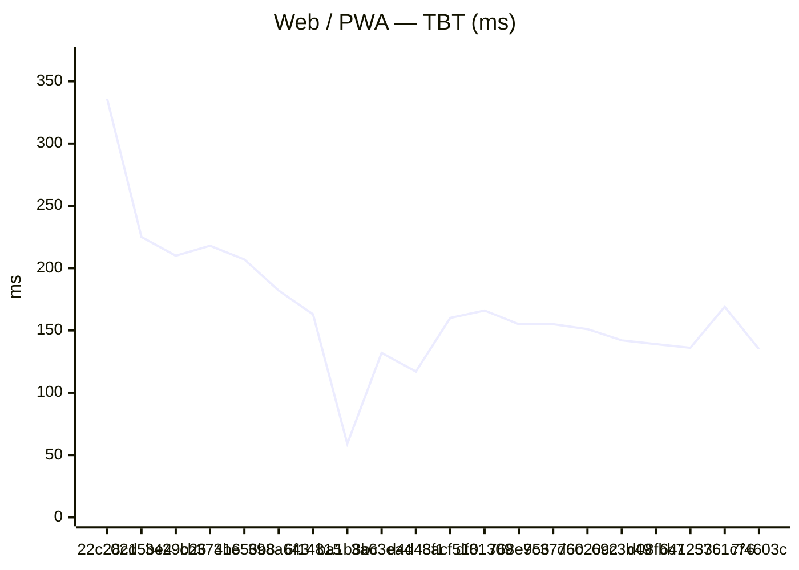

### GitHub Pages

| date | sha | status | LCP_ms | FCP_ms | TBT_ms | run |
| --- | --- | --- | --- | --- | --- | --- |
| 2026-06-21 21:50:56 | 22c28c1 | ok | 18704 | 9438 | 229 | 27918516609 |
| 2026-06-21 20:49:37 | 02d5be4 | ok | 18438 | 9000 | 227 | 27916990825 |
| 2026-06-21 20:33:19 | 3429b26 | ok | 18287 | 9284 | 221 | 27916581700 |
| 2026-06-21 20:10:17 | cb374b6 | ok | 18290 | 9305 | 230 | 27916012962 |
| 2026-06-21 19:25:34 | 31e56b8 | ok | 18265 | 9140 | 221 | 27914661913 |
| 2026-06-21 19:09:57 | 398a643 | ok | 18222 | 9134 | 159 | 27914523096 |
| 2026-06-21 18:44:20 | 6f14815 | ok | 18275 | 9225 | 209 | 27913865432 |
| 2026-06-20 20:15:34 | ba1b8bc | ok | 14936 | 9158 | 61 | 27882586489 |
| 2026-06-20 16:25:00 | 3a63ea4 | ok | 14957 | 9254 | 106 | 27876954012 |
| 2026-06-20 15:02:17 | d4d43f1 | ok | 13769 | 8960 | 121 | 27874796920 |
| 2026-06-20 11:46:18 | 8acf510 | ok | 13952 | 8997 | 168 | 27870147148 |
| 2026-06-20 10:56:54 | df81309 | ok | 13820 | 4733 | 141 | 27868999947 |
| 2026-06-20 10:25:52 | 768e756 | ok | 13811 | 8707 | 163 | 27868286537 |
| 2026-06-20 09:59:42 | 9c3776c | ok | 13660 | 8710 | 156 | 27867681464 |
| 2026-06-20 08:00:19 | d6020c2 | ok | 13653 | 8854 | 157 | 27864935646 |
| 2026-06-19 22:18:56 | 69c3b49 | ok | 14556 | 8846 | 149 | 27850876113 |
| 2026-06-19 20:34:57 | d08fbb7 | ok | 13636 | 9058 | 146 | 27847173077 |
| 2026-06-19 19:28:45 | 6412336 | ok | 14711 | 9003 | 164 | 27844611332 |
| 2026-06-19 18:36:52 | 5761c76 | ok | 13355 | 8852 | 152 | 27842548791 |
| 2026-06-19 18:05:00 | 7f4603c | ok | 13197 | 8842 | 124 | 27841255831 |

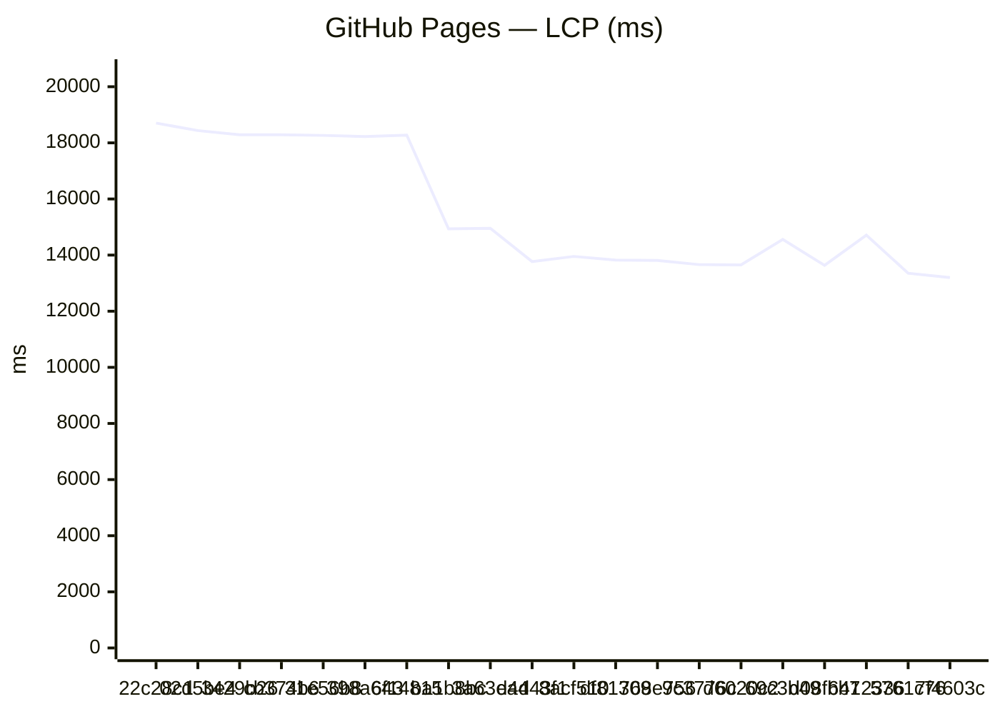
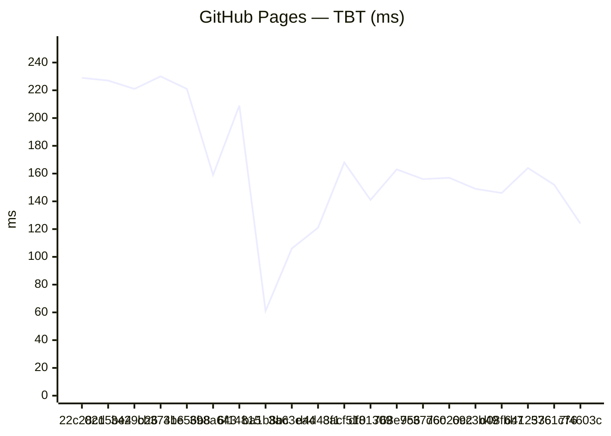

### Capacitor (legacy)
_No history yet._

### Expo / RN bundles

Aggregates: **sum of gzip bytes** across all `.hbc` files per platform (stable for trends when chunk hashes change).

| date | sha | status | android_gzip | ios_gzip | run |
| --- | --- | --- | --- | --- | --- |
| 2026-06-21 21:52:00 | 22c28c1 | ok | 3836645 | 3828818 | 27918516609 |
| 2026-06-21 20:50:44 | 02d5be4 | ok | 3819535 | 3810818 | 27916990825 |
| 2026-06-21 20:34:16 | 3429b26 | ok | 3807947 | 3801309 | 27916581700 |
| 2026-06-21 20:11:59 | cb374b6 | ok | 3807947 | 3801305 | 27916012962 |
| 2026-06-21 19:26:43 | 31e56b8 | ok | 3802529 | 3796002 | 27914661913 |
| 2026-06-21 19:11:07 | 398a643 | ok | 3802528 | 3796002 | 27914523096 |
| 2026-06-21 18:45:24 | 6f14815 | ok | 3802527 | 3796005 | 27913865432 |
| 2026-06-20 20:17:09 | ba1b8bc | ok | 3796378 | 3788525 | 27882586489 |
| 2026-06-20 16:26:14 | 3a63ea4 | ok | 3791714 | 3783517 | 27876954012 |
| 2026-06-20 15:03:47 | d4d43f1 | ok | 3791716 | 3783520 | 27874796920 |
| 2026-06-20 11:47:33 | 8acf510 | ok | 3770636 | 3762734 | 27870147148 |
| 2026-06-20 10:58:18 | df81309 | ok | 3770634 | 3762736 | 27868999947 |
| 2026-06-20 10:27:08 | 768e756 | ok | 3771343 | 3762498 | 27868286537 |
| 2026-06-20 10:00:46 | 9c3776c | ok | 3770634 | 3762733 | 27867681464 |
| 2026-06-20 08:01:43 | d6020c2 | ok | 3767812 | 3759872 | 27864935646 |
| 2026-06-19 22:20:03 | 69c3b49 | ok | 3557908 | 3548602 | 27850876113 |
| 2026-06-19 20:36:31 | d08fbb7 | ok | 3544463 | 3534279 | 27847173077 |
| 2026-06-19 19:30:18 | 6412336 | ok | 3543472 | 3535273 | 27844611332 |
| 2026-06-19 18:38:10 | 5761c76 | ok | 3523541 | 3515861 | 27842548791 |
| 2026-06-19 18:06:36 | 7f4603c | ok | 3511474 | 3502937 | 27841255831 |

