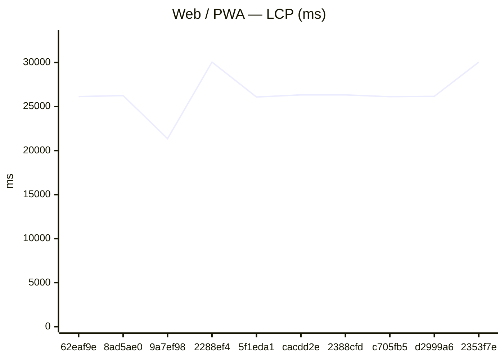
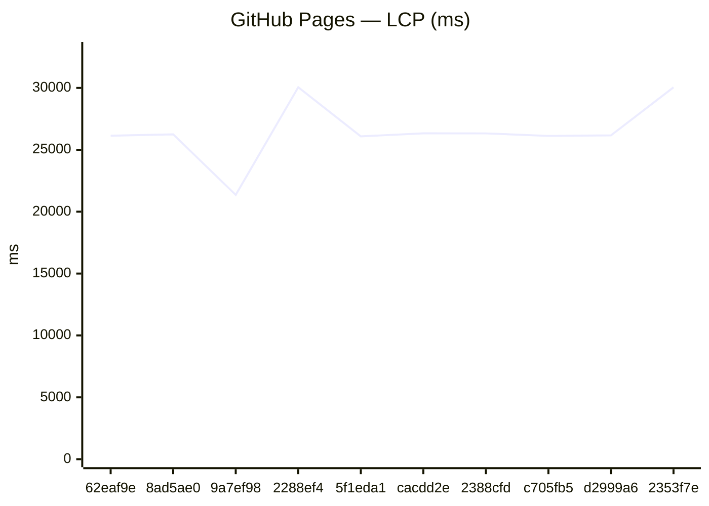
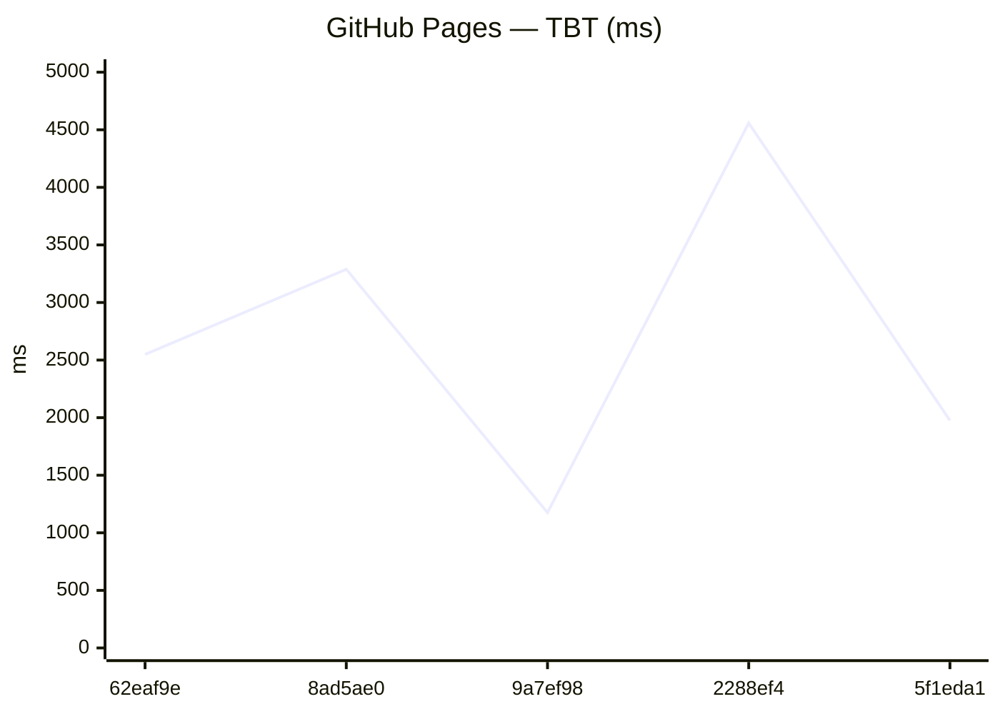
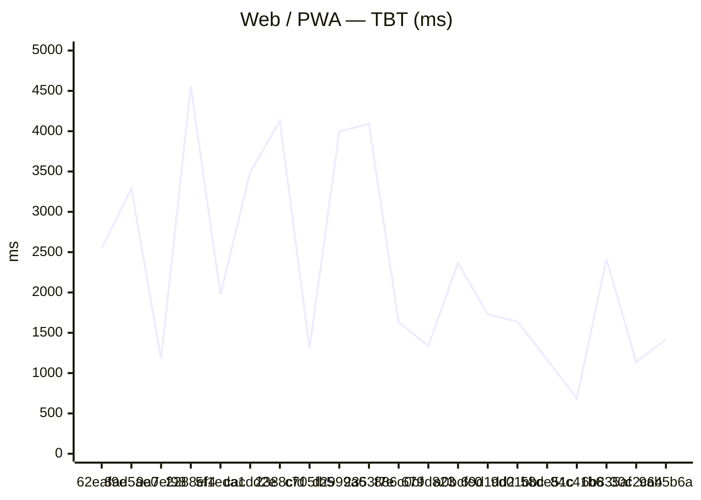
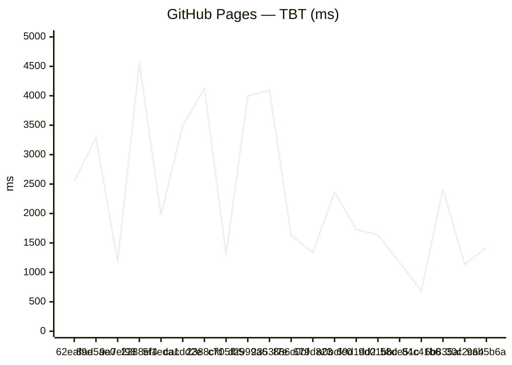

# Benchmark comparison (history)

Generated at **2026-08-02T11:56:02.958Z**.

To change the default number of runs in the primary sections below, edit **[compare.config.json](./compare.config.json)** (`window`). GitHub does not support interactive dropdowns in Markdown; optional **collapsed sections** list alternate window sizes.

---

### Web / PWA

| date | sha | status | LCP_ms | FCP_ms | TBT_ms | run |
| --- | --- | --- | --- | --- | --- | --- |
| 2026-08-02 11:55:41 | 62eaf9e | ok | 26139 | 12358 | 2549 | 30746671547 |
| 2026-08-02 11:42:42 | 8ad5ae0 | ok | 26251 | 11795 | 3289 | 30746233261 |
| 2026-07-29 22:50:15 | 9a7ef98 | ok | 21355 | 7809 | 1175 | 30497104541 |
| 2026-07-25 12:43:43 | 2288ef4 | ok | 30056 | 11861 | 4558 | 30158247061 |
| 2026-07-25 12:08:06 | 5f1eda1 | ok | 26085 | 11050 | 1976 | 30157390494 |
| 2026-07-25 11:59:21 | cacdd2e | ok | 26327 | 7885 | 3491 | 30157115144 |
| 2026-07-19 19:04:23 | 2388cfd | ok | 26326 | 7884 | 4127 | 29699802343 |
| 2026-07-19 18:51:10 | c705fb5 | ok | 26120 | 7810 | 1307 | 29699366587 |
| 2026-07-19 10:46:19 | d2999a6 | ok | 26164 | 11791 | 3994 | 29683857205 |
| 2026-07-19 02:23:15 | 2353f7e | ok | 30047 | 11746 | 4093 | 29670057411 |

### GitHub Pages

| date | sha | status | LCP_ms | FCP_ms | TBT_ms | run |
| --- | --- | --- | --- | --- | --- | --- |
| 2026-08-02 11:55:41 | 62eaf9e | ok | 26139 | 12358 | 2549 | 30746671547 |
| 2026-08-02 11:42:42 | 8ad5ae0 | ok | 26251 | 11795 | 3289 | 30746233261 |
| 2026-07-29 22:50:15 | 9a7ef98 | ok | 21355 | 7809 | 1175 | 30497104541 |
| 2026-07-25 12:43:43 | 2288ef4 | ok | 30056 | 11861 | 4558 | 30158247061 |
| 2026-07-25 12:08:06 | 5f1eda1 | ok | 26085 | 11050 | 1976 | 30157390494 |
| 2026-07-25 11:59:21 | cacdd2e | ok | 26327 | 7885 | 3491 | 30157115144 |
| 2026-07-19 19:04:23 | 2388cfd | ok | 26326 | 7884 | 4127 | 29699802343 |
| 2026-07-19 18:51:10 | c705fb5 | ok | 26120 | 7810 | 1307 | 29699366587 |
| 2026-07-19 10:46:19 | d2999a6 | ok | 26164 | 11791 | 3994 | 29683857205 |
| 2026-07-19 02:23:15 | 2353f7e | ok | 30047 | 11746 | 4093 | 29670057411 |

Last <strong>5</strong> runs (all platforms)

### Web / PWA

| date | sha | status | LCP_ms | FCP_ms | TBT_ms | run |
| --- | --- | --- | --- | --- | --- | --- |
| 2026-08-02 11:55:41 | 62eaf9e | ok | 26139 | 12358 | 2549 | 30746671547 |
| 2026-08-02 11:42:42 | 8ad5ae0 | ok | 26251 | 11795 | 3289 | 30746233261 |
| 2026-07-29 22:50:15 | 9a7ef98 | ok | 21355 | 7809 | 1175 | 30497104541 |
| 2026-07-25 12:43:43 | 2288ef4 | ok | 30056 | 11861 | 4558 | 30158247061 |
| 2026-07-25 12:08:06 | 5f1eda1 | ok | 26085 | 11050 | 1976 | 30157390494 |

### GitHub Pages

| date | sha | status | LCP_ms | FCP_ms | TBT_ms | run |
| --- | --- | --- | --- | --- | --- | --- |
| 2026-08-02 11:55:41 | 62eaf9e | ok | 26139 | 12358 | 2549 | 30746671547 |
| 2026-08-02 11:42:42 | 8ad5ae0 | ok | 26251 | 11795 | 3289 | 30746233261 |
| 2026-07-29 22:50:15 | 9a7ef98 | ok | 21355 | 7809 | 1175 | 30497104541 |
| 2026-07-25 12:43:43 | 2288ef4 | ok | 30056 | 11861 | 4558 | 30158247061 |
| 2026-07-25 12:08:06 | 5f1eda1 | ok | 26085 | 11050 | 1976 | 30157390494 |

Last <strong>20</strong> runs (all platforms)

### Web / PWA

| date | sha | status | LCP_ms | FCP_ms | TBT_ms | run |
| --- | --- | --- | --- | --- | --- | --- |
| 2026-08-02 11:55:41 | 62eaf9e | ok | 26139 | 12358 | 2549 | 30746671547 |
| 2026-08-02 11:42:42 | 8ad5ae0 | ok | 26251 | 11795 | 3289 | 30746233261 |
| 2026-07-29 22:50:15 | 9a7ef98 | ok | 21355 | 7809 | 1175 | 30497104541 |
| 2026-07-25 12:43:43 | 2288ef4 | ok | 30056 | 11861 | 4558 | 30158247061 |
| 2026-07-25 12:08:06 | 5f1eda1 | ok | 26085 | 11050 | 1976 | 30157390494 |
| 2026-07-25 11:59:21 | cacdd2e | ok | 26327 | 7885 | 3491 | 30157115144 |
| 2026-07-19 19:04:23 | 2388cfd | ok | 26326 | 7884 | 4127 | 29699802343 |
| 2026-07-19 18:51:10 | c705fb5 | ok | 26120 | 7810 | 1307 | 29699366587 |
| 2026-07-19 10:46:19 | d2999a6 | ok | 26164 | 11791 | 3994 | 29683857205 |
| 2026-07-19 02:23:15 | 2353f7e | ok | 30047 | 11746 | 4093 | 29670057411 |
| 2026-07-18 22:45:17 | 886c0bf | ok | 21835 | 11810 | 1630 | 29663952972 |
| 2026-07-18 21:31:39 | 679d823 | ok | 24900 | 12342 | 1338 | 29661697648 |
| 2026-07-18 21:01:27 | a0bcfc0 | ok | 25139 | 7810 | 2366 | 29660749746 |
| 2026-07-18 20:43:49 | 69d1dd2 | ok | 25124 | 11816 | 1729 | 29660192882 |
| 2026-07-18 20:19:50 | 9d01bbc | ok | 25162 | 11786 | 1639 | 29659426188 |
| 2026-07-18 19:41:24 | 58de51c | ok | 25092 | 11781 | 1166 | 29658208882 |
| 2026-07-18 19:09:22 | 84c41b6 | ok | 22152 | 7811 | 687 | 29657192225 |
| 2026-07-18 17:21:08 | 6b835af | ok | 25215 | 7810 | 2414 | 29653660920 |
| 2026-07-18 14:30:21 | 30c2c64 | ok | 25064 | 11834 | 1137 | 29648074587 |
| 2026-07-17 19:36:37 | 9ab5b6a | ok | 18985 | 7809 | 1417 | 29608013937 |

### GitHub Pages

| date | sha | status | LCP_ms | FCP_ms | TBT_ms | run |
| --- | --- | --- | --- | --- | --- | --- |
| 2026-08-02 11:55:41 | 62eaf9e | ok | 26139 | 12358 | 2549 | 30746671547 |
| 2026-08-02 11:42:42 | 8ad5ae0 | ok | 26251 | 11795 | 3289 | 30746233261 |
| 2026-07-29 22:50:15 | 9a7ef98 | ok | 21355 | 7809 | 1175 | 30497104541 |
| 2026-07-25 12:43:43 | 2288ef4 | ok | 30056 | 11861 | 4558 | 30158247061 |
| 2026-07-25 12:08:06 | 5f1eda1 | ok | 26085 | 11050 | 1976 | 30157390494 |
| 2026-07-25 11:59:21 | cacdd2e | ok | 26327 | 7885 | 3491 | 30157115144 |
| 2026-07-19 19:04:23 | 2388cfd | ok | 26326 | 7884 | 4127 | 29699802343 |
| 2026-07-19 18:51:10 | c705fb5 | ok | 26120 | 7810 | 1307 | 29699366587 |
| 2026-07-19 10:46:19 | d2999a6 | ok | 26164 | 11791 | 3994 | 29683857205 |
| 2026-07-19 02:23:15 | 2353f7e | ok | 30047 | 11746 | 4093 | 29670057411 |
| 2026-07-18 22:45:17 | 886c0bf | ok | 21835 | 11810 | 1630 | 29663952972 |
| 2026-07-18 21:31:39 | 679d823 | ok | 24900 | 12342 | 1338 | 29661697648 |
| 2026-07-18 21:01:27 | a0bcfc0 | ok | 25139 | 7810 | 2366 | 29660749746 |
| 2026-07-18 20:43:49 | 69d1dd2 | ok | 25124 | 11816 | 1729 | 29660192882 |
| 2026-07-18 20:19:50 | 9d01bbc | ok | 25162 | 11786 | 1639 | 29659426188 |
| 2026-07-18 19:41:24 | 58de51c | ok | 25092 | 11781 | 1166 | 29658208882 |
| 2026-07-18 19:09:22 | 84c41b6 | ok | 22152 | 7811 | 687 | 29657192225 |
| 2026-07-18 17:21:08 | 6b835af | ok | 25215 | 7810 | 2414 | 29653660920 |
| 2026-07-18 14:30:21 | 30c2c64 | ok | 25064 | 11834 | 1137 | 29648074587 |
| 2026-07-17 19:36:37 | 9ab5b6a | ok | 18985 | 7809 | 1417 | 29608013937 |

