# Benchmark comparison (history)

Generated at **2026-07-06T01:31:55.635Z**.

To change the default number of runs in the primary sections below, edit **[compare.config.json](./compare.config.json)** (`window`). GitHub does not support interactive dropdowns in Markdown; optional **collapsed sections** list alternate window sizes.

---

### Web / PWA

| date | sha | status | LCP_ms | FCP_ms | TBT_ms | run |
| --- | --- | --- | --- | --- | --- | --- |
| 2026-07-06 01:03:09 | 458975f | ok | — | — | — | 28760059244 |
| 2026-07-05 22:41:12 | b5a9254 | ok | 20837 | 13508 | 628 | 28757313083 |
| 2026-06-30 23:46:08 | c45967e | ok | — | — | — | 28481990024 |
| 2026-06-30 19:48:29 | 2d2a9da | ok | — | — | — | 28469775056 |
| 2026-06-30 18:21:19 | 0a41d6c | ok | — | — | — | 28464715678 |
| 2026-06-30 06:37:36 | 3c28203 | ok | 20503 | 13298 | 422 | 28425223140 |
| 2026-06-30 06:02:49 | 51e19c3 | ok | 20509 | 13319 | 418 | 28423759439 |
| 2026-06-29 23:37:50 | c7be5f0 | ok | 21095 | 14639 | 411 | 28409768340 |
| 2026-06-28 22:12:28 | f56ca64 | ok | 19101 | 12038 | 348 | 28337659878 |
| 2026-06-28 21:19:07 | e074e16 | ok | 19549 | 12733 | 402 | 28336245929 |

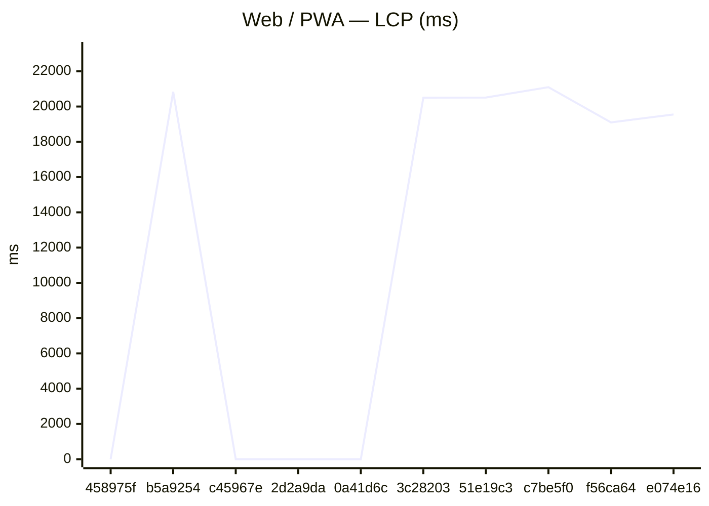

### GitHub Pages

| date | sha | status | LCP_ms | FCP_ms | TBT_ms | run |
| --- | --- | --- | --- | --- | --- | --- |
| 2026-07-06 01:31:32 | 458975f | ok | — | — | — | 28760059244 |
| 2026-07-05 23:10:59 | b5a9254 | ok | — | — | — | 28757313083 |
| 2026-07-01 00:15:55 | c45967e | ok | — | — | — | 28481990024 |
| 2026-06-30 20:18:44 | 2d2a9da | ok | — | — | — | 28469775056 |
| 2026-06-30 18:51:19 | 0a41d6c | ok | — | — | — | 28464715678 |
| 2026-06-30 07:07:23 | 3c28203 | ok | — | — | — | 28425223140 |
| 2026-06-30 06:33:08 | 51e19c3 | ok | — | — | — | 28423759439 |
| 2026-06-30 00:07:38 | c7be5f0 | ok | — | — | — | 28409768340 |
| 2026-06-28 22:13:00 | f56ca64 | ok | 18641 | 6915 | 385 | 28337659878 |
| 2026-06-28 21:19:38 | e074e16 | ok | 18940 | 11903 | 342 | 28336245929 |

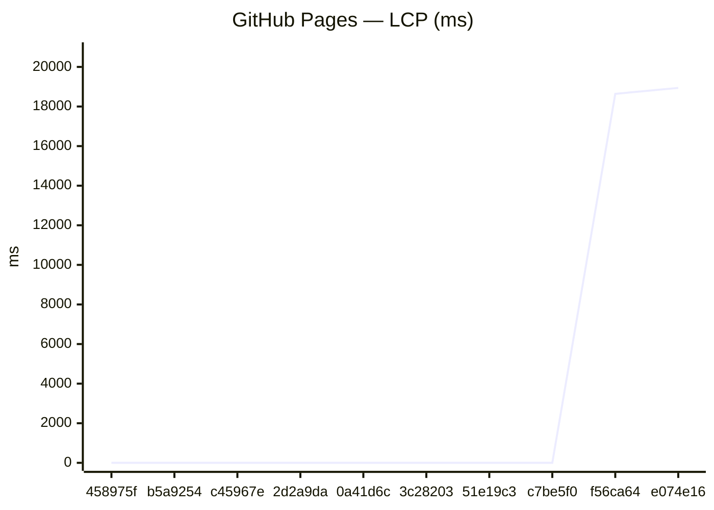
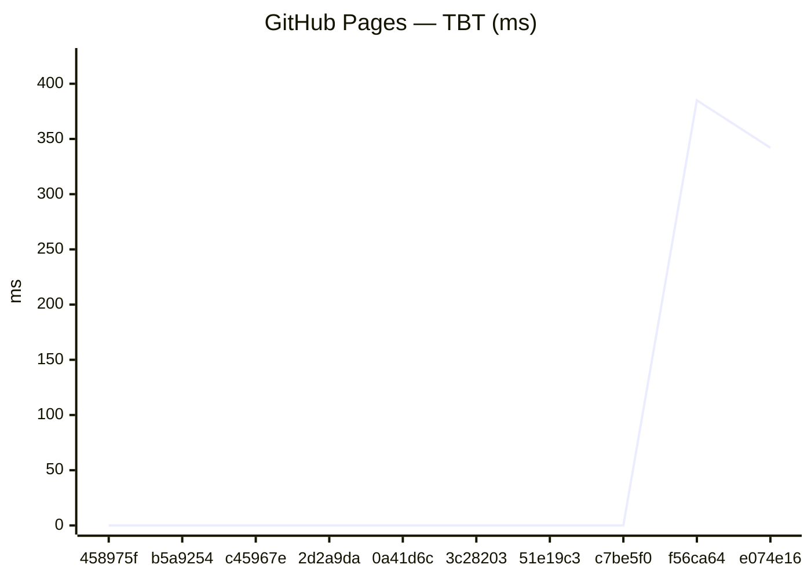

### Capacitor (legacy)
_No history yet._

### Expo / RN bundles

Aggregates: **sum of gzip bytes** across all `.hbc` files per platform (stable for trends when chunk hashes change).

| date | sha | status | android_gzip | ios_gzip | run |
| --- | --- | --- | --- | --- | --- |
| 2026-07-06 00:36:50 | 458975f | ok | 4077341 | 4073443 | 28760059244 |
| 2026-07-06 00:05:17 | 62dc462 | ok | 4077340 | 4073443 | 28758750040 |
| 2026-07-05 22:42:36 | b5a9254 | ok | 4078885 | 4069109 | 28757313083 |
| 2026-06-30 23:18:27 | c45967e | ok | 4078896 | 4069113 | 28481990024 |
| 2026-06-30 19:20:23 | 2d2a9da | ok | 4078895 | 4069106 | 28469775056 |
| 2026-06-30 17:53:53 | 0a41d6c | ok | 4078897 | 4069107 | 28464715678 |
| 2026-06-30 06:39:35 | 3c28203 | ok | 4076071 | 4065403 | 28425223140 |
| 2026-06-30 06:04:34 | 51e19c3 | ok | 4075584 | 4065816 | 28423759439 |
| 2026-06-29 23:39:37 | c7be5f0 | ok | 4075582 | 4065817 | 28409768340 |
| 2026-06-28 22:13:48 | f56ca64 | ok | 4052821 | 4047233 | 28337659878 |

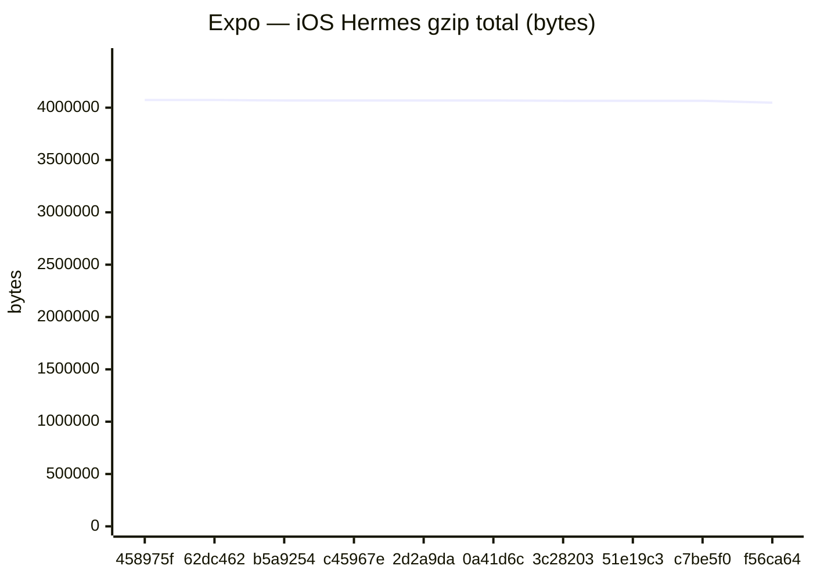

Last <strong>5</strong> runs (all platforms)

### Web / PWA

| date | sha | status | LCP_ms | FCP_ms | TBT_ms | run |
| --- | --- | --- | --- | --- | --- | --- |
| 2026-07-06 01:03:09 | 458975f | ok | — | — | — | 28760059244 |
| 2026-07-05 22:41:12 | b5a9254 | ok | 20837 | 13508 | 628 | 28757313083 |
| 2026-06-30 23:46:08 | c45967e | ok | — | — | — | 28481990024 |
| 2026-06-30 19:48:29 | 2d2a9da | ok | — | — | — | 28469775056 |
| 2026-06-30 18:21:19 | 0a41d6c | ok | — | — | — | 28464715678 |

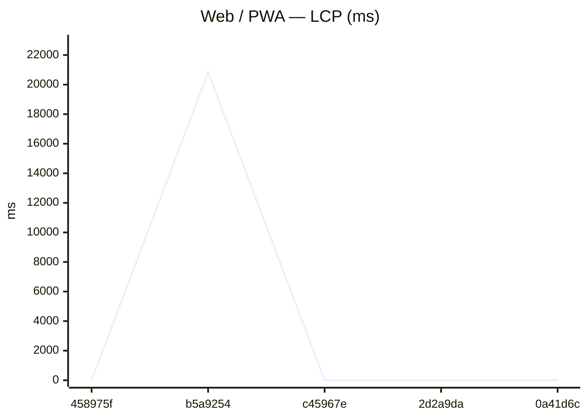
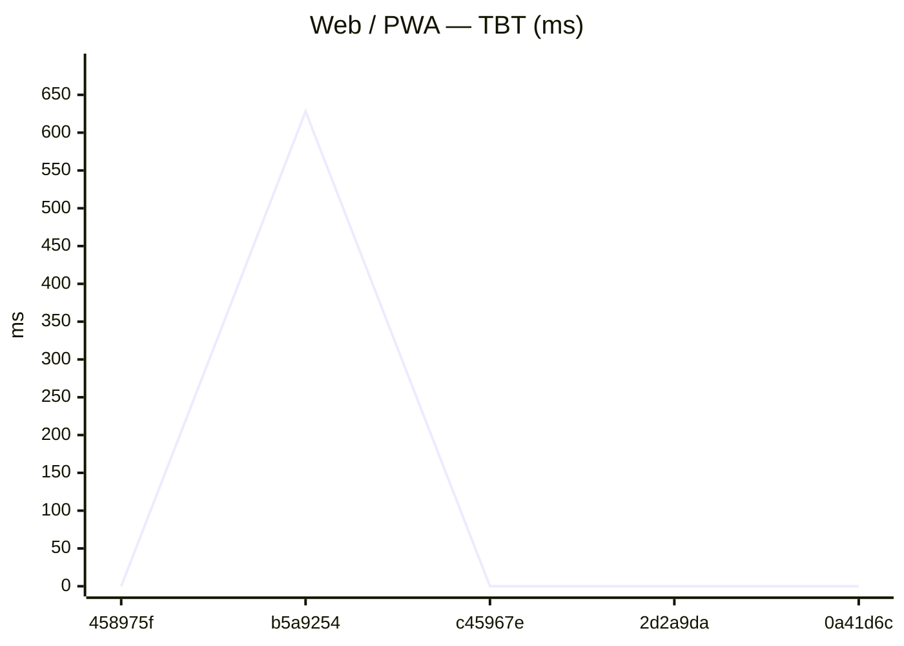

### GitHub Pages

| date | sha | status | LCP_ms | FCP_ms | TBT_ms | run |
| --- | --- | --- | --- | --- | --- | --- |
| 2026-07-06 01:31:32 | 458975f | ok | — | — | — | 28760059244 |
| 2026-07-05 23:10:59 | b5a9254 | ok | — | — | — | 28757313083 |
| 2026-07-01 00:15:55 | c45967e | ok | — | — | — | 28481990024 |
| 2026-06-30 20:18:44 | 2d2a9da | ok | — | — | — | 28469775056 |
| 2026-06-30 18:51:19 | 0a41d6c | ok | — | — | — | 28464715678 |

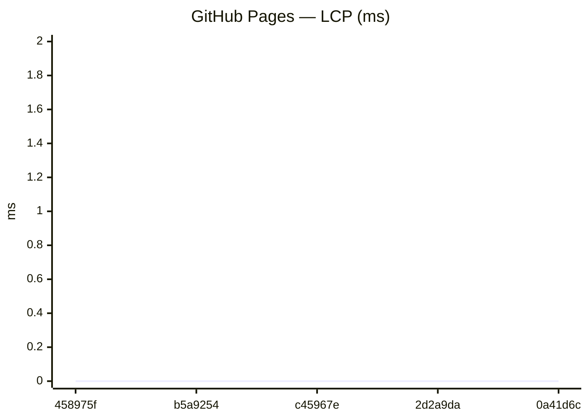
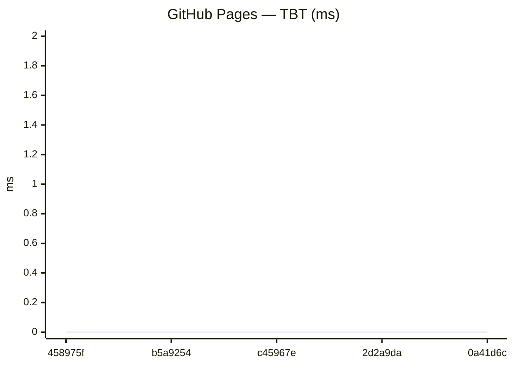

### Capacitor (legacy)
_No history yet._

### Expo / RN bundles

Aggregates: **sum of gzip bytes** across all `.hbc` files per platform (stable for trends when chunk hashes change).

| date | sha | status | android_gzip | ios_gzip | run |
| --- | --- | --- | --- | --- | --- |
| 2026-07-06 00:36:50 | 458975f | ok | 4077341 | 4073443 | 28760059244 |
| 2026-07-06 00:05:17 | 62dc462 | ok | 4077340 | 4073443 | 28758750040 |
| 2026-07-05 22:42:36 | b5a9254 | ok | 4078885 | 4069109 | 28757313083 |
| 2026-06-30 23:18:27 | c45967e | ok | 4078896 | 4069113 | 28481990024 |
| 2026-06-30 19:20:23 | 2d2a9da | ok | 4078895 | 4069106 | 28469775056 |

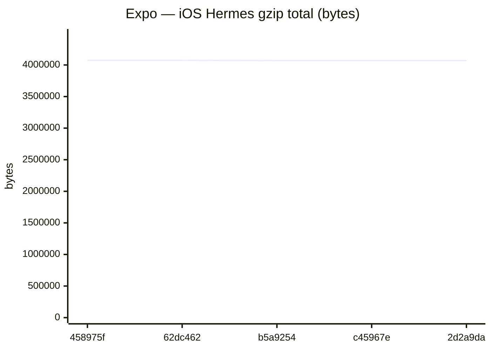

Last <strong>20</strong> runs (all platforms)

### Web / PWA

| date | sha | status | LCP_ms | FCP_ms | TBT_ms | run |
| --- | --- | --- | --- | --- | --- | --- |
| 2026-07-06 01:03:09 | 458975f | ok | — | — | — | 28760059244 |
| 2026-07-05 22:41:12 | b5a9254 | ok | 20837 | 13508 | 628 | 28757313083 |
| 2026-06-30 23:46:08 | c45967e | ok | — | — | — | 28481990024 |
| 2026-06-30 19:48:29 | 2d2a9da | ok | — | — | — | 28469775056 |
| 2026-06-30 18:21:19 | 0a41d6c | ok | — | — | — | 28464715678 |
| 2026-06-30 06:37:36 | 3c28203 | ok | 20503 | 13298 | 422 | 28425223140 |
| 2026-06-30 06:02:49 | 51e19c3 | ok | 20509 | 13319 | 418 | 28423759439 |
| 2026-06-29 23:37:50 | c7be5f0 | ok | 21095 | 14639 | 411 | 28409768340 |
| 2026-06-28 22:12:28 | f56ca64 | ok | 19101 | 12038 | 348 | 28337659878 |
| 2026-06-28 21:19:07 | e074e16 | ok | 19549 | 12733 | 402 | 28336245929 |
| 2026-06-28 20:02:16 | 7cc0f37 | ok | 19542 | 12060 | 443 | 28334230906 |
| 2026-06-28 17:38:37 | 4a71141 | ok | 18663 | 12057 | 333 | 28330439364 |
| 2026-06-28 16:41:40 | e3e901b | ok | 19248 | 11952 | 395 | 28328938834 |
| 2026-06-28 15:41:13 | 58e1088 | ok | 22351 | 11920 | 399 | 28327306068 |
| 2026-06-28 15:05:02 | c45239d | ok | 22326 | 12229 | 436 | 28326313095 |
| 2026-06-28 14:31:15 | d6a3c0b | ok | 22357 | 11927 | 479 | 28325382372 |
| 2026-06-27 18:07:05 | 00d3c19 | ok | 22240 | 11926 | 495 | 28297397124 |
| 2026-06-27 15:31:41 | c83d9d8 | ok | 22209 | 11773 | 507 | 28293517490 |
| 2026-06-27 13:36:36 | d22897f | ok | 21878 | 11551 | 475 | 28290750514 |
| 2026-06-27 12:54:46 | 3e44105 | ok | 21870 | 11590 | 500 | 28289763851 |

### GitHub Pages

| date | sha | status | LCP_ms | FCP_ms | TBT_ms | run |
| --- | --- | --- | --- | --- | --- | --- |
| 2026-07-06 01:31:32 | 458975f | ok | — | — | — | 28760059244 |
| 2026-07-05 23:10:59 | b5a9254 | ok | — | — | — | 28757313083 |
| 2026-07-01 00:15:55 | c45967e | ok | — | — | — | 28481990024 |
| 2026-06-30 20:18:44 | 2d2a9da | ok | — | — | — | 28469775056 |
| 2026-06-30 18:51:19 | 0a41d6c | ok | — | — | — | 28464715678 |
| 2026-06-30 07:07:23 | 3c28203 | ok | — | — | — | 28425223140 |
| 2026-06-30 06:33:08 | 51e19c3 | ok | — | — | — | 28423759439 |
| 2026-06-30 00:07:38 | c7be5f0 | ok | — | — | — | 28409768340 |
| 2026-06-28 22:13:00 | f56ca64 | ok | 18641 | 6915 | 385 | 28337659878 |
| 2026-06-28 21:19:38 | e074e16 | ok | 18940 | 11903 | 342 | 28336245929 |
| 2026-06-28 20:02:47 | 7cc0f37 | ok | 18936 | 12038 | 353 | 28334230906 |
| 2026-06-28 17:39:08 | 4a71141 | ok | 18660 | 12056 | 352 | 28330439364 |
| 2026-06-28 16:42:11 | e3e901b | ok | 18674 | 6619 | 362 | 28328938834 |
| 2026-06-28 15:41:44 | 58e1088 | ok | 22391 | 6611 | 396 | 28327306068 |
| 2026-06-28 15:05:32 | c45239d | ok | 22250 | 6539 | 377 | 28326313095 |
| 2026-06-28 14:31:47 | d6a3c0b | ok | 22344 | 11820 | 497 | 28325382372 |
| 2026-06-27 18:07:36 | 00d3c19 | ok | 22178 | 6537 | 391 | 28297397124 |
| 2026-06-27 15:32:12 | c83d9d8 | ok | 22170 | 11761 | 363 | 28293517490 |
| 2026-06-27 13:37:06 | d22897f | ok | 21853 | 11594 | 343 | 28290750514 |
| 2026-06-27 12:55:17 | 3e44105 | ok | 21828 | 11589 | 359 | 28289763851 |

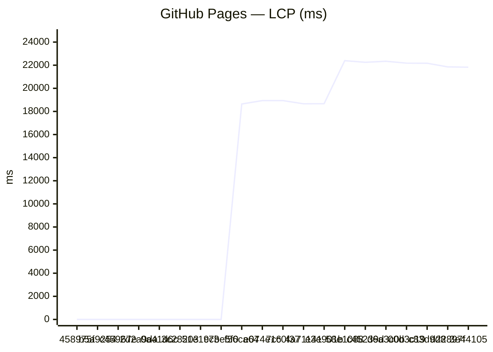
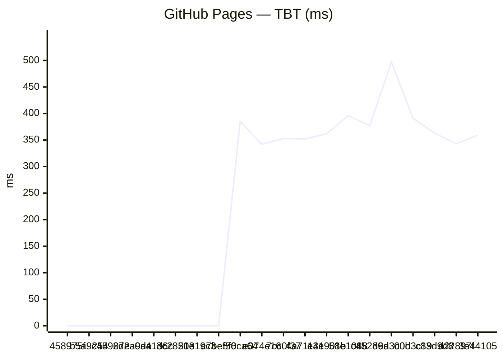

### Capacitor (legacy)
_No history yet._

### Expo / RN bundles

Aggregates: **sum of gzip bytes** across all `.hbc` files per platform (stable for trends when chunk hashes change).

| date | sha | status | android_gzip | ios_gzip | run |
| --- | --- | --- | --- | --- | --- |
| 2026-07-06 00:36:50 | 458975f | ok | 4077341 | 4073443 | 28760059244 |
| 2026-07-06 00:05:17 | 62dc462 | ok | 4077340 | 4073443 | 28758750040 |
| 2026-07-05 22:42:36 | b5a9254 | ok | 4078885 | 4069109 | 28757313083 |
| 2026-06-30 23:18:27 | c45967e | ok | 4078896 | 4069113 | 28481990024 |
| 2026-06-30 19:20:23 | 2d2a9da | ok | 4078895 | 4069106 | 28469775056 |
| 2026-06-30 17:53:53 | 0a41d6c | ok | 4078897 | 4069107 | 28464715678 |
| 2026-06-30 06:39:35 | 3c28203 | ok | 4076071 | 4065403 | 28425223140 |
| 2026-06-30 06:04:34 | 51e19c3 | ok | 4075584 | 4065816 | 28423759439 |
| 2026-06-29 23:39:37 | c7be5f0 | ok | 4075582 | 4065817 | 28409768340 |
| 2026-06-28 22:13:48 | f56ca64 | ok | 4052821 | 4047233 | 28337659878 |
| 2026-06-28 21:20:26 | e074e16 | ok | 4052813 | 4047234 | 28336245929 |
| 2026-06-28 20:03:43 | 7cc0f37 | ok | 4049448 | 4042958 | 28334230906 |
| 2026-06-28 17:40:53 | 4a71141 | ok | 4046554 | 4039809 | 28330439364 |
| 2026-06-28 16:43:08 | e3e901b | ok | 4048091 | 4039179 | 28328938834 |
| 2026-06-28 15:42:46 | 58e1088 | ok | 4030638 | 4023650 | 28327306068 |
| 2026-06-28 15:06:50 | c45239d | ok | 4030634 | 4023650 | 28326313095 |
| 2026-06-28 14:32:53 | d6a3c0b | ok | 4030639 | 4023645 | 28325382372 |
| 2026-06-27 18:08:44 | 00d3c19 | ok | 4025609 | 4024761 | 28297397124 |
| 2026-06-27 15:33:40 | c83d9d8 | ok | 4026084 | 4017281 | 28293517490 |
| 2026-06-27 13:38:42 | d22897f | ok | 4023969 | 4017565 | 28290750514 |

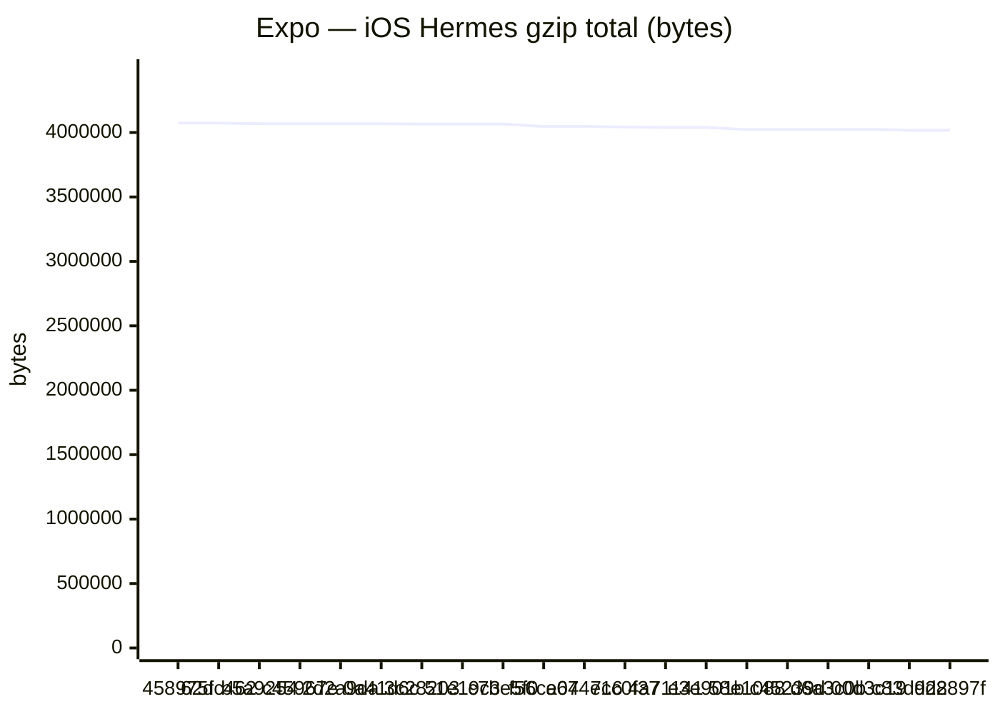

