# Benchmark comparison (history)

Generated at **2026-07-13T22:22:53.930Z**.

To change the default number of runs in the primary sections below, edit **[compare.config.json](./compare.config.json)** (`window`). GitHub does not support interactive dropdowns in Markdown; optional **collapsed sections** list alternate window sizes.

---

### Web / PWA

| date | sha | status | LCP_ms | FCP_ms | TBT_ms | run |
| --- | --- | --- | --- | --- | --- | --- |
| 2026-07-13 22:20:19 | 5d91329 | ok | 27536 | 7663 | 1186 | 29289400686 |
| 2026-07-13 21:30:04 | 782a519 | ok | 24725 | 7658 | 2090 | 29286354034 |
| 2026-07-13 20:35:07 | 54b5b9a | ok | 28712 | 11011 | 2819 | 29282111300 |
| 2026-07-13 20:03:57 | 95c674d | ok | 24213 | 7662 | 1235 | 29280775524 |
| 2026-07-13 19:29:58 | 1035b91 | ok | 11936 | 7661 | 859 | 29278561731 |
| 2026-07-08 21:52:19 | c0d5c84 | ok | 21994 | 13748 | 521 | 28978196267 |
| 2026-07-08 21:17:37 | a0abe91 | ok | - | - | - | 28974575590 |
| 2026-07-07 23:09:46 | f776321 | ok | - | - | - | 28903623662 |
| 2026-07-06 22:51:15 | 894d90a | ok | 21131 | 13641 | 609 | 28828577477 |
| 2026-07-06 02:02:05 | 130b3fd | ok | - | - | - | 28760447624 |

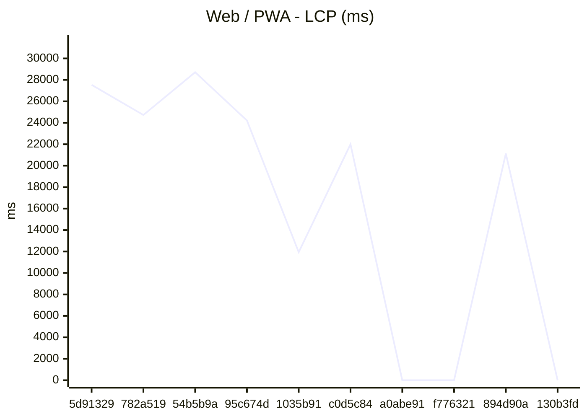
```mermaid
xychart-beta
    title "Web / PWA - LCP (ms)"
    x-axis ["5d91329", "782a519", "54b5b9a", "95c674d", "1035b91", "c0d5c84", "a0abe91", "f776321", "894d90a", "130b3fd"]
    y-axis "ms" 0 --> 31584
    line [27536, 24725, 28712, 24213, 11936, 21994, 0, 0, 21131, 0]
```
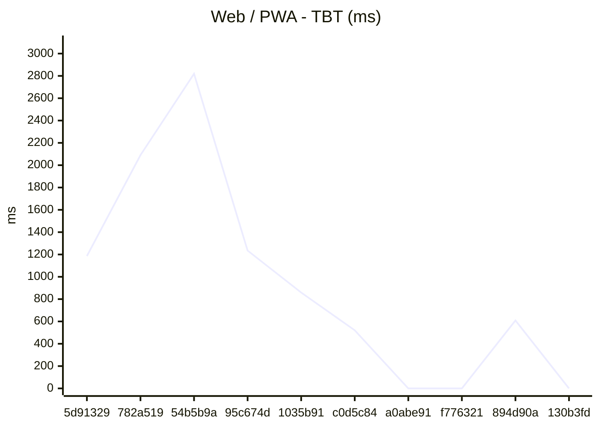
```mermaid
xychart-beta
    title "Web / PWA - TBT (ms)"
    x-axis ["5d91329", "782a519", "54b5b9a", "95c674d", "1035b91", "c0d5c84", "a0abe91", "f776321", "894d90a", "130b3fd"]
    y-axis "ms" 0 --> 3101
    line [1186, 2090, 2819, 1235, 859, 521, 0, 0, 609, 0]
```

### GitHub Pages

| date | sha | status | LCP_ms | FCP_ms | TBT_ms | run |
| --- | --- | --- | --- | --- | --- | --- |
| 2026-07-13 22:20:19 | 5d91329 | ok | 27536 | 7663 | 1186 | 29289400686 |
| 2026-07-13 21:30:04 | 782a519 | ok | 24725 | 7658 | 2090 | 29286354034 |
| 2026-07-13 20:35:07 | 54b5b9a | ok | 28712 | 11011 | 2819 | 29282111300 |
| 2026-07-13 20:03:57 | 95c674d | ok | 24213 | 7662 | 1235 | 29280775524 |
| 2026-07-13 19:29:58 | 1035b91 | ok | 11936 | 7661 | 859 | 29278561731 |
| 2026-07-08 22:21:17 | c0d5c84 | ok | - | - | - | 28978196267 |
| 2026-07-08 21:45:53 | a0abe91 | ok | - | - | - | 28974575590 |
| 2026-07-07 23:38:07 | f776321 | ok | - | - | - | 28903623662 |
| 2026-07-06 23:19:34 | 894d90a | ok | - | - | - | 28828577477 |
| 2026-07-06 02:30:29 | 130b3fd | ok | - | - | - | 28760447624 |

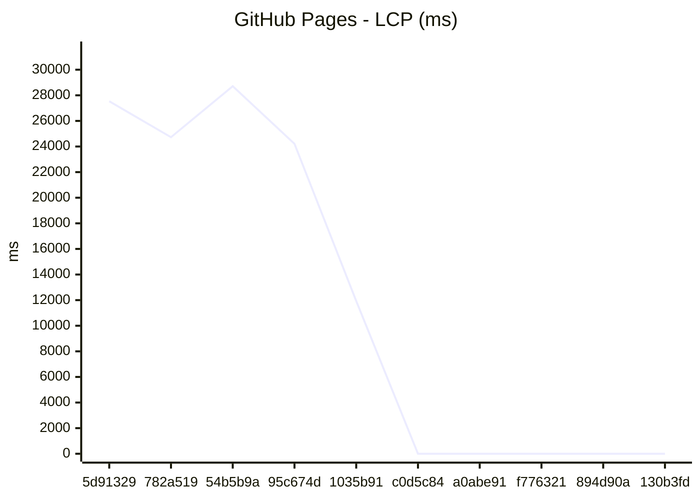
```mermaid
xychart-beta
    title "GitHub Pages - LCP (ms)"
    x-axis ["5d91329", "782a519", "54b5b9a", "95c674d", "1035b91", "c0d5c84", "a0abe91", "f776321", "894d90a", "130b3fd"]
    y-axis "ms" 0 --> 31584
    line [27536, 24725, 28712, 24213, 11936, 0, 0, 0, 0, 0]
```
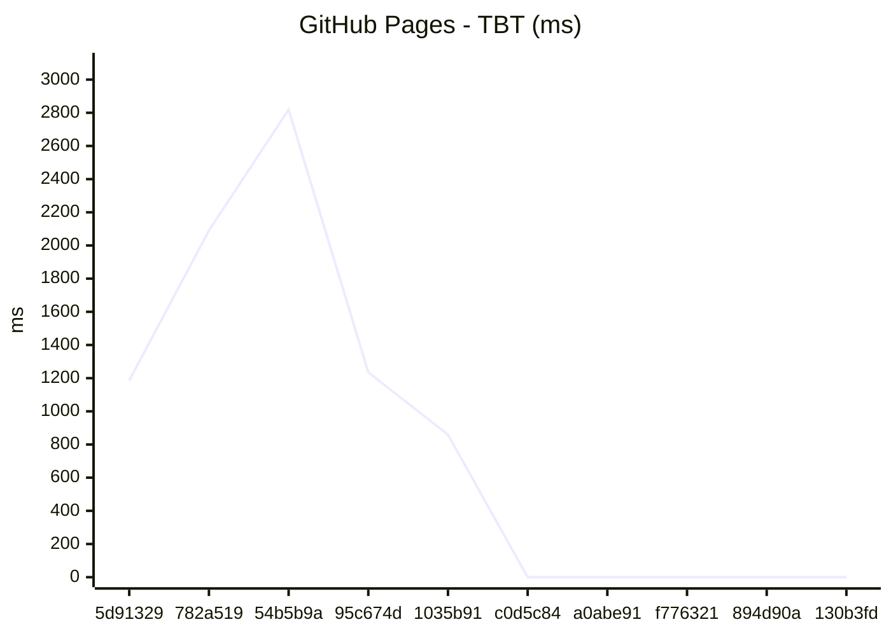
```mermaid
xychart-beta
    title "GitHub Pages - TBT (ms)"
    x-axis ["5d91329", "782a519", "54b5b9a", "95c674d", "1035b91", "c0d5c84", "a0abe91", "f776321", "894d90a", "130b3fd"]
    y-axis "ms" 0 --> 3101
    line [1186, 2090, 2819, 1235, 859, 0, 0, 0, 0, 0]
```

### Capacitor (legacy)
_No history yet._

### Expo / RN bundles

Aggregates: **sum of gzip bytes** across all `.hbc` files per platform (stable for trends when chunk hashes change).

| date | sha | status | android_gzip | ios_gzip | run |
| --- | --- | --- | --- | --- | --- |
| 2026-07-13 22:22:13 | 5d91329 | ok | 4090787 | 4084805 | 29289400686 |
| 2026-07-13 21:31:43 | 782a519 | ok | 4090360 | 4084677 | 29286354034 |
| 2026-07-13 20:41:25 | 54b5b9a | ok | 4089313 | 4082348 | 29282111300 |
| 2026-07-13 20:06:03 | 95c674d | ok | 4088814 | 4083105 | 29280775524 |
| 2026-07-13 19:31:58 | 1035b91 | ok | 4088813 | 4083108 | 29278561731 |
| 2026-07-08 21:53:45 | c0d5c84 | ok | 4088813 | 4083106 | 28978196267 |
| 2026-07-08 20:50:52 | a0abe91 | ok | 4088812 | 4083107 | 28974575590 |
| 2026-07-07 22:43:47 | f776321 | ok | 4085830 | 4079675 | 28903623662 |
| 2026-07-06 22:53:14 | 894d90a | ok | 4086643 | 4079243 | 28828577477 |
| 2026-07-06 01:36:06 | 130b3fd | ok | 4077332 | 4074172 | 28760447624 |

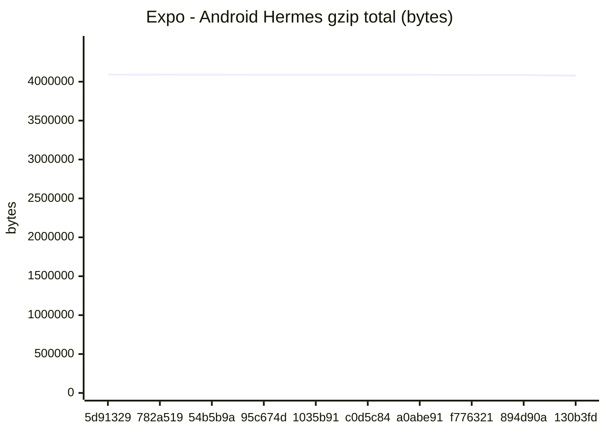
```mermaid
xychart-beta
    title "Expo - Android Hermes gzip total (bytes)"
    x-axis ["5d91329", "782a519", "54b5b9a", "95c674d", "1035b91", "c0d5c84", "a0abe91", "f776321", "894d90a", "130b3fd"]
    y-axis "bytes" 0 --> 4499866
    line [4090787, 4090360, 4089313, 4088814, 4088813, 4088813, 4088812, 4085830, 4086643, 4077332]
```
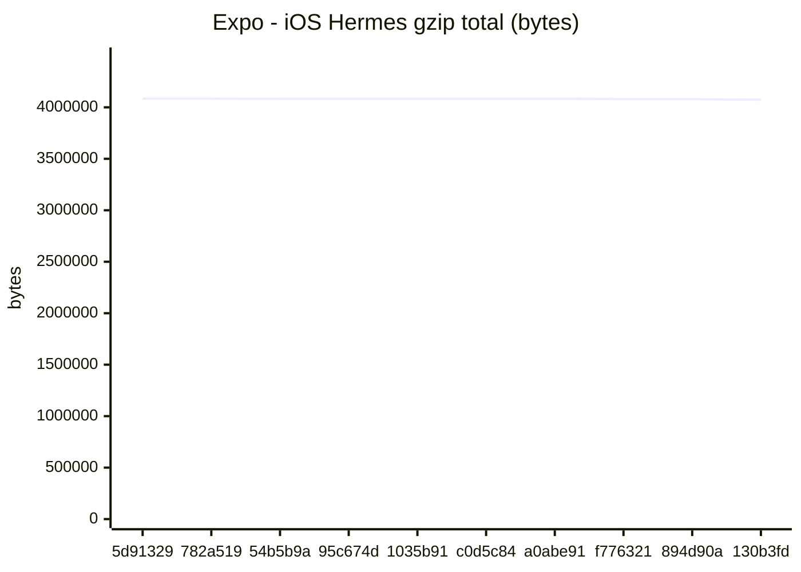
```mermaid
xychart-beta
    title "Expo - iOS Hermes gzip total (bytes)"
    x-axis ["5d91329", "782a519", "54b5b9a", "95c674d", "1035b91", "c0d5c84", "a0abe91", "f776321", "894d90a", "130b3fd"]
    y-axis "bytes" 0 --> 4493286
    line [4084805, 4084677, 4082348, 4083105, 4083108, 4083106, 4083107, 4079675, 4079243, 4074172]
```

Last <strong>5</strong> runs (all platforms)

### Web / PWA

| date | sha | status | LCP_ms | FCP_ms | TBT_ms | run |
| --- | --- | --- | --- | --- | --- | --- |
| 2026-07-13 22:20:19 | 5d91329 | ok | 27536 | 7663 | 1186 | 29289400686 |
| 2026-07-13 21:30:04 | 782a519 | ok | 24725 | 7658 | 2090 | 29286354034 |
| 2026-07-13 20:35:07 | 54b5b9a | ok | 28712 | 11011 | 2819 | 29282111300 |
| 2026-07-13 20:03:57 | 95c674d | ok | 24213 | 7662 | 1235 | 29280775524 |
| 2026-07-13 19:29:58 | 1035b91 | ok | 11936 | 7661 | 859 | 29278561731 |

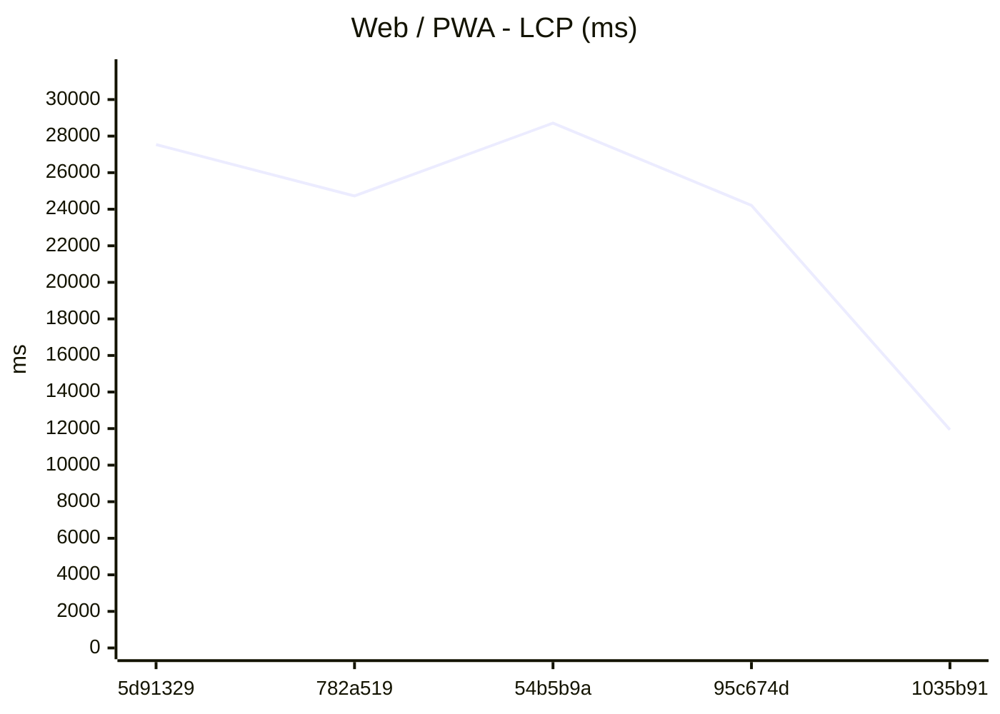
```mermaid
xychart-beta
    title "Web / PWA - LCP (ms)"
    x-axis ["5d91329", "782a519", "54b5b9a", "95c674d", "1035b91"]
    y-axis "ms" 0 --> 31584
    line [27536, 24725, 28712, 24213, 11936]
```
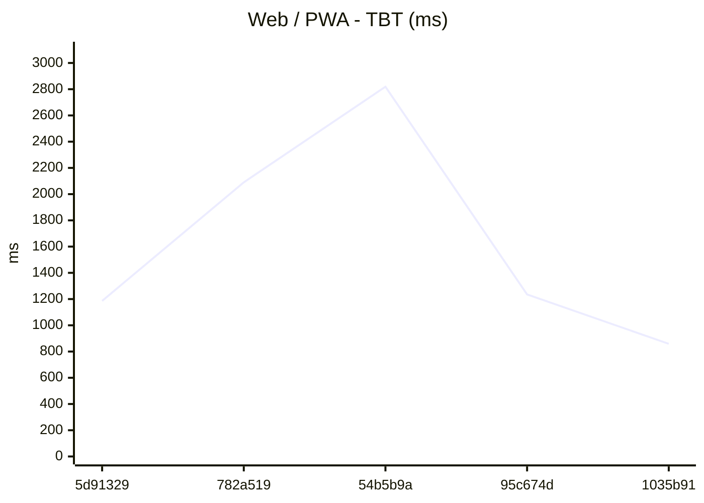
```mermaid
xychart-beta
    title "Web / PWA - TBT (ms)"
    x-axis ["5d91329", "782a519", "54b5b9a", "95c674d", "1035b91"]
    y-axis "ms" 0 --> 3101
    line [1186, 2090, 2819, 1235, 859]
```

### GitHub Pages

| date | sha | status | LCP_ms | FCP_ms | TBT_ms | run |
| --- | --- | --- | --- | --- | --- | --- |
| 2026-07-13 22:20:19 | 5d91329 | ok | 27536 | 7663 | 1186 | 29289400686 |
| 2026-07-13 21:30:04 | 782a519 | ok | 24725 | 7658 | 2090 | 29286354034 |
| 2026-07-13 20:35:07 | 54b5b9a | ok | 28712 | 11011 | 2819 | 29282111300 |
| 2026-07-13 20:03:57 | 95c674d | ok | 24213 | 7662 | 1235 | 29280775524 |
| 2026-07-13 19:29:58 | 1035b91 | ok | 11936 | 7661 | 859 | 29278561731 |

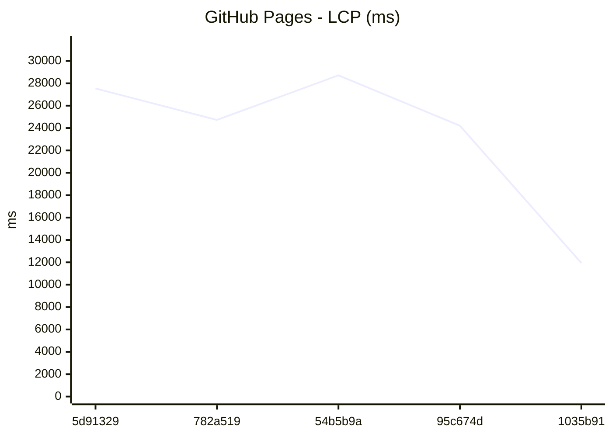
```mermaid
xychart-beta
    title "GitHub Pages - LCP (ms)"
    x-axis ["5d91329", "782a519", "54b5b9a", "95c674d", "1035b91"]
    y-axis "ms" 0 --> 31584
    line [27536, 24725, 28712, 24213, 11936]
```
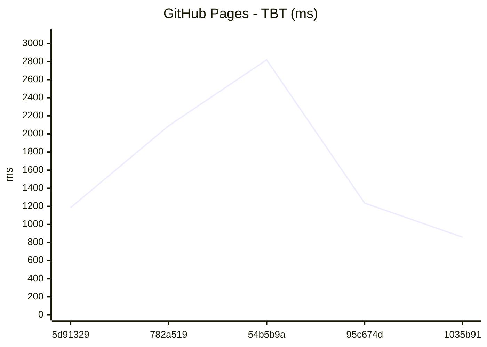
```mermaid
xychart-beta
    title "GitHub Pages - TBT (ms)"
    x-axis ["5d91329", "782a519", "54b5b9a", "95c674d", "1035b91"]
    y-axis "ms" 0 --> 3101
    line [1186, 2090, 2819, 1235, 859]
```

### Capacitor (legacy)
_No history yet._

### Expo / RN bundles

Aggregates: **sum of gzip bytes** across all `.hbc` files per platform (stable for trends when chunk hashes change).

| date | sha | status | android_gzip | ios_gzip | run |
| --- | --- | --- | --- | --- | --- |
| 2026-07-13 22:22:13 | 5d91329 | ok | 4090787 | 4084805 | 29289400686 |
| 2026-07-13 21:31:43 | 782a519 | ok | 4090360 | 4084677 | 29286354034 |
| 2026-07-13 20:41:25 | 54b5b9a | ok | 4089313 | 4082348 | 29282111300 |
| 2026-07-13 20:06:03 | 95c674d | ok | 4088814 | 4083105 | 29280775524 |
| 2026-07-13 19:31:58 | 1035b91 | ok | 4088813 | 4083108 | 29278561731 |

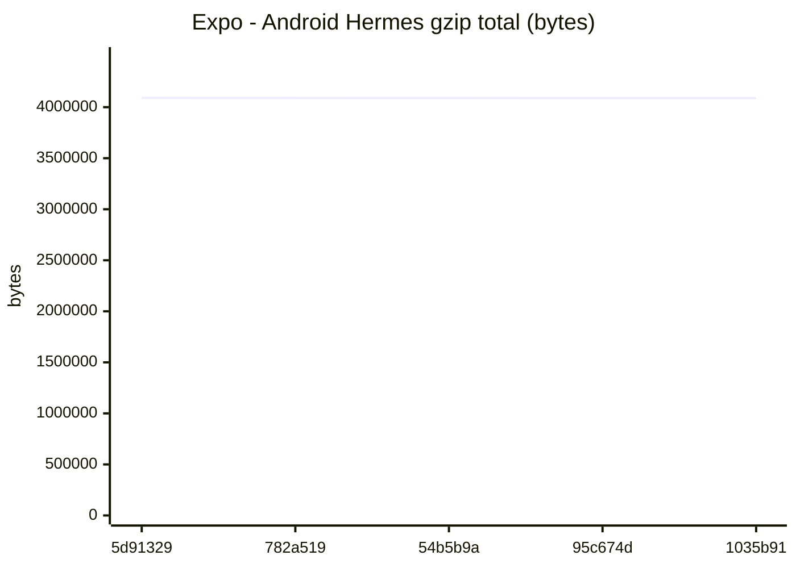
```mermaid
xychart-beta
    title "Expo - Android Hermes gzip total (bytes)"
    x-axis ["5d91329", "782a519", "54b5b9a", "95c674d", "1035b91"]
    y-axis "bytes" 0 --> 4499866
    line [4090787, 4090360, 4089313, 4088814, 4088813]
```

```mermaid
xychart-beta
    title "Expo - iOS Hermes gzip total (bytes)"
    x-axis ["5d91329", "782a519", "54b5b9a", "95c674d", "1035b91"]
    y-axis "bytes" 0 --> 4493286
    line [4084805, 4084677, 4082348, 4083105, 4083108]
```

Last <strong>20</strong> runs (all platforms)

### Web / PWA

| date | sha | status | LCP_ms | FCP_ms | TBT_ms | run |
| --- | --- | --- | --- | --- | --- | --- |
| 2026-07-13 22:20:19 | 5d91329 | ok | 27536 | 7663 | 1186 | 29289400686 |
| 2026-07-13 21:30:04 | 782a519 | ok | 24725 | 7658 | 2090 | 29286354034 |
| 2026-07-13 20:35:07 | 54b5b9a | ok | 28712 | 11011 | 2819 | 29282111300 |
| 2026-07-13 20:03:57 | 95c674d | ok | 24213 | 7662 | 1235 | 29280775524 |
| 2026-07-13 19:29:58 | 1035b91 | ok | 11936 | 7661 | 859 | 29278561731 |
| 2026-07-08 21:52:19 | c0d5c84 | ok | 21994 | 13748 | 521 | 28978196267 |
| 2026-07-08 21:17:37 | a0abe91 | ok | - | - | - | 28974575590 |
| 2026-07-07 23:09:46 | f776321 | ok | - | - | - | 28903623662 |
| 2026-07-06 22:51:15 | 894d90a | ok | 21131 | 13641 | 609 | 28828577477 |
| 2026-07-06 02:02:05 | 130b3fd | ok | - | - | - | 28760447624 |
| 2026-07-06 00:03:45 | 62dc462 | ok | 20871 | 13467 | 891 | 28758750040 |
| 2026-07-05 22:41:12 | b5a9254 | ok | 20837 | 13508 | 628 | 28757313083 |
| 2026-06-30 23:46:08 | c45967e | ok | - | - | - | 28481990024 |
| 2026-06-30 19:48:29 | 2d2a9da | ok | - | - | - | 28469775056 |
| 2026-06-30 18:21:19 | 0a41d6c | ok | - | - | - | 28464715678 |
| 2026-06-30 06:37:36 | 3c28203 | ok | 20503 | 13298 | 422 | 28425223140 |
| 2026-06-30 06:02:49 | 51e19c3 | ok | 20509 | 13319 | 418 | 28423759439 |
| 2026-06-29 23:37:50 | c7be5f0 | ok | 21095 | 14639 | 411 | 28409768340 |
| 2026-06-28 22:12:28 | f56ca64 | ok | 19101 | 12038 | 348 | 28337659878 |
| 2026-06-28 21:19:07 | e074e16 | ok | 19549 | 12733 | 402 | 28336245929 |

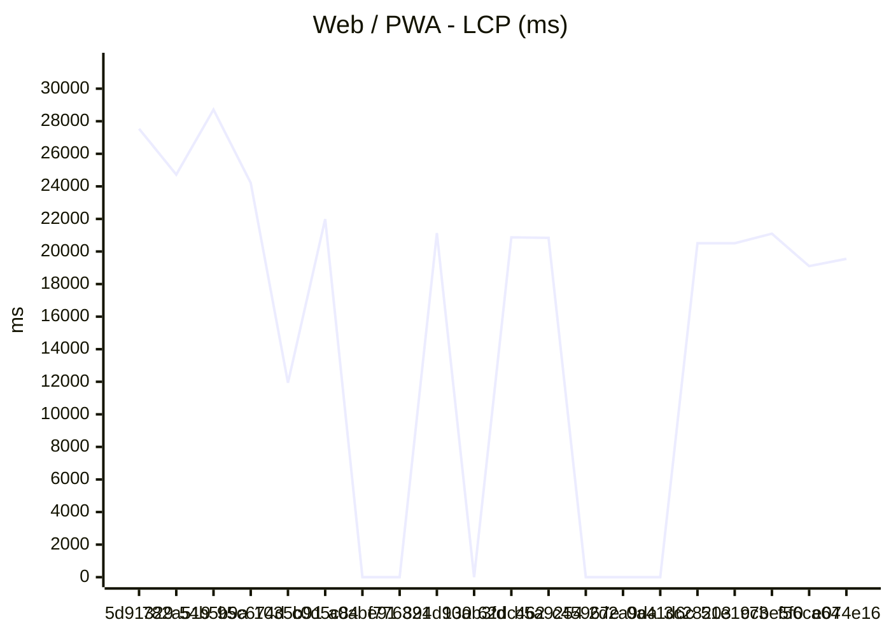
```mermaid
xychart-beta
    title "Web / PWA - LCP (ms)"
    x-axis ["5d91329", "782a519", "54b5b9a", "95c674d", "1035b91", "c0d5c84", "a0abe91", "f776321", "894d90a", "130b3fd", "62dc462", "b5a9254", "c45967e", "2d2a9da", "0a41d6c", "3c28203", "51e19c3", "c7be5f0", "f56ca64", "e074e16"]
    y-axis "ms" 0 --> 31584
    line [27536, 24725, 28712, 24213, 11936, 21994, 0, 0, 21131, 0, 20871, 20837, 0, 0, 0, 20503, 20509, 21095, 19101, 19549]
```
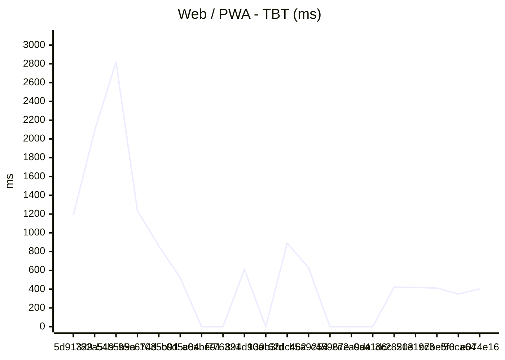
```mermaid
xychart-beta
    title "Web / PWA - TBT (ms)"
    x-axis ["5d91329", "782a519", "54b5b9a", "95c674d", "1035b91", "c0d5c84", "a0abe91", "f776321", "894d90a", "130b3fd", "62dc462", "b5a9254", "c45967e", "2d2a9da", "0a41d6c", "3c28203", "51e19c3", "c7be5f0", "f56ca64", "e074e16"]
    y-axis "ms" 0 --> 3101
    line [1186, 2090, 2819, 1235, 859, 521, 0, 0, 609, 0, 891, 628, 0, 0, 0, 422, 418, 411, 348, 402]
```

### GitHub Pages

| date | sha | status | LCP_ms | FCP_ms | TBT_ms | run |
| --- | --- | --- | --- | --- | --- | --- |
| 2026-07-13 22:20:19 | 5d91329 | ok | 27536 | 7663 | 1186 | 29289400686 |
| 2026-07-13 21:30:04 | 782a519 | ok | 24725 | 7658 | 2090 | 29286354034 |
| 2026-07-13 20:35:07 | 54b5b9a | ok | 28712 | 11011 | 2819 | 29282111300 |
| 2026-07-13 20:03:57 | 95c674d | ok | 24213 | 7662 | 1235 | 29280775524 |
| 2026-07-13 19:29:58 | 1035b91 | ok | 11936 | 7661 | 859 | 29278561731 |
| 2026-07-08 22:21:17 | c0d5c84 | ok | - | - | - | 28978196267 |
| 2026-07-08 21:45:53 | a0abe91 | ok | - | - | - | 28974575590 |
| 2026-07-07 23:38:07 | f776321 | ok | - | - | - | 28903623662 |
| 2026-07-06 23:19:34 | 894d90a | ok | - | - | - | 28828577477 |
| 2026-07-06 02:30:29 | 130b3fd | ok | - | - | - | 28760447624 |
| 2026-07-06 00:32:02 | 62dc462 | ok | - | - | - | 28758750040 |
| 2026-07-05 23:10:59 | b5a9254 | ok | - | - | - | 28757313083 |
| 2026-07-01 00:15:55 | c45967e | ok | - | - | - | 28481990024 |
| 2026-06-30 20:18:44 | 2d2a9da | ok | - | - | - | 28469775056 |
| 2026-06-30 18:51:19 | 0a41d6c | ok | - | - | - | 28464715678 |
| 2026-06-30 07:07:23 | 3c28203 | ok | - | - | - | 28425223140 |
| 2026-06-30 06:33:08 | 51e19c3 | ok | - | - | - | 28423759439 |
| 2026-06-30 00:07:38 | c7be5f0 | ok | - | - | - | 28409768340 |
| 2026-06-28 22:13:00 | f56ca64 | ok | 18641 | 6915 | 385 | 28337659878 |
| 2026-06-28 21:19:38 | e074e16 | ok | 18940 | 11903 | 342 | 28336245929 |

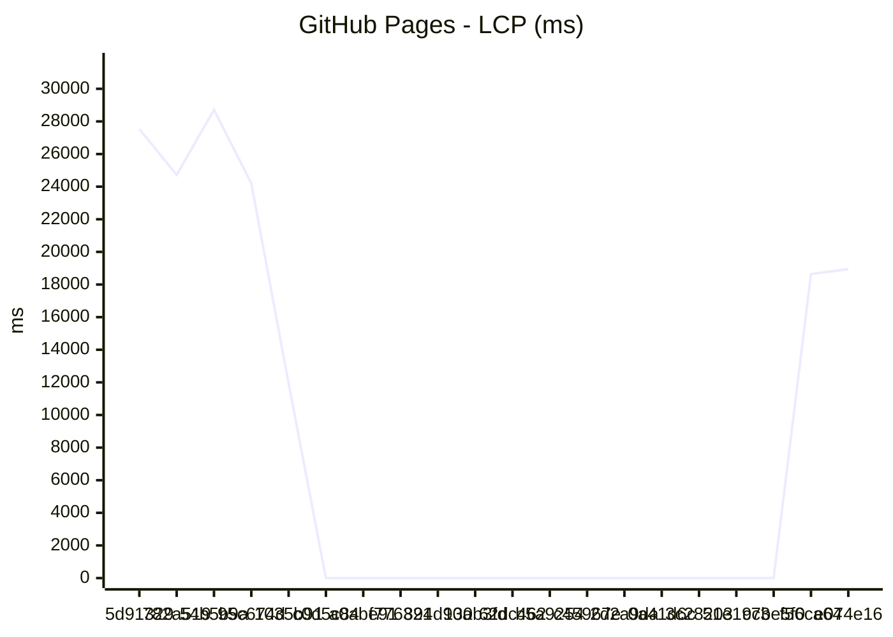
```mermaid
xychart-beta
    title "GitHub Pages - LCP (ms)"
    x-axis ["5d91329", "782a519", "54b5b9a", "95c674d", "1035b91", "c0d5c84", "a0abe91", "f776321", "894d90a", "130b3fd", "62dc462", "b5a9254", "c45967e", "2d2a9da", "0a41d6c", "3c28203", "51e19c3", "c7be5f0", "f56ca64", "e074e16"]
    y-axis "ms" 0 --> 31584
    line [27536, 24725, 28712, 24213, 11936, 0, 0, 0, 0, 0, 0, 0, 0, 0, 0, 0, 0, 0, 18641, 18940]
```
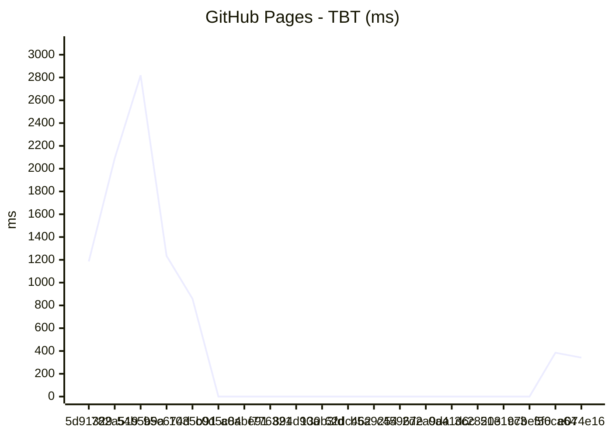
```mermaid
xychart-beta
    title "GitHub Pages - TBT (ms)"
    x-axis ["5d91329", "782a519", "54b5b9a", "95c674d", "1035b91", "c0d5c84", "a0abe91", "f776321", "894d90a", "130b3fd", "62dc462", "b5a9254", "c45967e", "2d2a9da", "0a41d6c", "3c28203", "51e19c3", "c7be5f0", "f56ca64", "e074e16"]
    y-axis "ms" 0 --> 3101
    line [1186, 2090, 2819, 1235, 859, 0, 0, 0, 0, 0, 0, 0, 0, 0, 0, 0, 0, 0, 385, 342]
```

### Capacitor (legacy)
_No history yet._

### Expo / RN bundles

Aggregates: **sum of gzip bytes** across all `.hbc` files per platform (stable for trends when chunk hashes change).

| date | sha | status | android_gzip | ios_gzip | run |
| --- | --- | --- | --- | --- | --- |
| 2026-07-13 22:22:13 | 5d91329 | ok | 4090787 | 4084805 | 29289400686 |
| 2026-07-13 21:31:43 | 782a519 | ok | 4090360 | 4084677 | 29286354034 |
| 2026-07-13 20:41:25 | 54b5b9a | ok | 4089313 | 4082348 | 29282111300 |
| 2026-07-13 20:06:03 | 95c674d | ok | 4088814 | 4083105 | 29280775524 |
| 2026-07-13 19:31:58 | 1035b91 | ok | 4088813 | 4083108 | 29278561731 |
| 2026-07-08 21:53:45 | c0d5c84 | ok | 4088813 | 4083106 | 28978196267 |
| 2026-07-08 20:50:52 | a0abe91 | ok | 4088812 | 4083107 | 28974575590 |
| 2026-07-07 22:43:47 | f776321 | ok | 4085830 | 4079675 | 28903623662 |
| 2026-07-06 22:53:14 | 894d90a | ok | 4086643 | 4079243 | 28828577477 |
| 2026-07-06 01:36:06 | 130b3fd | ok | 4077332 | 4074172 | 28760447624 |
| 2026-07-06 00:36:50 | 458975f | ok | 4077341 | 4073443 | 28760059244 |
| 2026-07-06 00:05:17 | 62dc462 | ok | 4077340 | 4073443 | 28758750040 |
| 2026-07-05 22:42:36 | b5a9254 | ok | 4078885 | 4069109 | 28757313083 |
| 2026-06-30 23:18:27 | c45967e | ok | 4078896 | 4069113 | 28481990024 |
| 2026-06-30 19:20:23 | 2d2a9da | ok | 4078895 | 4069106 | 28469775056 |
| 2026-06-30 17:53:53 | 0a41d6c | ok | 4078897 | 4069107 | 28464715678 |
| 2026-06-30 06:39:35 | 3c28203 | ok | 4076071 | 4065403 | 28425223140 |
| 2026-06-30 06:04:34 | 51e19c3 | ok | 4075584 | 4065816 | 28423759439 |
| 2026-06-29 23:39:37 | c7be5f0 | ok | 4075582 | 4065817 | 28409768340 |
| 2026-06-28 22:13:48 | f56ca64 | ok | 4052821 | 4047233 | 28337659878 |

```mermaid
xychart-beta
    title "Expo - Android Hermes gzip total (bytes)"
    x-axis ["5d91329", "782a519", "54b5b9a", "95c674d", "1035b91", "c0d5c84", "a0abe91", "f776321", "894d90a", "130b3fd", "458975f", "62dc462", "b5a9254", "c45967e", "2d2a9da", "0a41d6c", "3c28203", "51e19c3", "c7be5f0", "f56ca64"]
    y-axis "bytes" 0 --> 4499866
    line [4090787, 4090360, 4089313, 4088814, 4088813, 4088813, 4088812, 4085830, 4086643, 4077332, 4077341, 4077340, 4078885, 4078896, 4078895, 4078897, 4076071, 4075584, 4075582, 4052821]
```
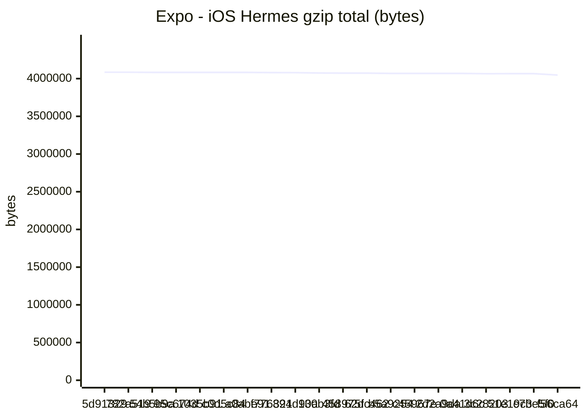
```mermaid
xychart-beta
    title "Expo - iOS Hermes gzip total (bytes)"
    x-axis ["5d91329", "782a519", "54b5b9a", "95c674d", "1035b91", "c0d5c84", "a0abe91", "f776321", "894d90a", "130b3fd", "458975f", "62dc462", "b5a9254", "c45967e", "2d2a9da", "0a41d6c", "3c28203", "51e19c3", "c7be5f0", "f56ca64"]
    y-axis "bytes" 0 --> 4493286
    line [4084805, 4084677, 4082348, 4083105, 4083108, 4083106, 4083107, 4079675, 4079243, 4074172, 4073443, 4073443, 4069109, 4069113, 4069106, 4069107, 4065403, 4065816, 4065817, 4047233]
```

