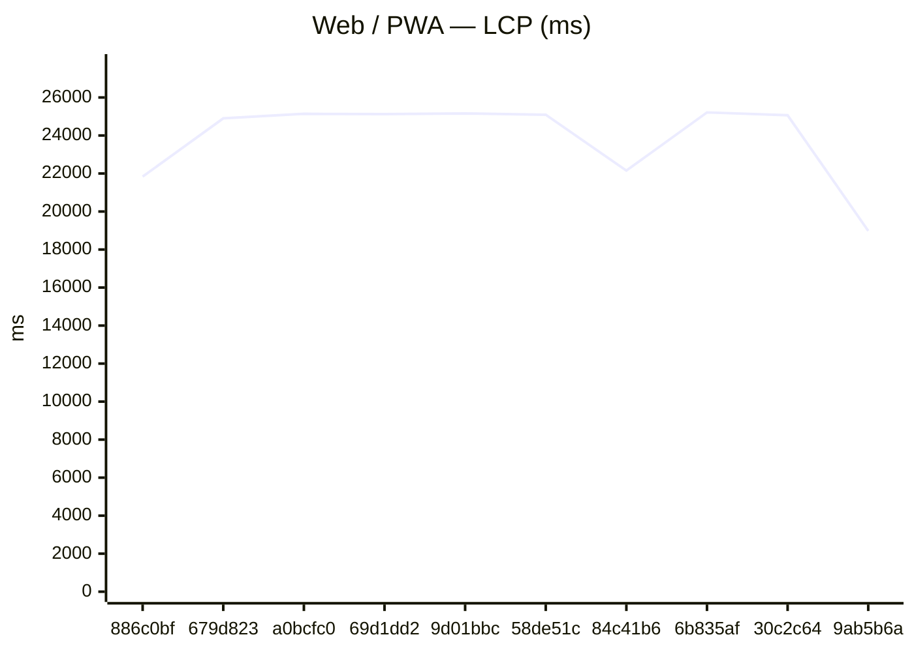
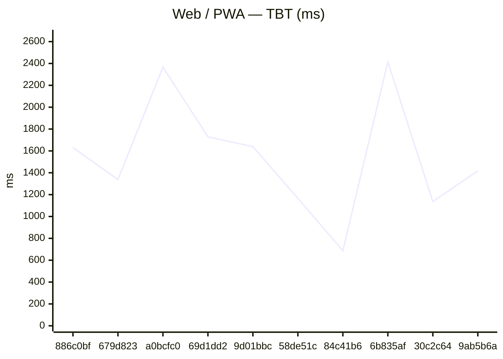
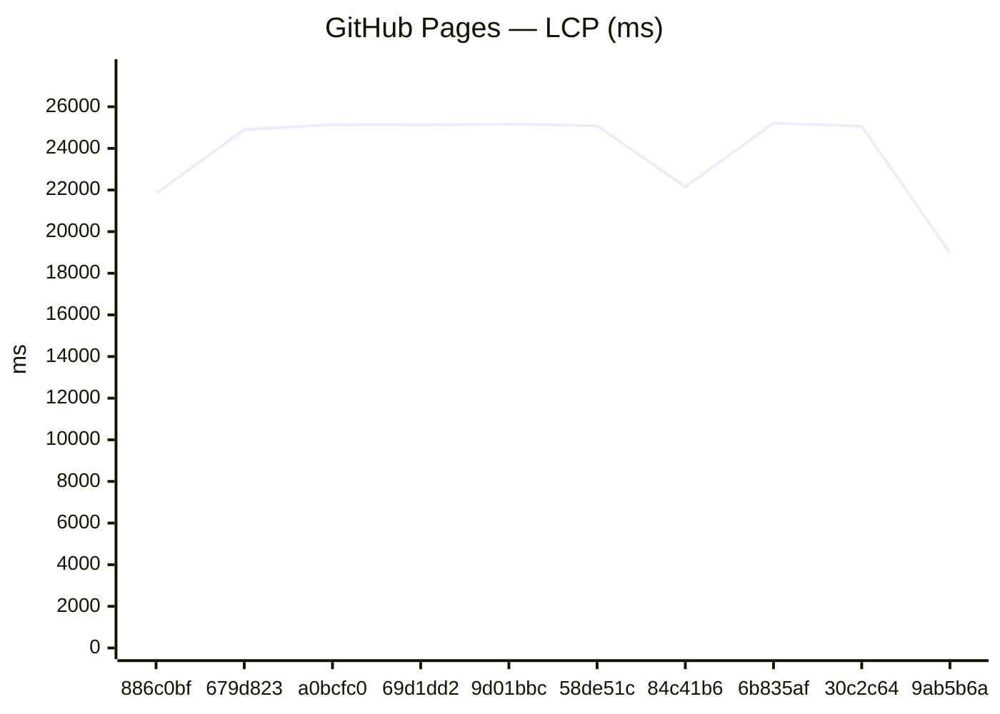
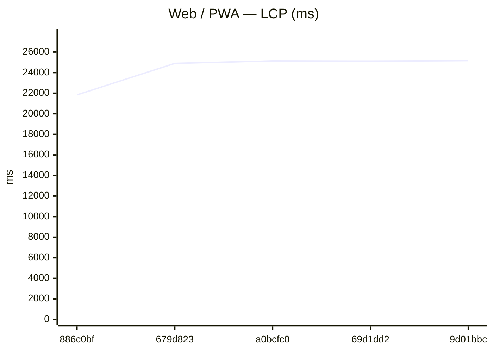
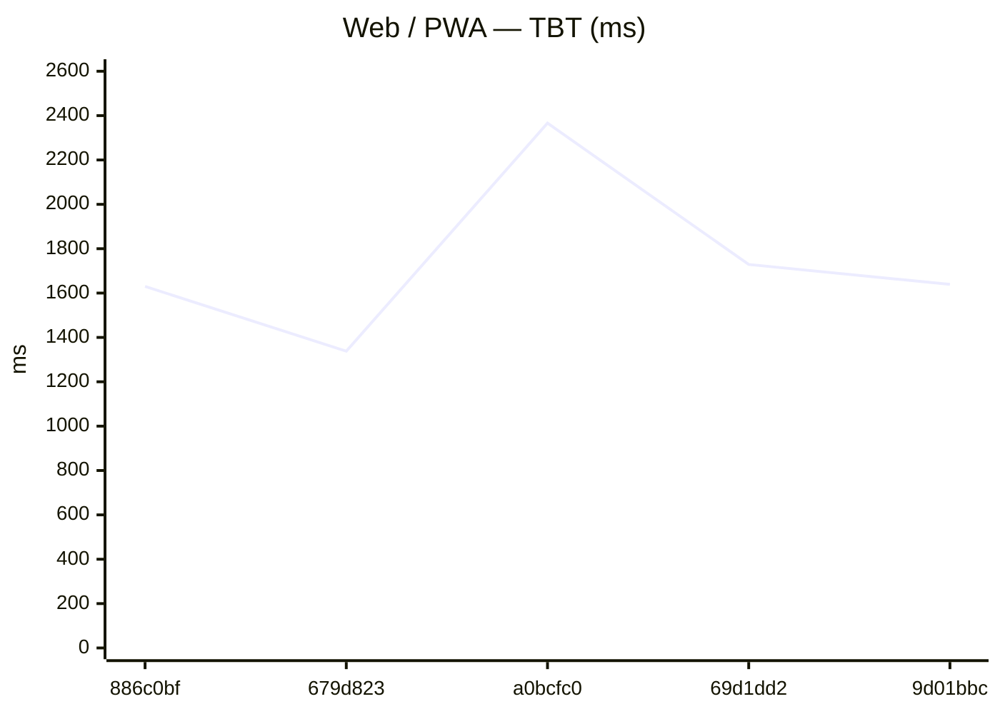
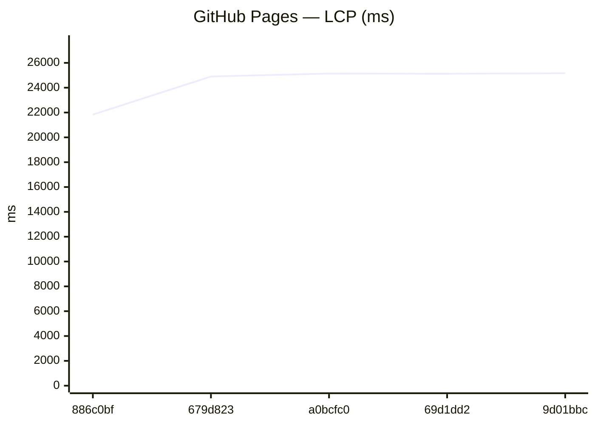
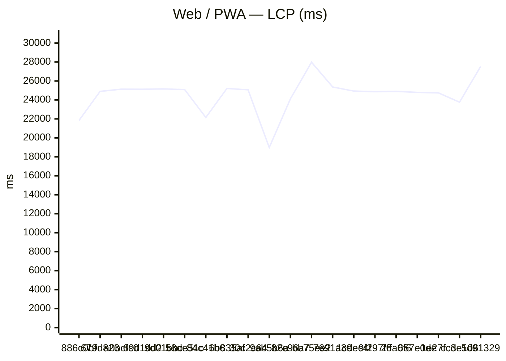
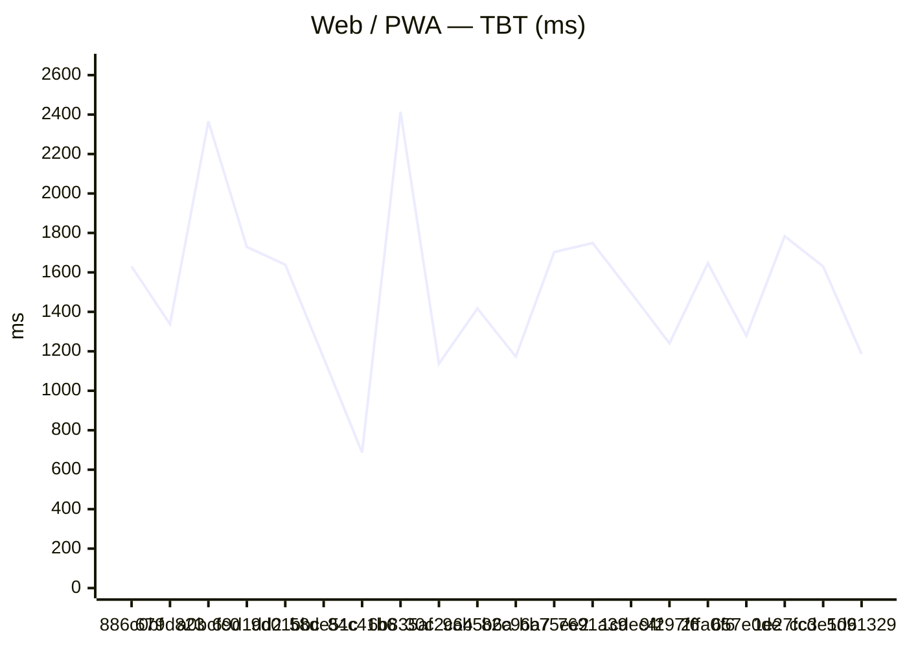
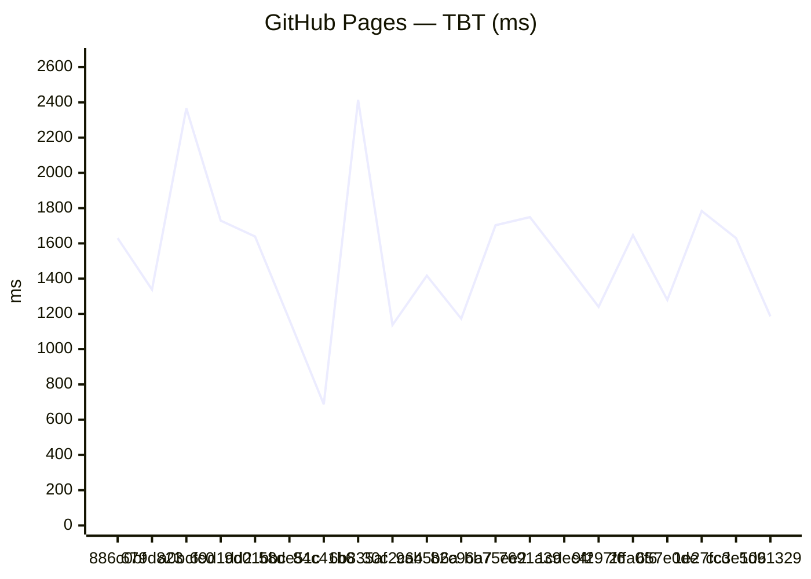

# Benchmark comparison (history)

Generated at **2026-07-18T22:45:44.760Z**.

To change the default number of runs in the primary sections below, edit **[compare.config.json](./compare.config.json)** (`window`). GitHub does not support interactive dropdowns in Markdown; optional **collapsed sections** list alternate window sizes.

---

### Web / PWA

| date | sha | status | LCP_ms | FCP_ms | TBT_ms | run |
| --- | --- | --- | --- | --- | --- | --- |
| 2026-07-18 22:45:17 | 886c0bf | ok | 21835 | 11810 | 1630 | 29663952972 |
| 2026-07-18 21:31:39 | 679d823 | ok | 24900 | 12342 | 1338 | 29661697648 |
| 2026-07-18 21:01:27 | a0bcfc0 | ok | 25139 | 7810 | 2366 | 29660749746 |
| 2026-07-18 20:43:49 | 69d1dd2 | ok | 25124 | 11816 | 1729 | 29660192882 |
| 2026-07-18 20:19:50 | 9d01bbc | ok | 25162 | 11786 | 1639 | 29659426188 |
| 2026-07-18 19:41:24 | 58de51c | ok | 25092 | 11781 | 1166 | 29658208882 |
| 2026-07-18 19:09:22 | 84c41b6 | ok | 22152 | 7811 | 687 | 29657192225 |
| 2026-07-18 17:21:08 | 6b835af | ok | 25215 | 7810 | 2414 | 29653660920 |
| 2026-07-18 14:30:21 | 30c2c64 | ok | 25064 | 11834 | 1137 | 29648074587 |
| 2026-07-17 19:36:37 | 9ab5b6a | ok | 18985 | 7809 | 1417 | 29608013937 |

### GitHub Pages

| date | sha | status | LCP_ms | FCP_ms | TBT_ms | run |
| --- | --- | --- | --- | --- | --- | --- |
| 2026-07-18 22:45:17 | 886c0bf | ok | 21835 | 11810 | 1630 | 29663952972 |
| 2026-07-18 21:31:39 | 679d823 | ok | 24900 | 12342 | 1338 | 29661697648 |
| 2026-07-18 21:01:27 | a0bcfc0 | ok | 25139 | 7810 | 2366 | 29660749746 |
| 2026-07-18 20:43:49 | 69d1dd2 | ok | 25124 | 11816 | 1729 | 29660192882 |
| 2026-07-18 20:19:50 | 9d01bbc | ok | 25162 | 11786 | 1639 | 29659426188 |
| 2026-07-18 19:41:24 | 58de51c | ok | 25092 | 11781 | 1166 | 29658208882 |
| 2026-07-18 19:09:22 | 84c41b6 | ok | 22152 | 7811 | 687 | 29657192225 |
| 2026-07-18 17:21:08 | 6b835af | ok | 25215 | 7810 | 2414 | 29653660920 |
| 2026-07-18 14:30:21 | 30c2c64 | ok | 25064 | 11834 | 1137 | 29648074587 |
| 2026-07-17 19:36:37 | 9ab5b6a | ok | 18985 | 7809 | 1417 | 29608013937 |

Last <strong>5</strong> runs (all platforms)

### Web / PWA

| date | sha | status | LCP_ms | FCP_ms | TBT_ms | run |
| --- | --- | --- | --- | --- | --- | --- |
| 2026-07-18 22:45:17 | 886c0bf | ok | 21835 | 11810 | 1630 | 29663952972 |
| 2026-07-18 21:31:39 | 679d823 | ok | 24900 | 12342 | 1338 | 29661697648 |
| 2026-07-18 21:01:27 | a0bcfc0 | ok | 25139 | 7810 | 2366 | 29660749746 |
| 2026-07-18 20:43:49 | 69d1dd2 | ok | 25124 | 11816 | 1729 | 29660192882 |
| 2026-07-18 20:19:50 | 9d01bbc | ok | 25162 | 11786 | 1639 | 29659426188 |

### GitHub Pages

| date | sha | status | LCP_ms | FCP_ms | TBT_ms | run |
| --- | --- | --- | --- | --- | --- | --- |
| 2026-07-18 22:45:17 | 886c0bf | ok | 21835 | 11810 | 1630 | 29663952972 |
| 2026-07-18 21:31:39 | 679d823 | ok | 24900 | 12342 | 1338 | 29661697648 |
| 2026-07-18 21:01:27 | a0bcfc0 | ok | 25139 | 7810 | 2366 | 29660749746 |
| 2026-07-18 20:43:49 | 69d1dd2 | ok | 25124 | 11816 | 1729 | 29660192882 |
| 2026-07-18 20:19:50 | 9d01bbc | ok | 25162 | 11786 | 1639 | 29659426188 |

Last <strong>20</strong> runs (all platforms)

### Web / PWA

| date | sha | status | LCP_ms | FCP_ms | TBT_ms | run |
| --- | --- | --- | --- | --- | --- | --- |
| 2026-07-18 22:45:17 | 886c0bf | ok | 21835 | 11810 | 1630 | 29663952972 |
| 2026-07-18 21:31:39 | 679d823 | ok | 24900 | 12342 | 1338 | 29661697648 |
| 2026-07-18 21:01:27 | a0bcfc0 | ok | 25139 | 7810 | 2366 | 29660749746 |
| 2026-07-18 20:43:49 | 69d1dd2 | ok | 25124 | 11816 | 1729 | 29660192882 |
| 2026-07-18 20:19:50 | 9d01bbc | ok | 25162 | 11786 | 1639 | 29659426188 |
| 2026-07-18 19:41:24 | 58de51c | ok | 25092 | 11781 | 1166 | 29658208882 |
| 2026-07-18 19:09:22 | 84c41b6 | ok | 22152 | 7811 | 687 | 29657192225 |
| 2026-07-18 17:21:08 | 6b835af | ok | 25215 | 7810 | 2414 | 29653660920 |
| 2026-07-18 14:30:21 | 30c2c64 | ok | 25064 | 11834 | 1137 | 29648074587 |
| 2026-07-17 19:36:37 | 9ab5b6a | ok | 18985 | 7809 | 1417 | 29608013937 |
| 2026-07-16 23:34:05 | 82c96a7 | ok | 24113 | 12314 | 1173 | 29542392416 |
| 2026-07-16 22:25:57 | bb75ee2 | ok | 27976 | 7814 | 1703 | 29539414426 |
| 2026-07-16 21:41:18 | 7691a39 | ok | 25370 | 11719 | 1749 | 29536835656 |
| 2026-07-16 16:14:30 | 1cdec4f | ok | 24933 | 11604 | 1497 | 29514595695 |
| 2026-07-16 13:16:59 | 9f297f6 | ok | 24873 | 11717 | 1240 | 29501373326 |
| 2026-07-16 12:35:03 | 2ffa0f6 | ok | 24910 | 11723 | 1647 | 29498560447 |
| 2026-07-15 21:49:00 | 657e0de | ok | 24797 | 10708 | 1279 | 29453124783 |
| 2026-07-13 23:57:13 | 1e27fcd | ok | 24744 | 7663 | 1784 | 29293876957 |
| 2026-07-13 23:02:03 | cc3e106 | ok | 23765 | 10936 | 1630 | 29291578240 |
| 2026-07-13 22:20:19 | 5d91329 | ok | 27536 | 7663 | 1186 | 29289400686 |

### GitHub Pages

| date | sha | status | LCP_ms | FCP_ms | TBT_ms | run |
| --- | --- | --- | --- | --- | --- | --- |
| 2026-07-18 22:45:17 | 886c0bf | ok | 21835 | 11810 | 1630 | 29663952972 |
| 2026-07-18 21:31:39 | 679d823 | ok | 24900 | 12342 | 1338 | 29661697648 |
| 2026-07-18 21:01:27 | a0bcfc0 | ok | 25139 | 7810 | 2366 | 29660749746 |
| 2026-07-18 20:43:49 | 69d1dd2 | ok | 25124 | 11816 | 1729 | 29660192882 |
| 2026-07-18 20:19:50 | 9d01bbc | ok | 25162 | 11786 | 1639 | 29659426188 |
| 2026-07-18 19:41:24 | 58de51c | ok | 25092 | 11781 | 1166 | 29658208882 |
| 2026-07-18 19:09:22 | 84c41b6 | ok | 22152 | 7811 | 687 | 29657192225 |
| 2026-07-18 17:21:08 | 6b835af | ok | 25215 | 7810 | 2414 | 29653660920 |
| 2026-07-18 14:30:21 | 30c2c64 | ok | 25064 | 11834 | 1137 | 29648074587 |
| 2026-07-17 19:36:37 | 9ab5b6a | ok | 18985 | 7809 | 1417 | 29608013937 |
| 2026-07-16 23:34:05 | 82c96a7 | ok | 24113 | 12314 | 1173 | 29542392416 |
| 2026-07-16 22:25:57 | bb75ee2 | ok | 27976 | 7814 | 1703 | 29539414426 |
| 2026-07-16 21:41:18 | 7691a39 | ok | 25370 | 11719 | 1749 | 29536835656 |
| 2026-07-16 16:14:30 | 1cdec4f | ok | 24933 | 11604 | 1497 | 29514595695 |
| 2026-07-16 13:16:59 | 9f297f6 | ok | 24873 | 11717 | 1240 | 29501373326 |
| 2026-07-16 12:35:03 | 2ffa0f6 | ok | 24910 | 11723 | 1647 | 29498560447 |
| 2026-07-15 21:49:00 | 657e0de | ok | 24797 | 10708 | 1279 | 29453124783 |
| 2026-07-13 23:57:13 | 1e27fcd | ok | 24744 | 7663 | 1784 | 29293876957 |
| 2026-07-13 23:02:03 | cc3e106 | ok | 23765 | 10936 | 1630 | 29291578240 |
| 2026-07-13 22:20:19 | 5d91329 | ok | 27536 | 7663 | 1186 | 29289400686 |

