# Benchmark comparison (history)

Generated at **2026-07-16T22:28:45.454Z**.

To change the default number of runs in the primary sections below, edit **[compare.config.json](./compare.config.json)** (`window`). GitHub does not support interactive dropdowns in Markdown; optional **collapsed sections** list alternate window sizes.

---

### Web / PWA

| date | sha | status | LCP_ms | FCP_ms | TBT_ms | run |
| --- | --- | --- | --- | --- | --- | --- |
| 2026-07-16 22:25:57 | bb75ee2 | ok | 27976 | 7814 | 1703 | 29539414426 |
| 2026-07-16 21:41:18 | 7691a39 | ok | 25370 | 11719 | 1749 | 29536835656 |
| 2026-07-16 16:14:30 | 1cdec4f | ok | 24933 | 11604 | 1497 | 29514595695 |
| 2026-07-16 13:16:59 | 9f297f6 | ok | 24873 | 11717 | 1240 | 29501373326 |
| 2026-07-16 12:35:03 | 2ffa0f6 | ok | 24910 | 11723 | 1647 | 29498560447 |
| 2026-07-15 21:49:00 | 657e0de | ok | 24797 | 10708 | 1279 | 29453124783 |
| 2026-07-13 23:57:13 | 1e27fcd | ok | 24744 | 7663 | 1784 | 29293876957 |
| 2026-07-13 23:02:03 | cc3e106 | ok | 23765 | 10936 | 1630 | 29291578240 |
| 2026-07-13 22:20:19 | 5d91329 | ok | 27536 | 7663 | 1186 | 29289400686 |
| 2026-07-13 21:30:04 | 782a519 | ok | 24725 | 7658 | 2090 | 29286354034 |

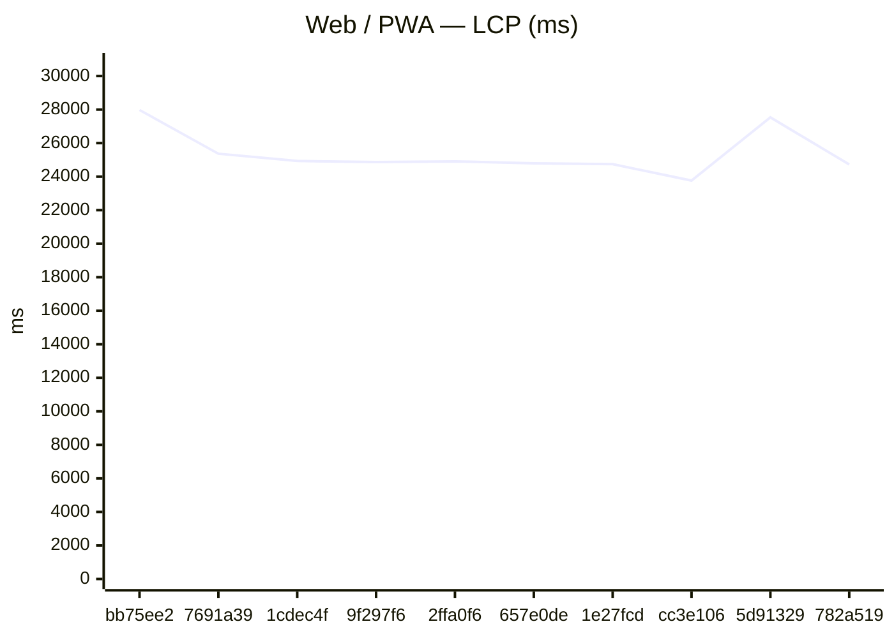

### GitHub Pages

| date | sha | status | LCP_ms | FCP_ms | TBT_ms | run |
| --- | --- | --- | --- | --- | --- | --- |
| 2026-07-16 22:25:57 | bb75ee2 | ok | 27976 | 7814 | 1703 | 29539414426 |
| 2026-07-16 21:41:18 | 7691a39 | ok | 25370 | 11719 | 1749 | 29536835656 |
| 2026-07-16 16:14:30 | 1cdec4f | ok | 24933 | 11604 | 1497 | 29514595695 |
| 2026-07-16 13:16:59 | 9f297f6 | ok | 24873 | 11717 | 1240 | 29501373326 |
| 2026-07-16 12:35:03 | 2ffa0f6 | ok | 24910 | 11723 | 1647 | 29498560447 |
| 2026-07-15 21:49:00 | 657e0de | ok | 24797 | 10708 | 1279 | 29453124783 |
| 2026-07-13 23:57:13 | 1e27fcd | ok | 24744 | 7663 | 1784 | 29293876957 |
| 2026-07-13 23:02:03 | cc3e106 | ok | 23765 | 10936 | 1630 | 29291578240 |
| 2026-07-13 22:20:19 | 5d91329 | ok | 27536 | 7663 | 1186 | 29289400686 |
| 2026-07-13 21:30:04 | 782a519 | ok | 24725 | 7658 | 2090 | 29286354034 |

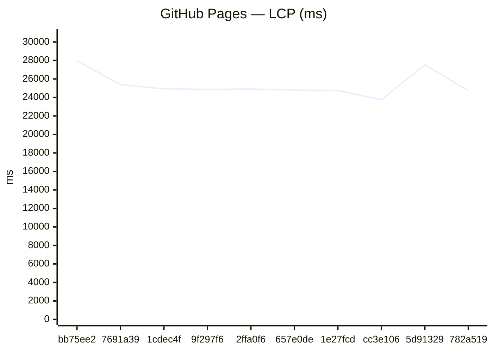
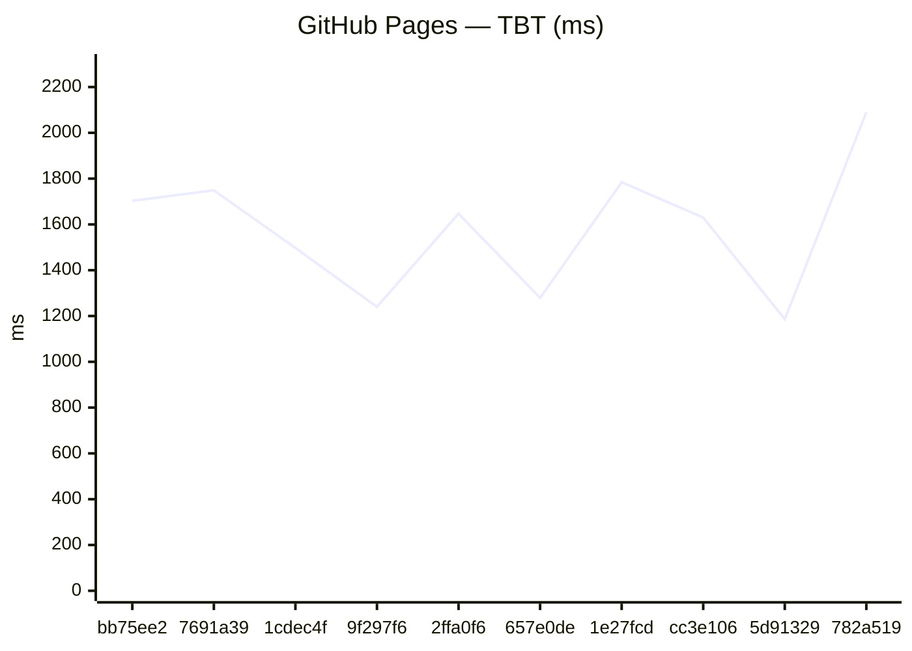

### Capacitor (legacy)
_No history yet._

### Expo / RN bundles

Aggregates: **sum of gzip bytes** across all `.hbc` files per platform (stable for trends when chunk hashes change).

| date | sha | status | android_gzip | ios_gzip | run |
| --- | --- | --- | --- | --- | --- |
| 2026-07-16 22:28:24 | bb75ee2 | ok | 4098255 | 4090855 | 29539414426 |
| 2026-07-16 21:44:03 | 7691a39 | ok | 4098083 | 4091134 | 29536835656 |
| 2026-07-16 16:16:27 | 1cdec4f | ok | 4099120 | 4091052 | 29514595695 |
| 2026-07-16 13:18:53 | 9f297f6 | ok | 4099121 | 4091052 | 29501373326 |
| 2026-07-16 12:36:49 | 2ffa0f6 | ok | 4099124 | 4091051 | 29498560447 |
| 2026-07-15 21:50:33 | 657e0de | ok | 4098083 | 4090884 | 29453124783 |
| 2026-07-13 23:58:43 | 1e27fcd | ok | 4094465 | 4087417 | 29293876957 |
| 2026-07-13 23:03:27 | cc3e106 | ok | 4094465 | 4087412 | 29291578240 |
| 2026-07-13 22:57:51 | fda11c1 | ok | 4090789 | 4084812 | 29291285600 |
| 2026-07-13 22:22:13 | 5d91329 | ok | 4090787 | 4084805 | 29289400686 |

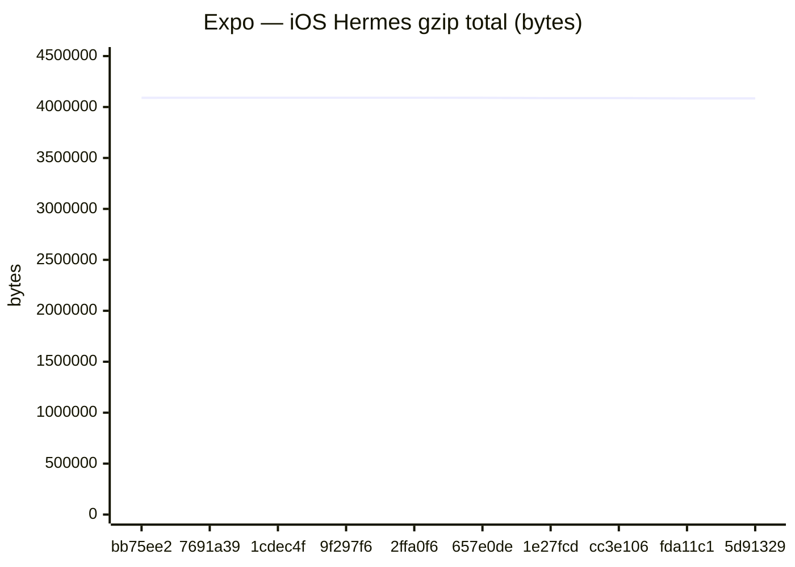

Last <strong>5</strong> runs (all platforms)

### Web / PWA

| date | sha | status | LCP_ms | FCP_ms | TBT_ms | run |
| --- | --- | --- | --- | --- | --- | --- |
| 2026-07-16 22:25:57 | bb75ee2 | ok | 27976 | 7814 | 1703 | 29539414426 |
| 2026-07-16 21:41:18 | 7691a39 | ok | 25370 | 11719 | 1749 | 29536835656 |
| 2026-07-16 16:14:30 | 1cdec4f | ok | 24933 | 11604 | 1497 | 29514595695 |
| 2026-07-16 13:16:59 | 9f297f6 | ok | 24873 | 11717 | 1240 | 29501373326 |
| 2026-07-16 12:35:03 | 2ffa0f6 | ok | 24910 | 11723 | 1647 | 29498560447 |

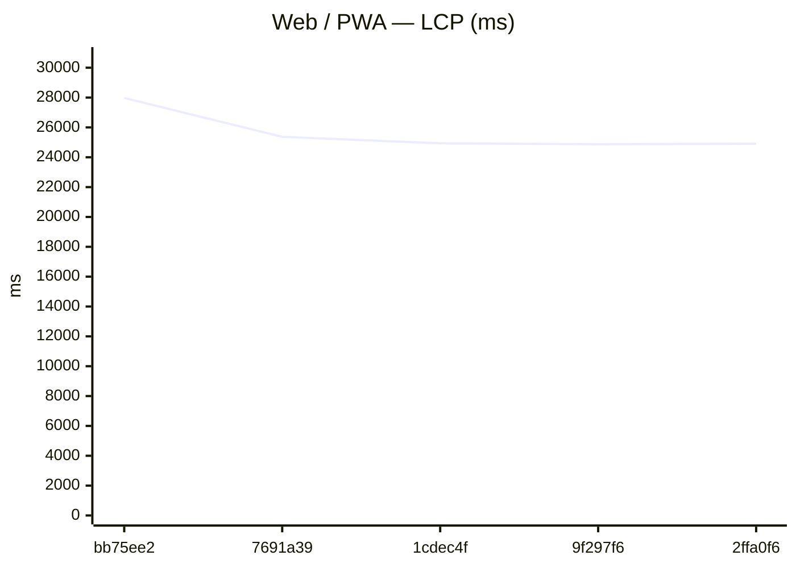
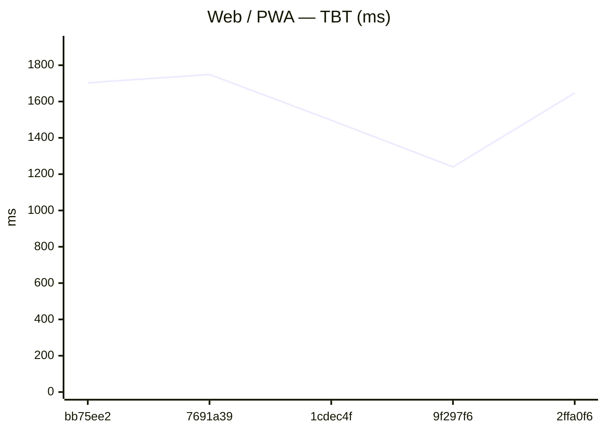

### GitHub Pages

| date | sha | status | LCP_ms | FCP_ms | TBT_ms | run |
| --- | --- | --- | --- | --- | --- | --- |
| 2026-07-16 22:25:57 | bb75ee2 | ok | 27976 | 7814 | 1703 | 29539414426 |
| 2026-07-16 21:41:18 | 7691a39 | ok | 25370 | 11719 | 1749 | 29536835656 |
| 2026-07-16 16:14:30 | 1cdec4f | ok | 24933 | 11604 | 1497 | 29514595695 |
| 2026-07-16 13:16:59 | 9f297f6 | ok | 24873 | 11717 | 1240 | 29501373326 |
| 2026-07-16 12:35:03 | 2ffa0f6 | ok | 24910 | 11723 | 1647 | 29498560447 |

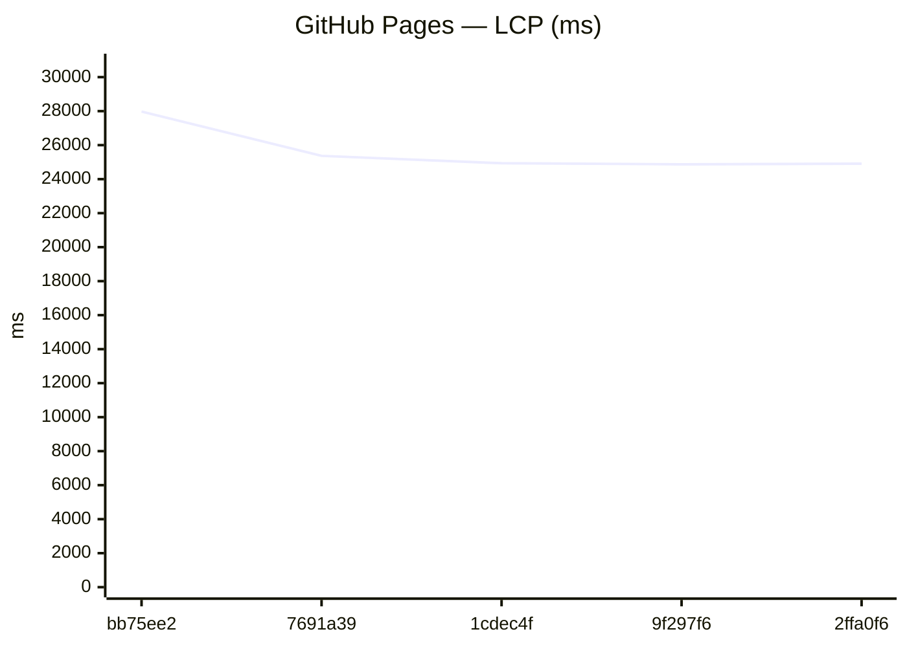
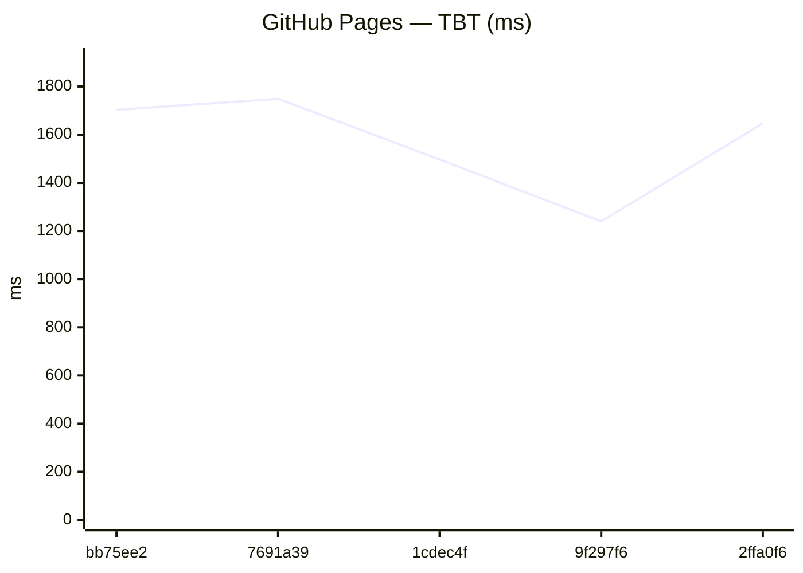

### Capacitor (legacy)
_No history yet._

### Expo / RN bundles

Aggregates: **sum of gzip bytes** across all `.hbc` files per platform (stable for trends when chunk hashes change).

| date | sha | status | android_gzip | ios_gzip | run |
| --- | --- | --- | --- | --- | --- |
| 2026-07-16 22:28:24 | bb75ee2 | ok | 4098255 | 4090855 | 29539414426 |
| 2026-07-16 21:44:03 | 7691a39 | ok | 4098083 | 4091134 | 29536835656 |
| 2026-07-16 16:16:27 | 1cdec4f | ok | 4099120 | 4091052 | 29514595695 |
| 2026-07-16 13:18:53 | 9f297f6 | ok | 4099121 | 4091052 | 29501373326 |
| 2026-07-16 12:36:49 | 2ffa0f6 | ok | 4099124 | 4091051 | 29498560447 |

Last <strong>20</strong> runs (all platforms)

### Web / PWA

| date | sha | status | LCP_ms | FCP_ms | TBT_ms | run |
| --- | --- | --- | --- | --- | --- | --- |
| 2026-07-16 22:25:57 | bb75ee2 | ok | 27976 | 7814 | 1703 | 29539414426 |
| 2026-07-16 21:41:18 | 7691a39 | ok | 25370 | 11719 | 1749 | 29536835656 |
| 2026-07-16 16:14:30 | 1cdec4f | ok | 24933 | 11604 | 1497 | 29514595695 |
| 2026-07-16 13:16:59 | 9f297f6 | ok | 24873 | 11717 | 1240 | 29501373326 |
| 2026-07-16 12:35:03 | 2ffa0f6 | ok | 24910 | 11723 | 1647 | 29498560447 |
| 2026-07-15 21:49:00 | 657e0de | ok | 24797 | 10708 | 1279 | 29453124783 |
| 2026-07-13 23:57:13 | 1e27fcd | ok | 24744 | 7663 | 1784 | 29293876957 |
| 2026-07-13 23:02:03 | cc3e106 | ok | 23765 | 10936 | 1630 | 29291578240 |
| 2026-07-13 22:20:19 | 5d91329 | ok | 27536 | 7663 | 1186 | 29289400686 |
| 2026-07-13 21:30:04 | 782a519 | ok | 24725 | 7658 | 2090 | 29286354034 |
| 2026-07-13 20:35:07 | 54b5b9a | ok | 28712 | 11011 | 2819 | 29282111300 |
| 2026-07-13 20:03:57 | 95c674d | ok | 24213 | 7662 | 1235 | 29280775524 |
| 2026-07-13 19:29:58 | 1035b91 | ok | 11936 | 7661 | 859 | 29278561731 |
| 2026-07-08 21:52:19 | c0d5c84 | ok | 21994 | 13748 | 521 | 28978196267 |
| 2026-07-08 21:17:37 | a0abe91 | ok | — | — | — | 28974575590 |
| 2026-07-07 23:09:46 | f776321 | ok | — | — | — | 28903623662 |
| 2026-07-06 22:51:15 | 894d90a | ok | 21131 | 13641 | 609 | 28828577477 |
| 2026-07-06 02:02:05 | 130b3fd | ok | — | — | — | 28760447624 |
| 2026-07-06 00:03:45 | 62dc462 | ok | 20871 | 13467 | 891 | 28758750040 |
| 2026-07-05 22:41:12 | b5a9254 | ok | 20837 | 13508 | 628 | 28757313083 |

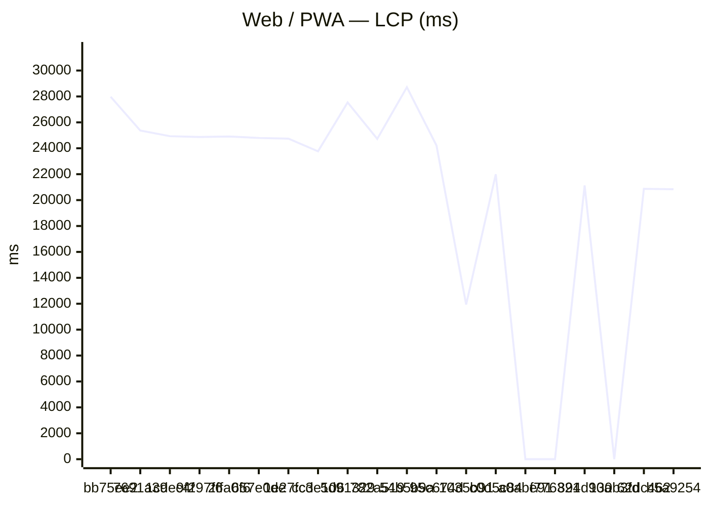
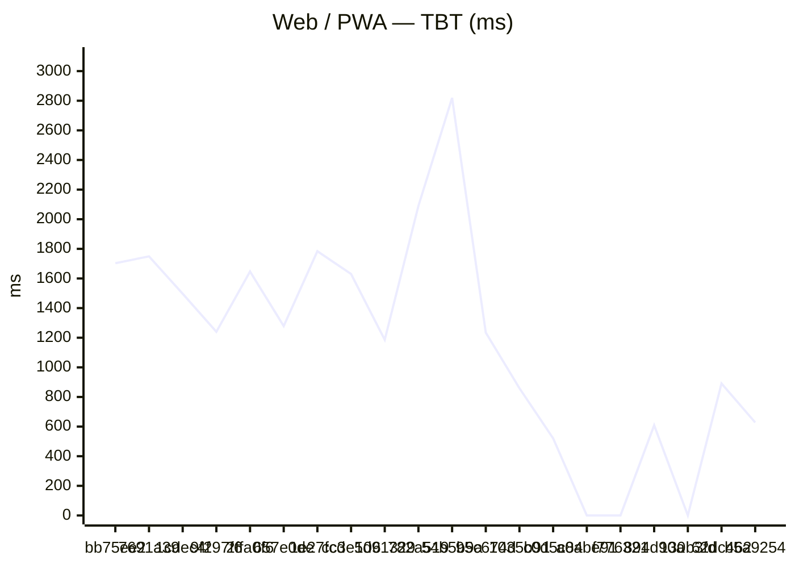

### GitHub Pages

| date | sha | status | LCP_ms | FCP_ms | TBT_ms | run |
| --- | --- | --- | --- | --- | --- | --- |
| 2026-07-16 22:25:57 | bb75ee2 | ok | 27976 | 7814 | 1703 | 29539414426 |
| 2026-07-16 21:41:18 | 7691a39 | ok | 25370 | 11719 | 1749 | 29536835656 |
| 2026-07-16 16:14:30 | 1cdec4f | ok | 24933 | 11604 | 1497 | 29514595695 |
| 2026-07-16 13:16:59 | 9f297f6 | ok | 24873 | 11717 | 1240 | 29501373326 |
| 2026-07-16 12:35:03 | 2ffa0f6 | ok | 24910 | 11723 | 1647 | 29498560447 |
| 2026-07-15 21:49:00 | 657e0de | ok | 24797 | 10708 | 1279 | 29453124783 |
| 2026-07-13 23:57:13 | 1e27fcd | ok | 24744 | 7663 | 1784 | 29293876957 |
| 2026-07-13 23:02:03 | cc3e106 | ok | 23765 | 10936 | 1630 | 29291578240 |
| 2026-07-13 22:20:19 | 5d91329 | ok | 27536 | 7663 | 1186 | 29289400686 |
| 2026-07-13 21:30:04 | 782a519 | ok | 24725 | 7658 | 2090 | 29286354034 |
| 2026-07-13 20:35:07 | 54b5b9a | ok | 28712 | 11011 | 2819 | 29282111300 |
| 2026-07-13 20:03:57 | 95c674d | ok | 24213 | 7662 | 1235 | 29280775524 |
| 2026-07-13 19:29:58 | 1035b91 | ok | 11936 | 7661 | 859 | 29278561731 |
| 2026-07-08 22:21:17 | c0d5c84 | ok | — | — | — | 28978196267 |
| 2026-07-08 21:45:53 | a0abe91 | ok | — | — | — | 28974575590 |
| 2026-07-07 23:38:07 | f776321 | ok | — | — | — | 28903623662 |
| 2026-07-06 23:19:34 | 894d90a | ok | — | — | — | 28828577477 |
| 2026-07-06 02:30:29 | 130b3fd | ok | — | — | — | 28760447624 |
| 2026-07-06 00:32:02 | 62dc462 | ok | — | — | — | 28758750040 |
| 2026-07-05 23:10:59 | b5a9254 | ok | — | — | — | 28757313083 |

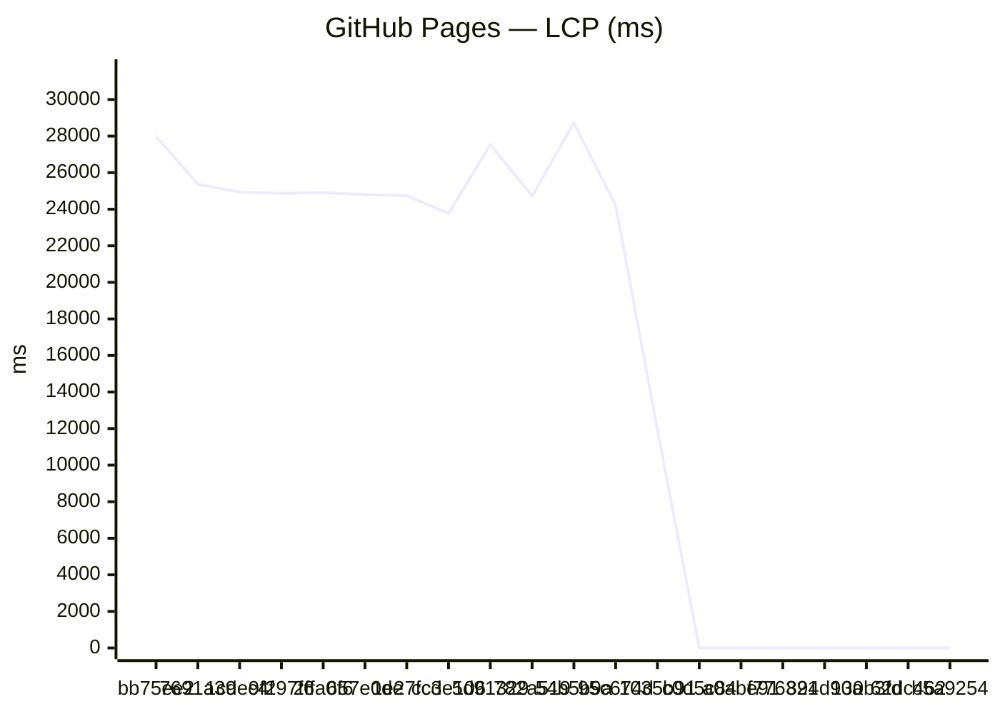
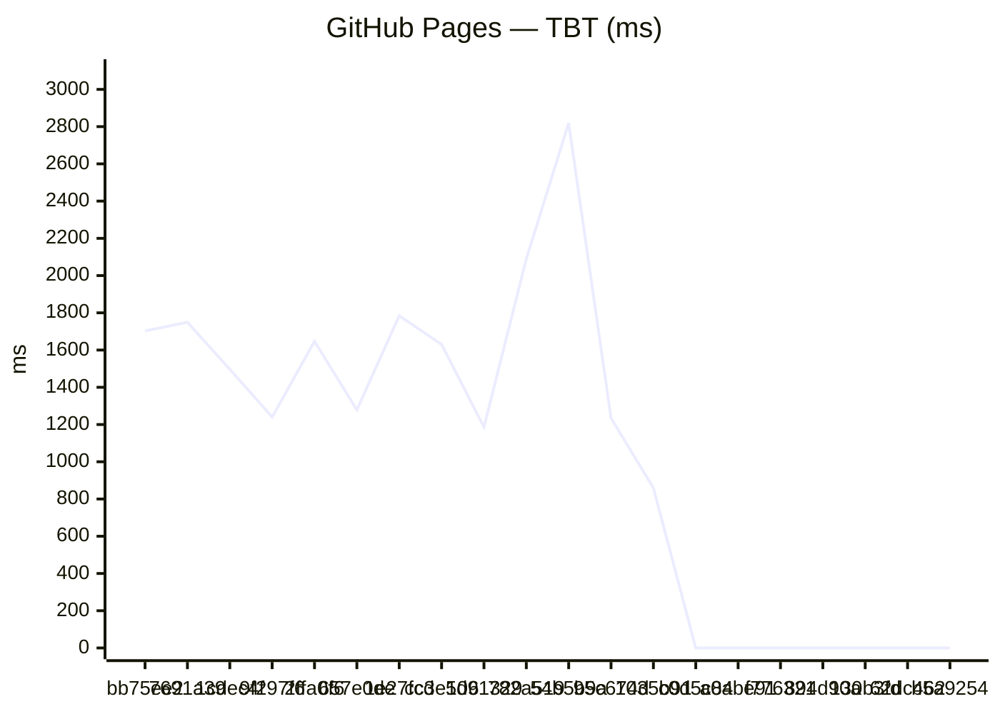

### Capacitor (legacy)
_No history yet._

### Expo / RN bundles

Aggregates: **sum of gzip bytes** across all `.hbc` files per platform (stable for trends when chunk hashes change).

| date | sha | status | android_gzip | ios_gzip | run |
| --- | --- | --- | --- | --- | --- |
| 2026-07-16 22:28:24 | bb75ee2 | ok | 4098255 | 4090855 | 29539414426 |
| 2026-07-16 21:44:03 | 7691a39 | ok | 4098083 | 4091134 | 29536835656 |
| 2026-07-16 16:16:27 | 1cdec4f | ok | 4099120 | 4091052 | 29514595695 |
| 2026-07-16 13:18:53 | 9f297f6 | ok | 4099121 | 4091052 | 29501373326 |
| 2026-07-16 12:36:49 | 2ffa0f6 | ok | 4099124 | 4091051 | 29498560447 |
| 2026-07-15 21:50:33 | 657e0de | ok | 4098083 | 4090884 | 29453124783 |
| 2026-07-13 23:58:43 | 1e27fcd | ok | 4094465 | 4087417 | 29293876957 |
| 2026-07-13 23:03:27 | cc3e106 | ok | 4094465 | 4087412 | 29291578240 |
| 2026-07-13 22:57:51 | fda11c1 | ok | 4090789 | 4084812 | 29291285600 |
| 2026-07-13 22:22:13 | 5d91329 | ok | 4090787 | 4084805 | 29289400686 |
| 2026-07-13 21:31:43 | 782a519 | ok | 4090360 | 4084677 | 29286354034 |
| 2026-07-13 20:41:25 | 54b5b9a | ok | 4089313 | 4082348 | 29282111300 |
| 2026-07-13 20:06:03 | 95c674d | ok | 4088814 | 4083105 | 29280775524 |
| 2026-07-13 19:31:58 | 1035b91 | ok | 4088813 | 4083108 | 29278561731 |
| 2026-07-08 21:53:45 | c0d5c84 | ok | 4088813 | 4083106 | 28978196267 |
| 2026-07-08 20:50:52 | a0abe91 | ok | 4088812 | 4083107 | 28974575590 |
| 2026-07-07 22:43:47 | f776321 | ok | 4085830 | 4079675 | 28903623662 |
| 2026-07-06 22:53:14 | 894d90a | ok | 4086643 | 4079243 | 28828577477 |
| 2026-07-06 01:36:06 | 130b3fd | ok | 4077332 | 4074172 | 28760447624 |
| 2026-07-06 00:36:50 | 458975f | ok | 4077341 | 4073443 | 28760059244 |

