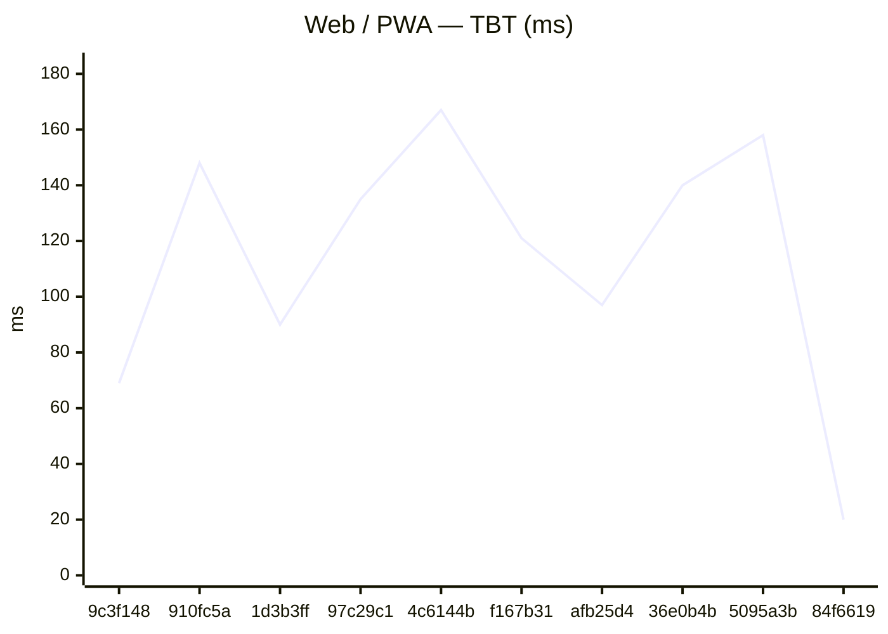
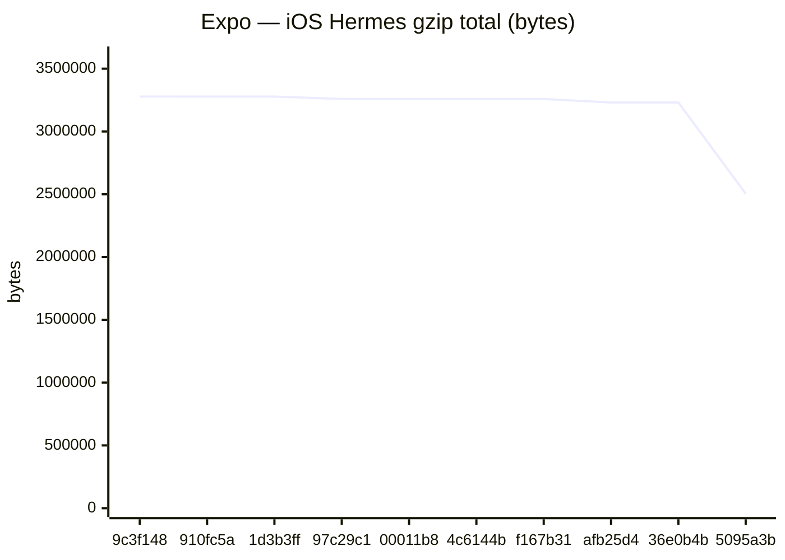
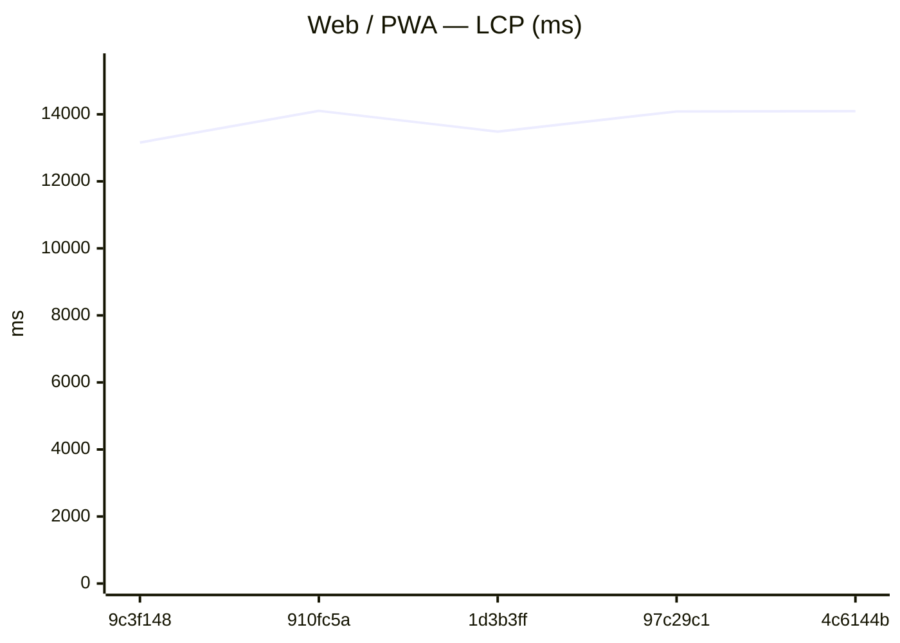
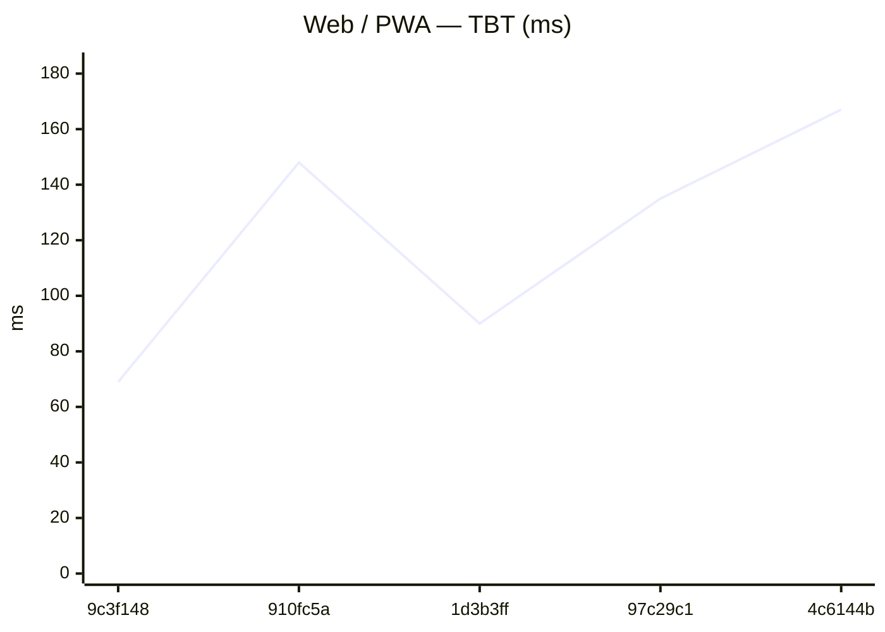
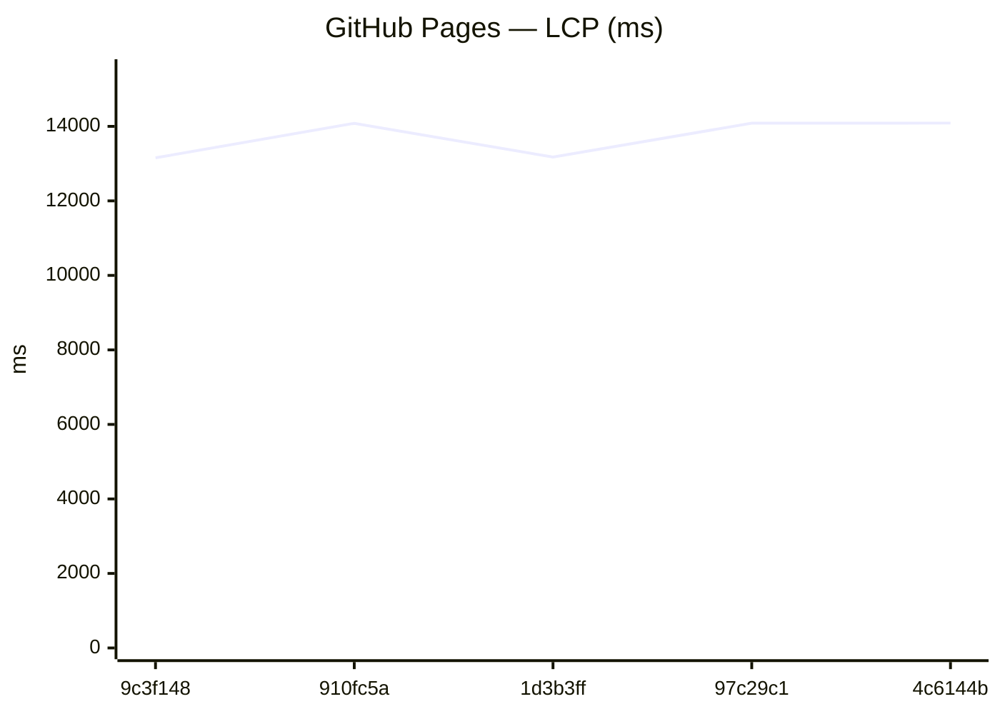
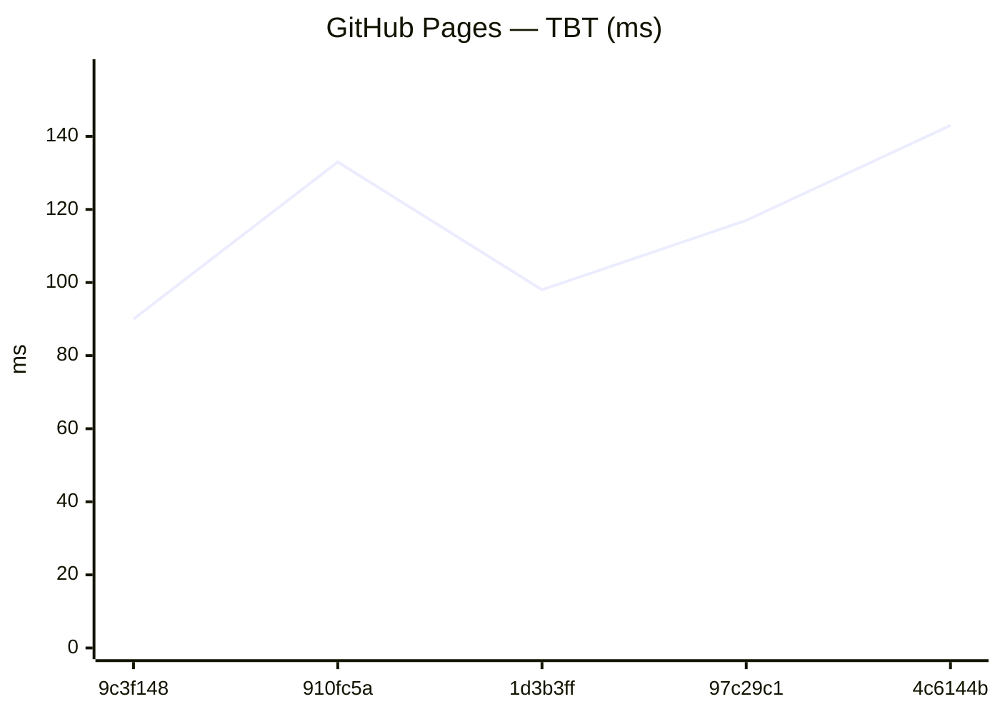
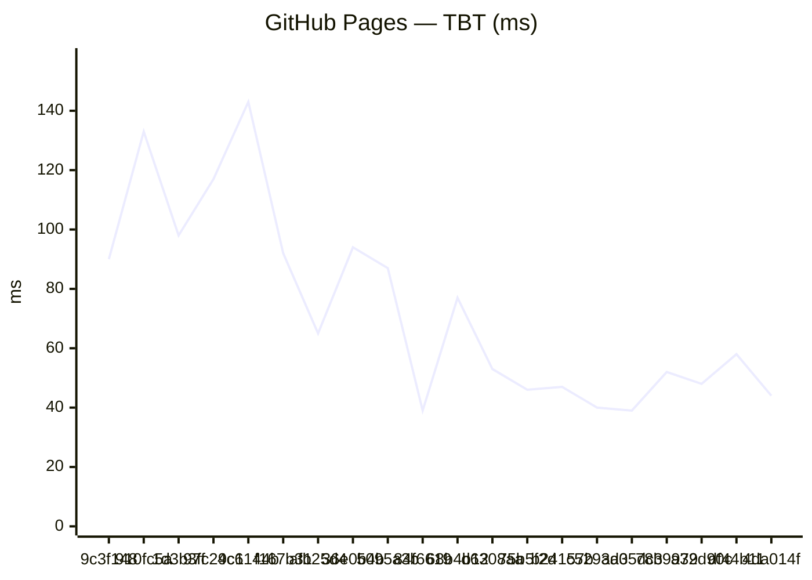
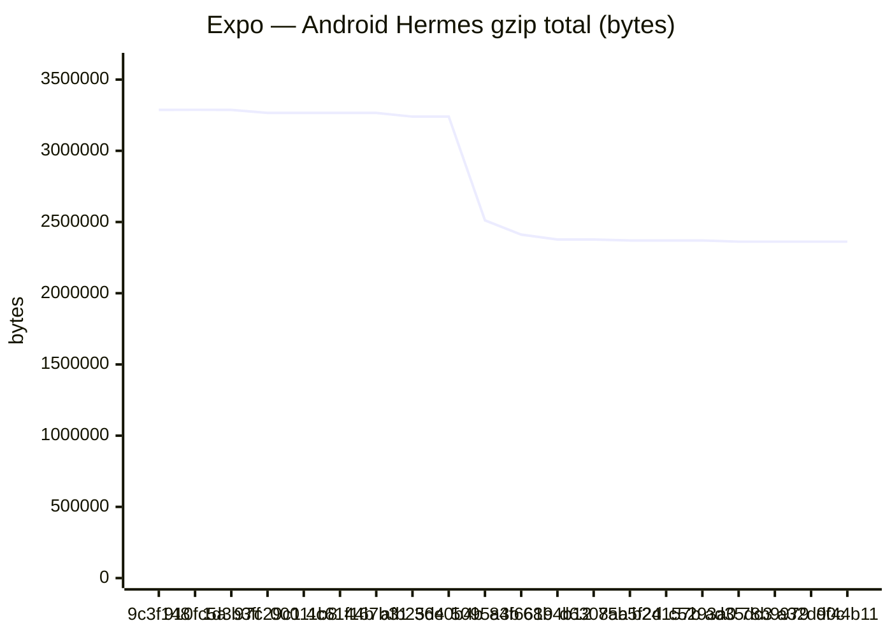

# Benchmark comparison (history)

Generated at **2026-06-15T22:29:09.243Z**.

To change the default number of runs in the primary sections below, edit **[compare.config.json](./compare.config.json)** (`window`). GitHub does not support interactive dropdowns in Markdown; optional **collapsed sections** list alternate window sizes.

---

### Web / PWA

| date | sha | status | LCP_ms | FCP_ms | TBT_ms | run |
| --- | --- | --- | --- | --- | --- | --- |
| 2026-06-15 22:27:10 | 9c3f148 | ok | 13157 | 9703 | 69 | 27580413350 |
| 2026-06-15 22:12:56 | 910fc5a | ok | 14103 | 9955 | 148 | 27579705192 |
| 2026-06-15 21:57:35 | 1d3b3ff | ok | 13484 | 9879 | 90 | 27578918030 |
| 2026-06-15 20:06:07 | 97c29c1 | ok | 14084 | 10132 | 135 | 27572035531 |
| 2026-06-15 19:42:51 | 4c6144b | ok | 14094 | 10816 | 167 | 27571371864 |
| 2026-06-15 19:30:21 | f167b31 | ok | 13501 | 9896 | 121 | 27570907674 |
| 2026-06-14 08:25:21 | afb25d4 | ok | 13531 | 9214 | 97 | 27493118482 |
| 2026-06-14 08:07:54 | 36e0b4b | ok | 13563 | 8738 | 140 | 27492730321 |
| 2026-06-14 01:01:58 | 5095a3b | ok | 13394 | 8646 | 158 | 27484132166 |
| 2026-06-13 16:55:37 | 84f6619 | ok | 12124 | 8314 | 20 | 27473022439 |

### GitHub Pages

| date | sha | status | LCP_ms | FCP_ms | TBT_ms | run |
| --- | --- | --- | --- | --- | --- | --- |
| 2026-06-15 22:27:32 | 9c3f148 | ok | 13156 | 9704 | 90 | 27580413350 |
| 2026-06-15 22:13:18 | 910fc5a | ok | 14081 | 10479 | 133 | 27579705192 |
| 2026-06-15 21:57:58 | 1d3b3ff | ok | 13177 | 9724 | 98 | 27578918030 |
| 2026-06-15 20:06:30 | 97c29c1 | ok | 14085 | 10479 | 117 | 27572035531 |
| 2026-06-15 19:43:14 | 4c6144b | ok | 14088 | 10492 | 143 | 27571371864 |
| 2026-06-15 19:30:44 | f167b31 | ok | 13032 | 9598 | 92 | 27570907674 |
| 2026-06-14 08:25:47 | afb25d4 | ok | 13521 | 8708 | 65 | 27493118482 |
| 2026-06-14 08:08:20 | 36e0b4b | ok | 13383 | 8717 | 94 | 27492730321 |
| 2026-06-14 01:02:24 | 5095a3b | ok | 13388 | 8713 | 87 | 27484132166 |
| 2026-06-13 16:56:01 | 84f6619 | ok | 12127 | 8168 | 39 | 27473022439 |

### Capacitor (legacy)
_No history yet._

### Expo / RN bundles

Aggregates: **sum of gzip bytes** across all `.hbc` files per platform (stable for trends when chunk hashes change).

| date | sha | status | android_gzip | ios_gzip | run |
| --- | --- | --- | --- | --- | --- |
| 2026-06-15 22:28:41 | 9c3f148 | ok | 3287424 | 3278199 | 27580413350 |
| 2026-06-15 22:13:34 | 910fc5a | ok | 3287869 | 3277688 | 27579705192 |
| 2026-06-15 21:58:45 | 1d3b3ff | ok | 3287424 | 3278198 | 27578918030 |
| 2026-06-15 20:07:14 | 97c29c1 | ok | 3266092 | 3258272 | 27572035531 |
| 2026-06-15 19:50:15 | 00011b8 | ok | 3266094 | 3258276 | 27571805119 |
| 2026-06-15 19:43:38 | 4c6144b | ok | 3266092 | 3258273 | 27571371864 |
| 2026-06-15 19:32:03 | f167b31 | ok | 3266093 | 3258270 | 27570907674 |
| 2026-06-14 08:26:02 | afb25d4 | ok | 3239886 | 3230867 | 27493118482 |
| 2026-06-14 08:08:52 | 36e0b4b | ok | 3240548 | 3230712 | 27492730321 |
| 2026-06-14 01:03:17 | 5095a3b | ok | 2511667 | 2504401 | 27484132166 |

Last <strong>5</strong> runs (all platforms)

### Web / PWA

| date | sha | status | LCP_ms | FCP_ms | TBT_ms | run |
| --- | --- | --- | --- | --- | --- | --- |
| 2026-06-15 22:27:10 | 9c3f148 | ok | 13157 | 9703 | 69 | 27580413350 |
| 2026-06-15 22:12:56 | 910fc5a | ok | 14103 | 9955 | 148 | 27579705192 |
| 2026-06-15 21:57:35 | 1d3b3ff | ok | 13484 | 9879 | 90 | 27578918030 |
| 2026-06-15 20:06:07 | 97c29c1 | ok | 14084 | 10132 | 135 | 27572035531 |
| 2026-06-15 19:42:51 | 4c6144b | ok | 14094 | 10816 | 167 | 27571371864 |

### GitHub Pages

| date | sha | status | LCP_ms | FCP_ms | TBT_ms | run |
| --- | --- | --- | --- | --- | --- | --- |
| 2026-06-15 22:27:32 | 9c3f148 | ok | 13156 | 9704 | 90 | 27580413350 |
| 2026-06-15 22:13:18 | 910fc5a | ok | 14081 | 10479 | 133 | 27579705192 |
| 2026-06-15 21:57:58 | 1d3b3ff | ok | 13177 | 9724 | 98 | 27578918030 |
| 2026-06-15 20:06:30 | 97c29c1 | ok | 14085 | 10479 | 117 | 27572035531 |
| 2026-06-15 19:43:14 | 4c6144b | ok | 14088 | 10492 | 143 | 27571371864 |

### Capacitor (legacy)
_No history yet._

### Expo / RN bundles

Aggregates: **sum of gzip bytes** across all `.hbc` files per platform (stable for trends when chunk hashes change).

| date | sha | status | android_gzip | ios_gzip | run |
| --- | --- | --- | --- | --- | --- |
| 2026-06-15 22:28:41 | 9c3f148 | ok | 3287424 | 3278199 | 27580413350 |
| 2026-06-15 22:13:34 | 910fc5a | ok | 3287869 | 3277688 | 27579705192 |
| 2026-06-15 21:58:45 | 1d3b3ff | ok | 3287424 | 3278198 | 27578918030 |
| 2026-06-15 20:07:14 | 97c29c1 | ok | 3266092 | 3258272 | 27572035531 |
| 2026-06-15 19:50:15 | 00011b8 | ok | 3266094 | 3258276 | 27571805119 |

Last <strong>20</strong> runs (all platforms)

### Web / PWA

| date | sha | status | LCP_ms | FCP_ms | TBT_ms | run |
| --- | --- | --- | --- | --- | --- | --- |
| 2026-06-15 22:27:10 | 9c3f148 | ok | 13157 | 9703 | 69 | 27580413350 |
| 2026-06-15 22:12:56 | 910fc5a | ok | 14103 | 9955 | 148 | 27579705192 |
| 2026-06-15 21:57:35 | 1d3b3ff | ok | 13484 | 9879 | 90 | 27578918030 |
| 2026-06-15 20:06:07 | 97c29c1 | ok | 14084 | 10132 | 135 | 27572035531 |
| 2026-06-15 19:42:51 | 4c6144b | ok | 14094 | 10816 | 167 | 27571371864 |
| 2026-06-15 19:30:21 | f167b31 | ok | 13501 | 9896 | 121 | 27570907674 |
| 2026-06-14 08:25:21 | afb25d4 | ok | 13531 | 9214 | 97 | 27493118482 |
| 2026-06-14 08:07:54 | 36e0b4b | ok | 13563 | 8738 | 140 | 27492730321 |
| 2026-06-14 01:01:58 | 5095a3b | ok | 13394 | 8646 | 158 | 27484132166 |
| 2026-06-13 16:55:37 | 84f6619 | ok | 12124 | 8314 | 20 | 27473022439 |
| 2026-06-13 11:09:28 | 68b4b12 | ok | 12007 | 8334 | 54 | 27465001801 |
| 2026-06-13 10:46:59 | d6308aa | ok | 12072 | 8348 | 110 | 27464520051 |
| 2026-06-12 19:00:16 | 75b5f2d | ok | 11911 | 7881 | 55 | 27436558960 |
| 2026-06-12 18:34:20 | b24157b | ok | 11695 | 8030 | 38 | 27435038702 |
| 2026-06-12 18:17:41 | c5293a0 | ok | 11707 | 8115 | 48 | 27434368650 |
| 2026-06-12 17:13:29 | ad35dc3 | ok | 11844 | 10268 | 41 | 27430856806 |
| 2026-06-12 16:57:26 | 78b9979 | ok | 11862 | 10360 | 58 | 27430191956 |
| 2026-06-12 15:56:06 | a32d90c | ok | 11845 | 10276 | 47 | 27426915206 |
| 2026-06-12 04:40:18 | df44b11 | ok | 11860 | 10272 | 57 | 27394811733 |
| 2026-04-12 11:41:04 | 4da014f | ok | 11572 | 10144 | 68 | 24305848610 |

### GitHub Pages

| date | sha | status | LCP_ms | FCP_ms | TBT_ms | run |
| --- | --- | --- | --- | --- | --- | --- |
| 2026-06-15 22:27:32 | 9c3f148 | ok | 13156 | 9704 | 90 | 27580413350 |
| 2026-06-15 22:13:18 | 910fc5a | ok | 14081 | 10479 | 133 | 27579705192 |
| 2026-06-15 21:57:58 | 1d3b3ff | ok | 13177 | 9724 | 98 | 27578918030 |
| 2026-06-15 20:06:30 | 97c29c1 | ok | 14085 | 10479 | 117 | 27572035531 |
| 2026-06-15 19:43:14 | 4c6144b | ok | 14088 | 10492 | 143 | 27571371864 |
| 2026-06-15 19:30:44 | f167b31 | ok | 13032 | 9598 | 92 | 27570907674 |
| 2026-06-14 08:25:47 | afb25d4 | ok | 13521 | 8708 | 65 | 27493118482 |
| 2026-06-14 08:08:20 | 36e0b4b | ok | 13383 | 8717 | 94 | 27492730321 |
| 2026-06-14 01:02:24 | 5095a3b | ok | 13388 | 8713 | 87 | 27484132166 |
| 2026-06-13 16:56:01 | 84f6619 | ok | 12127 | 8168 | 39 | 27473022439 |
| 2026-06-13 11:09:53 | 68b4b12 | ok | 12028 | 8175 | 77 | 27465001801 |
| 2026-06-13 10:47:24 | d6308aa | ok | 11904 | 8339 | 53 | 27464520051 |
| 2026-06-12 19:00:41 | 75b5f2d | ok | 11863 | 7882 | 46 | 27436558960 |
| 2026-06-12 18:34:45 | b24157b | ok | 11768 | 7903 | 47 | 27435038702 |
| 2026-06-12 18:18:06 | c5293a0 | ok | 11742 | 8022 | 40 | 27434368650 |
| 2026-06-12 17:13:54 | ad35dc3 | ok | 11838 | 10286 | 39 | 27430856806 |
| 2026-06-12 16:57:52 | 78b9979 | ok | 11855 | 10284 | 52 | 27430191956 |
| 2026-06-12 15:56:31 | a32d90c | ok | 11852 | 10279 | 48 | 27426915206 |
| 2026-06-12 04:40:44 | df44b11 | ok | 11847 | 10270 | 58 | 27394811733 |
| 2026-04-12 11:41:32 | 4da014f | ok | 11548 | 10124 | 44 | 24305848610 |

### Capacitor (legacy)
_No history yet._

### Expo / RN bundles

Aggregates: **sum of gzip bytes** across all `.hbc` files per platform (stable for trends when chunk hashes change).

| date | sha | status | android_gzip | ios_gzip | run |
| --- | --- | --- | --- | --- | --- |
| 2026-06-15 22:28:41 | 9c3f148 | ok | 3287424 | 3278199 | 27580413350 |
| 2026-06-15 22:13:34 | 910fc5a | ok | 3287869 | 3277688 | 27579705192 |
| 2026-06-15 21:58:45 | 1d3b3ff | ok | 3287424 | 3278198 | 27578918030 |
| 2026-06-15 20:07:14 | 97c29c1 | ok | 3266092 | 3258272 | 27572035531 |
| 2026-06-15 19:50:15 | 00011b8 | ok | 3266094 | 3258276 | 27571805119 |
| 2026-06-15 19:43:38 | 4c6144b | ok | 3266092 | 3258273 | 27571371864 |
| 2026-06-15 19:32:03 | f167b31 | ok | 3266093 | 3258270 | 27570907674 |
| 2026-06-14 08:26:02 | afb25d4 | ok | 3239886 | 3230867 | 27493118482 |
| 2026-06-14 08:08:52 | 36e0b4b | ok | 3240548 | 3230712 | 27492730321 |
| 2026-06-14 01:03:17 | 5095a3b | ok | 2511667 | 2504401 | 27484132166 |
| 2026-06-13 16:56:41 | 84f6619 | ok | 2411913 | 2405024 | 27473022439 |
| 2026-06-13 11:09:53 | 68b4b12 | ok | 2377489 | 2370491 | 27465001801 |
| 2026-06-13 10:47:46 | d6308aa | ok | 2377488 | 2370493 | 27464520051 |
| 2026-06-12 19:00:37 | 75b5f2d | ok | 2370632 | 2363429 | 27436558960 |
| 2026-06-12 18:34:50 | b24157b | ok | 2370632 | 2363431 | 27435038702 |
| 2026-06-12 18:18:19 | c5293a0 | ok | 2370634 | 2363430 | 27434368650 |
| 2026-06-12 17:14:12 | ad35dc3 | ok | 2362082 | 2356086 | 27430856806 |
| 2026-06-12 16:58:10 | 78b9979 | ok | 2362084 | 2356086 | 27430191956 |
| 2026-06-12 15:56:51 | a32d90c | ok | 2362047 | 2356058 | 27426915206 |
| 2026-06-12 04:40:23 | df44b11 | ok | 2362047 | 2356058 | 27394811733 |

