# Benchmark comparison (history)

Generated at **2026-06-28T20:04:02.141Z**.

To change the default number of runs in the primary sections below, edit **[compare.config.json](./compare.config.json)** (`window`). GitHub does not support interactive dropdowns in Markdown; optional **collapsed sections** list alternate window sizes.

---

### Web / PWA

| date | sha | status | LCP_ms | FCP_ms | TBT_ms | run |
| --- | --- | --- | --- | --- | --- | --- |
| 2026-06-28 20:02:16 | 7cc0f37 | ok | 19542 | 12060 | 443 | 28334230906 |
| 2026-06-28 17:38:37 | 4a71141 | ok | 18663 | 12057 | 333 | 28330439364 |
| 2026-06-28 16:41:40 | e3e901b | ok | 19248 | 11952 | 395 | 28328938834 |
| 2026-06-28 15:41:13 | 58e1088 | ok | 22351 | 11920 | 399 | 28327306068 |
| 2026-06-28 15:05:02 | c45239d | ok | 22326 | 12229 | 436 | 28326313095 |
| 2026-06-28 14:31:15 | d6a3c0b | ok | 22357 | 11927 | 479 | 28325382372 |
| 2026-06-27 18:07:05 | 00d3c19 | ok | 22240 | 11926 | 495 | 28297397124 |
| 2026-06-27 15:31:41 | c83d9d8 | ok | 22209 | 11773 | 507 | 28293517490 |
| 2026-06-27 13:36:36 | d22897f | ok | 21878 | 11551 | 475 | 28290750514 |
| 2026-06-27 12:54:46 | 3e44105 | ok | 21870 | 11590 | 500 | 28289763851 |

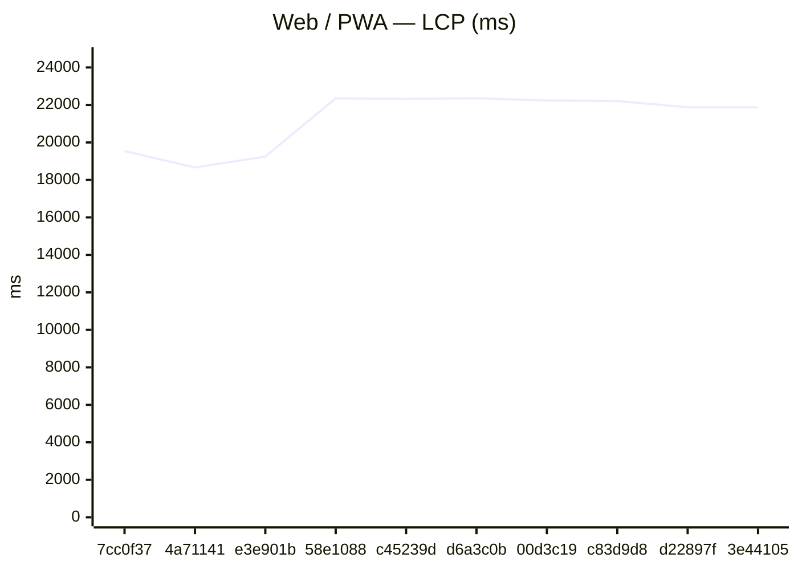
```mermaid
xychart-beta
    title "Web / PWA — LCP (ms)"
    x-axis ["7cc0f37", "4a71141", "e3e901b", "58e1088", "c45239d", "d6a3c0b", "00d3c19", "c83d9d8", "d22897f", "3e44105"]
    y-axis "ms" 0 --> 24593
    line [19542, 18663, 19248, 22351, 22326, 22357, 22240, 22209, 21878, 21870]
```
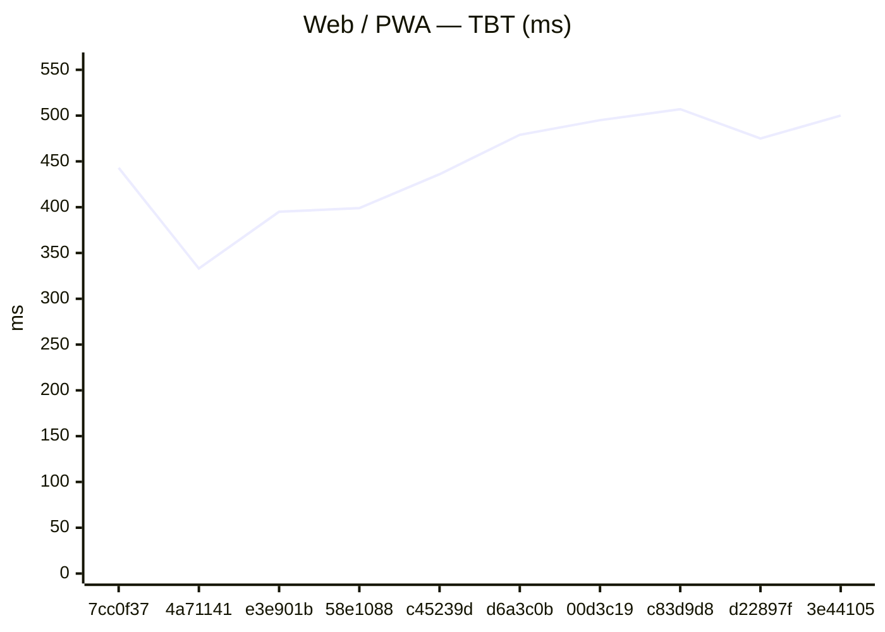
```mermaid
xychart-beta
    title "Web / PWA — TBT (ms)"
    x-axis ["7cc0f37", "4a71141", "e3e901b", "58e1088", "c45239d", "d6a3c0b", "00d3c19", "c83d9d8", "d22897f", "3e44105"]
    y-axis "ms" 0 --> 558
    line [443, 333, 395, 399, 436, 479, 495, 507, 475, 500]
```

### GitHub Pages

| date | sha | status | LCP_ms | FCP_ms | TBT_ms | run |
| --- | --- | --- | --- | --- | --- | --- |
| 2026-06-28 20:02:47 | 7cc0f37 | ok | 18936 | 12038 | 353 | 28334230906 |
| 2026-06-28 17:39:08 | 4a71141 | ok | 18660 | 12056 | 352 | 28330439364 |
| 2026-06-28 16:42:11 | e3e901b | ok | 18674 | 6619 | 362 | 28328938834 |
| 2026-06-28 15:41:44 | 58e1088 | ok | 22391 | 6611 | 396 | 28327306068 |
| 2026-06-28 15:05:32 | c45239d | ok | 22250 | 6539 | 377 | 28326313095 |
| 2026-06-28 14:31:47 | d6a3c0b | ok | 22344 | 11820 | 497 | 28325382372 |
| 2026-06-27 18:07:36 | 00d3c19 | ok | 22178 | 6537 | 391 | 28297397124 |
| 2026-06-27 15:32:12 | c83d9d8 | ok | 22170 | 11761 | 363 | 28293517490 |
| 2026-06-27 13:37:06 | d22897f | ok | 21853 | 11594 | 343 | 28290750514 |
| 2026-06-27 12:55:17 | 3e44105 | ok | 21828 | 11589 | 359 | 28289763851 |

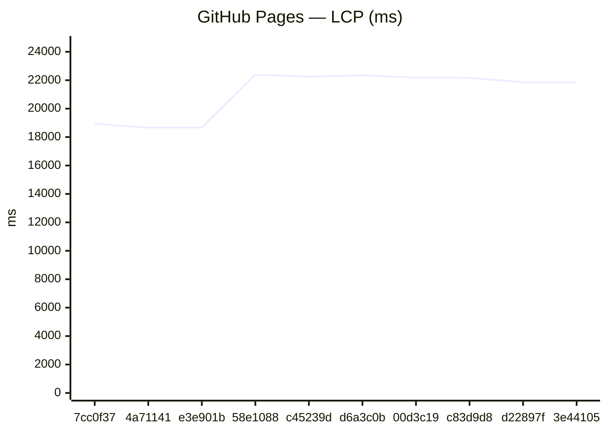
```mermaid
xychart-beta
    title "GitHub Pages — LCP (ms)"
    x-axis ["7cc0f37", "4a71141", "e3e901b", "58e1088", "c45239d", "d6a3c0b", "00d3c19", "c83d9d8", "d22897f", "3e44105"]
    y-axis "ms" 0 --> 24631
    line [18936, 18660, 18674, 22391, 22250, 22344, 22178, 22170, 21853, 21828]
```
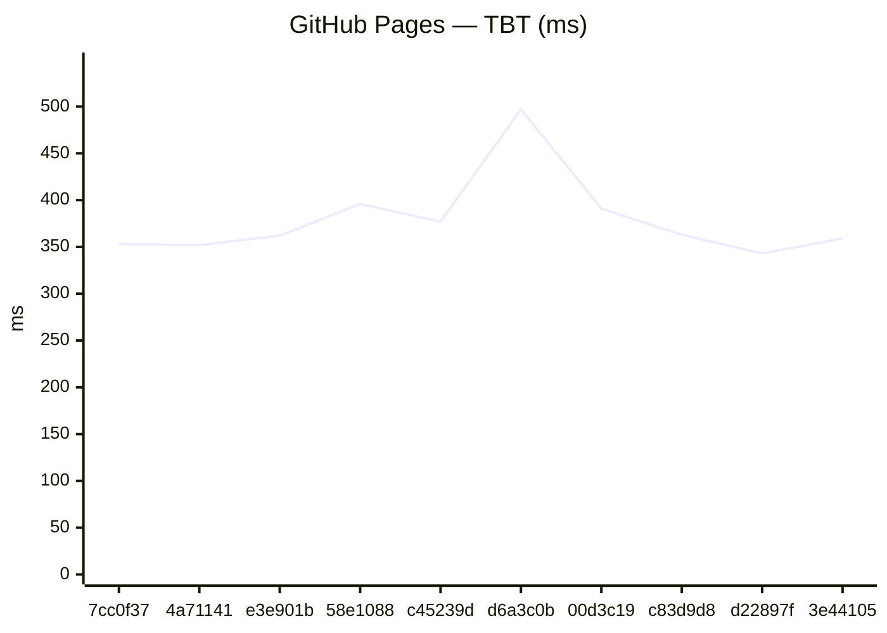
```mermaid
xychart-beta
    title "GitHub Pages — TBT (ms)"
    x-axis ["7cc0f37", "4a71141", "e3e901b", "58e1088", "c45239d", "d6a3c0b", "00d3c19", "c83d9d8", "d22897f", "3e44105"]
    y-axis "ms" 0 --> 547
    line [353, 352, 362, 396, 377, 497, 391, 363, 343, 359]
```

### Capacitor (legacy)
_No history yet._

### Expo / RN bundles

Aggregates: **sum of gzip bytes** across all `.hbc` files per platform (stable for trends when chunk hashes change).

| date | sha | status | android_gzip | ios_gzip | run |
| --- | --- | --- | --- | --- | --- |
| 2026-06-28 20:03:43 | 7cc0f37 | ok | 4049448 | 4042958 | 28334230906 |
| 2026-06-28 17:40:53 | 4a71141 | ok | 4046554 | 4039809 | 28330439364 |
| 2026-06-28 16:43:08 | e3e901b | ok | 4048091 | 4039179 | 28328938834 |
| 2026-06-28 15:42:46 | 58e1088 | ok | 4030638 | 4023650 | 28327306068 |
| 2026-06-28 15:06:50 | c45239d | ok | 4030634 | 4023650 | 28326313095 |
| 2026-06-28 14:32:53 | d6a3c0b | ok | 4030639 | 4023645 | 28325382372 |
| 2026-06-27 18:08:44 | 00d3c19 | ok | 4025609 | 4024761 | 28297397124 |
| 2026-06-27 15:33:40 | c83d9d8 | ok | 4026084 | 4017281 | 28293517490 |
| 2026-06-27 13:38:42 | d22897f | ok | 4023969 | 4017565 | 28290750514 |
| 2026-06-27 12:56:25 | 3e44105 | ok | 4020690 | 4012063 | 28289763851 |

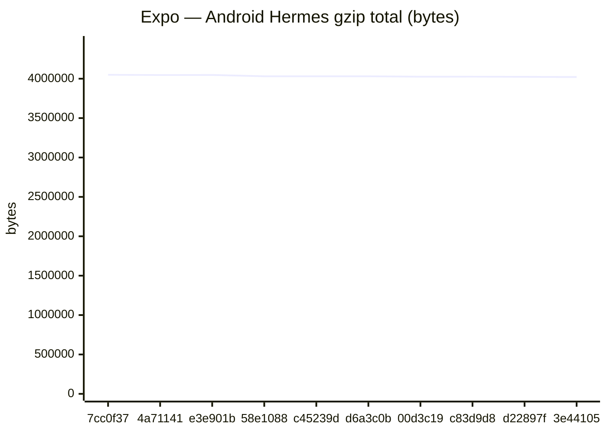
```mermaid
xychart-beta
    title "Expo — Android Hermes gzip total (bytes)"
    x-axis ["7cc0f37", "4a71141", "e3e901b", "58e1088", "c45239d", "d6a3c0b", "00d3c19", "c83d9d8", "d22897f", "3e44105"]
    y-axis "bytes" 0 --> 4454393
    line [4049448, 4046554, 4048091, 4030638, 4030634, 4030639, 4025609, 4026084, 4023969, 4020690]
```
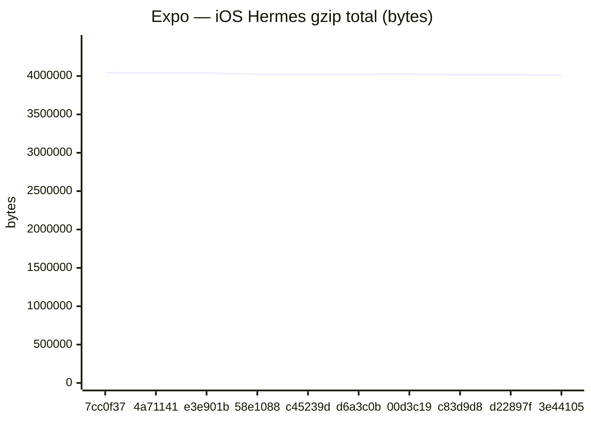
```mermaid
xychart-beta
    title "Expo — iOS Hermes gzip total (bytes)"
    x-axis ["7cc0f37", "4a71141", "e3e901b", "58e1088", "c45239d", "d6a3c0b", "00d3c19", "c83d9d8", "d22897f", "3e44105"]
    y-axis "bytes" 0 --> 4447254
    line [4042958, 4039809, 4039179, 4023650, 4023650, 4023645, 4024761, 4017281, 4017565, 4012063]
```

Last <strong>5</strong> runs (all platforms)

### Web / PWA

| date | sha | status | LCP_ms | FCP_ms | TBT_ms | run |
| --- | --- | --- | --- | --- | --- | --- |
| 2026-06-28 20:02:16 | 7cc0f37 | ok | 19542 | 12060 | 443 | 28334230906 |
| 2026-06-28 17:38:37 | 4a71141 | ok | 18663 | 12057 | 333 | 28330439364 |
| 2026-06-28 16:41:40 | e3e901b | ok | 19248 | 11952 | 395 | 28328938834 |
| 2026-06-28 15:41:13 | 58e1088 | ok | 22351 | 11920 | 399 | 28327306068 |
| 2026-06-28 15:05:02 | c45239d | ok | 22326 | 12229 | 436 | 28326313095 |

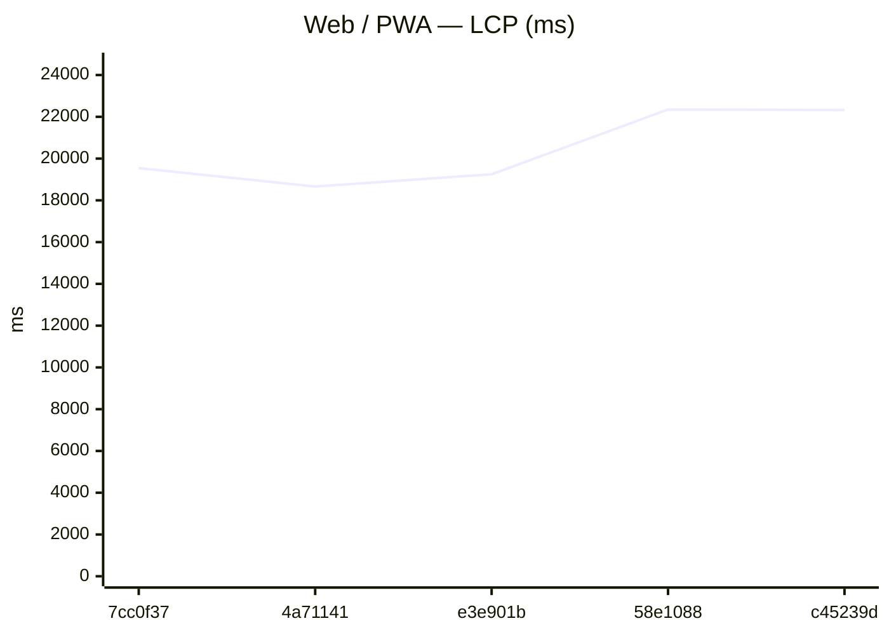
```mermaid
xychart-beta
    title "Web / PWA — LCP (ms)"
    x-axis ["7cc0f37", "4a71141", "e3e901b", "58e1088", "c45239d"]
    y-axis "ms" 0 --> 24587
    line [19542, 18663, 19248, 22351, 22326]
```
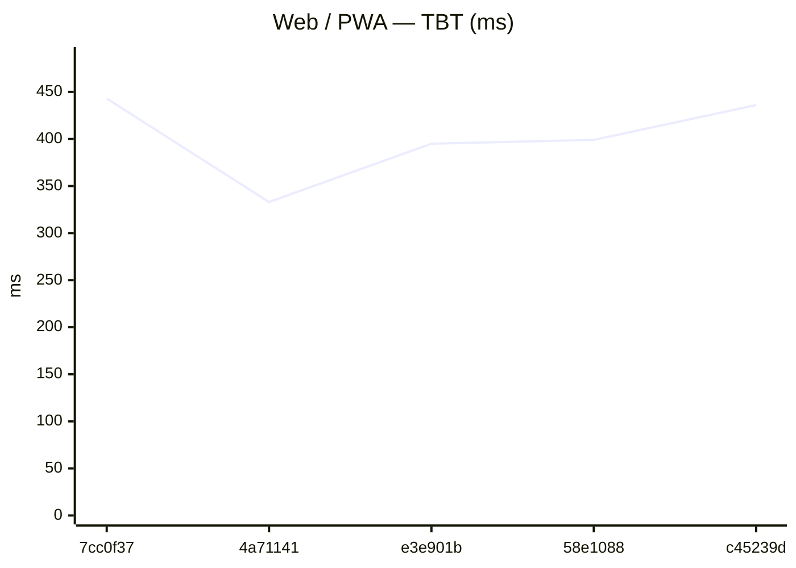
```mermaid
xychart-beta
    title "Web / PWA — TBT (ms)"
    x-axis ["7cc0f37", "4a71141", "e3e901b", "58e1088", "c45239d"]
    y-axis "ms" 0 --> 488
    line [443, 333, 395, 399, 436]
```

### GitHub Pages

| date | sha | status | LCP_ms | FCP_ms | TBT_ms | run |
| --- | --- | --- | --- | --- | --- | --- |
| 2026-06-28 20:02:47 | 7cc0f37 | ok | 18936 | 12038 | 353 | 28334230906 |
| 2026-06-28 17:39:08 | 4a71141 | ok | 18660 | 12056 | 352 | 28330439364 |
| 2026-06-28 16:42:11 | e3e901b | ok | 18674 | 6619 | 362 | 28328938834 |
| 2026-06-28 15:41:44 | 58e1088 | ok | 22391 | 6611 | 396 | 28327306068 |
| 2026-06-28 15:05:32 | c45239d | ok | 22250 | 6539 | 377 | 28326313095 |

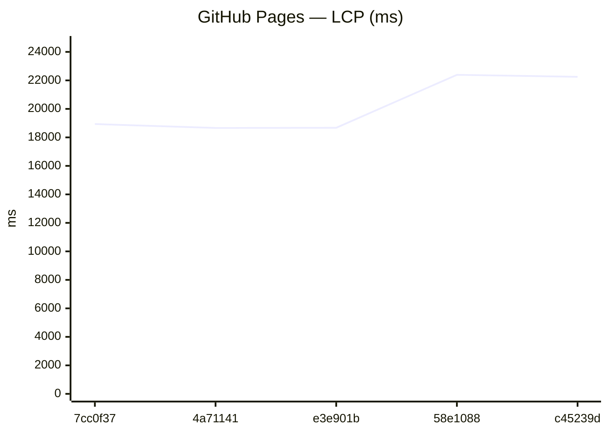
```mermaid
xychart-beta
    title "GitHub Pages — LCP (ms)"
    x-axis ["7cc0f37", "4a71141", "e3e901b", "58e1088", "c45239d"]
    y-axis "ms" 0 --> 24631
    line [18936, 18660, 18674, 22391, 22250]
```
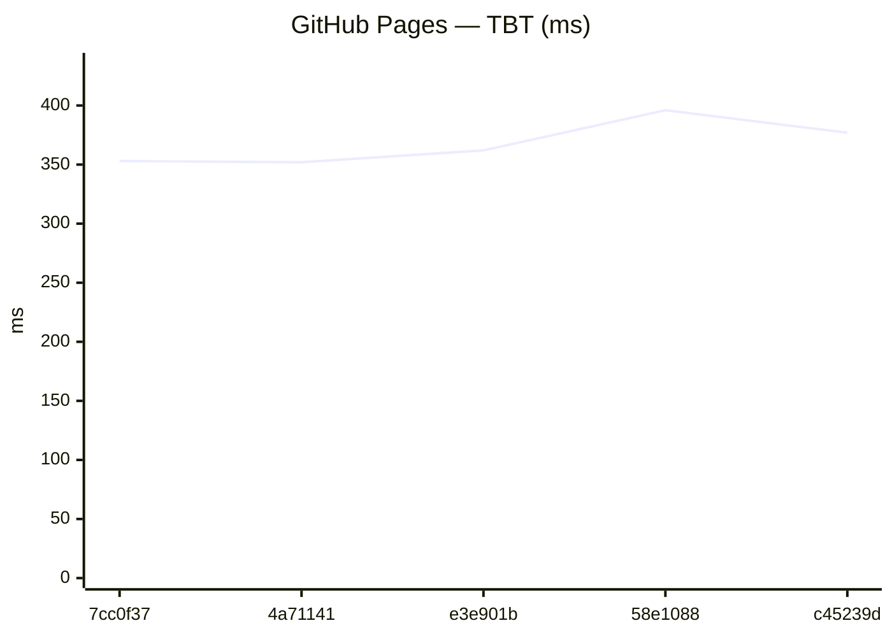
```mermaid
xychart-beta
    title "GitHub Pages — TBT (ms)"
    x-axis ["7cc0f37", "4a71141", "e3e901b", "58e1088", "c45239d"]
    y-axis "ms" 0 --> 436
    line [353, 352, 362, 396, 377]
```

### Capacitor (legacy)
_No history yet._

### Expo / RN bundles

Aggregates: **sum of gzip bytes** across all `.hbc` files per platform (stable for trends when chunk hashes change).

| date | sha | status | android_gzip | ios_gzip | run |
| --- | --- | --- | --- | --- | --- |
| 2026-06-28 20:03:43 | 7cc0f37 | ok | 4049448 | 4042958 | 28334230906 |
| 2026-06-28 17:40:53 | 4a71141 | ok | 4046554 | 4039809 | 28330439364 |
| 2026-06-28 16:43:08 | e3e901b | ok | 4048091 | 4039179 | 28328938834 |
| 2026-06-28 15:42:46 | 58e1088 | ok | 4030638 | 4023650 | 28327306068 |
| 2026-06-28 15:06:50 | c45239d | ok | 4030634 | 4023650 | 28326313095 |

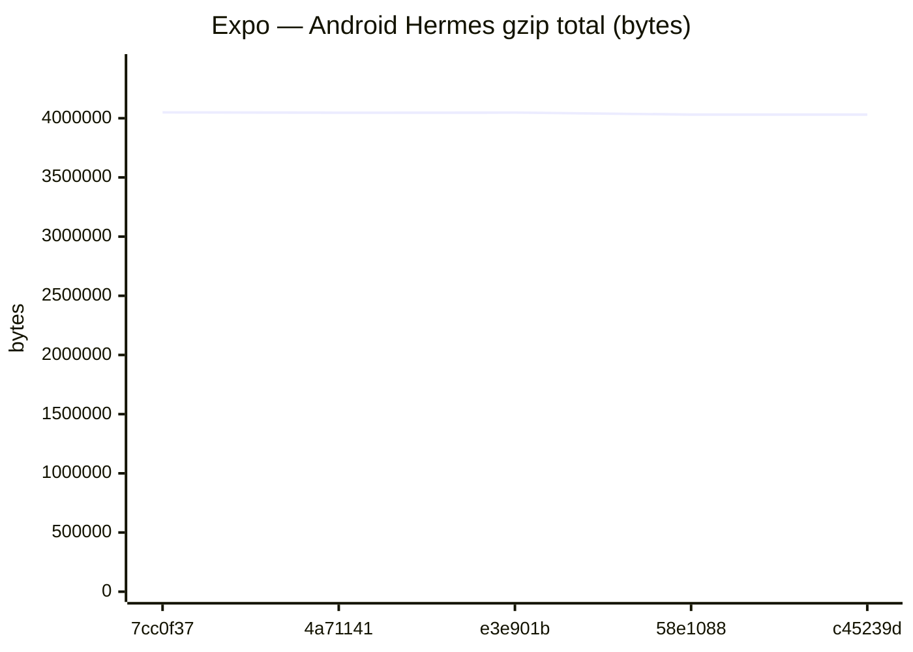
```mermaid
xychart-beta
    title "Expo — Android Hermes gzip total (bytes)"
    x-axis ["7cc0f37", "4a71141", "e3e901b", "58e1088", "c45239d"]
    y-axis "bytes" 0 --> 4454393
    line [4049448, 4046554, 4048091, 4030638, 4030634]
```

```mermaid
xychart-beta
    title "Expo — iOS Hermes gzip total (bytes)"
    x-axis ["7cc0f37", "4a71141", "e3e901b", "58e1088", "c45239d"]
    y-axis "bytes" 0 --> 4447254
    line [4042958, 4039809, 4039179, 4023650, 4023650]
```

Last <strong>20</strong> runs (all platforms)

### Web / PWA

| date | sha | status | LCP_ms | FCP_ms | TBT_ms | run |
| --- | --- | --- | --- | --- | --- | --- |
| 2026-06-28 20:02:16 | 7cc0f37 | ok | 19542 | 12060 | 443 | 28334230906 |
| 2026-06-28 17:38:37 | 4a71141 | ok | 18663 | 12057 | 333 | 28330439364 |
| 2026-06-28 16:41:40 | e3e901b | ok | 19248 | 11952 | 395 | 28328938834 |
| 2026-06-28 15:41:13 | 58e1088 | ok | 22351 | 11920 | 399 | 28327306068 |
| 2026-06-28 15:05:02 | c45239d | ok | 22326 | 12229 | 436 | 28326313095 |
| 2026-06-28 14:31:15 | d6a3c0b | ok | 22357 | 11927 | 479 | 28325382372 |
| 2026-06-27 18:07:05 | 00d3c19 | ok | 22240 | 11926 | 495 | 28297397124 |
| 2026-06-27 15:31:41 | c83d9d8 | ok | 22209 | 11773 | 507 | 28293517490 |
| 2026-06-27 13:36:36 | d22897f | ok | 21878 | 11551 | 475 | 28290750514 |
| 2026-06-27 12:54:46 | 3e44105 | ok | 21870 | 11590 | 500 | 28289763851 |
| 2026-06-27 10:37:09 | bde5d06 | ok | 21566 | 11301 | 372 | 28286667469 |
| 2026-06-27 02:32:55 | e18d728 | ok | 21132 | 11358 | 526 | 28275937069 |
| 2026-06-27 01:19:24 | 505b82a | ok | 20925 | 10986 | 362 | 28274160404 |
| 2026-06-26 23:08:38 | 5cb7766 | ok | 20504 | 10831 | 353 | 28269780345 |
| 2026-06-26 22:38:13 | d24306a | ok | 20549 | 10836 | 668 | 28269105853 |
| 2026-06-26 19:42:50 | 0694684 | ok | 20346 | 10695 | 351 | 28261145300 |
| 2026-06-26 19:06:08 | 63ff7b1 | ok | 20361 | 10684 | 328 | 28259311162 |
| 2026-06-26 18:46:14 | 68da6e1 | ok | 20380 | 10696 | 340 | 28258270019 |
| 2026-06-24 17:15:57 | a38f9aa | ok | 19099 | 9913 | 266 | 28116271372 |
| 2026-06-24 00:38:20 | d04511e | ok | 19257 | 9931 | 279 | 28066846770 |

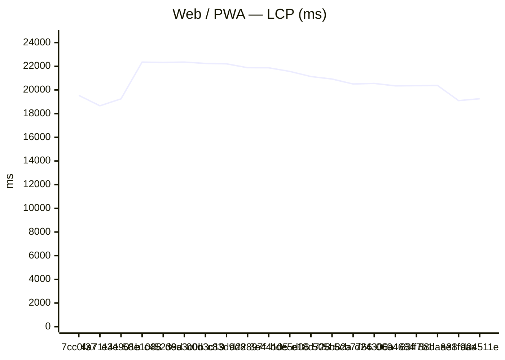
```mermaid
xychart-beta
    title "Web / PWA — LCP (ms)"
    x-axis ["7cc0f37", "4a71141", "e3e901b", "58e1088", "c45239d", "d6a3c0b", "00d3c19", "c83d9d8", "d22897f", "3e44105", "bde5d06", "e18d728", "505b82a", "5cb7766", "d24306a", "0694684", "63ff7b1", "68da6e1", "a38f9aa", "d04511e"]
    y-axis "ms" 0 --> 24593
    line [19542, 18663, 19248, 22351, 22326, 22357, 22240, 22209, 21878, 21870, 21566, 21132, 20925, 20504, 20549, 20346, 20361, 20380, 19099, 19257]
```
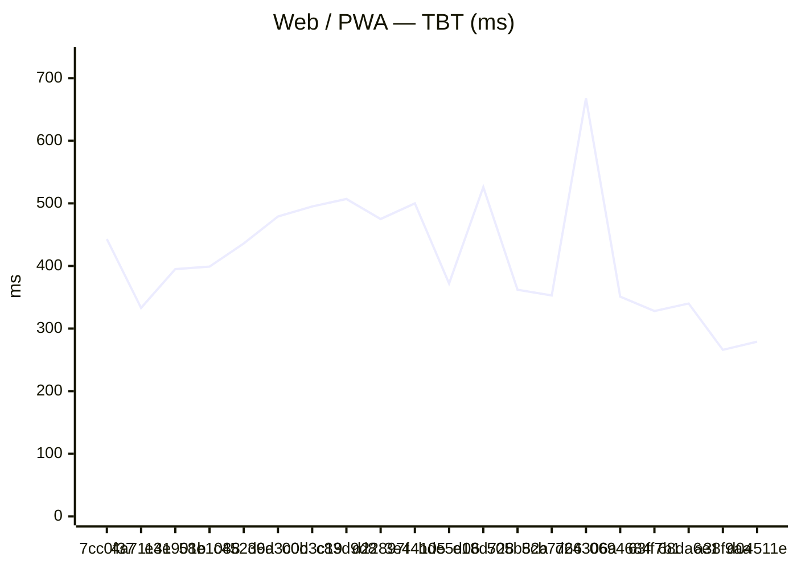
```mermaid
xychart-beta
    title "Web / PWA — TBT (ms)"
    x-axis ["7cc0f37", "4a71141", "e3e901b", "58e1088", "c45239d", "d6a3c0b", "00d3c19", "c83d9d8", "d22897f", "3e44105", "bde5d06", "e18d728", "505b82a", "5cb7766", "d24306a", "0694684", "63ff7b1", "68da6e1", "a38f9aa", "d04511e"]
    y-axis "ms" 0 --> 735
    line [443, 333, 395, 399, 436, 479, 495, 507, 475, 500, 372, 526, 362, 353, 668, 351, 328, 340, 266, 279]
```

### GitHub Pages

| date | sha | status | LCP_ms | FCP_ms | TBT_ms | run |
| --- | --- | --- | --- | --- | --- | --- |
| 2026-06-28 20:02:47 | 7cc0f37 | ok | 18936 | 12038 | 353 | 28334230906 |
| 2026-06-28 17:39:08 | 4a71141 | ok | 18660 | 12056 | 352 | 28330439364 |
| 2026-06-28 16:42:11 | e3e901b | ok | 18674 | 6619 | 362 | 28328938834 |
| 2026-06-28 15:41:44 | 58e1088 | ok | 22391 | 6611 | 396 | 28327306068 |
| 2026-06-28 15:05:32 | c45239d | ok | 22250 | 6539 | 377 | 28326313095 |
| 2026-06-28 14:31:47 | d6a3c0b | ok | 22344 | 11820 | 497 | 28325382372 |
| 2026-06-27 18:07:36 | 00d3c19 | ok | 22178 | 6537 | 391 | 28297397124 |
| 2026-06-27 15:32:12 | c83d9d8 | ok | 22170 | 11761 | 363 | 28293517490 |
| 2026-06-27 13:37:06 | d22897f | ok | 21853 | 11594 | 343 | 28290750514 |
| 2026-06-27 12:55:17 | 3e44105 | ok | 21828 | 11589 | 359 | 28289763851 |
| 2026-06-27 10:37:39 | bde5d06 | ok | 21442 | 11306 | 369 | 28286667469 |
| 2026-06-27 02:33:25 | e18d728 | ok | 21100 | 11129 | 319 | 28275937069 |
| 2026-06-27 01:19:52 | 505b82a | ok | 20773 | 10985 | 359 | 28274160404 |
| 2026-06-26 23:09:06 | 5cb7766 | ok | 20501 | 10678 | 328 | 28269780345 |
| 2026-06-26 22:38:41 | d24306a | ok | 20513 | 10696 | 369 | 28269105853 |
| 2026-06-26 19:43:19 | 0694684 | ok | 20406 | 10550 | 350 | 28261145300 |
| 2026-06-26 19:06:37 | 63ff7b1 | ok | 20374 | 10686 | 334 | 28259311162 |
| 2026-06-26 18:46:42 | 68da6e1 | ok | 20366 | 10565 | 356 | 28258270019 |
| 2026-06-24 17:16:24 | a38f9aa | ok | 19133 | 9917 | 281 | 28116271372 |
| 2026-06-24 00:38:48 | d04511e | ok | 19145 | 9748 | 283 | 28066846770 |

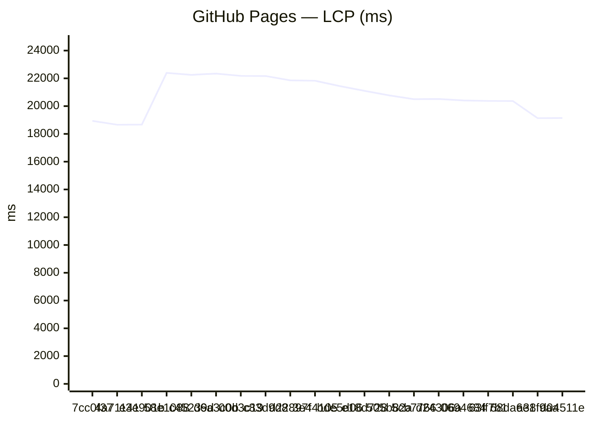
```mermaid
xychart-beta
    title "GitHub Pages — LCP (ms)"
    x-axis ["7cc0f37", "4a71141", "e3e901b", "58e1088", "c45239d", "d6a3c0b", "00d3c19", "c83d9d8", "d22897f", "3e44105", "bde5d06", "e18d728", "505b82a", "5cb7766", "d24306a", "0694684", "63ff7b1", "68da6e1", "a38f9aa", "d04511e"]
    y-axis "ms" 0 --> 24631
    line [18936, 18660, 18674, 22391, 22250, 22344, 22178, 22170, 21853, 21828, 21442, 21100, 20773, 20501, 20513, 20406, 20374, 20366, 19133, 19145]
```

```mermaid
xychart-beta
    title "GitHub Pages — TBT (ms)"
    x-axis ["7cc0f37", "4a71141", "e3e901b", "58e1088", "c45239d", "d6a3c0b", "00d3c19", "c83d9d8", "d22897f", "3e44105", "bde5d06", "e18d728", "505b82a", "5cb7766", "d24306a", "0694684", "63ff7b1", "68da6e1", "a38f9aa", "d04511e"]
    y-axis "ms" 0 --> 547
    line [353, 352, 362, 396, 377, 497, 391, 363, 343, 359, 369, 319, 359, 328, 369, 350, 334, 356, 281, 283]
```

### Capacitor (legacy)
_No history yet._

### Expo / RN bundles

Aggregates: **sum of gzip bytes** across all `.hbc` files per platform (stable for trends when chunk hashes change).

| date | sha | status | android_gzip | ios_gzip | run |
| --- | --- | --- | --- | --- | --- |
| 2026-06-28 20:03:43 | 7cc0f37 | ok | 4049448 | 4042958 | 28334230906 |
| 2026-06-28 17:40:53 | 4a71141 | ok | 4046554 | 4039809 | 28330439364 |
| 2026-06-28 16:43:08 | e3e901b | ok | 4048091 | 4039179 | 28328938834 |
| 2026-06-28 15:42:46 | 58e1088 | ok | 4030638 | 4023650 | 28327306068 |
| 2026-06-28 15:06:50 | c45239d | ok | 4030634 | 4023650 | 28326313095 |
| 2026-06-28 14:32:53 | d6a3c0b | ok | 4030639 | 4023645 | 28325382372 |
| 2026-06-27 18:08:44 | 00d3c19 | ok | 4025609 | 4024761 | 28297397124 |
| 2026-06-27 15:33:40 | c83d9d8 | ok | 4026084 | 4017281 | 28293517490 |
| 2026-06-27 13:38:42 | d22897f | ok | 4023969 | 4017565 | 28290750514 |
| 2026-06-27 12:56:25 | 3e44105 | ok | 4020690 | 4012063 | 28289763851 |
| 2026-06-27 10:39:00 | bde5d06 | ok | 4016661 | 4008470 | 28286667469 |
| 2026-06-27 02:34:47 | e18d728 | ok | 4010565 | 4002116 | 28275937069 |
| 2026-06-27 01:21:12 | 505b82a | ok | 3997221 | 3990384 | 28274160404 |
| 2026-06-26 23:10:35 | 5cb7766 | ok | 3982594 | 3978033 | 28269780345 |
| 2026-06-26 22:40:08 | d24306a | ok | 3982590 | 3978036 | 28269105853 |
| 2026-06-26 19:44:32 | 0694684 | ok | 3979178 | 3971946 | 28261145300 |
| 2026-06-26 19:07:42 | 63ff7b1 | ok | 3979178 | 3971945 | 28259311162 |
| 2026-06-26 18:47:52 | 68da6e1 | ok | 3979178 | 3971946 | 28258270019 |
| 2026-06-24 17:17:28 | a38f9aa | ok | 3858192 | 3849365 | 28116271372 |
| 2026-06-24 00:39:57 | d04511e | ok | 3858192 | 3849367 | 28066846770 |

```mermaid
xychart-beta
    title "Expo — Android Hermes gzip total (bytes)"
    x-axis ["7cc0f37", "4a71141", "e3e901b", "58e1088", "c45239d", "d6a3c0b", "00d3c19", "c83d9d8", "d22897f", "3e44105", "bde5d06", "e18d728", "505b82a", "5cb7766", "d24306a", "0694684", "63ff7b1", "68da6e1", "a38f9aa", "d04511e"]
    y-axis "bytes" 0 --> 4454393
    line [4049448, 4046554, 4048091, 4030638, 4030634, 4030639, 4025609, 4026084, 4023969, 4020690, 4016661, 4010565, 3997221, 3982594, 3982590, 3979178, 3979178, 3979178, 3858192, 3858192]
```
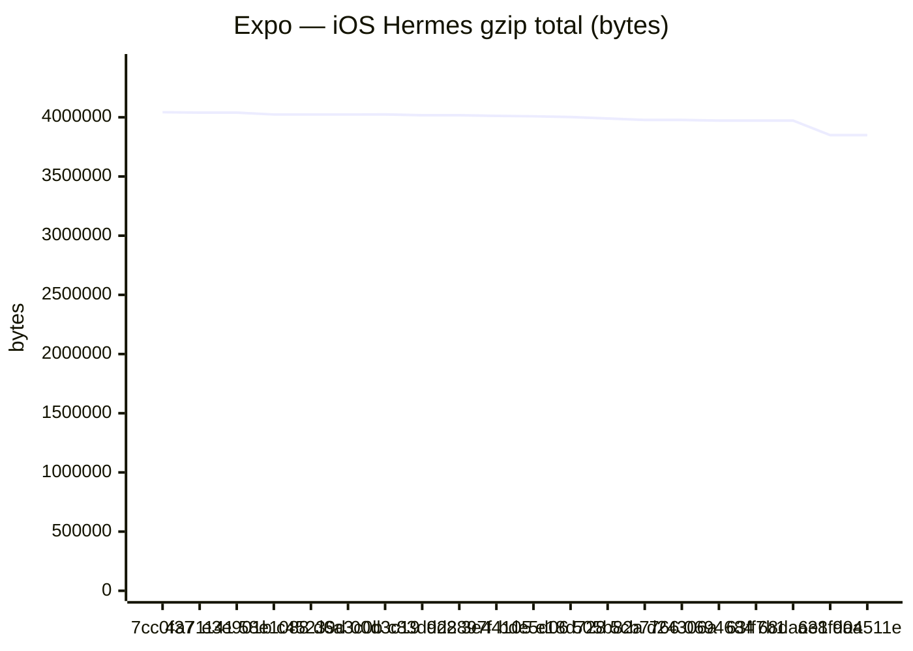
```mermaid
xychart-beta
    title "Expo — iOS Hermes gzip total (bytes)"
    x-axis ["7cc0f37", "4a71141", "e3e901b", "58e1088", "c45239d", "d6a3c0b", "00d3c19", "c83d9d8", "d22897f", "3e44105", "bde5d06", "e18d728", "505b82a", "5cb7766", "d24306a", "0694684", "63ff7b1", "68da6e1", "a38f9aa", "d04511e"]
    y-axis "bytes" 0 --> 4447254
    line [4042958, 4039809, 4039179, 4023650, 4023650, 4023645, 4024761, 4017281, 4017565, 4012063, 4008470, 4002116, 3990384, 3978033, 3978036, 3971946, 3971945, 3971946, 3849365, 3849367]
```

