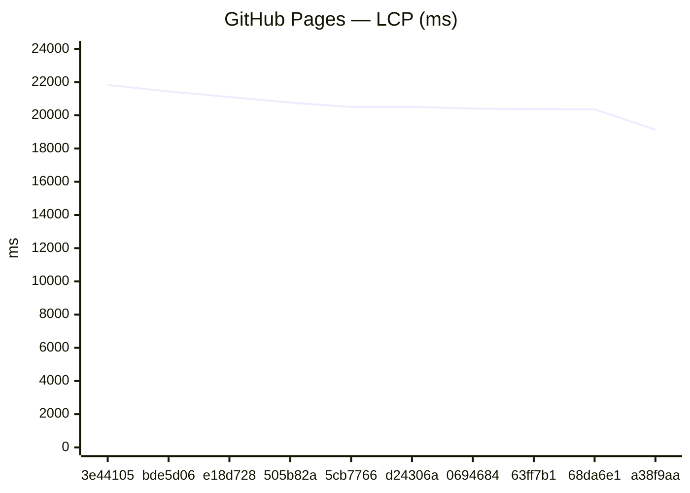
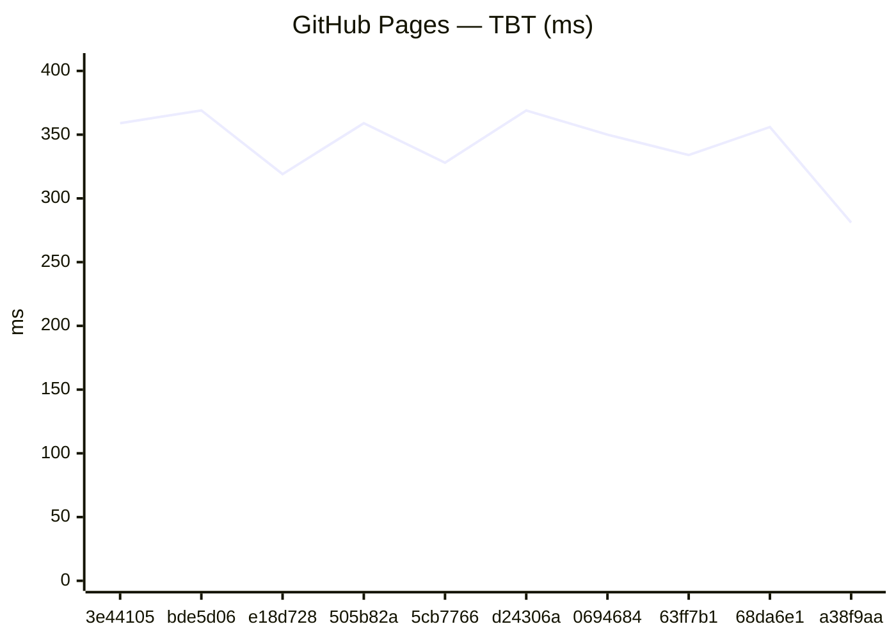
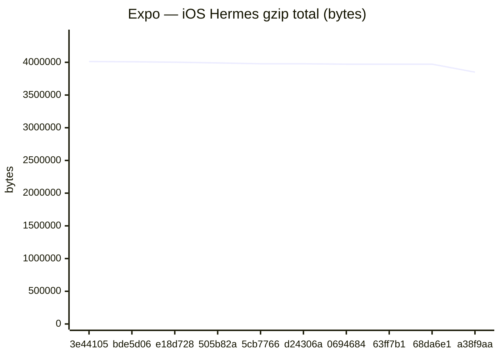
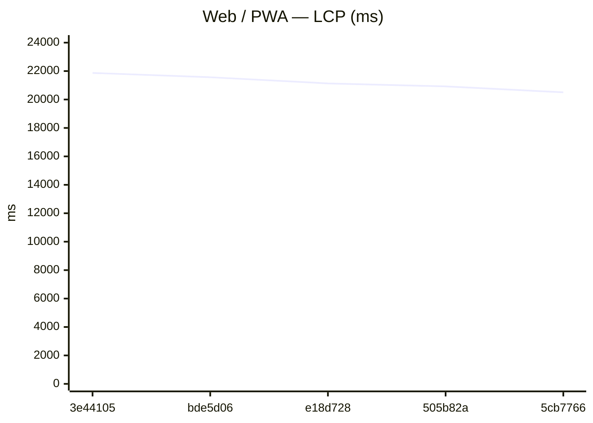
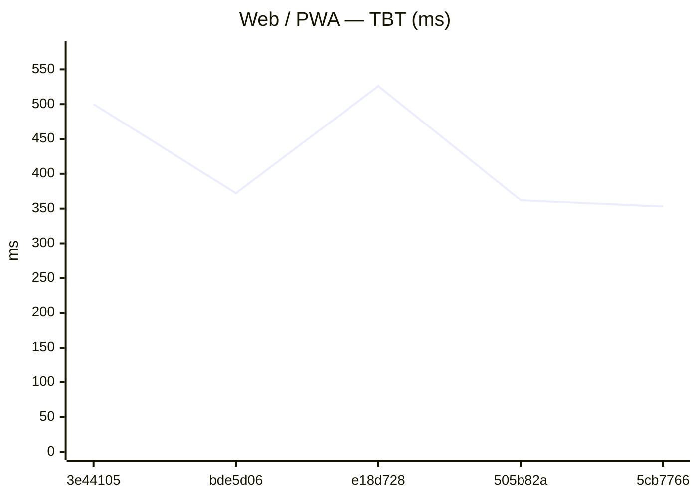
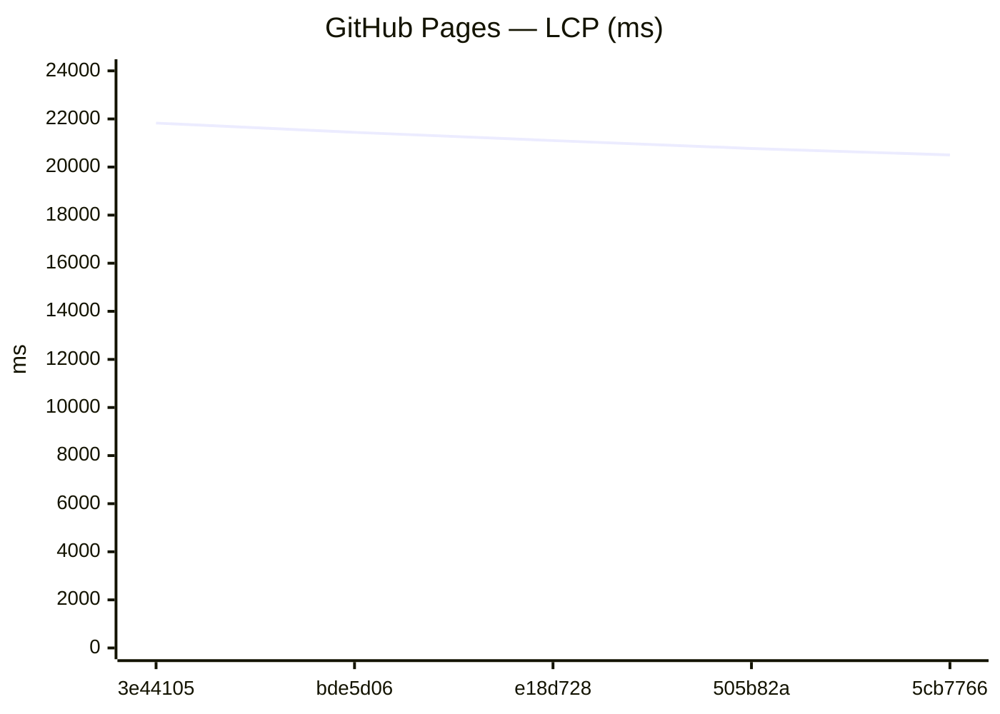
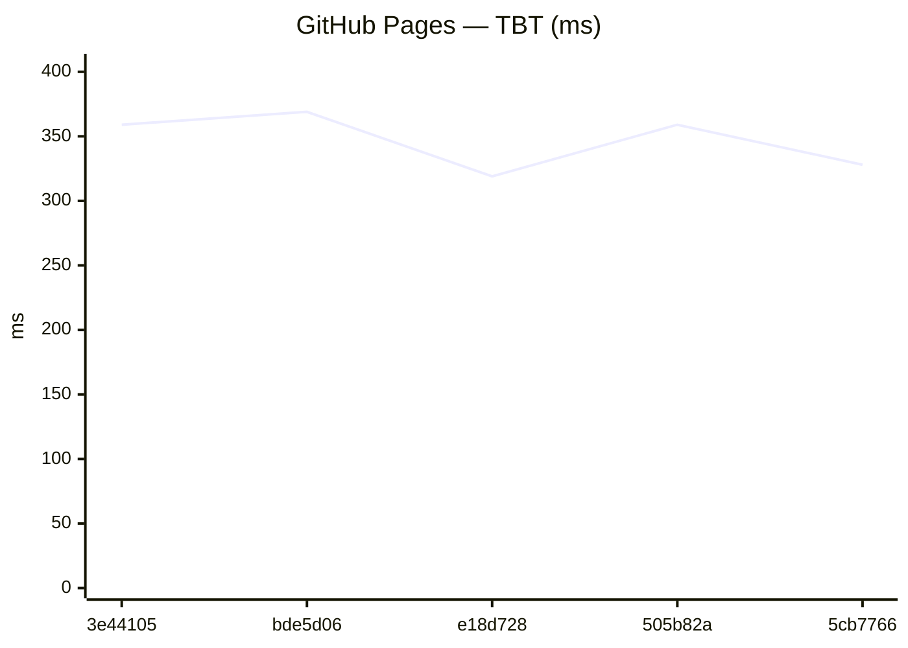
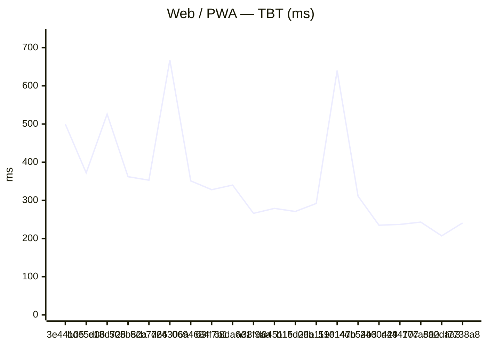
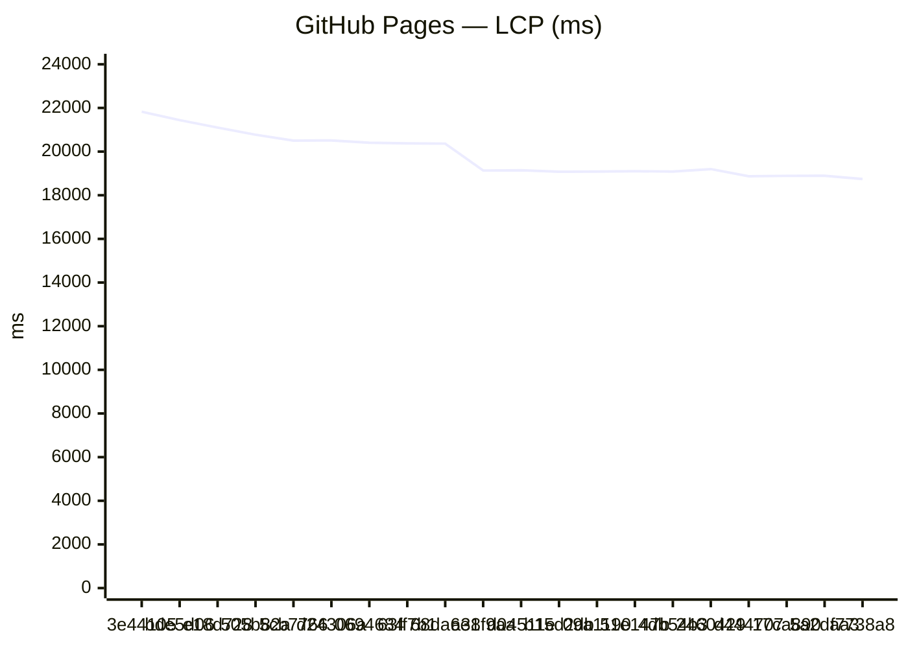
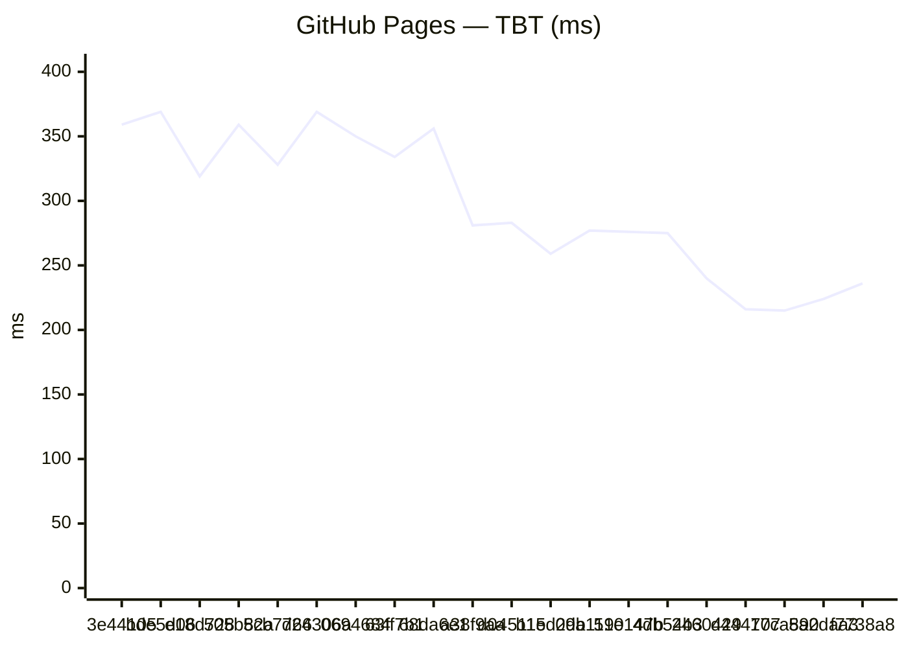

# Benchmark comparison (history)

Generated at **2026-06-27T12:56:46.887Z**.

To change the default number of runs in the primary sections below, edit **[compare.config.json](./compare.config.json)** (`window`). GitHub does not support interactive dropdowns in Markdown; optional **collapsed sections** list alternate window sizes.

---

### Web / PWA

| date | sha | status | LCP_ms | FCP_ms | TBT_ms | run |
| --- | --- | --- | --- | --- | --- | --- |
| 2026-06-27 12:54:46 | 3e44105 | ok | 21870 | 11590 | 500 | 28289763851 |
| 2026-06-27 10:37:09 | bde5d06 | ok | 21566 | 11301 | 372 | 28286667469 |
| 2026-06-27 02:32:55 | e18d728 | ok | 21132 | 11358 | 526 | 28275937069 |
| 2026-06-27 01:19:24 | 505b82a | ok | 20925 | 10986 | 362 | 28274160404 |
| 2026-06-26 23:08:38 | 5cb7766 | ok | 20504 | 10831 | 353 | 28269780345 |
| 2026-06-26 22:38:13 | d24306a | ok | 20549 | 10836 | 668 | 28269105853 |
| 2026-06-26 19:42:50 | 0694684 | ok | 20346 | 10695 | 351 | 28261145300 |
| 2026-06-26 19:06:08 | 63ff7b1 | ok | 20361 | 10684 | 328 | 28259311162 |
| 2026-06-26 18:46:14 | 68da6e1 | ok | 20380 | 10696 | 340 | 28258270019 |
| 2026-06-24 17:15:57 | a38f9aa | ok | 19099 | 9913 | 266 | 28116271372 |

### GitHub Pages

| date | sha | status | LCP_ms | FCP_ms | TBT_ms | run |
| --- | --- | --- | --- | --- | --- | --- |
| 2026-06-27 12:55:17 | 3e44105 | ok | 21828 | 11589 | 359 | 28289763851 |
| 2026-06-27 10:37:39 | bde5d06 | ok | 21442 | 11306 | 369 | 28286667469 |
| 2026-06-27 02:33:25 | e18d728 | ok | 21100 | 11129 | 319 | 28275937069 |
| 2026-06-27 01:19:52 | 505b82a | ok | 20773 | 10985 | 359 | 28274160404 |
| 2026-06-26 23:09:06 | 5cb7766 | ok | 20501 | 10678 | 328 | 28269780345 |
| 2026-06-26 22:38:41 | d24306a | ok | 20513 | 10696 | 369 | 28269105853 |
| 2026-06-26 19:43:19 | 0694684 | ok | 20406 | 10550 | 350 | 28261145300 |
| 2026-06-26 19:06:37 | 63ff7b1 | ok | 20374 | 10686 | 334 | 28259311162 |
| 2026-06-26 18:46:42 | 68da6e1 | ok | 20366 | 10565 | 356 | 28258270019 |
| 2026-06-24 17:16:24 | a38f9aa | ok | 19133 | 9917 | 281 | 28116271372 |

### Capacitor (legacy)
_No history yet._

### Expo / RN bundles

Aggregates: **sum of gzip bytes** across all `.hbc` files per platform (stable for trends when chunk hashes change).

| date | sha | status | android_gzip | ios_gzip | run |
| --- | --- | --- | --- | --- | --- |
| 2026-06-27 12:56:25 | 3e44105 | ok | 4020690 | 4012063 | 28289763851 |
| 2026-06-27 10:39:00 | bde5d06 | ok | 4016661 | 4008470 | 28286667469 |
| 2026-06-27 02:34:47 | e18d728 | ok | 4010565 | 4002116 | 28275937069 |
| 2026-06-27 01:21:12 | 505b82a | ok | 3997221 | 3990384 | 28274160404 |
| 2026-06-26 23:10:35 | 5cb7766 | ok | 3982594 | 3978033 | 28269780345 |
| 2026-06-26 22:40:08 | d24306a | ok | 3982590 | 3978036 | 28269105853 |
| 2026-06-26 19:44:32 | 0694684 | ok | 3979178 | 3971946 | 28261145300 |
| 2026-06-26 19:07:42 | 63ff7b1 | ok | 3979178 | 3971945 | 28259311162 |
| 2026-06-26 18:47:52 | 68da6e1 | ok | 3979178 | 3971946 | 28258270019 |
| 2026-06-24 17:17:28 | a38f9aa | ok | 3858192 | 3849365 | 28116271372 |

Last <strong>5</strong> runs (all platforms)

### Web / PWA

| date | sha | status | LCP_ms | FCP_ms | TBT_ms | run |
| --- | --- | --- | --- | --- | --- | --- |
| 2026-06-27 12:54:46 | 3e44105 | ok | 21870 | 11590 | 500 | 28289763851 |
| 2026-06-27 10:37:09 | bde5d06 | ok | 21566 | 11301 | 372 | 28286667469 |
| 2026-06-27 02:32:55 | e18d728 | ok | 21132 | 11358 | 526 | 28275937069 |
| 2026-06-27 01:19:24 | 505b82a | ok | 20925 | 10986 | 362 | 28274160404 |
| 2026-06-26 23:08:38 | 5cb7766 | ok | 20504 | 10831 | 353 | 28269780345 |

### GitHub Pages

| date | sha | status | LCP_ms | FCP_ms | TBT_ms | run |
| --- | --- | --- | --- | --- | --- | --- |
| 2026-06-27 12:55:17 | 3e44105 | ok | 21828 | 11589 | 359 | 28289763851 |
| 2026-06-27 10:37:39 | bde5d06 | ok | 21442 | 11306 | 369 | 28286667469 |
| 2026-06-27 02:33:25 | e18d728 | ok | 21100 | 11129 | 319 | 28275937069 |
| 2026-06-27 01:19:52 | 505b82a | ok | 20773 | 10985 | 359 | 28274160404 |
| 2026-06-26 23:09:06 | 5cb7766 | ok | 20501 | 10678 | 328 | 28269780345 |

### Capacitor (legacy)
_No history yet._

### Expo / RN bundles

Aggregates: **sum of gzip bytes** across all `.hbc` files per platform (stable for trends when chunk hashes change).

| date | sha | status | android_gzip | ios_gzip | run |
| --- | --- | --- | --- | --- | --- |
| 2026-06-27 12:56:25 | 3e44105 | ok | 4020690 | 4012063 | 28289763851 |
| 2026-06-27 10:39:00 | bde5d06 | ok | 4016661 | 4008470 | 28286667469 |
| 2026-06-27 02:34:47 | e18d728 | ok | 4010565 | 4002116 | 28275937069 |
| 2026-06-27 01:21:12 | 505b82a | ok | 3997221 | 3990384 | 28274160404 |
| 2026-06-26 23:10:35 | 5cb7766 | ok | 3982594 | 3978033 | 28269780345 |

Last <strong>20</strong> runs (all platforms)

### Web / PWA

| date | sha | status | LCP_ms | FCP_ms | TBT_ms | run |
| --- | --- | --- | --- | --- | --- | --- |
| 2026-06-27 12:54:46 | 3e44105 | ok | 21870 | 11590 | 500 | 28289763851 |
| 2026-06-27 10:37:09 | bde5d06 | ok | 21566 | 11301 | 372 | 28286667469 |
| 2026-06-27 02:32:55 | e18d728 | ok | 21132 | 11358 | 526 | 28275937069 |
| 2026-06-27 01:19:24 | 505b82a | ok | 20925 | 10986 | 362 | 28274160404 |
| 2026-06-26 23:08:38 | 5cb7766 | ok | 20504 | 10831 | 353 | 28269780345 |
| 2026-06-26 22:38:13 | d24306a | ok | 20549 | 10836 | 668 | 28269105853 |
| 2026-06-26 19:42:50 | 0694684 | ok | 20346 | 10695 | 351 | 28261145300 |
| 2026-06-26 19:06:08 | 63ff7b1 | ok | 20361 | 10684 | 328 | 28259311162 |
| 2026-06-26 18:46:14 | 68da6e1 | ok | 20380 | 10696 | 340 | 28258270019 |
| 2026-06-24 17:15:57 | a38f9aa | ok | 19099 | 9913 | 266 | 28116271372 |
| 2026-06-24 00:38:20 | d04511e | ok | 19257 | 9931 | 279 | 28066846770 |
| 2026-06-24 00:11:21 | b15d2db | ok | 19097 | 9922 | 271 | 28065771305 |
| 2026-06-23 23:55:27 | 09a1190 | ok | 19090 | 9913 | 292 | 28065136067 |
| 2026-06-23 23:44:50 | 51e147b | ok | 19227 | 10351 | 640 | 28064714244 |
| 2026-06-23 23:33:46 | 4db54b3 | ok | 19255 | 9924 | 311 | 28064246612 |
| 2026-06-23 23:26:25 | 2460429 | ok | 19076 | 9920 | 235 | 28063918132 |
| 2026-06-22 21:14:45 | d444707 | ok | 18898 | 9591 | 237 | 27984363575 |
| 2026-06-22 19:50:57 | 17ca890 | ok | 18874 | 9821 | 243 | 27979561919 |
| 2026-06-21 22:51:11 | 5a2daa3 | ok | 18888 | 9440 | 207 | 27919974433 |
| 2026-06-21 22:21:07 | f7738a8 | ok | 18728 | 9603 | 241 | 27919259834 |

### GitHub Pages

| date | sha | status | LCP_ms | FCP_ms | TBT_ms | run |
| --- | --- | --- | --- | --- | --- | --- |
| 2026-06-27 12:55:17 | 3e44105 | ok | 21828 | 11589 | 359 | 28289763851 |
| 2026-06-27 10:37:39 | bde5d06 | ok | 21442 | 11306 | 369 | 28286667469 |
| 2026-06-27 02:33:25 | e18d728 | ok | 21100 | 11129 | 319 | 28275937069 |
| 2026-06-27 01:19:52 | 505b82a | ok | 20773 | 10985 | 359 | 28274160404 |
| 2026-06-26 23:09:06 | 5cb7766 | ok | 20501 | 10678 | 328 | 28269780345 |
| 2026-06-26 22:38:41 | d24306a | ok | 20513 | 10696 | 369 | 28269105853 |
| 2026-06-26 19:43:19 | 0694684 | ok | 20406 | 10550 | 350 | 28261145300 |
| 2026-06-26 19:06:37 | 63ff7b1 | ok | 20374 | 10686 | 334 | 28259311162 |
| 2026-06-26 18:46:42 | 68da6e1 | ok | 20366 | 10565 | 356 | 28258270019 |
| 2026-06-24 17:16:24 | a38f9aa | ok | 19133 | 9917 | 281 | 28116271372 |
| 2026-06-24 00:38:48 | d04511e | ok | 19145 | 9748 | 283 | 28066846770 |
| 2026-06-24 00:11:48 | b15d2db | ok | 19077 | 9622 | 259 | 28065771305 |
| 2026-06-23 23:55:53 | 09a1190 | ok | 19086 | 9656 | 277 | 28065136067 |
| 2026-06-23 23:45:17 | 51e147b | ok | 19101 | 9908 | 276 | 28064714244 |
| 2026-06-23 23:34:13 | 4db54b3 | ok | 19086 | 9809 | 275 | 28064246612 |
| 2026-06-23 23:26:51 | 2460429 | ok | 19199 | 9910 | 240 | 28063918132 |
| 2026-06-22 21:15:13 | d444707 | ok | 18871 | 9614 | 216 | 27984363575 |
| 2026-06-22 19:51:25 | 17ca890 | ok | 18888 | 9583 | 215 | 27979561919 |
| 2026-06-21 22:51:38 | 5a2daa3 | ok | 18892 | 9439 | 224 | 27919974433 |
| 2026-06-21 22:21:34 | f7738a8 | ok | 18741 | 9436 | 236 | 27919259834 |

### Capacitor (legacy)
_No history yet._

### Expo / RN bundles

Aggregates: **sum of gzip bytes** across all `.hbc` files per platform (stable for trends when chunk hashes change).

| date | sha | status | android_gzip | ios_gzip | run |
| --- | --- | --- | --- | --- | --- |
| 2026-06-27 12:56:25 | 3e44105 | ok | 4020690 | 4012063 | 28289763851 |
| 2026-06-27 10:39:00 | bde5d06 | ok | 4016661 | 4008470 | 28286667469 |
| 2026-06-27 02:34:47 | e18d728 | ok | 4010565 | 4002116 | 28275937069 |
| 2026-06-27 01:21:12 | 505b82a | ok | 3997221 | 3990384 | 28274160404 |
| 2026-06-26 23:10:35 | 5cb7766 | ok | 3982594 | 3978033 | 28269780345 |
| 2026-06-26 22:40:08 | d24306a | ok | 3982590 | 3978036 | 28269105853 |
| 2026-06-26 19:44:32 | 0694684 | ok | 3979178 | 3971946 | 28261145300 |
| 2026-06-26 19:07:42 | 63ff7b1 | ok | 3979178 | 3971945 | 28259311162 |
| 2026-06-26 18:47:52 | 68da6e1 | ok | 3979178 | 3971946 | 28258270019 |
| 2026-06-24 17:17:28 | a38f9aa | ok | 3858192 | 3849365 | 28116271372 |
| 2026-06-24 00:39:57 | d04511e | ok | 3858192 | 3849367 | 28066846770 |
| 2026-06-24 00:12:58 | b15d2db | ok | 3858195 | 3849366 | 28065771305 |
| 2026-06-23 23:57:09 | 09a1190 | ok | 3858763 | 3850104 | 28065136067 |
| 2026-06-23 23:46:21 | 51e147b | ok | 3858763 | 3850105 | 28064714244 |
| 2026-06-23 23:35:13 | 4db54b3 | ok | 3858762 | 3850105 | 28064246612 |
| 2026-06-23 23:27:37 | 2460429 | ok | 3858764 | 3850104 | 28063918132 |
| 2026-06-22 21:16:24 | d444707 | ok | 3845905 | 3837764 | 27984363575 |
| 2026-06-22 19:52:45 | 17ca890 | ok | 3843474 | 3833771 | 27979561919 |
| 2026-06-21 22:52:32 | 5a2daa3 | ok | 3841087 | 3832292 | 27919974433 |
| 2026-06-21 22:22:48 | f7738a8 | ok | 3837618 | 3830296 | 27919259834 |

