# Benchmark comparison (history)

Generated at **2026-06-19T06:00:50.901Z**.

To change the default number of runs in the primary sections below, edit **[compare.config.json](./compare.config.json)** (`window`). GitHub does not support interactive dropdowns in Markdown; optional **collapsed sections** list alternate window sizes.

---

### Web / PWA

| date | sha | status | LCP_ms | FCP_ms | TBT_ms | run |
| --- | --- | --- | --- | --- | --- | --- |
| 2026-06-19 05:58:35 | 8a821bd | ok | 12437 | 8682 | 116 | 27808359407 |
| 2026-06-19 05:17:34 | 0cd488d | ok | 12430 | 8720 | 131 | 27806960853 |
| 2026-06-18 22:23:33 | fae42c2 | ok | 12295 | 8691 | 136 | 27792882132 |
| 2026-06-18 21:36:15 | ac4c6a0 | ok | 13197 | 9894 | 154 | 27790728070 |
| 2026-06-18 20:56:32 | 0f26a4d | ok | 13323 | 9880 | 127 | 27788620761 |
| 2026-06-18 19:57:33 | d13794d | ok | 13038 | 9734 | 120 | 27785501975 |
| 2026-06-18 19:08:40 | b296889 | ok | 12168 | 8452 | 199 | 27782910961 |
| 2026-06-18 17:41:26 | 4b2eed4 | ok | 11999 | 8607 | 132 | 27778067467 |
| 2026-06-18 17:00:25 | e566410 | ok | 12553 | 9255 | 65 | 27775707987 |
| 2026-06-18 16:30:03 | fd7e730 | ok | 11687 | 8610 | 111 | 27774025951 |

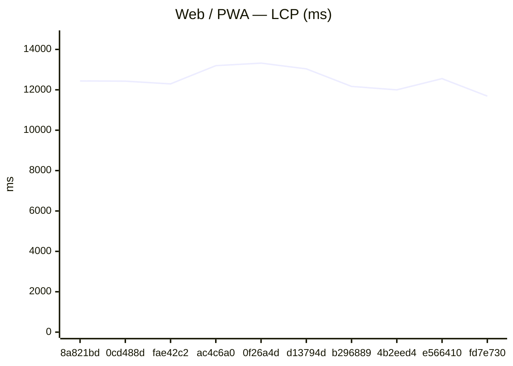
```mermaid
xychart-beta
    title "Web / PWA — LCP (ms)"
    x-axis ["8a821bd", "0cd488d", "fae42c2", "ac4c6a0", "0f26a4d", "d13794d", "b296889", "4b2eed4", "e566410", "fd7e730"]
    y-axis "ms" 0 --> 14656
    line [12437, 12430, 12295, 13197, 13323, 13038, 12168, 11999, 12553, 11687]
```
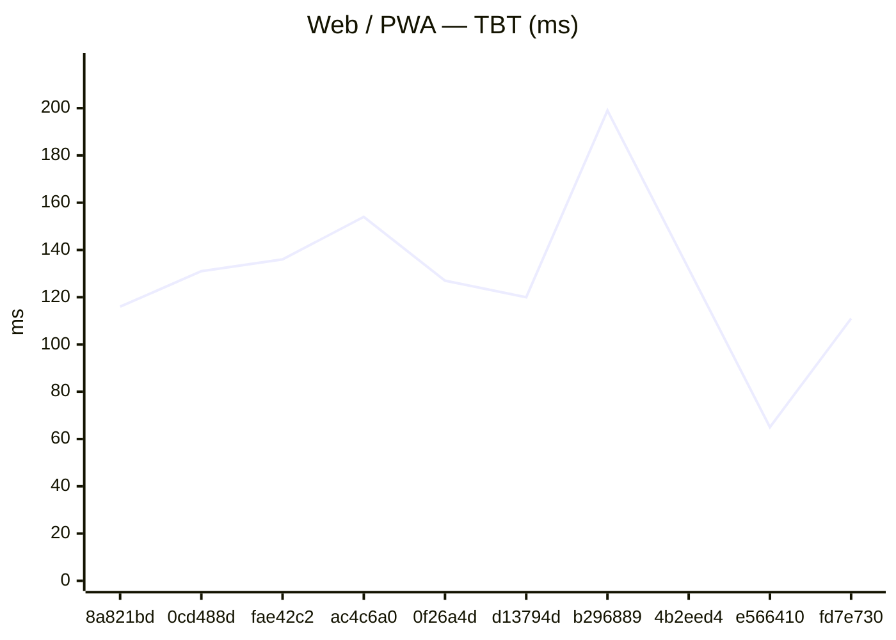
```mermaid
xychart-beta
    title "Web / PWA — TBT (ms)"
    x-axis ["8a821bd", "0cd488d", "fae42c2", "ac4c6a0", "0f26a4d", "d13794d", "b296889", "4b2eed4", "e566410", "fd7e730"]
    y-axis "ms" 0 --> 219
    line [116, 131, 136, 154, 127, 120, 199, 132, 65, 111]
```

### GitHub Pages

| date | sha | status | LCP_ms | FCP_ms | TBT_ms | run |
| --- | --- | --- | --- | --- | --- | --- |
| 2026-06-19 05:58:59 | 8a821bd | ok | 12438 | 8685 | 122 | 27808359407 |
| 2026-06-19 05:17:58 | 0cd488d | ok | 12126 | 8673 | 129 | 27806960853 |
| 2026-06-18 22:23:57 | fae42c2 | ok | 12180 | 8678 | 130 | 27792882132 |
| 2026-06-18 21:36:38 | ac4c6a0 | ok | 12127 | 8691 | 118 | 27790728070 |
| 2026-06-18 20:56:54 | 0f26a4d | ok | 13036 | 9283 | 122 | 27788620761 |
| 2026-06-18 19:57:55 | d13794d | ok | 11979 | 8601 | 115 | 27785501975 |
| 2026-06-18 19:09:03 | b296889 | ok | 11847 | 8393 | 110 | 27782910961 |
| 2026-06-18 17:41:48 | 4b2eed4 | ok | 11759 | 8376 | 120 | 27778067467 |
| 2026-06-18 17:00:46 | e566410 | ok | 12402 | 9249 | 71 | 27775707987 |
| 2026-06-18 16:30:26 | fd7e730 | ok | 12580 | 8376 | 109 | 27774025951 |

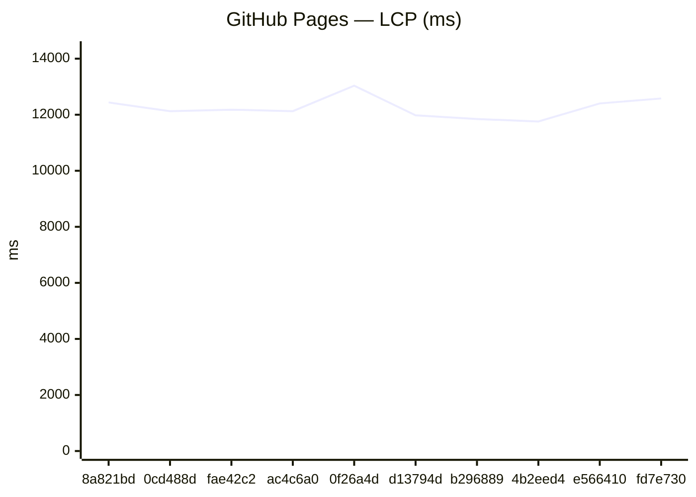
```mermaid
xychart-beta
    title "GitHub Pages — LCP (ms)"
    x-axis ["8a821bd", "0cd488d", "fae42c2", "ac4c6a0", "0f26a4d", "d13794d", "b296889", "4b2eed4", "e566410", "fd7e730"]
    y-axis "ms" 0 --> 14340
    line [12438, 12126, 12180, 12127, 13036, 11979, 11847, 11759, 12402, 12580]
```
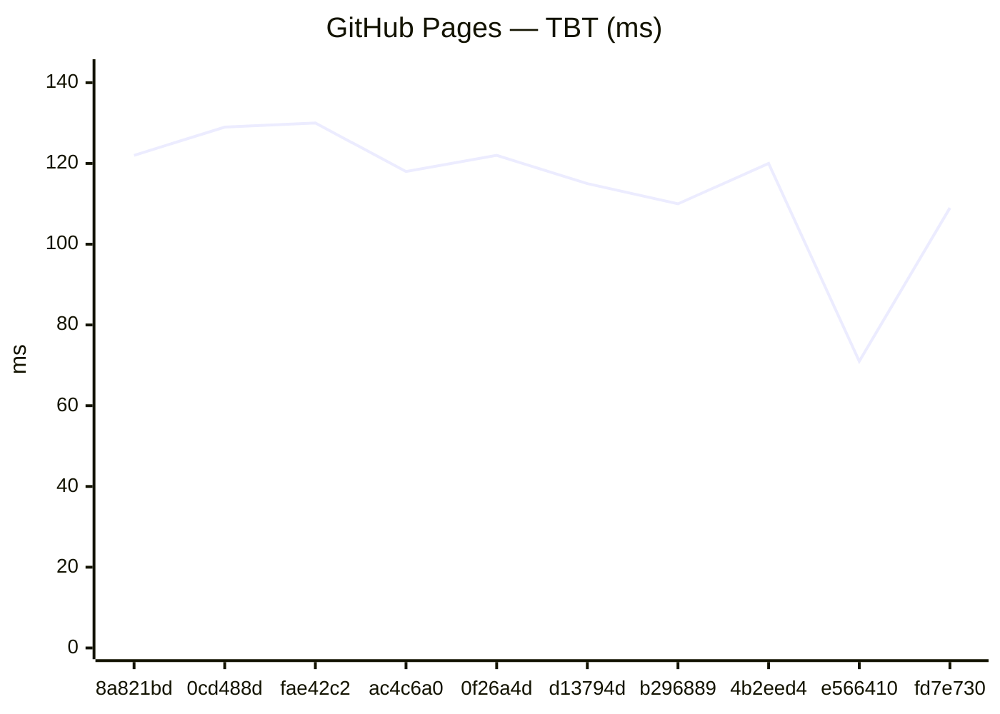
```mermaid
xychart-beta
    title "GitHub Pages — TBT (ms)"
    x-axis ["8a821bd", "0cd488d", "fae42c2", "ac4c6a0", "0f26a4d", "d13794d", "b296889", "4b2eed4", "e566410", "fd7e730"]
    y-axis "ms" 0 --> 143
    line [122, 129, 130, 118, 122, 115, 110, 120, 71, 109]
```

### Capacitor (legacy)
_No history yet._

### Expo / RN bundles

Aggregates: **sum of gzip bytes** across all `.hbc` files per platform (stable for trends when chunk hashes change).

| date | sha | status | android_gzip | ios_gzip | run |
| --- | --- | --- | --- | --- | --- |
| 2026-06-19 06:00:24 | 8a821bd | ok | 3417622 | 3409221 | 27808359407 |
| 2026-06-19 05:19:15 | 0cd488d | ok | 3400545 | 3391123 | 27806960853 |
| 2026-06-18 22:24:11 | fae42c2 | ok | 3388765 | 3378280 | 27792882132 |
| 2026-06-18 21:38:25 | ac4c6a0 | ok | 3375300 | 3368083 | 27790728070 |
| 2026-06-18 20:57:02 | 0f26a4d | ok | 3368860 | 3360774 | 27788620761 |
| 2026-06-18 19:59:02 | d13794d | ok | 3368861 | 3360776 | 27785501975 |
| 2026-06-18 19:09:33 | b296889 | ok | 3349208 | 3341646 | 27782910961 |
| 2026-06-18 17:42:51 | 4b2eed4 | ok | 3324082 | 3316545 | 27778067467 |
| 2026-06-18 17:01:52 | e566410 | ok | 3305549 | 3297734 | 27775707987 |
| 2026-06-18 16:31:53 | fd7e730 | ok | 3300038 | 3293199 | 27774025951 |

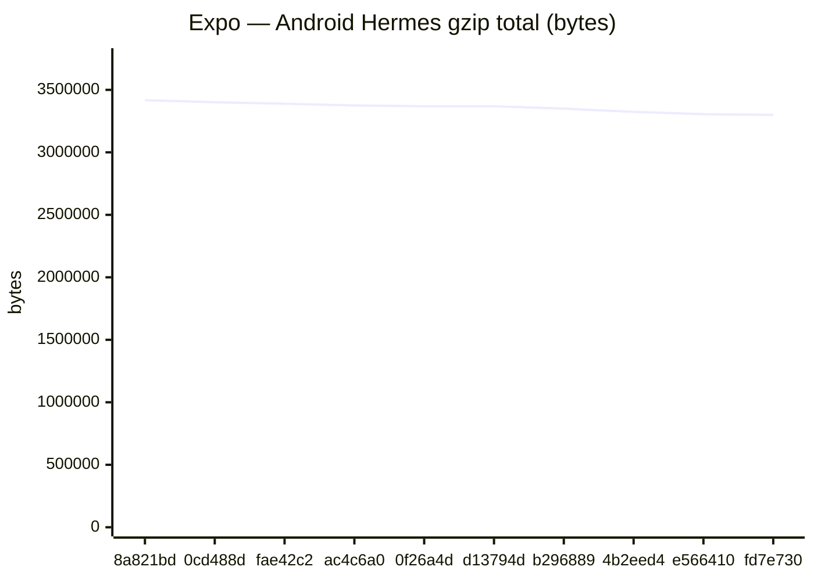
```mermaid
xychart-beta
    title "Expo — Android Hermes gzip total (bytes)"
    x-axis ["8a821bd", "0cd488d", "fae42c2", "ac4c6a0", "0f26a4d", "d13794d", "b296889", "4b2eed4", "e566410", "fd7e730"]
    y-axis "bytes" 0 --> 3759385
    line [3417622, 3400545, 3388765, 3375300, 3368860, 3368861, 3349208, 3324082, 3305549, 3300038]
```
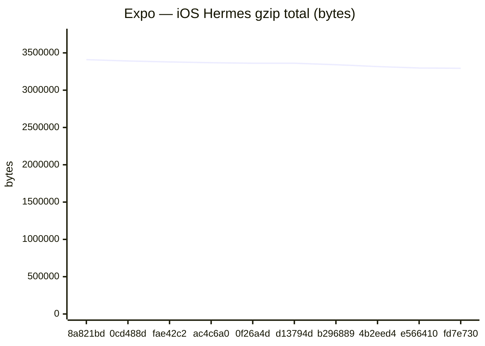
```mermaid
xychart-beta
    title "Expo — iOS Hermes gzip total (bytes)"
    x-axis ["8a821bd", "0cd488d", "fae42c2", "ac4c6a0", "0f26a4d", "d13794d", "b296889", "4b2eed4", "e566410", "fd7e730"]
    y-axis "bytes" 0 --> 3750144
    line [3409221, 3391123, 3378280, 3368083, 3360774, 3360776, 3341646, 3316545, 3297734, 3293199]
```

Last <strong>5</strong> runs (all platforms)

### Web / PWA

| date | sha | status | LCP_ms | FCP_ms | TBT_ms | run |
| --- | --- | --- | --- | --- | --- | --- |
| 2026-06-19 05:58:35 | 8a821bd | ok | 12437 | 8682 | 116 | 27808359407 |
| 2026-06-19 05:17:34 | 0cd488d | ok | 12430 | 8720 | 131 | 27806960853 |
| 2026-06-18 22:23:33 | fae42c2 | ok | 12295 | 8691 | 136 | 27792882132 |
| 2026-06-18 21:36:15 | ac4c6a0 | ok | 13197 | 9894 | 154 | 27790728070 |
| 2026-06-18 20:56:32 | 0f26a4d | ok | 13323 | 9880 | 127 | 27788620761 |

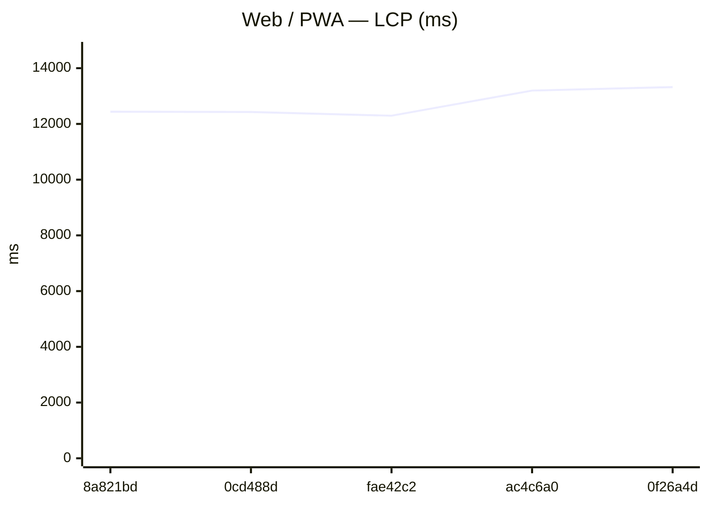
```mermaid
xychart-beta
    title "Web / PWA — LCP (ms)"
    x-axis ["8a821bd", "0cd488d", "fae42c2", "ac4c6a0", "0f26a4d"]
    y-axis "ms" 0 --> 14656
    line [12437, 12430, 12295, 13197, 13323]
```
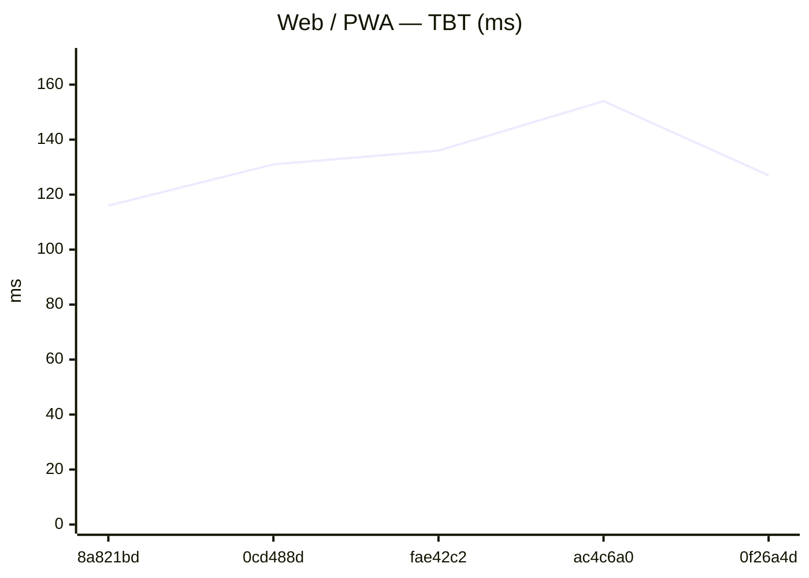
```mermaid
xychart-beta
    title "Web / PWA — TBT (ms)"
    x-axis ["8a821bd", "0cd488d", "fae42c2", "ac4c6a0", "0f26a4d"]
    y-axis "ms" 0 --> 170
    line [116, 131, 136, 154, 127]
```

### GitHub Pages

| date | sha | status | LCP_ms | FCP_ms | TBT_ms | run |
| --- | --- | --- | --- | --- | --- | --- |
| 2026-06-19 05:58:59 | 8a821bd | ok | 12438 | 8685 | 122 | 27808359407 |
| 2026-06-19 05:17:58 | 0cd488d | ok | 12126 | 8673 | 129 | 27806960853 |
| 2026-06-18 22:23:57 | fae42c2 | ok | 12180 | 8678 | 130 | 27792882132 |
| 2026-06-18 21:36:38 | ac4c6a0 | ok | 12127 | 8691 | 118 | 27790728070 |
| 2026-06-18 20:56:54 | 0f26a4d | ok | 13036 | 9283 | 122 | 27788620761 |

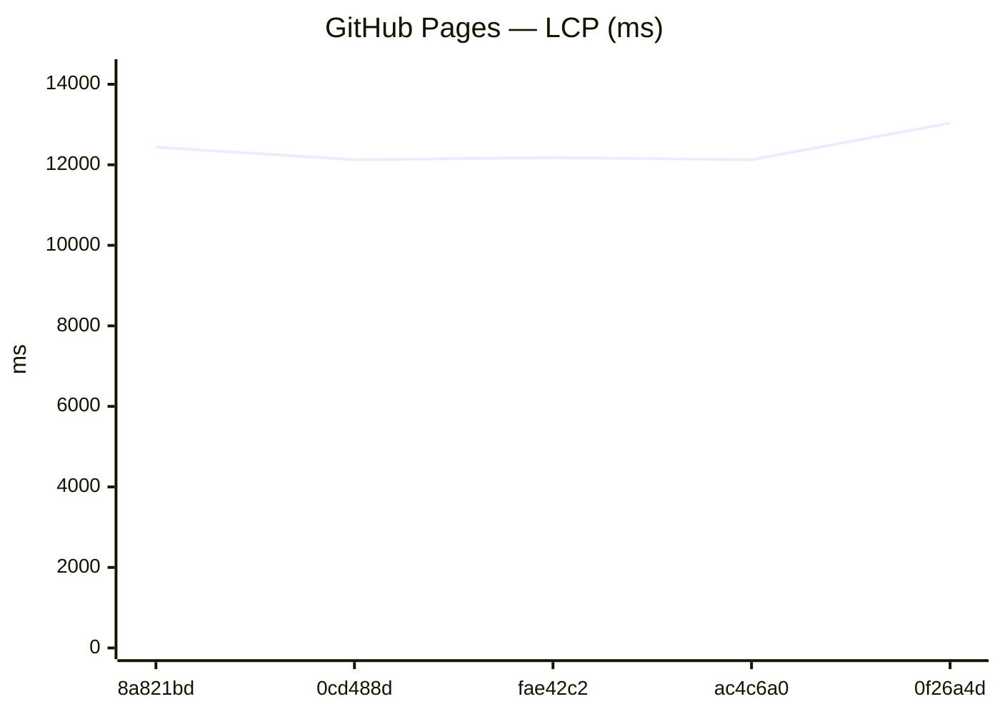
```mermaid
xychart-beta
    title "GitHub Pages — LCP (ms)"
    x-axis ["8a821bd", "0cd488d", "fae42c2", "ac4c6a0", "0f26a4d"]
    y-axis "ms" 0 --> 14340
    line [12438, 12126, 12180, 12127, 13036]
```
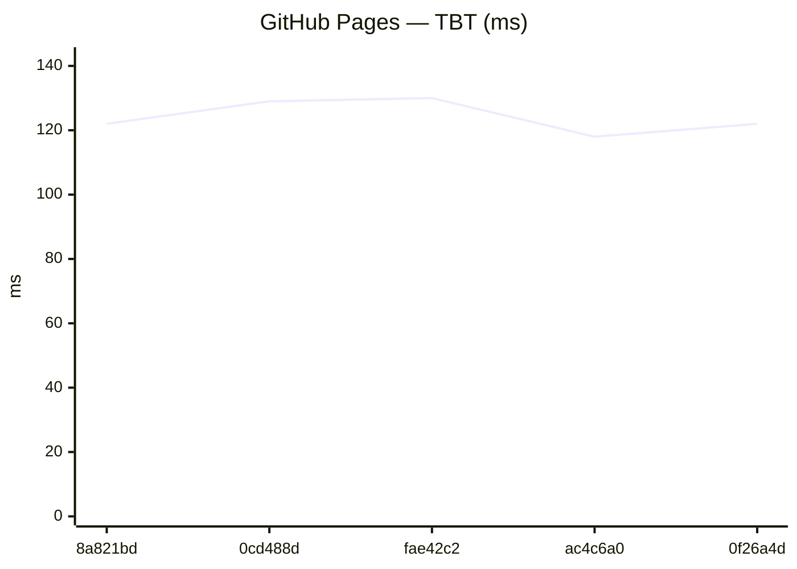
```mermaid
xychart-beta
    title "GitHub Pages — TBT (ms)"
    x-axis ["8a821bd", "0cd488d", "fae42c2", "ac4c6a0", "0f26a4d"]
    y-axis "ms" 0 --> 143
    line [122, 129, 130, 118, 122]
```

### Capacitor (legacy)
_No history yet._

### Expo / RN bundles

Aggregates: **sum of gzip bytes** across all `.hbc` files per platform (stable for trends when chunk hashes change).

| date | sha | status | android_gzip | ios_gzip | run |
| --- | --- | --- | --- | --- | --- |
| 2026-06-19 06:00:24 | 8a821bd | ok | 3417622 | 3409221 | 27808359407 |
| 2026-06-19 05:19:15 | 0cd488d | ok | 3400545 | 3391123 | 27806960853 |
| 2026-06-18 22:24:11 | fae42c2 | ok | 3388765 | 3378280 | 27792882132 |
| 2026-06-18 21:38:25 | ac4c6a0 | ok | 3375300 | 3368083 | 27790728070 |
| 2026-06-18 20:57:02 | 0f26a4d | ok | 3368860 | 3360774 | 27788620761 |

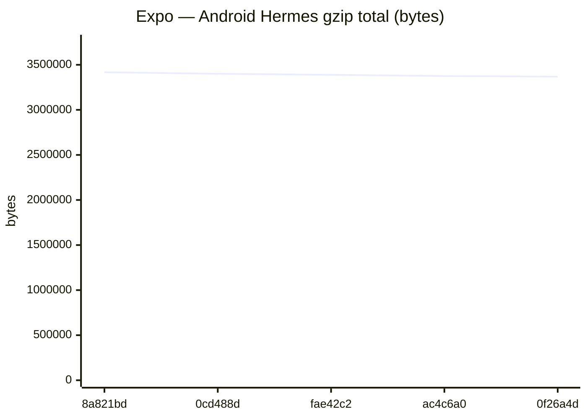
```mermaid
xychart-beta
    title "Expo — Android Hermes gzip total (bytes)"
    x-axis ["8a821bd", "0cd488d", "fae42c2", "ac4c6a0", "0f26a4d"]
    y-axis "bytes" 0 --> 3759385
    line [3417622, 3400545, 3388765, 3375300, 3368860]
```

```mermaid
xychart-beta
    title "Expo — iOS Hermes gzip total (bytes)"
    x-axis ["8a821bd", "0cd488d", "fae42c2", "ac4c6a0", "0f26a4d"]
    y-axis "bytes" 0 --> 3750144
    line [3409221, 3391123, 3378280, 3368083, 3360774]
```

Last <strong>20</strong> runs (all platforms)

### Web / PWA

| date | sha | status | LCP_ms | FCP_ms | TBT_ms | run |
| --- | --- | --- | --- | --- | --- | --- |
| 2026-06-19 05:58:35 | 8a821bd | ok | 12437 | 8682 | 116 | 27808359407 |
| 2026-06-19 05:17:34 | 0cd488d | ok | 12430 | 8720 | 131 | 27806960853 |
| 2026-06-18 22:23:33 | fae42c2 | ok | 12295 | 8691 | 136 | 27792882132 |
| 2026-06-18 21:36:15 | ac4c6a0 | ok | 13197 | 9894 | 154 | 27790728070 |
| 2026-06-18 20:56:32 | 0f26a4d | ok | 13323 | 9880 | 127 | 27788620761 |
| 2026-06-18 19:57:33 | d13794d | ok | 13038 | 9734 | 120 | 27785501975 |
| 2026-06-18 19:08:40 | b296889 | ok | 12168 | 8452 | 199 | 27782910961 |
| 2026-06-18 17:41:26 | 4b2eed4 | ok | 11999 | 8607 | 132 | 27778067467 |
| 2026-06-18 17:00:25 | e566410 | ok | 12553 | 9255 | 65 | 27775707987 |
| 2026-06-18 16:30:03 | fd7e730 | ok | 11687 | 8610 | 111 | 27774025951 |
| 2026-06-18 13:13:27 | e9f962a | ok | 13245 | 10182 | 118 | 27761833841 |
| 2026-06-18 12:12:34 | 03bb856 | ok | 12382 | 8613 | 138 | 27758462438 |
| 2026-06-18 10:57:29 | aabc381 | ok | 12632 | 9581 | 118 | 27754625786 |
| 2026-06-17 22:25:04 | ec2f02d | ok | 12566 | 9562 | 75 | 27723559485 |
| 2026-06-17 21:47:48 | 7d43c9d | ok | 12399 | 9245 | 60 | 27721796875 |
| 2026-06-17 19:59:42 | b350fd1 | ok | 12420 | 9568 | 110 | 27715903744 |
| 2026-06-17 19:34:13 | f4bee70 | ok | 14457 | 9745 | 161 | 27714347810 |
| 2026-06-17 19:18:15 | 189ea7f | ok | 14459 | 10036 | 142 | 27713591407 |
| 2026-06-17 18:46:00 | 4cdf078 | ok | 13617 | 9710 | 88 | 27711771797 |
| 2026-06-17 15:37:50 | 2056f68 | ok | 14386 | 9959 | 135 | 27700771524 |

```mermaid
xychart-beta
    title "Web / PWA — LCP (ms)"
    x-axis ["8a821bd", "0cd488d", "fae42c2", "ac4c6a0", "0f26a4d", "d13794d", "b296889", "4b2eed4", "e566410", "fd7e730", "e9f962a", "03bb856", "aabc381", "ec2f02d", "7d43c9d", "b350fd1", "f4bee70", "189ea7f", "4cdf078", "2056f68"]
    y-axis "ms" 0 --> 15905
    line [12437, 12430, 12295, 13197, 13323, 13038, 12168, 11999, 12553, 11687, 13245, 12382, 12632, 12566, 12399, 12420, 14457, 14459, 13617, 14386]
```

```mermaid
xychart-beta
    title "Web / PWA — TBT (ms)"
    x-axis ["8a821bd", "0cd488d", "fae42c2", "ac4c6a0", "0f26a4d", "d13794d", "b296889", "4b2eed4", "e566410", "fd7e730", "e9f962a", "03bb856", "aabc381", "ec2f02d", "7d43c9d", "b350fd1", "f4bee70", "189ea7f", "4cdf078", "2056f68"]
    y-axis "ms" 0 --> 219
    line [116, 131, 136, 154, 127, 120, 199, 132, 65, 111, 118, 138, 118, 75, 60, 110, 161, 142, 88, 135]
```

### GitHub Pages

| date | sha | status | LCP_ms | FCP_ms | TBT_ms | run |
| --- | --- | --- | --- | --- | --- | --- |
| 2026-06-19 05:58:59 | 8a821bd | ok | 12438 | 8685 | 122 | 27808359407 |
| 2026-06-19 05:17:58 | 0cd488d | ok | 12126 | 8673 | 129 | 27806960853 |
| 2026-06-18 22:23:57 | fae42c2 | ok | 12180 | 8678 | 130 | 27792882132 |
| 2026-06-18 21:36:38 | ac4c6a0 | ok | 12127 | 8691 | 118 | 27790728070 |
| 2026-06-18 20:56:54 | 0f26a4d | ok | 13036 | 9283 | 122 | 27788620761 |
| 2026-06-18 19:57:55 | d13794d | ok | 11979 | 8601 | 115 | 27785501975 |
| 2026-06-18 19:09:03 | b296889 | ok | 11847 | 8393 | 110 | 27782910961 |
| 2026-06-18 17:41:48 | 4b2eed4 | ok | 11759 | 8376 | 120 | 27778067467 |
| 2026-06-18 17:00:46 | e566410 | ok | 12402 | 9249 | 71 | 27775707987 |
| 2026-06-18 16:30:26 | fd7e730 | ok | 12580 | 8376 | 109 | 27774025951 |
| 2026-06-18 13:13:50 | e9f962a | ok | 12444 | 9319 | 126 | 27761833841 |
| 2026-06-18 12:12:57 | 03bb856 | ok | 11529 | 8376 | 112 | 27758462438 |
| 2026-06-18 10:57:52 | aabc381 | ok | 12751 | 8622 | 141 | 27754625786 |
| 2026-06-17 22:25:26 | ec2f02d | ok | 11500 | 8352 | 62 | 27723559485 |
| 2026-06-17 21:48:10 | 7d43c9d | ok | 12552 | 9249 | 68 | 27721796875 |
| 2026-06-17 20:00:05 | b350fd1 | ok | 12421 | 9270 | 106 | 27715903744 |
| 2026-06-17 19:34:36 | f4bee70 | ok | 13612 | 9736 | 158 | 27714347810 |
| 2026-06-17 19:18:38 | 189ea7f | ok | 14591 | 10654 | 145 | 27713591407 |
| 2026-06-17 18:46:22 | 4cdf078 | ok | 14540 | 9660 | 107 | 27711771797 |
| 2026-06-17 15:38:13 | 2056f68 | ok | 13488 | 9737 | 135 | 27700771524 |

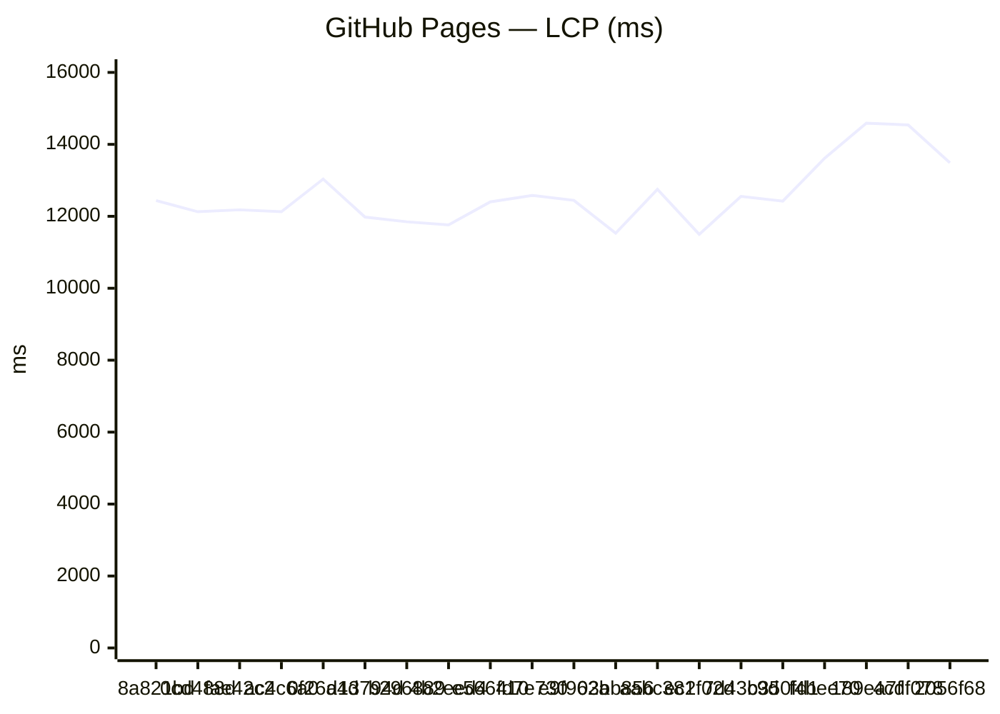
```mermaid
xychart-beta
    title "GitHub Pages — LCP (ms)"
    x-axis ["8a821bd", "0cd488d", "fae42c2", "ac4c6a0", "0f26a4d", "d13794d", "b296889", "4b2eed4", "e566410", "fd7e730", "e9f962a", "03bb856", "aabc381", "ec2f02d", "7d43c9d", "b350fd1", "f4bee70", "189ea7f", "4cdf078", "2056f68"]
    y-axis "ms" 0 --> 16051
    line [12438, 12126, 12180, 12127, 13036, 11979, 11847, 11759, 12402, 12580, 12444, 11529, 12751, 11500, 12552, 12421, 13612, 14591, 14540, 13488]
```
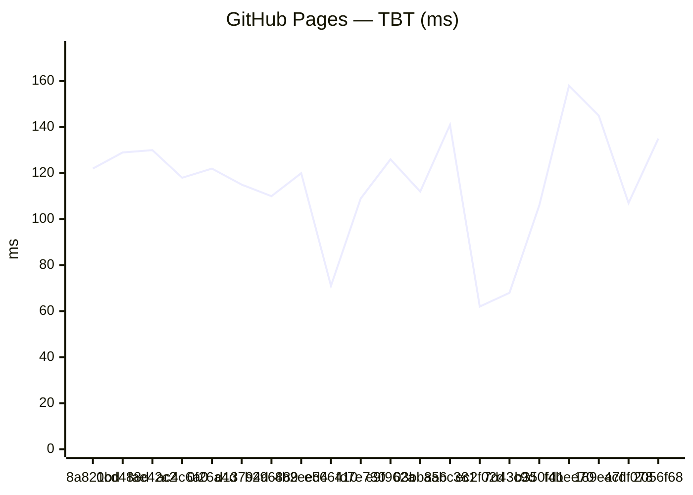
```mermaid
xychart-beta
    title "GitHub Pages — TBT (ms)"
    x-axis ["8a821bd", "0cd488d", "fae42c2", "ac4c6a0", "0f26a4d", "d13794d", "b296889", "4b2eed4", "e566410", "fd7e730", "e9f962a", "03bb856", "aabc381", "ec2f02d", "7d43c9d", "b350fd1", "f4bee70", "189ea7f", "4cdf078", "2056f68"]
    y-axis "ms" 0 --> 174
    line [122, 129, 130, 118, 122, 115, 110, 120, 71, 109, 126, 112, 141, 62, 68, 106, 158, 145, 107, 135]
```

### Capacitor (legacy)
_No history yet._

### Expo / RN bundles

Aggregates: **sum of gzip bytes** across all `.hbc` files per platform (stable for trends when chunk hashes change).

| date | sha | status | android_gzip | ios_gzip | run |
| --- | --- | --- | --- | --- | --- |
| 2026-06-19 06:00:24 | 8a821bd | ok | 3417622 | 3409221 | 27808359407 |
| 2026-06-19 05:19:15 | 0cd488d | ok | 3400545 | 3391123 | 27806960853 |
| 2026-06-18 22:24:11 | fae42c2 | ok | 3388765 | 3378280 | 27792882132 |
| 2026-06-18 21:38:25 | ac4c6a0 | ok | 3375300 | 3368083 | 27790728070 |
| 2026-06-18 20:57:02 | 0f26a4d | ok | 3368860 | 3360774 | 27788620761 |
| 2026-06-18 19:59:02 | d13794d | ok | 3368861 | 3360776 | 27785501975 |
| 2026-06-18 19:09:33 | b296889 | ok | 3349208 | 3341646 | 27782910961 |
| 2026-06-18 17:42:51 | 4b2eed4 | ok | 3324082 | 3316545 | 27778067467 |
| 2026-06-18 17:01:52 | e566410 | ok | 3305549 | 3297734 | 27775707987 |
| 2026-06-18 16:31:53 | fd7e730 | ok | 3300038 | 3293199 | 27774025951 |
| 2026-06-18 13:14:38 | e9f962a | ok | 3300034 | 3293198 | 27761833841 |
| 2026-06-18 12:14:14 | 03bb856 | ok | 3300038 | 3293200 | 27758462438 |
| 2026-06-18 10:59:07 | aabc381 | ok | 3300630 | 3293409 | 27754625786 |
| 2026-06-17 22:27:01 | ec2f02d | ok | 3300522 | 3293314 | 27723559485 |
| 2026-06-17 21:49:20 | 7d43c9d | ok | 3299950 | 3291396 | 27721796875 |
| 2026-06-17 20:01:54 | b350fd1 | ok | 3296025 | 3288856 | 27715903744 |
| 2026-06-17 19:35:53 | f4bee70 | ok | 3296632 | 3288399 | 27714347810 |
| 2026-06-17 19:19:46 | 189ea7f | ok | 3296023 | 3288861 | 27713591407 |
| 2026-06-17 18:47:53 | 4cdf078 | ok | 3295973 | 3288877 | 27711771797 |
| 2026-06-17 15:39:09 | 2056f68 | ok | 3295761 | 3288270 | 27700771524 |

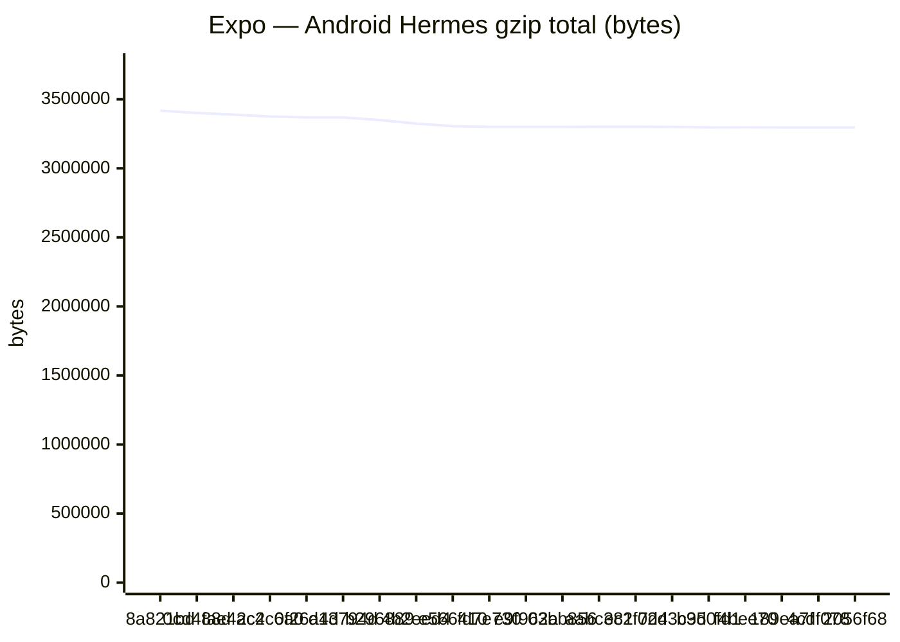
```mermaid
xychart-beta
    title "Expo — Android Hermes gzip total (bytes)"
    x-axis ["8a821bd", "0cd488d", "fae42c2", "ac4c6a0", "0f26a4d", "d13794d", "b296889", "4b2eed4", "e566410", "fd7e730", "e9f962a", "03bb856", "aabc381", "ec2f02d", "7d43c9d", "b350fd1", "f4bee70", "189ea7f", "4cdf078", "2056f68"]
    y-axis "bytes" 0 --> 3759385
    line [3417622, 3400545, 3388765, 3375300, 3368860, 3368861, 3349208, 3324082, 3305549, 3300038, 3300034, 3300038, 3300630, 3300522, 3299950, 3296025, 3296632, 3296023, 3295973, 3295761]
```
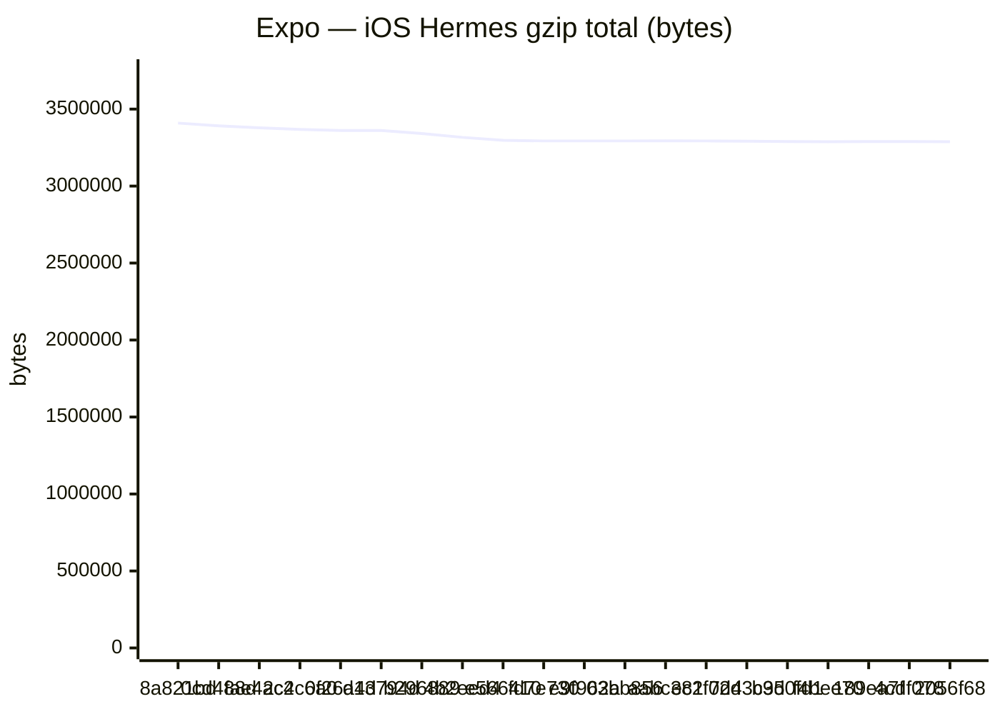
```mermaid
xychart-beta
    title "Expo — iOS Hermes gzip total (bytes)"
    x-axis ["8a821bd", "0cd488d", "fae42c2", "ac4c6a0", "0f26a4d", "d13794d", "b296889", "4b2eed4", "e566410", "fd7e730", "e9f962a", "03bb856", "aabc381", "ec2f02d", "7d43c9d", "b350fd1", "f4bee70", "189ea7f", "4cdf078", "2056f68"]
    y-axis "bytes" 0 --> 3750144
    line [3409221, 3391123, 3378280, 3368083, 3360774, 3360776, 3341646, 3316545, 3297734, 3293199, 3293198, 3293200, 3293409, 3293314, 3291396, 3288856, 3288399, 3288861, 3288877, 3288270]
```

