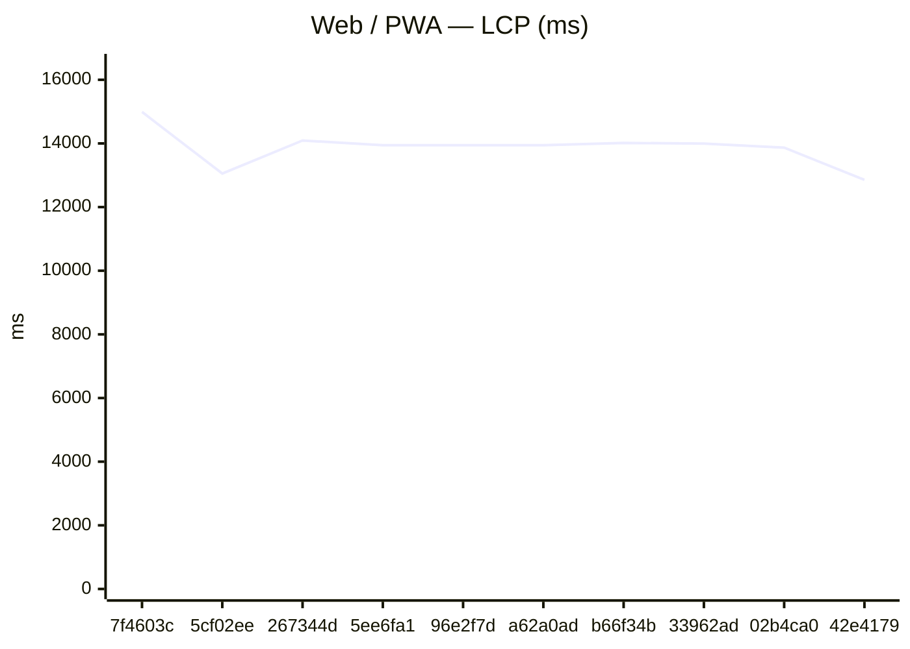
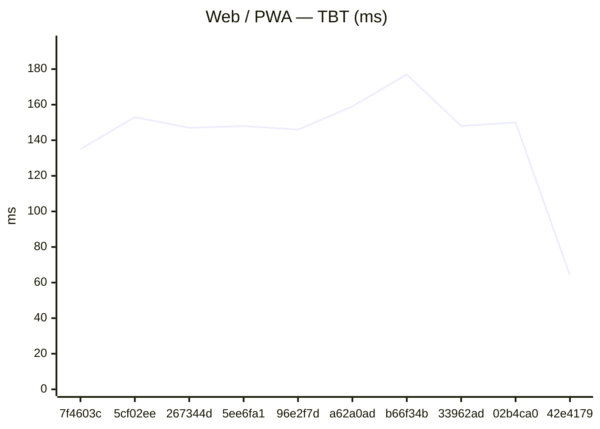
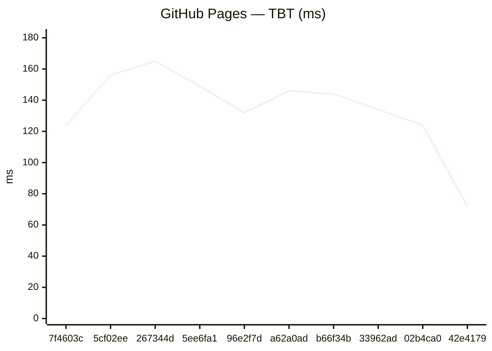
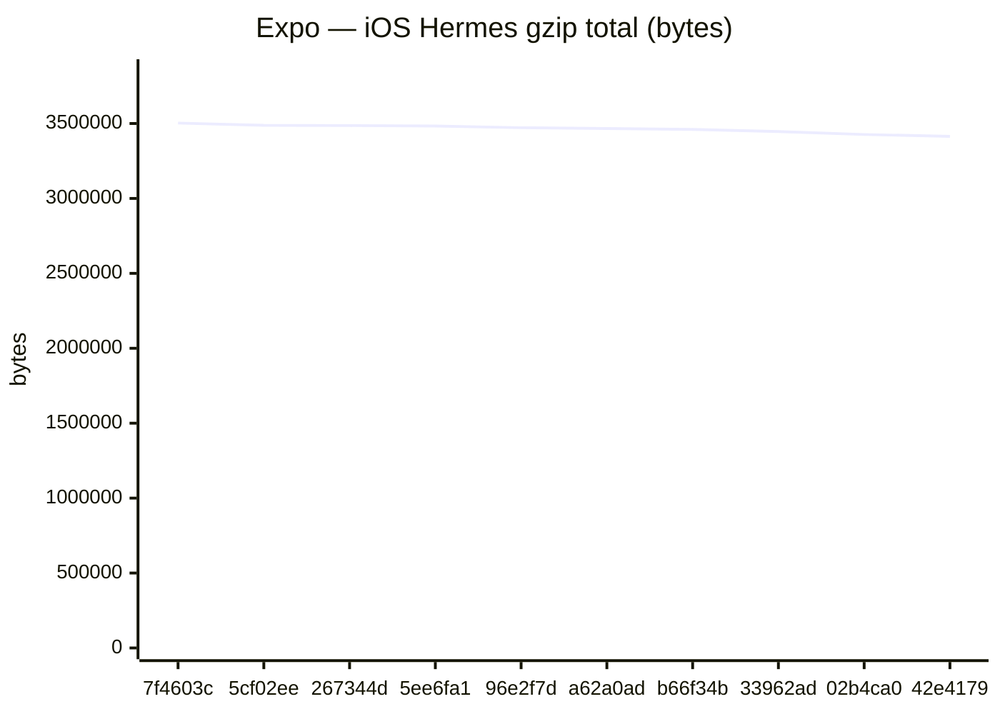
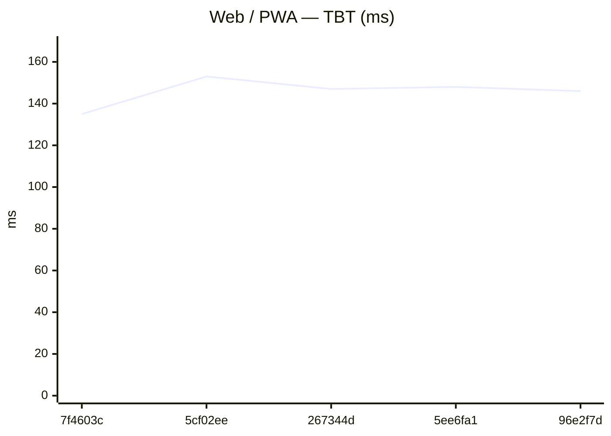
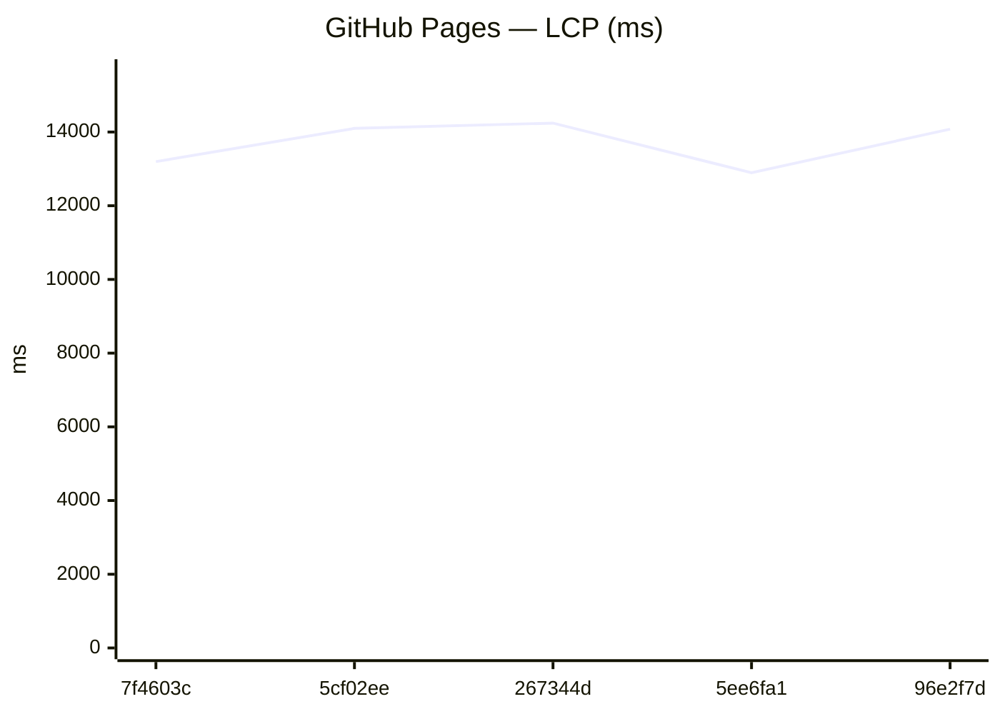
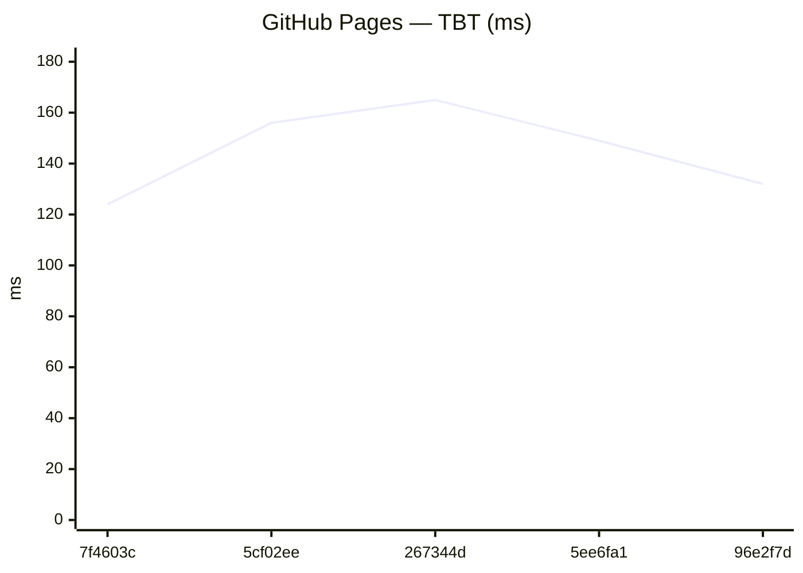
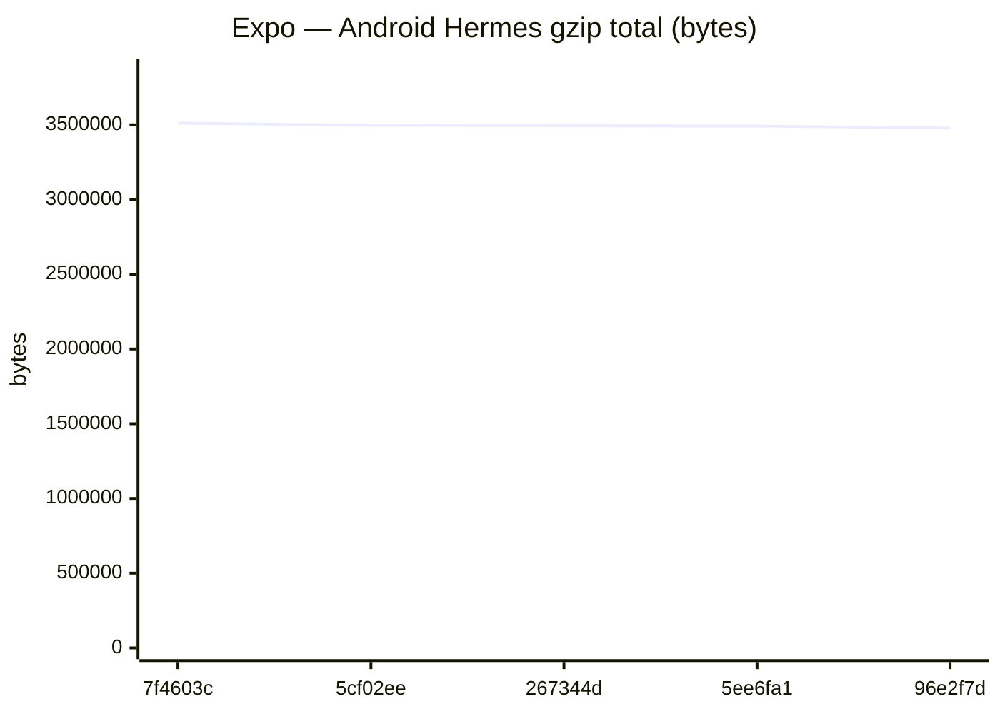
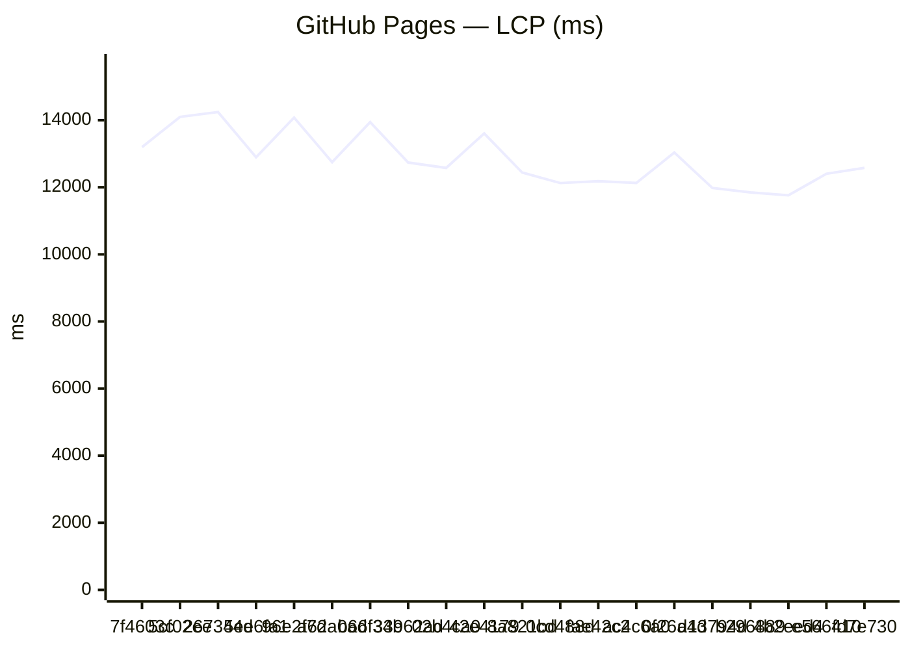
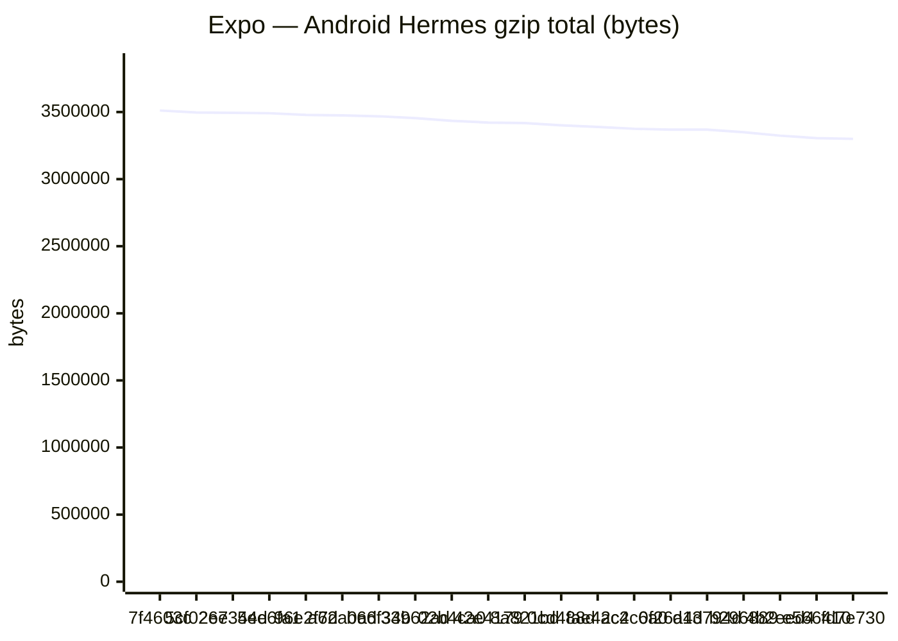

# Benchmark comparison (history)

Generated at **2026-06-19T18:07:00.334Z**.

To change the default number of runs in the primary sections below, edit **[compare.config.json](./compare.config.json)** (`window`). GitHub does not support interactive dropdowns in Markdown; optional **collapsed sections** list alternate window sizes.

---

### Web / PWA

| date | sha | status | LCP_ms | FCP_ms | TBT_ms | run |
| --- | --- | --- | --- | --- | --- | --- |
| 2026-06-19 18:04:36 | 7f4603c | ok | 14991 | 10498 | 135 | 27841255831 |
| 2026-06-19 17:23:49 | 5cf02ee | ok | 13053 | 8849 | 153 | 27839577970 |
| 2026-06-19 17:02:25 | 267344d | ok | 14092 | 9575 | 147 | 27838693379 |
| 2026-06-19 16:33:19 | 5ee6fa1 | ok | 13942 | 9058 | 148 | 27837449888 |
| 2026-06-19 16:08:01 | 96e2f7d | ok | 13945 | 8990 | 146 | 27836320613 |
| 2026-06-19 15:29:36 | a62a0ad | ok | 13945 | 9937 | 159 | 27834496354 |
| 2026-06-19 14:44:46 | b66f34b | ok | 14014 | 10046 | 177 | 27832305511 |
| 2026-06-19 14:16:17 | 33962ad | ok | 13997 | 10042 | 148 | 27830878522 |
| 2026-06-19 07:14:18 | 02b4ca0 | ok | 13868 | 8924 | 150 | 27811247840 |
| 2026-06-19 06:20:45 | 42e4179 | ok | 12854 | 8648 | 64 | 27809171398 |

### GitHub Pages

| date | sha | status | LCP_ms | FCP_ms | TBT_ms | run |
| --- | --- | --- | --- | --- | --- | --- |
| 2026-06-19 18:05:00 | 7f4603c | ok | 13197 | 8842 | 124 | 27841255831 |
| 2026-06-19 17:24:13 | 5cf02ee | ok | 14098 | 9743 | 156 | 27839577970 |
| 2026-06-19 17:02:48 | 267344d | ok | 14242 | 8860 | 165 | 27838693379 |
| 2026-06-19 16:33:42 | 5ee6fa1 | ok | 12895 | 8837 | 149 | 27837449888 |
| 2026-06-19 16:08:24 | 96e2f7d | ok | 14078 | 8974 | 132 | 27836320613 |
| 2026-06-19 15:29:59 | a62a0ad | ok | 12749 | 8842 | 146 | 27834496354 |
| 2026-06-19 14:45:09 | b66f34b | ok | 13943 | 8706 | 144 | 27832305511 |
| 2026-06-19 14:16:40 | 33962ad | ok | 12738 | 8833 | 134 | 27830878522 |
| 2026-06-19 07:14:41 | 02b4ca0 | ok | 12578 | 8674 | 124 | 27811247840 |
| 2026-06-19 06:21:07 | 42e4179 | ok | 13605 | 8661 | 72 | 27809171398 |

### Capacitor (legacy)
_No history yet._

### Expo / RN bundles

Aggregates: **sum of gzip bytes** across all `.hbc` files per platform (stable for trends when chunk hashes change).

| date | sha | status | android_gzip | ios_gzip | run |
| --- | --- | --- | --- | --- | --- |
| 2026-06-19 18:06:36 | 7f4603c | ok | 3511474 | 3502937 | 27841255831 |
| 2026-06-19 17:25:18 | 5cf02ee | ok | 3496393 | 3488256 | 27839577970 |
| 2026-06-19 17:04:23 | 267344d | ok | 3494445 | 3486228 | 27838693379 |
| 2026-06-19 16:35:08 | 5ee6fa1 | ok | 3491111 | 3483393 | 27837449888 |
| 2026-06-19 16:09:36 | 96e2f7d | ok | 3478911 | 3471867 | 27836320613 |
| 2026-06-19 15:31:12 | a62a0ad | ok | 3474606 | 3466755 | 27834496354 |
| 2026-06-19 14:46:46 | b66f34b | ok | 3468338 | 3460455 | 27832305511 |
| 2026-06-19 14:17:42 | 33962ad | ok | 3454266 | 3446796 | 27830878522 |
| 2026-06-19 07:15:58 | 02b4ca0 | ok | 3434635 | 3426562 | 27811247840 |
| 2026-06-19 06:22:12 | 42e4179 | ok | 3421569 | 3414256 | 27809171398 |

Last <strong>5</strong> runs (all platforms)

### Web / PWA

| date | sha | status | LCP_ms | FCP_ms | TBT_ms | run |
| --- | --- | --- | --- | --- | --- | --- |
| 2026-06-19 18:04:36 | 7f4603c | ok | 14991 | 10498 | 135 | 27841255831 |
| 2026-06-19 17:23:49 | 5cf02ee | ok | 13053 | 8849 | 153 | 27839577970 |
| 2026-06-19 17:02:25 | 267344d | ok | 14092 | 9575 | 147 | 27838693379 |
| 2026-06-19 16:33:19 | 5ee6fa1 | ok | 13942 | 9058 | 148 | 27837449888 |
| 2026-06-19 16:08:01 | 96e2f7d | ok | 13945 | 8990 | 146 | 27836320613 |

### GitHub Pages

| date | sha | status | LCP_ms | FCP_ms | TBT_ms | run |
| --- | --- | --- | --- | --- | --- | --- |
| 2026-06-19 18:05:00 | 7f4603c | ok | 13197 | 8842 | 124 | 27841255831 |
| 2026-06-19 17:24:13 | 5cf02ee | ok | 14098 | 9743 | 156 | 27839577970 |
| 2026-06-19 17:02:48 | 267344d | ok | 14242 | 8860 | 165 | 27838693379 |
| 2026-06-19 16:33:42 | 5ee6fa1 | ok | 12895 | 8837 | 149 | 27837449888 |
| 2026-06-19 16:08:24 | 96e2f7d | ok | 14078 | 8974 | 132 | 27836320613 |

### Capacitor (legacy)
_No history yet._

### Expo / RN bundles

Aggregates: **sum of gzip bytes** across all `.hbc` files per platform (stable for trends when chunk hashes change).

| date | sha | status | android_gzip | ios_gzip | run |
| --- | --- | --- | --- | --- | --- |
| 2026-06-19 18:06:36 | 7f4603c | ok | 3511474 | 3502937 | 27841255831 |
| 2026-06-19 17:25:18 | 5cf02ee | ok | 3496393 | 3488256 | 27839577970 |
| 2026-06-19 17:04:23 | 267344d | ok | 3494445 | 3486228 | 27838693379 |
| 2026-06-19 16:35:08 | 5ee6fa1 | ok | 3491111 | 3483393 | 27837449888 |
| 2026-06-19 16:09:36 | 96e2f7d | ok | 3478911 | 3471867 | 27836320613 |

Last <strong>20</strong> runs (all platforms)

### Web / PWA

| date | sha | status | LCP_ms | FCP_ms | TBT_ms | run |
| --- | --- | --- | --- | --- | --- | --- |
| 2026-06-19 18:04:36 | 7f4603c | ok | 14991 | 10498 | 135 | 27841255831 |
| 2026-06-19 17:23:49 | 5cf02ee | ok | 13053 | 8849 | 153 | 27839577970 |
| 2026-06-19 17:02:25 | 267344d | ok | 14092 | 9575 | 147 | 27838693379 |
| 2026-06-19 16:33:19 | 5ee6fa1 | ok | 13942 | 9058 | 148 | 27837449888 |
| 2026-06-19 16:08:01 | 96e2f7d | ok | 13945 | 8990 | 146 | 27836320613 |
| 2026-06-19 15:29:36 | a62a0ad | ok | 13945 | 9937 | 159 | 27834496354 |
| 2026-06-19 14:44:46 | b66f34b | ok | 14014 | 10046 | 177 | 27832305511 |
| 2026-06-19 14:16:17 | 33962ad | ok | 13997 | 10042 | 148 | 27830878522 |
| 2026-06-19 07:14:18 | 02b4ca0 | ok | 13868 | 8924 | 150 | 27811247840 |
| 2026-06-19 06:20:45 | 42e4179 | ok | 12854 | 8648 | 64 | 27809171398 |
| 2026-06-19 05:58:35 | 8a821bd | ok | 12437 | 8682 | 116 | 27808359407 |
| 2026-06-19 05:17:34 | 0cd488d | ok | 12430 | 8720 | 131 | 27806960853 |
| 2026-06-18 22:23:33 | fae42c2 | ok | 12295 | 8691 | 136 | 27792882132 |
| 2026-06-18 21:36:15 | ac4c6a0 | ok | 13197 | 9894 | 154 | 27790728070 |
| 2026-06-18 20:56:32 | 0f26a4d | ok | 13323 | 9880 | 127 | 27788620761 |
| 2026-06-18 19:57:33 | d13794d | ok | 13038 | 9734 | 120 | 27785501975 |
| 2026-06-18 19:08:40 | b296889 | ok | 12168 | 8452 | 199 | 27782910961 |
| 2026-06-18 17:41:26 | 4b2eed4 | ok | 11999 | 8607 | 132 | 27778067467 |
| 2026-06-18 17:00:25 | e566410 | ok | 12553 | 9255 | 65 | 27775707987 |
| 2026-06-18 16:30:03 | fd7e730 | ok | 11687 | 8610 | 111 | 27774025951 |

### GitHub Pages

| date | sha | status | LCP_ms | FCP_ms | TBT_ms | run |
| --- | --- | --- | --- | --- | --- | --- |
| 2026-06-19 18:05:00 | 7f4603c | ok | 13197 | 8842 | 124 | 27841255831 |
| 2026-06-19 17:24:13 | 5cf02ee | ok | 14098 | 9743 | 156 | 27839577970 |
| 2026-06-19 17:02:48 | 267344d | ok | 14242 | 8860 | 165 | 27838693379 |
| 2026-06-19 16:33:42 | 5ee6fa1 | ok | 12895 | 8837 | 149 | 27837449888 |
| 2026-06-19 16:08:24 | 96e2f7d | ok | 14078 | 8974 | 132 | 27836320613 |
| 2026-06-19 15:29:59 | a62a0ad | ok | 12749 | 8842 | 146 | 27834496354 |
| 2026-06-19 14:45:09 | b66f34b | ok | 13943 | 8706 | 144 | 27832305511 |
| 2026-06-19 14:16:40 | 33962ad | ok | 12738 | 8833 | 134 | 27830878522 |
| 2026-06-19 07:14:41 | 02b4ca0 | ok | 12578 | 8674 | 124 | 27811247840 |
| 2026-06-19 06:21:07 | 42e4179 | ok | 13605 | 8661 | 72 | 27809171398 |
| 2026-06-19 05:58:59 | 8a821bd | ok | 12438 | 8685 | 122 | 27808359407 |
| 2026-06-19 05:17:58 | 0cd488d | ok | 12126 | 8673 | 129 | 27806960853 |
| 2026-06-18 22:23:57 | fae42c2 | ok | 12180 | 8678 | 130 | 27792882132 |
| 2026-06-18 21:36:38 | ac4c6a0 | ok | 12127 | 8691 | 118 | 27790728070 |
| 2026-06-18 20:56:54 | 0f26a4d | ok | 13036 | 9283 | 122 | 27788620761 |
| 2026-06-18 19:57:55 | d13794d | ok | 11979 | 8601 | 115 | 27785501975 |
| 2026-06-18 19:09:03 | b296889 | ok | 11847 | 8393 | 110 | 27782910961 |
| 2026-06-18 17:41:48 | 4b2eed4 | ok | 11759 | 8376 | 120 | 27778067467 |
| 2026-06-18 17:00:46 | e566410 | ok | 12402 | 9249 | 71 | 27775707987 |
| 2026-06-18 16:30:26 | fd7e730 | ok | 12580 | 8376 | 109 | 27774025951 |

### Capacitor (legacy)
_No history yet._

### Expo / RN bundles

Aggregates: **sum of gzip bytes** across all `.hbc` files per platform (stable for trends when chunk hashes change).

| date | sha | status | android_gzip | ios_gzip | run |
| --- | --- | --- | --- | --- | --- |
| 2026-06-19 18:06:36 | 7f4603c | ok | 3511474 | 3502937 | 27841255831 |
| 2026-06-19 17:25:18 | 5cf02ee | ok | 3496393 | 3488256 | 27839577970 |
| 2026-06-19 17:04:23 | 267344d | ok | 3494445 | 3486228 | 27838693379 |
| 2026-06-19 16:35:08 | 5ee6fa1 | ok | 3491111 | 3483393 | 27837449888 |
| 2026-06-19 16:09:36 | 96e2f7d | ok | 3478911 | 3471867 | 27836320613 |
| 2026-06-19 15:31:12 | a62a0ad | ok | 3474606 | 3466755 | 27834496354 |
| 2026-06-19 14:46:46 | b66f34b | ok | 3468338 | 3460455 | 27832305511 |
| 2026-06-19 14:17:42 | 33962ad | ok | 3454266 | 3446796 | 27830878522 |
| 2026-06-19 07:15:58 | 02b4ca0 | ok | 3434635 | 3426562 | 27811247840 |
| 2026-06-19 06:22:12 | 42e4179 | ok | 3421569 | 3414256 | 27809171398 |
| 2026-06-19 06:00:24 | 8a821bd | ok | 3417622 | 3409221 | 27808359407 |
| 2026-06-19 05:19:15 | 0cd488d | ok | 3400545 | 3391123 | 27806960853 |
| 2026-06-18 22:24:11 | fae42c2 | ok | 3388765 | 3378280 | 27792882132 |
| 2026-06-18 21:38:25 | ac4c6a0 | ok | 3375300 | 3368083 | 27790728070 |
| 2026-06-18 20:57:02 | 0f26a4d | ok | 3368860 | 3360774 | 27788620761 |
| 2026-06-18 19:59:02 | d13794d | ok | 3368861 | 3360776 | 27785501975 |
| 2026-06-18 19:09:33 | b296889 | ok | 3349208 | 3341646 | 27782910961 |
| 2026-06-18 17:42:51 | 4b2eed4 | ok | 3324082 | 3316545 | 27778067467 |
| 2026-06-18 17:01:52 | e566410 | ok | 3305549 | 3297734 | 27775707987 |
| 2026-06-18 16:31:53 | fd7e730 | ok | 3300038 | 3293199 | 27774025951 |

