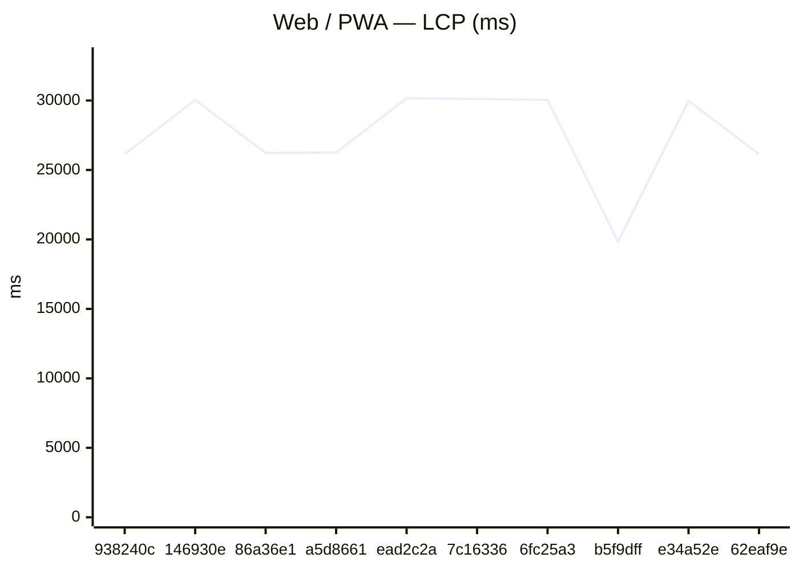
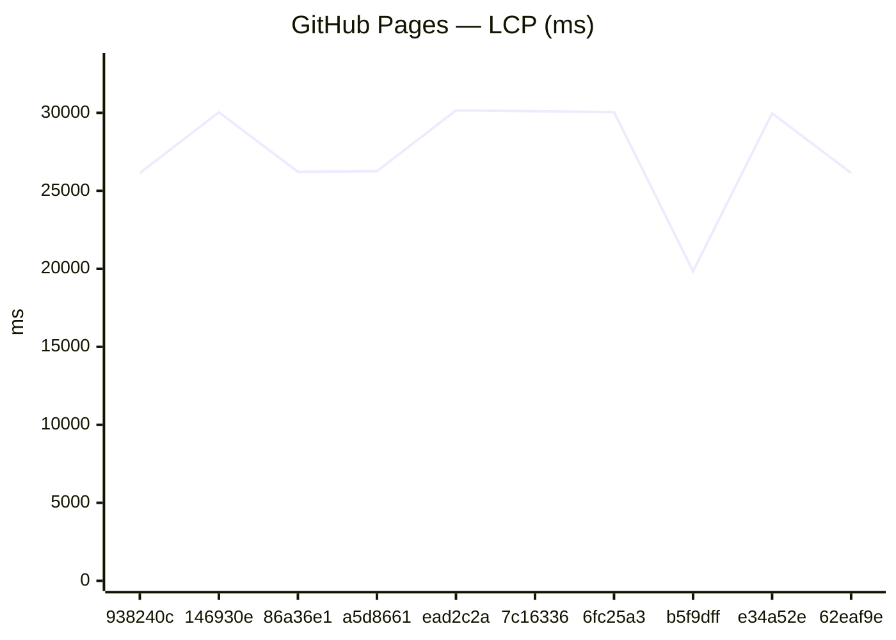
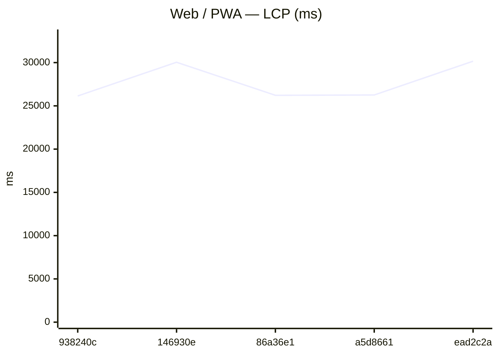
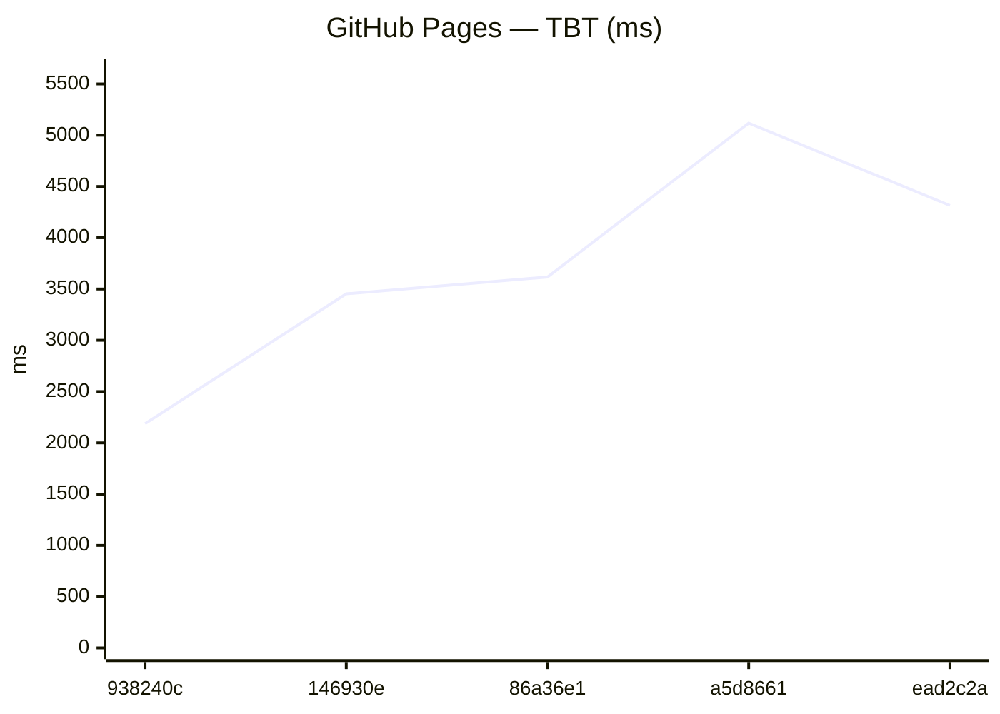
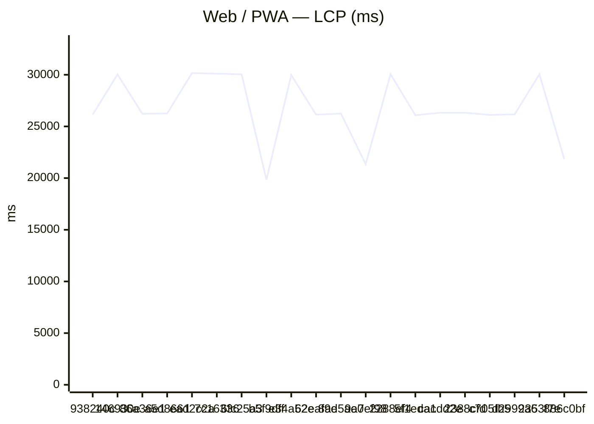
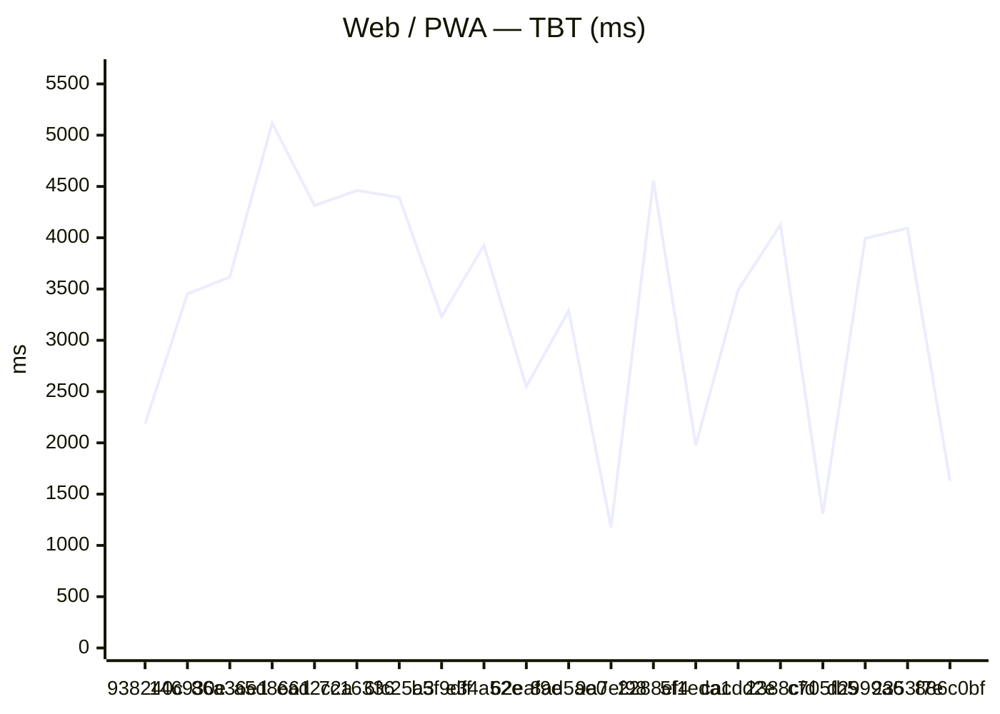
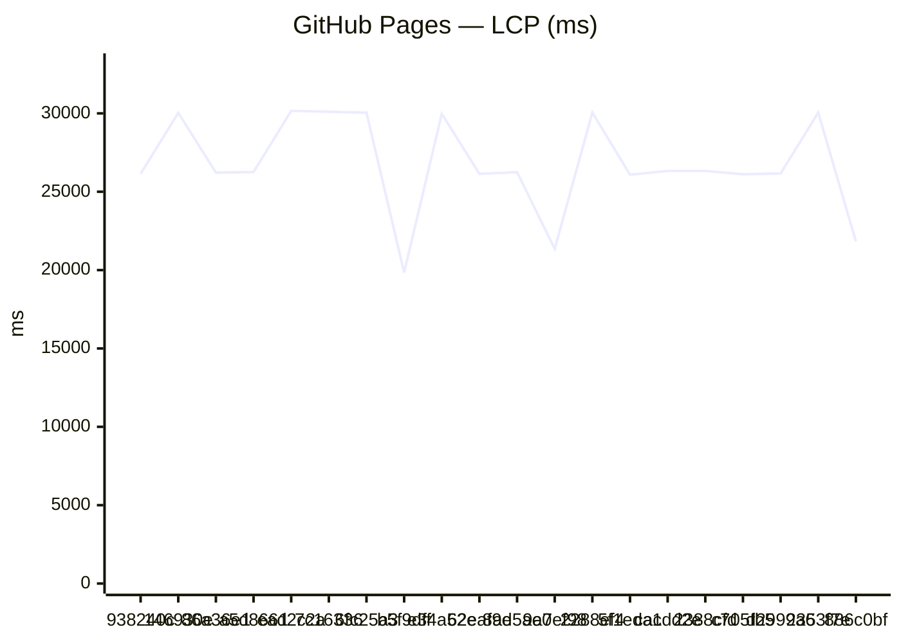
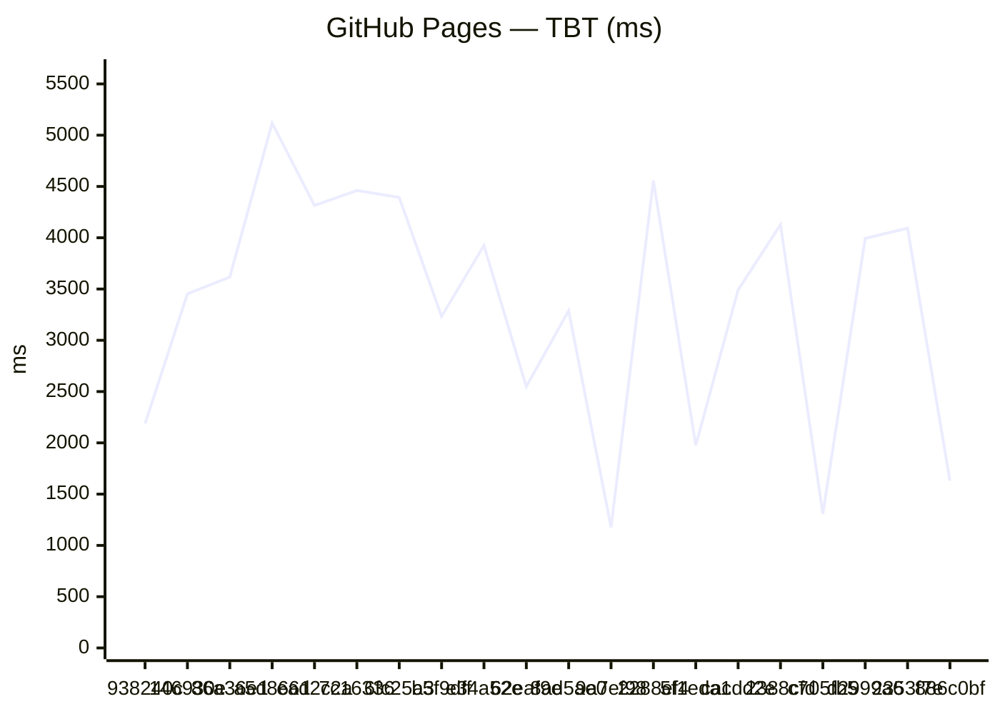

# Benchmark comparison (history)

Generated at **2026-08-10T11:30:47.067Z**.

To change the default number of runs in the primary sections below, edit **[compare.config.json](./compare.config.json)** (`window`). GitHub does not support interactive dropdowns in Markdown; optional **collapsed sections** list alternate window sizes.

---

### Web / PWA

| date | sha | status | LCP_ms | FCP_ms | TBT_ms | run |
| --- | --- | --- | --- | --- | --- | --- |
| 2026-08-10 11:30:24 | 938240c | ok | 26143 | 11902 | 2187 | 31383652813 |
| 2026-08-05 08:52:34 | 146930e | ok | 30039 | 11882 | 3453 | 30990664629 |
| 2026-08-04 20:52:53 | 86a36e1 | ok | 26222 | 11859 | 3617 | 30949689308 |
| 2026-08-02 13:37:05 | a5d8661 | ok | 26258 | 7884 | 5118 | 30750166148 |
| 2026-08-02 13:30:57 | ead2c2a | ok | 30162 | 12756 | 4315 | 30750011531 |
| 2026-08-02 13:22:47 | 7c16336 | ok | 30106 | 11807 | 4460 | 30749724026 |
| 2026-08-02 13:11:29 | 6fc25a3 | ok | 30044 | 11857 | 4393 | 30749323426 |
| 2026-08-02 12:15:57 | b5f9dff | ok | 19849 | 11843 | 3233 | 30747387246 |
| 2026-08-02 12:05:40 | e34a52e | ok | 29974 | 11853 | 3925 | 30747025093 |
| 2026-08-02 11:55:41 | 62eaf9e | ok | 26139 | 12358 | 2549 | 30746671547 |

### GitHub Pages

| date | sha | status | LCP_ms | FCP_ms | TBT_ms | run |
| --- | --- | --- | --- | --- | --- | --- |
| 2026-08-10 11:30:24 | 938240c | ok | 26143 | 11902 | 2187 | 31383652813 |
| 2026-08-05 08:52:34 | 146930e | ok | 30039 | 11882 | 3453 | 30990664629 |
| 2026-08-04 20:52:53 | 86a36e1 | ok | 26222 | 11859 | 3617 | 30949689308 |
| 2026-08-02 13:37:05 | a5d8661 | ok | 26258 | 7884 | 5118 | 30750166148 |
| 2026-08-02 13:30:57 | ead2c2a | ok | 30162 | 12756 | 4315 | 30750011531 |
| 2026-08-02 13:22:47 | 7c16336 | ok | 30106 | 11807 | 4460 | 30749724026 |
| 2026-08-02 13:11:29 | 6fc25a3 | ok | 30044 | 11857 | 4393 | 30749323426 |
| 2026-08-02 12:15:57 | b5f9dff | ok | 19849 | 11843 | 3233 | 30747387246 |
| 2026-08-02 12:05:40 | e34a52e | ok | 29974 | 11853 | 3925 | 30747025093 |
| 2026-08-02 11:55:41 | 62eaf9e | ok | 26139 | 12358 | 2549 | 30746671547 |

Last <strong>5</strong> runs (all platforms)

### Web / PWA

| date | sha | status | LCP_ms | FCP_ms | TBT_ms | run |
| --- | --- | --- | --- | --- | --- | --- |
| 2026-08-10 11:30:24 | 938240c | ok | 26143 | 11902 | 2187 | 31383652813 |
| 2026-08-05 08:52:34 | 146930e | ok | 30039 | 11882 | 3453 | 30990664629 |
| 2026-08-04 20:52:53 | 86a36e1 | ok | 26222 | 11859 | 3617 | 30949689308 |
| 2026-08-02 13:37:05 | a5d8661 | ok | 26258 | 7884 | 5118 | 30750166148 |
| 2026-08-02 13:30:57 | ead2c2a | ok | 30162 | 12756 | 4315 | 30750011531 |

### GitHub Pages

| date | sha | status | LCP_ms | FCP_ms | TBT_ms | run |
| --- | --- | --- | --- | --- | --- | --- |
| 2026-08-10 11:30:24 | 938240c | ok | 26143 | 11902 | 2187 | 31383652813 |
| 2026-08-05 08:52:34 | 146930e | ok | 30039 | 11882 | 3453 | 30990664629 |
| 2026-08-04 20:52:53 | 86a36e1 | ok | 26222 | 11859 | 3617 | 30949689308 |
| 2026-08-02 13:37:05 | a5d8661 | ok | 26258 | 7884 | 5118 | 30750166148 |
| 2026-08-02 13:30:57 | ead2c2a | ok | 30162 | 12756 | 4315 | 30750011531 |

Last <strong>20</strong> runs (all platforms)

### Web / PWA

| date | sha | status | LCP_ms | FCP_ms | TBT_ms | run |
| --- | --- | --- | --- | --- | --- | --- |
| 2026-08-10 11:30:24 | 938240c | ok | 26143 | 11902 | 2187 | 31383652813 |
| 2026-08-05 08:52:34 | 146930e | ok | 30039 | 11882 | 3453 | 30990664629 |
| 2026-08-04 20:52:53 | 86a36e1 | ok | 26222 | 11859 | 3617 | 30949689308 |
| 2026-08-02 13:37:05 | a5d8661 | ok | 26258 | 7884 | 5118 | 30750166148 |
| 2026-08-02 13:30:57 | ead2c2a | ok | 30162 | 12756 | 4315 | 30750011531 |
| 2026-08-02 13:22:47 | 7c16336 | ok | 30106 | 11807 | 4460 | 30749724026 |
| 2026-08-02 13:11:29 | 6fc25a3 | ok | 30044 | 11857 | 4393 | 30749323426 |
| 2026-08-02 12:15:57 | b5f9dff | ok | 19849 | 11843 | 3233 | 30747387246 |
| 2026-08-02 12:05:40 | e34a52e | ok | 29974 | 11853 | 3925 | 30747025093 |
| 2026-08-02 11:55:41 | 62eaf9e | ok | 26139 | 12358 | 2549 | 30746671547 |
| 2026-08-02 11:42:42 | 8ad5ae0 | ok | 26251 | 11795 | 3289 | 30746233261 |
| 2026-07-29 22:50:15 | 9a7ef98 | ok | 21355 | 7809 | 1175 | 30497104541 |
| 2026-07-25 12:43:43 | 2288ef4 | ok | 30056 | 11861 | 4558 | 30158247061 |
| 2026-07-25 12:08:06 | 5f1eda1 | ok | 26085 | 11050 | 1976 | 30157390494 |
| 2026-07-25 11:59:21 | cacdd2e | ok | 26327 | 7885 | 3491 | 30157115144 |
| 2026-07-19 19:04:23 | 2388cfd | ok | 26326 | 7884 | 4127 | 29699802343 |
| 2026-07-19 18:51:10 | c705fb5 | ok | 26120 | 7810 | 1307 | 29699366587 |
| 2026-07-19 10:46:19 | d2999a6 | ok | 26164 | 11791 | 3994 | 29683857205 |
| 2026-07-19 02:23:15 | 2353f7e | ok | 30047 | 11746 | 4093 | 29670057411 |
| 2026-07-18 22:45:17 | 886c0bf | ok | 21835 | 11810 | 1630 | 29663952972 |

### GitHub Pages

| date | sha | status | LCP_ms | FCP_ms | TBT_ms | run |
| --- | --- | --- | --- | --- | --- | --- |
| 2026-08-10 11:30:24 | 938240c | ok | 26143 | 11902 | 2187 | 31383652813 |
| 2026-08-05 08:52:34 | 146930e | ok | 30039 | 11882 | 3453 | 30990664629 |
| 2026-08-04 20:52:53 | 86a36e1 | ok | 26222 | 11859 | 3617 | 30949689308 |
| 2026-08-02 13:37:05 | a5d8661 | ok | 26258 | 7884 | 5118 | 30750166148 |
| 2026-08-02 13:30:57 | ead2c2a | ok | 30162 | 12756 | 4315 | 30750011531 |
| 2026-08-02 13:22:47 | 7c16336 | ok | 30106 | 11807 | 4460 | 30749724026 |
| 2026-08-02 13:11:29 | 6fc25a3 | ok | 30044 | 11857 | 4393 | 30749323426 |
| 2026-08-02 12:15:57 | b5f9dff | ok | 19849 | 11843 | 3233 | 30747387246 |
| 2026-08-02 12:05:40 | e34a52e | ok | 29974 | 11853 | 3925 | 30747025093 |
| 2026-08-02 11:55:41 | 62eaf9e | ok | 26139 | 12358 | 2549 | 30746671547 |
| 2026-08-02 11:42:42 | 8ad5ae0 | ok | 26251 | 11795 | 3289 | 30746233261 |
| 2026-07-29 22:50:15 | 9a7ef98 | ok | 21355 | 7809 | 1175 | 30497104541 |
| 2026-07-25 12:43:43 | 2288ef4 | ok | 30056 | 11861 | 4558 | 30158247061 |
| 2026-07-25 12:08:06 | 5f1eda1 | ok | 26085 | 11050 | 1976 | 30157390494 |
| 2026-07-25 11:59:21 | cacdd2e | ok | 26327 | 7885 | 3491 | 30157115144 |
| 2026-07-19 19:04:23 | 2388cfd | ok | 26326 | 7884 | 4127 | 29699802343 |
| 2026-07-19 18:51:10 | c705fb5 | ok | 26120 | 7810 | 1307 | 29699366587 |
| 2026-07-19 10:46:19 | d2999a6 | ok | 26164 | 11791 | 3994 | 29683857205 |
| 2026-07-19 02:23:15 | 2353f7e | ok | 30047 | 11746 | 4093 | 29670057411 |
| 2026-07-18 22:45:17 | 886c0bf | ok | 21835 | 11810 | 1630 | 29663952972 |

