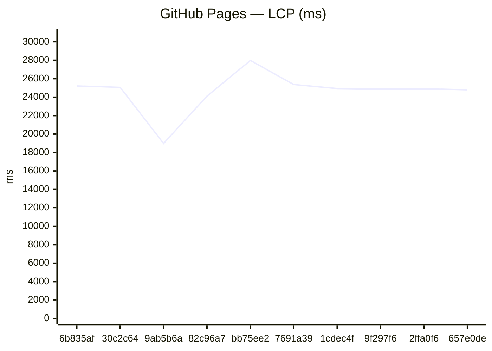
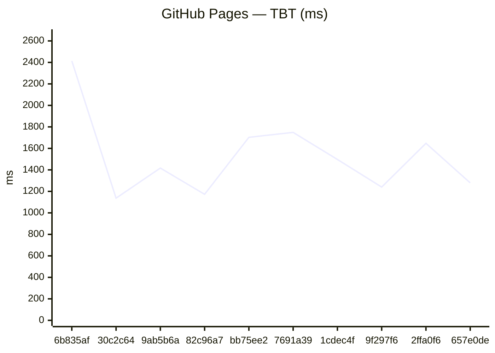
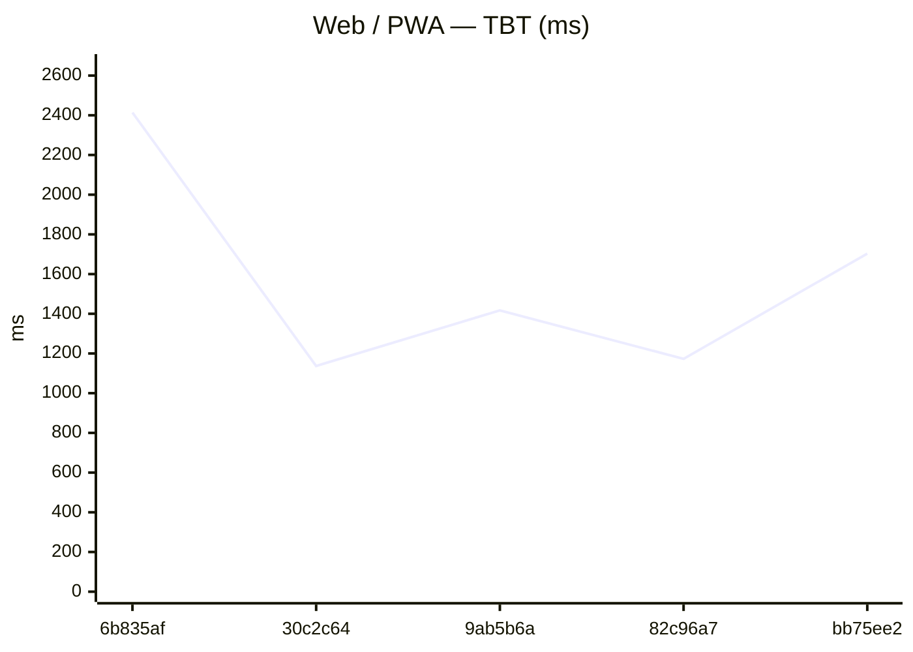
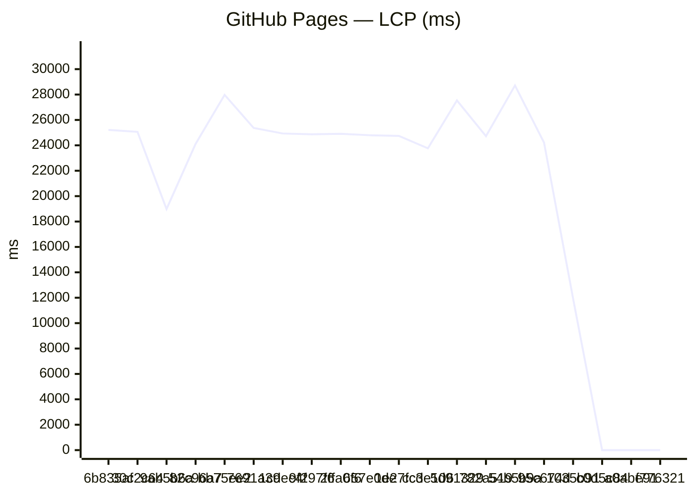
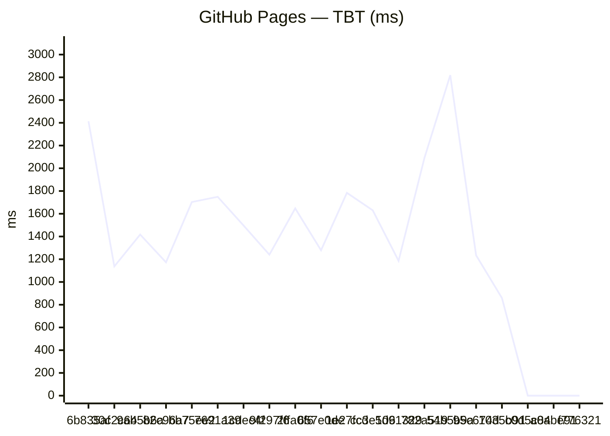

# Benchmark comparison (history)

Generated at **2026-07-18T17:21:33.681Z**.

To change the default number of runs in the primary sections below, edit **[compare.config.json](./compare.config.json)** (`window`). GitHub does not support interactive dropdowns in Markdown; optional **collapsed sections** list alternate window sizes.

---

### Web / PWA

| date | sha | status | LCP_ms | FCP_ms | TBT_ms | run |
| --- | --- | --- | --- | --- | --- | --- |
| 2026-07-18 17:21:08 | 6b835af | ok | 25215 | 7810 | 2414 | 29653660920 |
| 2026-07-18 14:30:21 | 30c2c64 | ok | 25064 | 11834 | 1137 | 29648074587 |
| 2026-07-17 19:36:37 | 9ab5b6a | ok | 18985 | 7809 | 1417 | 29608013937 |
| 2026-07-16 23:34:05 | 82c96a7 | ok | 24113 | 12314 | 1173 | 29542392416 |
| 2026-07-16 22:25:57 | bb75ee2 | ok | 27976 | 7814 | 1703 | 29539414426 |
| 2026-07-16 21:41:18 | 7691a39 | ok | 25370 | 11719 | 1749 | 29536835656 |
| 2026-07-16 16:14:30 | 1cdec4f | ok | 24933 | 11604 | 1497 | 29514595695 |
| 2026-07-16 13:16:59 | 9f297f6 | ok | 24873 | 11717 | 1240 | 29501373326 |
| 2026-07-16 12:35:03 | 2ffa0f6 | ok | 24910 | 11723 | 1647 | 29498560447 |
| 2026-07-15 21:49:00 | 657e0de | ok | 24797 | 10708 | 1279 | 29453124783 |


### GitHub Pages

| date | sha | status | LCP_ms | FCP_ms | TBT_ms | run |
| --- | --- | --- | --- | --- | --- | --- |
| 2026-07-18 17:21:08 | 6b835af | ok | 25215 | 7810 | 2414 | 29653660920 |
| 2026-07-18 14:30:21 | 30c2c64 | ok | 25064 | 11834 | 1137 | 29648074587 |
| 2026-07-17 19:36:37 | 9ab5b6a | ok | 18985 | 7809 | 1417 | 29608013937 |
| 2026-07-16 23:34:05 | 82c96a7 | ok | 24113 | 12314 | 1173 | 29542392416 |
| 2026-07-16 22:25:57 | bb75ee2 | ok | 27976 | 7814 | 1703 | 29539414426 |
| 2026-07-16 21:41:18 | 7691a39 | ok | 25370 | 11719 | 1749 | 29536835656 |
| 2026-07-16 16:14:30 | 1cdec4f | ok | 24933 | 11604 | 1497 | 29514595695 |
| 2026-07-16 13:16:59 | 9f297f6 | ok | 24873 | 11717 | 1240 | 29501373326 |
| 2026-07-16 12:35:03 | 2ffa0f6 | ok | 24910 | 11723 | 1647 | 29498560447 |
| 2026-07-15 21:49:00 | 657e0de | ok | 24797 | 10708 | 1279 | 29453124783 |




<details>
<summary>Last <strong>5</strong> runs (all platforms)</summary>

### Web / PWA

| date | sha | status | LCP_ms | FCP_ms | TBT_ms | run |
| --- | --- | --- | --- | --- | --- | --- |
| 2026-07-18 17:21:08 | 6b835af | ok | 25215 | 7810 | 2414 | 29653660920 |
| 2026-07-18 14:30:21 | 30c2c64 | ok | 25064 | 11834 | 1137 | 29648074587 |
| 2026-07-17 19:36:37 | 9ab5b6a | ok | 18985 | 7809 | 1417 | 29608013937 |
| 2026-07-16 23:34:05 | 82c96a7 | ok | 24113 | 12314 | 1173 | 29542392416 |
| 2026-07-16 22:25:57 | bb75ee2 | ok | 27976 | 7814 | 1703 | 29539414426 |




### GitHub Pages

| date | sha | status | LCP_ms | FCP_ms | TBT_ms | run |
| --- | --- | --- | --- | --- | --- | --- |
| 2026-07-18 17:21:08 | 6b835af | ok | 25215 | 7810 | 2414 | 29653660920 |
| 2026-07-18 14:30:21 | 30c2c64 | ok | 25064 | 11834 | 1137 | 29648074587 |
| 2026-07-17 19:36:37 | 9ab5b6a | ok | 18985 | 7809 | 1417 | 29608013937 |
| 2026-07-16 23:34:05 | 82c96a7 | ok | 24113 | 12314 | 1173 | 29542392416 |
| 2026-07-16 22:25:57 | bb75ee2 | ok | 27976 | 7814 | 1703 | 29539414426 |


</details>

<details>
<summary>Last <strong>20</strong> runs (all platforms)</summary>

### Web / PWA

| date | sha | status | LCP_ms | FCP_ms | TBT_ms | run |
| --- | --- | --- | --- | --- | --- | --- |
| 2026-07-18 17:21:08 | 6b835af | ok | 25215 | 7810 | 2414 | 29653660920 |
| 2026-07-18 14:30:21 | 30c2c64 | ok | 25064 | 11834 | 1137 | 29648074587 |
| 2026-07-17 19:36:37 | 9ab5b6a | ok | 18985 | 7809 | 1417 | 29608013937 |
| 2026-07-16 23:34:05 | 82c96a7 | ok | 24113 | 12314 | 1173 | 29542392416 |
| 2026-07-16 22:25:57 | bb75ee2 | ok | 27976 | 7814 | 1703 | 29539414426 |
| 2026-07-16 21:41:18 | 7691a39 | ok | 25370 | 11719 | 1749 | 29536835656 |
| 2026-07-16 16:14:30 | 1cdec4f | ok | 24933 | 11604 | 1497 | 29514595695 |
| 2026-07-16 13:16:59 | 9f297f6 | ok | 24873 | 11717 | 1240 | 29501373326 |
| 2026-07-16 12:35:03 | 2ffa0f6 | ok | 24910 | 11723 | 1647 | 29498560447 |
| 2026-07-15 21:49:00 | 657e0de | ok | 24797 | 10708 | 1279 | 29453124783 |
| 2026-07-13 23:57:13 | 1e27fcd | ok | 24744 | 7663 | 1784 | 29293876957 |
| 2026-07-13 23:02:03 | cc3e106 | ok | 23765 | 10936 | 1630 | 29291578240 |
| 2026-07-13 22:20:19 | 5d91329 | ok | 27536 | 7663 | 1186 | 29289400686 |
| 2026-07-13 21:30:04 | 782a519 | ok | 24725 | 7658 | 2090 | 29286354034 |
| 2026-07-13 20:35:07 | 54b5b9a | ok | 28712 | 11011 | 2819 | 29282111300 |
| 2026-07-13 20:03:57 | 95c674d | ok | 24213 | 7662 | 1235 | 29280775524 |
| 2026-07-13 19:29:58 | 1035b91 | ok | 11936 | 7661 | 859 | 29278561731 |
| 2026-07-08 21:52:19 | c0d5c84 | ok | 21994 | 13748 | 521 | 28978196267 |
| 2026-07-08 21:17:37 | a0abe91 | ok | — | — | — | 28974575590 |
| 2026-07-07 23:09:46 | f776321 | ok | — | — | — | 28903623662 |

```mermaid
xychart-beta
    title "Web / PWA — LCP (ms)"
    x-axis ["6b835af", "30c2c64", "9ab5b6a", "82c96a7", "bb75ee2", "7691a39", "1cdec4f", "9f297f6", "2ffa0f6", "657e0de", "1e27fcd", "cc3e106", "5d91329", "782a519", "54b5b9a", "95c674d", "1035b91", "c0d5c84", "a0abe91", "f776321"]
    y-axis "ms" 0 --> 31584
    line [25215, 25064, 18985, 24113, 27976, 25370, 24933, 24873, 24910, 24797, 24744, 23765, 27536, 24725, 28712, 24213, 11936, 21994, 0, 0]
```


### GitHub Pages

| date | sha | status | LCP_ms | FCP_ms | TBT_ms | run |
| --- | --- | --- | --- | --- | --- | --- |
| 2026-07-18 17:21:08 | 6b835af | ok | 25215 | 7810 | 2414 | 29653660920 |
| 2026-07-18 14:30:21 | 30c2c64 | ok | 25064 | 11834 | 1137 | 29648074587 |
| 2026-07-17 19:36:37 | 9ab5b6a | ok | 18985 | 7809 | 1417 | 29608013937 |
| 2026-07-16 23:34:05 | 82c96a7 | ok | 24113 | 12314 | 1173 | 29542392416 |
| 2026-07-16 22:25:57 | bb75ee2 | ok | 27976 | 7814 | 1703 | 29539414426 |
| 2026-07-16 21:41:18 | 7691a39 | ok | 25370 | 11719 | 1749 | 29536835656 |
| 2026-07-16 16:14:30 | 1cdec4f | ok | 24933 | 11604 | 1497 | 29514595695 |
| 2026-07-16 13:16:59 | 9f297f6 | ok | 24873 | 11717 | 1240 | 29501373326 |
| 2026-07-16 12:35:03 | 2ffa0f6 | ok | 24910 | 11723 | 1647 | 29498560447 |
| 2026-07-15 21:49:00 | 657e0de | ok | 24797 | 10708 | 1279 | 29453124783 |
| 2026-07-13 23:57:13 | 1e27fcd | ok | 24744 | 7663 | 1784 | 29293876957 |
| 2026-07-13 23:02:03 | cc3e106 | ok | 23765 | 10936 | 1630 | 29291578240 |
| 2026-07-13 22:20:19 | 5d91329 | ok | 27536 | 7663 | 1186 | 29289400686 |
| 2026-07-13 21:30:04 | 782a519 | ok | 24725 | 7658 | 2090 | 29286354034 |
| 2026-07-13 20:35:07 | 54b5b9a | ok | 28712 | 11011 | 2819 | 29282111300 |
| 2026-07-13 20:03:57 | 95c674d | ok | 24213 | 7662 | 1235 | 29280775524 |
| 2026-07-13 19:29:58 | 1035b91 | ok | 11936 | 7661 | 859 | 29278561731 |
| 2026-07-08 22:21:17 | c0d5c84 | ok | — | — | — | 28978196267 |
| 2026-07-08 21:45:53 | a0abe91 | ok | — | — | — | 28974575590 |
| 2026-07-07 23:38:07 | f776321 | ok | — | — | — | 28903623662 |




</details>

