# Benchmark comparison (history)

Generated at **2026-06-17T22:27:28.907Z**.

To change the default number of runs in the primary sections below, edit **[compare.config.json](./compare.config.json)** (`window`). GitHub does not support interactive dropdowns in Markdown; optional **collapsed sections** list alternate window sizes.

---

### Web / PWA

| date | sha | status | LCP_ms | FCP_ms | TBT_ms | run |
| --- | --- | --- | --- | --- | --- | --- |
| 2026-06-17 22:25:04 | ec2f02d | ok | 12566 | 9562 | 75 | 27723559485 |
| 2026-06-17 21:47:48 | 7d43c9d | ok | 12399 | 9245 | 60 | 27721796875 |
| 2026-06-17 19:59:42 | b350fd1 | ok | 12420 | 9568 | 110 | 27715903744 |
| 2026-06-17 19:34:13 | f4bee70 | ok | 14457 | 9745 | 161 | 27714347810 |
| 2026-06-17 19:18:15 | 189ea7f | ok | 14459 | 10036 | 142 | 27713591407 |
| 2026-06-17 18:46:00 | 4cdf078 | ok | 13617 | 9710 | 88 | 27711771797 |
| 2026-06-17 15:37:50 | 2056f68 | ok | 14386 | 9959 | 135 | 27700771524 |
| 2026-06-17 14:58:40 | d0fb0f7 | ok | 14419 | 11095 | 159 | 27698239997 |
| 2026-06-17 14:11:26 | a53523f | ok | 13497 | 9742 | 160 | 27695103028 |
| 2026-06-17 13:32:18 | 95287e7 | ok | 13828 | 9729 | 153 | 27692598618 |

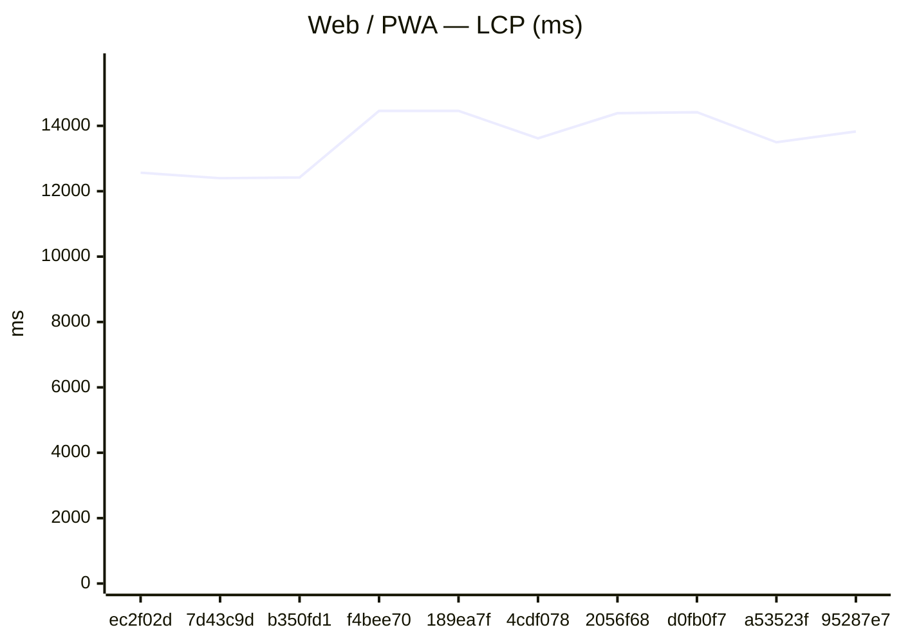

### GitHub Pages

| date | sha | status | LCP_ms | FCP_ms | TBT_ms | run |
| --- | --- | --- | --- | --- | --- | --- |
| 2026-06-17 22:25:26 | ec2f02d | ok | 11500 | 8352 | 62 | 27723559485 |
| 2026-06-17 21:48:10 | 7d43c9d | ok | 12552 | 9249 | 68 | 27721796875 |
| 2026-06-17 20:00:05 | b350fd1 | ok | 12421 | 9270 | 106 | 27715903744 |
| 2026-06-17 19:34:36 | f4bee70 | ok | 13612 | 9736 | 158 | 27714347810 |
| 2026-06-17 19:18:38 | 189ea7f | ok | 14591 | 10654 | 145 | 27713591407 |
| 2026-06-17 18:46:22 | 4cdf078 | ok | 14540 | 9660 | 107 | 27711771797 |
| 2026-06-17 15:38:13 | 2056f68 | ok | 13488 | 9737 | 135 | 27700771524 |
| 2026-06-17 14:59:03 | d0fb0f7 | ok | 14410 | 10518 | 165 | 27698239997 |
| 2026-06-17 14:11:51 | a53523f | ok | 14392 | 9750 | 137 | 27695103028 |
| 2026-06-17 13:32:41 | 95287e7 | ok | 14255 | 10502 | 129 | 27692598618 |

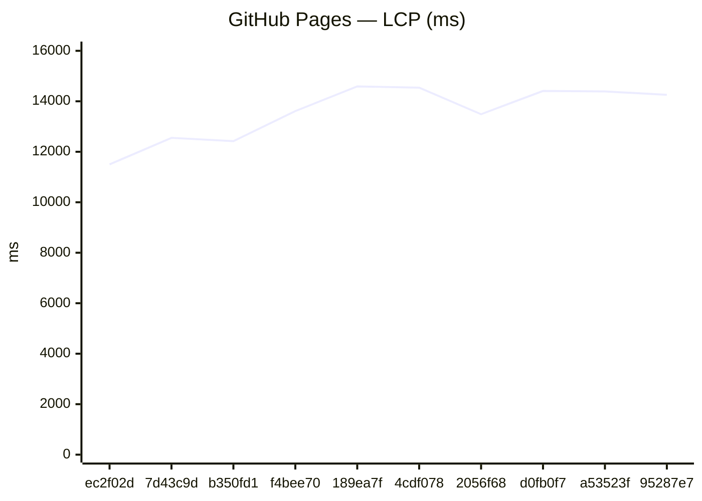
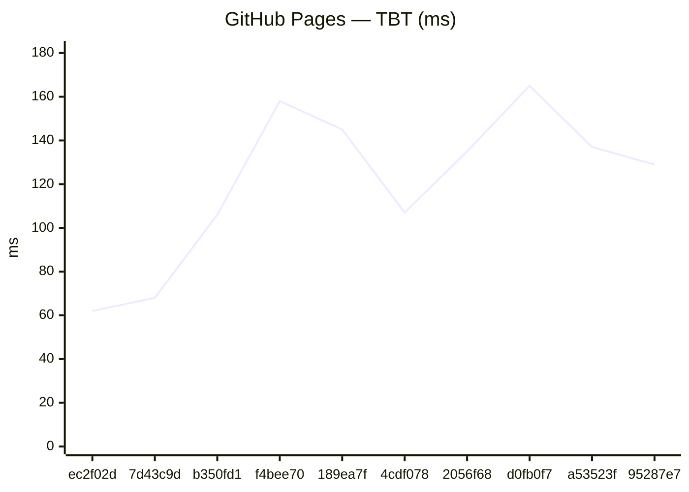

### Capacitor (legacy)
_No history yet._

### Expo / RN bundles

Aggregates: **sum of gzip bytes** across all `.hbc` files per platform (stable for trends when chunk hashes change).

| date | sha | status | android_gzip | ios_gzip | run |
| --- | --- | --- | --- | --- | --- |
| 2026-06-17 22:27:01 | ec2f02d | ok | 3300522 | 3293314 | 27723559485 |
| 2026-06-17 21:49:20 | 7d43c9d | ok | 3299950 | 3291396 | 27721796875 |
| 2026-06-17 20:01:54 | b350fd1 | ok | 3296025 | 3288856 | 27715903744 |
| 2026-06-17 19:35:53 | f4bee70 | ok | 3296632 | 3288399 | 27714347810 |
| 2026-06-17 19:19:46 | 189ea7f | ok | 3296023 | 3288861 | 27713591407 |
| 2026-06-17 18:47:53 | 4cdf078 | ok | 3295973 | 3288877 | 27711771797 |
| 2026-06-17 15:39:09 | 2056f68 | ok | 3295761 | 3288270 | 27700771524 |
| 2026-06-17 15:00:43 | d0fb0f7 | ok | 3295758 | 3288272 | 27698239997 |
| 2026-06-17 14:13:05 | a53523f | ok | 3295757 | 3288270 | 27695103028 |
| 2026-06-17 13:34:13 | 95287e7 | ok | 3291461 | 3283767 | 27692598618 |

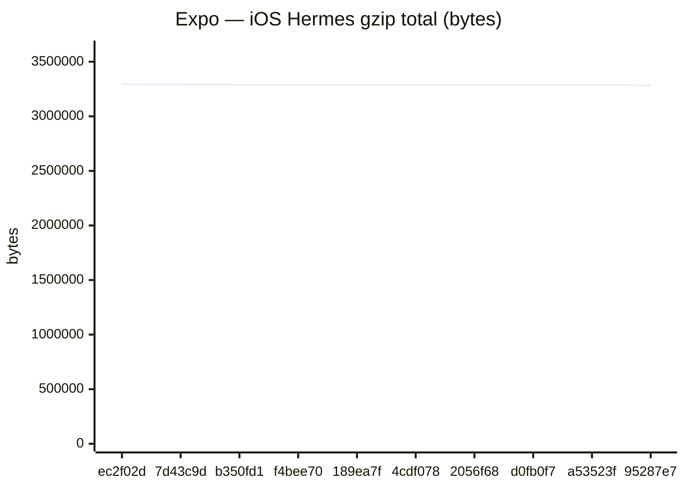

Last <strong>5</strong> runs (all platforms)

### Web / PWA

| date | sha | status | LCP_ms | FCP_ms | TBT_ms | run |
| --- | --- | --- | --- | --- | --- | --- |
| 2026-06-17 22:25:04 | ec2f02d | ok | 12566 | 9562 | 75 | 27723559485 |
| 2026-06-17 21:47:48 | 7d43c9d | ok | 12399 | 9245 | 60 | 27721796875 |
| 2026-06-17 19:59:42 | b350fd1 | ok | 12420 | 9568 | 110 | 27715903744 |
| 2026-06-17 19:34:13 | f4bee70 | ok | 14457 | 9745 | 161 | 27714347810 |
| 2026-06-17 19:18:15 | 189ea7f | ok | 14459 | 10036 | 142 | 27713591407 |

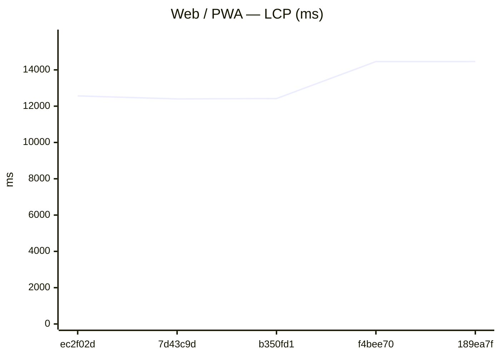
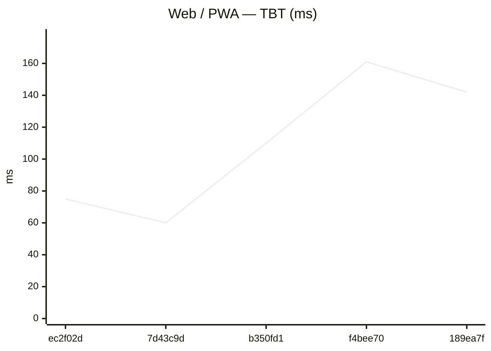

### GitHub Pages

| date | sha | status | LCP_ms | FCP_ms | TBT_ms | run |
| --- | --- | --- | --- | --- | --- | --- |
| 2026-06-17 22:25:26 | ec2f02d | ok | 11500 | 8352 | 62 | 27723559485 |
| 2026-06-17 21:48:10 | 7d43c9d | ok | 12552 | 9249 | 68 | 27721796875 |
| 2026-06-17 20:00:05 | b350fd1 | ok | 12421 | 9270 | 106 | 27715903744 |
| 2026-06-17 19:34:36 | f4bee70 | ok | 13612 | 9736 | 158 | 27714347810 |
| 2026-06-17 19:18:38 | 189ea7f | ok | 14591 | 10654 | 145 | 27713591407 |

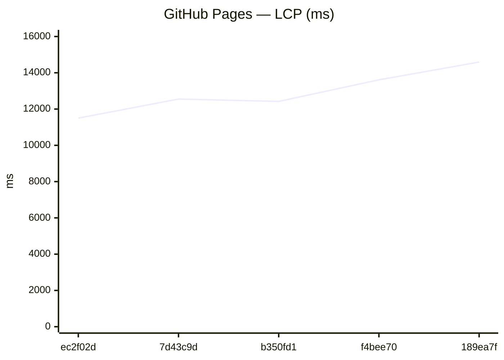
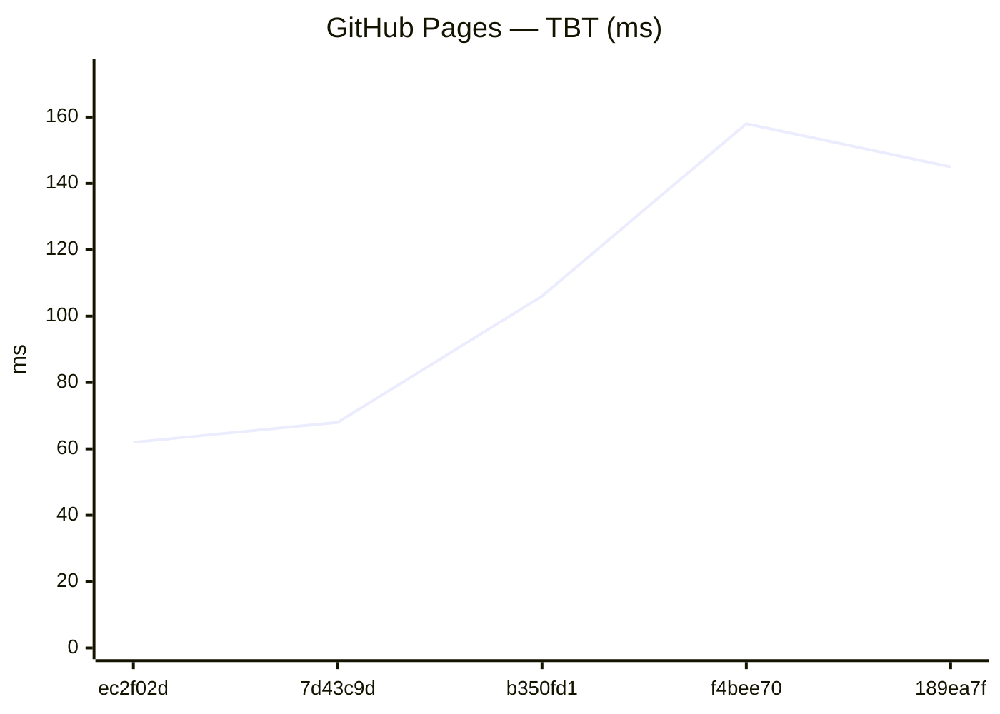

### Capacitor (legacy)
_No history yet._

### Expo / RN bundles

Aggregates: **sum of gzip bytes** across all `.hbc` files per platform (stable for trends when chunk hashes change).

| date | sha | status | android_gzip | ios_gzip | run |
| --- | --- | --- | --- | --- | --- |
| 2026-06-17 22:27:01 | ec2f02d | ok | 3300522 | 3293314 | 27723559485 |
| 2026-06-17 21:49:20 | 7d43c9d | ok | 3299950 | 3291396 | 27721796875 |
| 2026-06-17 20:01:54 | b350fd1 | ok | 3296025 | 3288856 | 27715903744 |
| 2026-06-17 19:35:53 | f4bee70 | ok | 3296632 | 3288399 | 27714347810 |
| 2026-06-17 19:19:46 | 189ea7f | ok | 3296023 | 3288861 | 27713591407 |

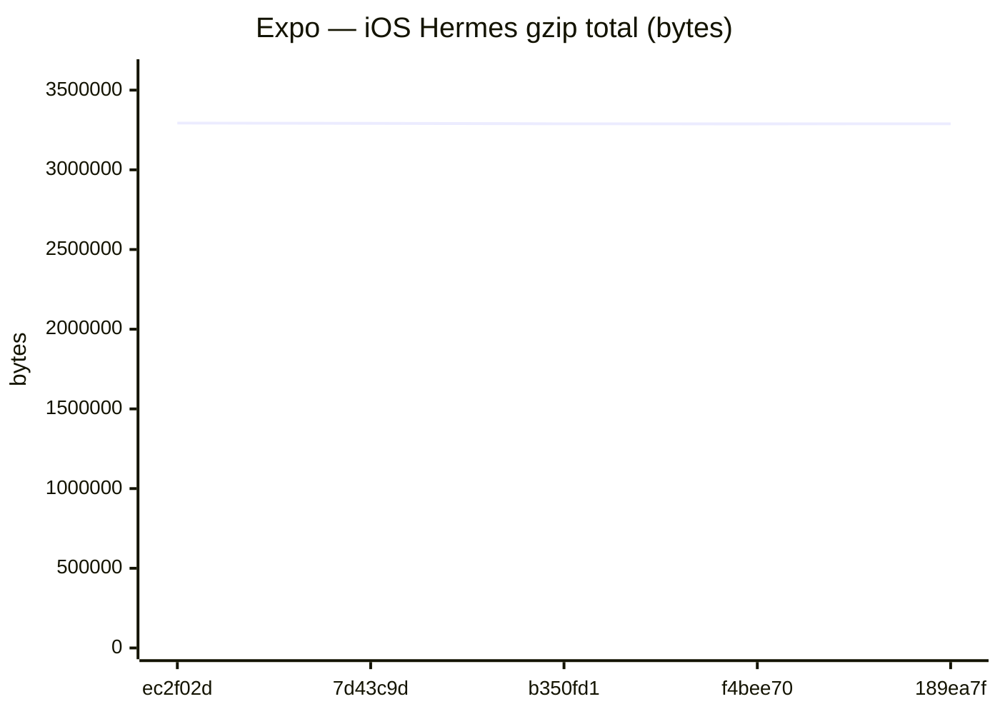

Last <strong>20</strong> runs (all platforms)

### Web / PWA

| date | sha | status | LCP_ms | FCP_ms | TBT_ms | run |
| --- | --- | --- | --- | --- | --- | --- |
| 2026-06-17 22:25:04 | ec2f02d | ok | 12566 | 9562 | 75 | 27723559485 |
| 2026-06-17 21:47:48 | 7d43c9d | ok | 12399 | 9245 | 60 | 27721796875 |
| 2026-06-17 19:59:42 | b350fd1 | ok | 12420 | 9568 | 110 | 27715903744 |
| 2026-06-17 19:34:13 | f4bee70 | ok | 14457 | 9745 | 161 | 27714347810 |
| 2026-06-17 19:18:15 | 189ea7f | ok | 14459 | 10036 | 142 | 27713591407 |
| 2026-06-17 18:46:00 | 4cdf078 | ok | 13617 | 9710 | 88 | 27711771797 |
| 2026-06-17 15:37:50 | 2056f68 | ok | 14386 | 9959 | 135 | 27700771524 |
| 2026-06-17 14:58:40 | d0fb0f7 | ok | 14419 | 11095 | 159 | 27698239997 |
| 2026-06-17 14:11:26 | a53523f | ok | 13497 | 9742 | 160 | 27695103028 |
| 2026-06-17 13:32:18 | 95287e7 | ok | 13828 | 9729 | 153 | 27692598618 |
| 2026-06-17 12:02:31 | a01e98f | ok | 13339 | 9740 | 131 | 27687352143 |
| 2026-06-17 11:50:43 | eb58226 | ok | 14256 | 9931 | 151 | 27686723739 |
| 2026-06-16 10:54:57 | 21cf681 | ok | 13811 | 8783 | 54 | 27612448313 |
| 2026-06-16 10:38:10 | b25a874 | ok | 13665 | 8784 | 71 | 27611604472 |
| 2026-06-16 06:03:27 | 52c24ba | ok | 12311 | 8257 | 67 | 27597550897 |
| 2026-06-16 05:54:51 | af742cc | ok | 13514 | 8334 | 59 | 27597185363 |
| 2026-06-15 23:06:25 | 8c88228 | ok | 14099 | 10944 | 158 | 27582159029 |
| 2026-06-15 22:51:54 | f1d81b5 | ok | 14091 | 10787 | 140 | 27581514757 |
| 2026-06-15 22:45:47 | f02224d | ok | 13178 | 9724 | 77 | 27581252223 |
| 2026-06-15 22:37:51 | cb092d9 | ok | 14089 | 10927 | 167 | 27580894614 |

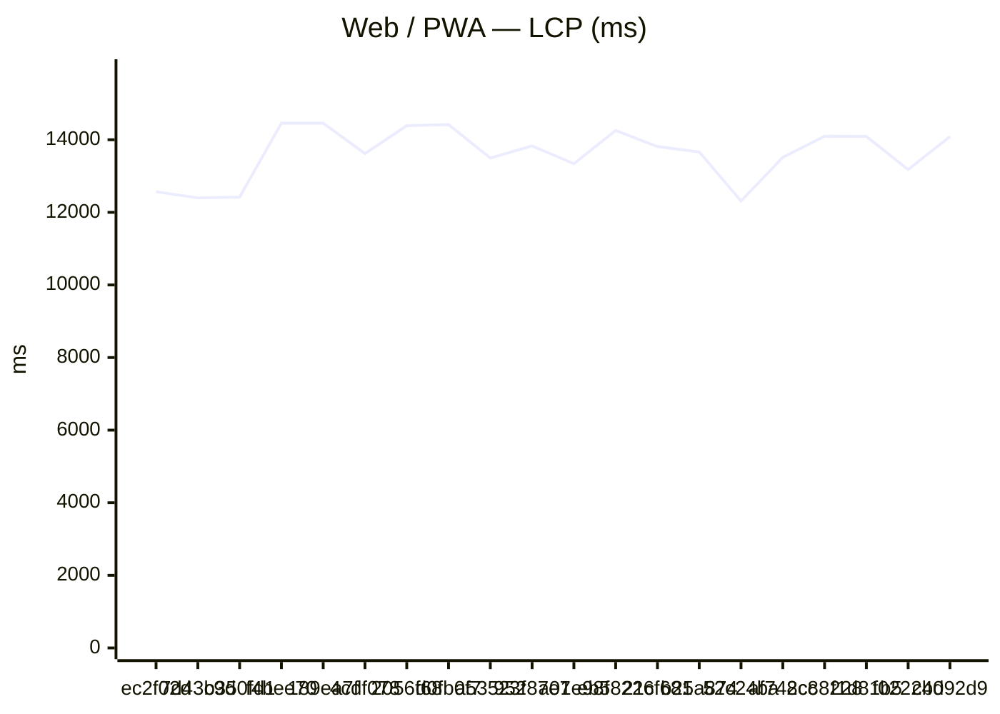
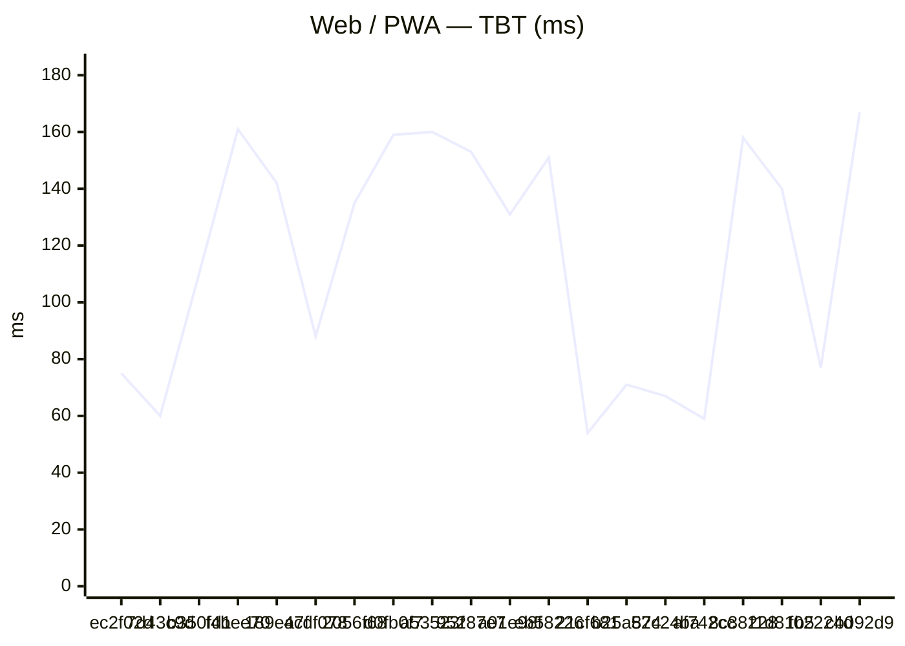

### GitHub Pages

| date | sha | status | LCP_ms | FCP_ms | TBT_ms | run |
| --- | --- | --- | --- | --- | --- | --- |
| 2026-06-17 22:25:26 | ec2f02d | ok | 11500 | 8352 | 62 | 27723559485 |
| 2026-06-17 21:48:10 | 7d43c9d | ok | 12552 | 9249 | 68 | 27721796875 |
| 2026-06-17 20:00:05 | b350fd1 | ok | 12421 | 9270 | 106 | 27715903744 |
| 2026-06-17 19:34:36 | f4bee70 | ok | 13612 | 9736 | 158 | 27714347810 |
| 2026-06-17 19:18:38 | 189ea7f | ok | 14591 | 10654 | 145 | 27713591407 |
| 2026-06-17 18:46:22 | 4cdf078 | ok | 14540 | 9660 | 107 | 27711771797 |
| 2026-06-17 15:38:13 | 2056f68 | ok | 13488 | 9737 | 135 | 27700771524 |
| 2026-06-17 14:59:03 | d0fb0f7 | ok | 14410 | 10518 | 165 | 27698239997 |
| 2026-06-17 14:11:51 | a53523f | ok | 14392 | 9750 | 137 | 27695103028 |
| 2026-06-17 13:32:41 | 95287e7 | ok | 14255 | 10502 | 129 | 27692598618 |
| 2026-06-17 12:02:54 | a01e98f | ok | 14254 | 10656 | 155 | 27687352143 |
| 2026-06-17 11:51:07 | eb58226 | ok | 13354 | 9763 | 154 | 27686723739 |
| 2026-06-16 10:55:20 | 21cf681 | ok | 12763 | 8708 | 63 | 27612448313 |
| 2026-06-16 10:38:34 | b25a874 | ok | 13959 | 8781 | 73 | 27611604472 |
| 2026-06-16 06:03:49 | 52c24ba | ok | 12313 | 8259 | 57 | 27597550897 |
| 2026-06-16 05:55:14 | af742cc | ok | 13510 | 8332 | 55 | 27597185363 |
| 2026-06-15 23:06:48 | 8c88228 | ok | 14082 | 10499 | 125 | 27582159029 |
| 2026-06-15 22:52:17 | f1d81b5 | ok | 14090 | 10484 | 140 | 27581514757 |
| 2026-06-15 22:46:10 | f02224d | ok | 14084 | 10486 | 121 | 27581252223 |
| 2026-06-15 22:38:13 | cb092d9 | ok | 13204 | 9751 | 105 | 27580894614 |

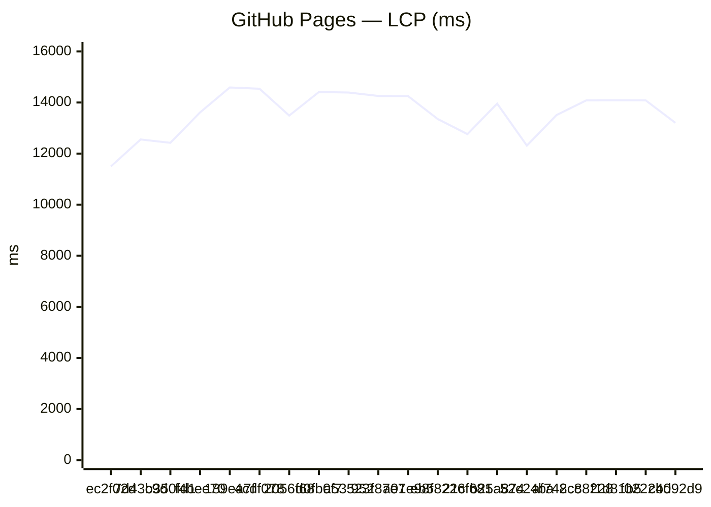

### Capacitor (legacy)
_No history yet._

### Expo / RN bundles

Aggregates: **sum of gzip bytes** across all `.hbc` files per platform (stable for trends when chunk hashes change).

| date | sha | status | android_gzip | ios_gzip | run |
| --- | --- | --- | --- | --- | --- |
| 2026-06-17 22:27:01 | ec2f02d | ok | 3300522 | 3293314 | 27723559485 |
| 2026-06-17 21:49:20 | 7d43c9d | ok | 3299950 | 3291396 | 27721796875 |
| 2026-06-17 20:01:54 | b350fd1 | ok | 3296025 | 3288856 | 27715903744 |
| 2026-06-17 19:35:53 | f4bee70 | ok | 3296632 | 3288399 | 27714347810 |
| 2026-06-17 19:19:46 | 189ea7f | ok | 3296023 | 3288861 | 27713591407 |
| 2026-06-17 18:47:53 | 4cdf078 | ok | 3295973 | 3288877 | 27711771797 |
| 2026-06-17 15:39:09 | 2056f68 | ok | 3295761 | 3288270 | 27700771524 |
| 2026-06-17 15:00:43 | d0fb0f7 | ok | 3295758 | 3288272 | 27698239997 |
| 2026-06-17 14:13:05 | a53523f | ok | 3295757 | 3288270 | 27695103028 |
| 2026-06-17 13:34:13 | 95287e7 | ok | 3291461 | 3283767 | 27692598618 |
| 2026-06-17 12:03:50 | a01e98f | ok | 3291455 | 3283770 | 27687352143 |
| 2026-06-17 11:52:25 | eb58226 | ok | 3291464 | 3283769 | 27686723739 |
| 2026-06-16 10:56:19 | 21cf681 | ok | 3287427 | 3278198 | 27612448313 |
| 2026-06-16 10:39:41 | b25a874 | ok | 3287424 | 3278199 | 27611604472 |
| 2026-06-16 06:04:44 | 52c24ba | ok | 3287423 | 3278191 | 27597550897 |
| 2026-06-16 05:55:48 | af742cc | ok | 3287424 | 3278197 | 27597185363 |
| 2026-06-15 23:07:16 | 8c88228 | ok | 3287869 | 3277689 | 27582159029 |
| 2026-06-15 22:52:59 | f1d81b5 | ok | 3287424 | 3278200 | 27581514757 |
| 2026-06-15 22:47:03 | f02224d | ok | 3287426 | 3278200 | 27581252223 |
| 2026-06-15 22:38:54 | cb092d9 | ok | 3287424 | 3278198 | 27580894614 |

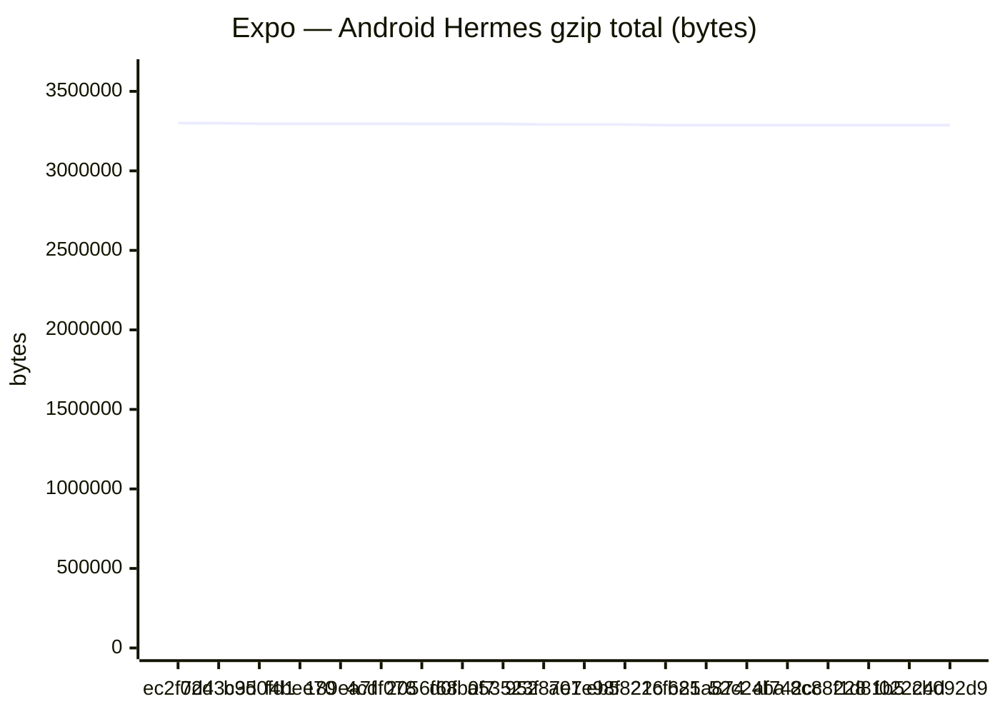

