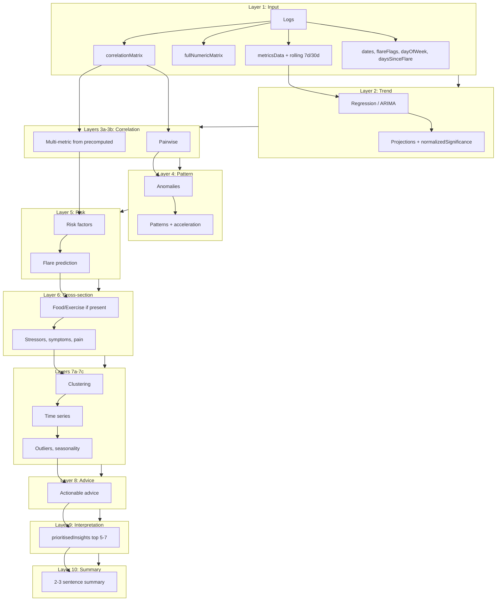
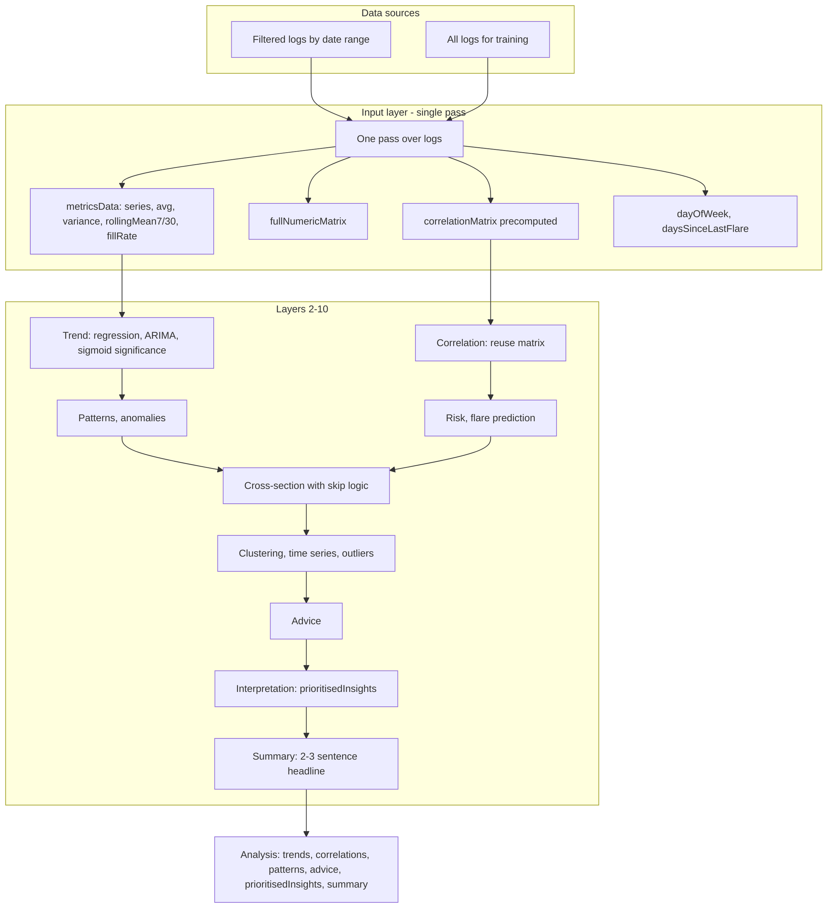

## 🧠 AI Analysis: Neural Network Architecture

### v1.44.2 documentation sync

- AI slide presentation now sits within a broader UI theme parity pass so AI surfaces remain visually consistent with selected global themes on web/mobile shells.
- Summary-note reliability and fallback behavior remain governed by the resilient timeout + rule-based fallback path documented in the changelog.

The AI analysis engine runs as a **neural-style pipeline**: each layer applies existing logic (regression, correlation, prediction, etc.) as activator functions. The design aims to **use as much of your collected data as possible** to deliver **meaningful health insights** (trends, early signals, correlations, and actionable advice). A detailed expansion and optimisation plan is in [NEURAL_NETWORK_PLAN.md](NEURAL_NETWORK_PLAN.md).

### Planned objectives

- **Richer input**: One pass over all logs to build metricsData, rolling 7d/30d baselines, day-of-week, days-since-flare, fill-rate, and a **precomputed correlation matrix** so downstream layers avoid redundant work.
- **Optimisation**: Correlation matrix computed once in the input layer; correlation layers **reuse** it. Cross-section layer **skips** food/exercise analysis when no food or exercise entries exist.
- **Interpretation**: A dedicated layer **ranks and deduplicates** anomalies, risk factors, correlations, and patterns into **prioritisedInsights** (top 5–7 items) so “what matters most” is clear.
- **Summary**: A **summary** layer produces a short 2–3 sentence plain-language headline from trends, risk, and advice.
- **Activations**: Trend significance is normalised (e.g. sigmoid(r²)) for consistent scoring; activations (sigmoid, tanh, relu, softmax) are available for bounding and ranking.

### Analysis pipeline (forward pass)

### Data flow: from logs to insights

### Layer summary

| Layer | Role | Data used | Activator functions |
|-------|------|-----------|---------------------|
| 1 Input | Feature space in one pass | All training + recent logs | metricsData (with rollingMean7/30, fillRate), fullNumericMatrix, correlationMatrix, dates, flareFlags, dayOfWeek, daysSinceLastFlare |
| 2 Trend | Per-metric trends and predictions | Full training series per metric | Linear/polynomial regression, ARIMA, predictFutureValues, normalizedSignificance (sigmoid) |
| 3a–3b | Pairwise + multi-metric correlation | Precomputed matrix or training logs | detectCorrelations, detectMultiMetricCorrelations (uses precomputed when available) |
| 4 Pattern | Anomalies and patterns | Recent logs | detectAnomalies, detectPatterns, detectTrendAcceleration |
| 5 Risk | Risk factors and flare prediction | Training logs | assessRiskFactors, predictFlareUps |
| 6 Cross-section | Food, exercise, stressors, symptoms | Larger of training/recent; **skip** food/exercise if none logged | analyzeFoodExerciseImpact (guarded), analyzeStressorsImpact, analyzeSymptomsAndPainLocation, analyzeCrossSectionCorrelations |
| 7a–7c | Clustering, time series, outliers | Training logs | performClustering, performTimeSeriesAnalysis, detectOutliers, detectSeasonality |
| 8 Output | Advice | Recent logs + trends | generateActionableAdvice |
| 9 Interpretation | Prioritise and dedupe | analysis.anomalies, riskFactors, correlations, patterns | Score, dedupe, set prioritisedInsights (top 7) |
| 10 Summary | Plain-language headline | trends, risk, patterns, advice | Set analysis.summary (2–3 sentences) |

### How we use your data for meaningful insights

- **Full history**: Training logs (all available data) are used for regression, correlation matrix, clustering, time series, and flare prediction so insights reflect long-term patterns, not just the last few days.
- **Rolling baselines**: 7-day and 30-day rolling means per metric support future “vs your baseline” comparisons and stability checks.
- **Temporal context**: Day-of-week and days-since-last-flare are computed once and available for pattern and seasonality layers.
- **Prioritised list**: Anomalies and risk factors are ranked above correlations and patterns; duplicates are removed so the UI can show a short “what matters most” list.
- **Summary**: The final summary sentence is generated from improving/worsening trends, the top risk or pattern, and one piece of advice so the user gets a quick takeaway.

Activation functions (sigmoid, tanh, relu, softmax) are available as `AIEngine.activations`. The network constructor is `AIEngine.NeuralAnalysisNetwork`. Detailed plan: [NEURAL_NETWORK_PLAN.md](NEURAL_NETWORK_PLAN.md).

---
