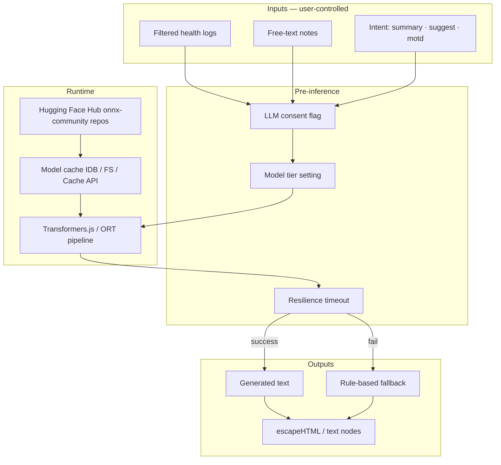

# AI security — on-device LLM and deterministic analysis

**Product:** Rianell  
**Last updated:** 2026-06-14 (v1.91.0 — HF-only runtime, GPU-first load order, CVE baseline)  
**Related:** [ai-architecture.md](ai-architecture.md) · [threat-model.md](threat-model.md) · [dpia-health-sync.md](privacy/dpia-health-sync.md) · [SECURITY.md](SECURITY.md)

---

## 1. AI surfaces in Rianell

| Surface | Technology | Data leaves device? | User control |
|---------|------------|---------------------|--------------|
| **Deterministic analysis** | `@rianell/ai-engine` (regression, correlation, flare prediction) | No | Always on when user runs AI Analysis |
| **On-device LLM (PWA)** | Transformers.js `@3.3.2` (self-hosted `/vendor/` or jsDelivr fallback) + **Hugging Face Hub** weights only | Weights downloaded from HF; **prompts stay on device** | Consent modal + download UI; **WebGPU** tried before WASM (`webgl` is not a valid Transformers device) |
| **Ephemeral health chat (PWA Home)** | `modules/ai-chat.js` + `buildChatContext` (`@rianell/shared`) | **No persistence** — in-memory only, cleared on close/`beforeunload` | Opens from Home discovery cards; 5-turn limit; on-device inference via `generateHealthChatWithLLM` |
| **On-device LLM (RN)** | `@rianell/llm` + `llmNative.ts` (ORT) or `llmJs.ts` (Expo Go WASM) | HF Hub download to app documents; prompts on device | `AiModelDownloadGate`; Android NNAPI / iOS CoreML before CPU |
| **Rule-based fallbacks** | Shared MOTD / summary templates | No | Automatic when LLM unavailable or times out |
| **Anonymized training pool** | Encrypted blobs in `anonymized_data` | Yes (opt-in) | Separate consent in settings |

There is **no server-side LLM inference** in the current architecture. Cloud sync stores encrypted backups and optional anonymized contributions only.

---

## 2. On-device LLM architecture

**Package references:** `packages/llm` (`runtime-profiles.mjs`, `load-ladder.mjs`, `tier-benchmark.mjs`), PWA `summary-llm.js`, RN `llmNative.ts` / `llmJs.ts`.

**Load order (GPU-first):** WebGPU (q4f16→q4) → WASM q4 on PWA (all platforms); NNAPI/CoreML then CPU on RN native; WASM q4 last resort on Expo Go. Transformers.js browser devices are **webgpu** and **wasm** only.

---

## 3. Prompt injection and untrusted content

### 3.1 Threat

Health **notes**, **symptoms**, and imported log text are **user-controlled** and may contain adversarial instructions ("ignore previous instructions…"). Because inference runs locally, the primary impact is:

- Misleading health summaries shown to the user
- Inappropriate "suggest note" text appended to medical records
- Wasted compute / denial of UX (infinite loops rare but possible with pathological prompts)

There is **no cross-user** prompt injection path today (no shared server prompt store).

### 3.2 Controls (current)

| Control | Implementation |
|---------|----------------|
| **UGC delimiters (v1.60)** | User notes in LLM context wrapped in `---USER_NOTE---` / `---END_USER_NOTE---` (`summary-llm.js`); notes never passed through UI translation |
| **Health chat context builder (v1.134)** | `packages/shared/src/ai/chatContext.mjs` — screening field exclusion, URL/script redaction, delimiter spoof neutralization, 1800-char cap |
| **Ephemeral chat (v1.134)** | `apps/pwa-webapp/modules/ai-chat.js` — no `localStorage`/IndexedDB; `wipeState()` on close and `beforeunload`; enforced by `llm-security-contract.mjs` |
| **Instruction hierarchy (AI-01 partial)** | `weekChat.system` prompt ranks system instructions above `---USER_NOTE---` content and user messages |
| Structured prompts | Intent-specific templates (`buildLlmContext`) separate system instructions from user payload |
| Output length caps | Suggest-note append capped (500 chars on medications step) |
| Timeout + fallback | Rule-based summary/MOTD if LLM stalls |
| HTML safety | User-visible LLM output rendered via `escapeHTML` / text nodes, not raw `innerHTML` |
| No tool execution | LLM has no API keys, SQL, or network tools in the pipeline |

### 3.3 Controls (backlog)

| ID | Control | Priority |
|----|---------|----------|
| AI-01 | Delimiter hardening and instruction hierarchy in prompt templates | P1 | **Partial** — `weekChat.system` hierarchy + delimiter spoof stripping in `chatContext.mjs` |
| AI-02 | Output schema validation (reject non-prose / markup) | P2 |
| AI-03 | Optional "strict mode" — deterministic analysis only | P2 |
| AI-04 | Log redaction layer before prompt assembly (strip URLs, script-like tokens) | P3 |

See [threat-model.md](threat-model.md) M-08.

---

## 4. Model supply chain

### 4.1 Sources

| Artifact | Source | Integrity |
|----------|--------|-----------|
| Transformers.js | `cdn.jsdelivr.net/npm/@huggingface/transformers@3.3.2` | Pinned; not `@latest`; CSP `connect-src` |
| onnxruntime-react-native | npm lockfile `^1.22.0` | CI OSV + npm audit |
| Model weights | `huggingface.co` / Xet bridge hosts only | Model ID whitelist in `@rianell/llm` |
| Tokenizers / configs | Bundled with model repo | HF commit hash implicit in cache |

### 4.2 Risks

- **Compromised Hugging Face account** publishing malicious weights under a similar model name
- **CDN substitution** if TLS or DNS compromised
- **Supply-chain in npm** (`@xenova/transformers` or successors)

### 4.3 Mitigations

1. **Allowlist model IDs** — only `onnx-community/SmolLM2-360M-Instruct-ONNX` and `onnx-community/Llama-3.2-1B-Instruct-ONNX` unless extended in release notes.
2. **Llama 3.2 gated repo** — user may need accepted HF license + `HF_TOKEN` for tier 3–5 downloads; never commit tokens.
3. **CI scanning** — `npm audit`, OSV-Scanner, Gitleaks per [SECURITY.md](SECURITY.md).
4. **CSP `connect-src`** — limits fetch targets to known HF hosts (see `index.html`).
5. **Cache inspection** — operators can clear model cache from settings when behaviour is anomalous.
6. **Future:** verify weight checksums against published SHA256 in repo metadata before first run.

### 4.3a CVE disposition (2026-06-14 baseline)

Run `npm audit --omit=dev` and OSV-Scanner in CI ([`security-audit.yml`](../.github/workflows/security-audit.yml)). Inference stack pins:

| Package | Pin | Notes |
|---------|-----|-------|
| `@huggingface/transformers` | 3.3.2 | PWA CDN + RN override; upgrade only with parity tests |
| `onnxruntime-react-native` | ^1.22.0 | Android Gradle patch via `patch-onnxruntime-gradle.mjs` |

High/critical production CVEs must be fixed or documented with accepted risk before release.

### 4.4 Update policy

- Model tier changes require CHANGELOG entry, parity check, and DPIA delta if new data processing occurs.
- Do not auto-pull `latest` from HF; pin revision in code or config.

---

## 5. Privacy and special-category data

On-device LLM processing uses **health logs and notes** (GDPR Art. 9 special category). Legal basis and DPIA: [dpia-health-sync.md](privacy/dpia-health-sync.md), [eu-gdpr.md](privacy/eu-gdpr.md).

| Principle | Position |
|-----------|----------|
| Data minimisation | Prompts include only logs in selected date range + intent-specific fields |
| Storage limitation | Model cache is technical artifact, not health data; clearable by user |
| Transparency | Settings → Performance explains on-device AI and HF download |
| No automated legal decisions | Outputs are informational only |

---

## 6. GDPR Article 22 — automated decision-making

**Article 22** restricts decisions based **solely** on automated processing that produce **legal or similarly significant effects**.

### 6.1 Rianell position

| Question | Answer |
|----------|--------|
| Does the app make solely automated decisions with legal/similar effect? | **No.** Insights, summaries, and suggestions are informational wellness aids. |
| Could outputs influence significant health choices? | **Possibly**, but user retains full control; no binding triage, insurance, or employment decisions. |
| Is human review offered? | User reviews and edits all logs; AI output is advisory. |
| Right to contest? | User may disable LLM, ignore output, or delete logs. |

**Formal statement (for privacy policy):** Rianell does not use automated processing to make decisions that produce legal or similarly significant effects on data subjects. AI features provide optional, non-binding health insights. Users are not subject to a decision based solely on automated processing without meaningful human involvement in any regulated sense.

If future features introduce **automated triage**, **insurer reporting**, or **clinical pathways**, revisit this section and conduct a new DPIA before launch.

---

## 7. Deterministic AI engine (non-LLM)

`@rianell/ai-engine` performs statistical analysis on local logs. Risks:

| Risk | Mitigation |
|------|------------|
| Misleading correlation → user harm | Disclaimers in UI; "not medical advice" |
| Numeric instability on small samples | Low-sample guards in charts/AI UI |
| Re-identification via anonymized pool | Encryption + contribution opt-in separate from backup |

---

## 8. Incident scenarios

| Scenario | Severity | Response |
|----------|----------|----------|
| Malicious HF model served | P1 | Disable LLM via feature flag; rotate cache; notify users if integrity check fails |
| Prompt injection causes harmful text | P2 | Patch templates; document in [incident-response.md](incident-response.md) |
| LLM library CVE | P1–P2 | `npm audit` triage; emergency release |

---

## 9. Testing and assurance

- Parity gates: `parity:web`, `parity:android`, `parity:ios` include LLM consent paths.
- Manual: verify LLM disabled → fallback strings only.
- Regression: suggest-note cap, timeout fallback, CSP allows HF fetch on production host.

---

## 10. References

- Transformers.js — https://huggingface.co/docs/transformers.js
- ICO guidance on AI and data protection — https://ico.org.uk/for-organisations/uk-gdpr-guidance-and-resources/artificial-intelligence/
- Rianell platform parity — [platform-parity.md](platform-parity.md)
