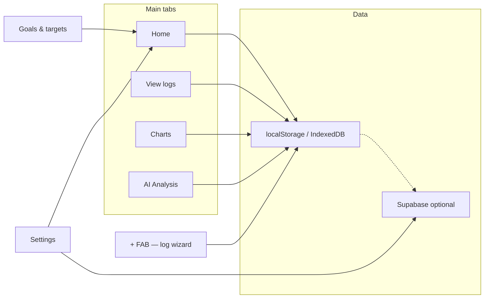

## 🏠 App overview

## ✨ Features

### Health data tracking
- **Daily log entry**: Record per-day health metrics: resting heart rate (BPM), weight, fatigue, stiffness, back pain, sleep quality, joint pain, mobility, daily function, joint swelling, mood, irritability, weather sensitivity, steps, hydration (glasses).
- **Structured data**: Flare (yes/no), stressors, symptoms, pain location, notes; food log (meals with items); exercise log (activities with duration).
- **Medical condition**: Optional label stored in settings and used for anonymised data aggregation and AI context; user can change or clear it.

### App shell and log experience (web UI)

- **Home / Today**: Default tab with greeting, date, logging status, and goals snippet when enabled. Use the floating **+** button to open the log entry wizard from any main tab (Home, Logs, Charts, AI).
- **Log entry wizard**: Step-by-step flow (date & flare → vitals → symptoms & pain → energy & day → food → exercise → medication & notes → review) with step indicator, **Back** / **Skip** / **Next**, and **Save entry** on the last step. The bottom nav row keeps three equal slots (hidden steps use invisibility, not `display:none`) so **Next** does not stretch full width on early steps. Drafts are debounced to `sessionStorage`; URL hash `#log/step/<1-based step>` restores step when opening the log flow. The **+** is hidden while the wizard is active.
- **Navigation**: Top tab strip on wider screens; **bottom navigation bar** on viewports ≤768px (**Home**, **Logs**, **Charts**, **AI** — no separate Log tab). On phones, **`html`/`body` do not scroll**; **`.app-shell`** fills the viewport and **`.container.app-main-scroll`** is the only vertical scroll area so every tab behaves the same. The **+** button is **`position: fixed`**, overlays the main content, and sits just above the tab bar (not in the scroll flow). The tab bar lives in **`.app-mobile-bottom-chrome`** as a flex footer below the scroll region. Only one nav chrome shows per breakpoint.
- **Layout**: Extra horizontal padding in the log wizard on small screens; **`--card-content-padding-x`** in `styles.css` sets consistent horizontal inset inside bordered cards (`.form-section` / `.section-content`), including wizard vitals and other steps, log date/flare blocks, and review—so labels, inputs, and controls (e.g. weight unit toggle) are not flush to the card edge. **Tile pickers** (energy & mental clarity, stressors, symptoms, food by meal, exercise by category) open in a **full-screen `<dialog>` bottom sheet** on phones and a centred max-width sheet on wider viewports; chip content is moved into the sheet and restored on close (same IDs and handlers as before). Optional **per-section search** filters chips on the client. Sticky wizard actions use a flat bar (no heavy drop shadow behind the button row). **Selected items** (stressors, symptoms, edit-entry lists) use a **glass** sticky strip on mobile and **row chips** (`.item-tag`) that match the card surfaces—not a flat black panel.

- **View logs**: Date range shortcuts (Today / 7 / 30 / 90 days) or custom dates, **Filter** and **Oldest** / **Newest** sort; **Your entries** lists per-day cards with vitals, symptoms, wellbeing, food, exercise, flare status, and edit / delete / share.

### Charts and visualisation
- **Combined chart**: Multi-metric line chart with date range filter; optional AI-powered trend predictions (when AI enabled); metric selector; balance and single-chart views.
- **Individual metric charts**: Per-metric ApexCharts (e.g. fatigue, stiffness, BPM, sleep, steps, hydration) with lazy loading and device-based point caps.
- **Chart view modes**: Use **Balance**, **Combined**, or **Individual** in the Charts tab. Only the active mode’s layout is shown (combined, balance radar, or per-metric charts). Saved preference uses **`chartView`** as the source of truth; legacy **`combinedChart`** is kept in sync when settings load.
- **Select metrics to display** (combined / balance): On small screens the full metric list **scrolls with the main chart column** (no separate inner scroll panel on narrow phones).
- **Chart behaviour**: Date range (7/30/90 days) and prediction range; predictions can be toggled off; empty state when no data; animations respect reduced-motion and device class. Charts tab opens in balance view; View Logs tab opens with last 7 days.
- **Tier 5 / GPU-accelerated charts**: On tier 5 (or tier 4 with a good GPU), chart containers use GPU-friendly compositor layers and maximum point limits; critical chart and AI preload run with high scheduler priority when supported.
- **Loading behaviour**: App shows a loading overlay until the combined chart and summary LLM preload are ready (or 12s timeout), then reveals the UI so heavy work does not stutter the first paint.

### Performance (optimisation stack)

- **Logs**: Central reads via `getAllHistoricalLogsSync()` (avoids repeated `JSON.parse` of `healthLogs` on hot paths); optional **IndexedDB** mirror in `web/logs-idb.js` (async backup; localStorage remains primary); cache invalidation on save/import.
- **Charts**: In-place **ApexCharts** updates when view/data signatures match (combined, balance, individual); chart-specific styles load on demand from **`styles-charts.css`** when opening the Charts tab (or when the chart section is shown on load).
- **AI**: In-flight **deduplication** of `analyzeHealthMetrics`; guarded AI preload and chart **precompute** (idle / debounced; slower when the tab is hidden).
- **View logs**: For very large histories, **IntersectionObserver** loads additional entries as you scroll (windowed append).
- **Scripts**: **`summary-llm.js`** loads with `requestIdleCallback` on non–low devices (no `document.write`); Font Awesome remains deferred.
- **Build**: Root **`npm run build:web`** runs **`web/build-site.mjs`**: AST instrumentation (function trace hooks) for first-party scripts into **`web/.trace-build/`**, then esbuild minifies **`app.js`** → **`web/app.min.js`** (gitignored). **GitHub Pages** deploy runs the same script on the copied **`site/`** tree (see [GitHub Pages](setup-and-usage.md#github-pages-app-at-repo-root)).
- **Web Workers**: `web/workers/io-worker.js` — large JSON **parse** / **stringify** when the optimisation profile has **`useWorkers`** (import / export paths).
- **Service worker**: **Off** by default; opt-in with `localStorage.setItem('rianellEnableStaticSW','1')` or **`?sw=1`** — `web/sw.js` uses cache-first for static file extensions (test on your host; CSP is same-origin).
- **Python server**: **gzip** for compressible static files when the client sends `Accept-Encoding: gzip`; **Cache-Control** tuned for common static extensions (`server/main.py`).
- **Observability**: Optional **Long Task** logging via `localStorage.setItem('rianellPerfLongTasks','1')` or debug mode; `performance.mark('rianell-init')` during init.

### Browser console (what is and is not Rianell)

- **Expected `DEBUG` messages**: Empty charts or an empty AI range are logged at **debug** level (enable *Verbose* in DevTools if you want to see them). They are not errors.
- **Extension noise**: Messages from **`vendor.js`**, **`tabs:outgoing.message.ready`**, **`serviceWorker.js`** (when the filename is not this app’s `sw.js`), or **`Frame with ID … was removed`** usually come from **browser extensions** (password managers, Grammarly, devtools helpers), not from Rianell. The app includes handlers to ignore common extension promise rejections where possible.
- **Third-party / browser**: **SES / lockdown** lines, **Grammarly / i18next** tips, **WebGPU `powerPreference` on Windows**, and **PWA** DevTools notes about `beforeinstallprompt` are outside app control or informational.
- **Hugging Face / CDN**: If the on-device LLM fails to download model shards (`ERR_CONTENT_LENGTH_MISMATCH`, `ERR_CONNECTION_RESET`), the app falls back to a smaller model or rule-based text; that is usually **network or CDN** related, not a bug in the repo.

### AI analysis

- **Optional AI**: Settings toggle "Enable AI features & Goals" hides or shows the AI Analysis tab, chart predictions, and Goals.
- **Neural-style pipeline**: Trend regression, correlations, patterns, risk factors, flare prediction, cross-section (food/exercise/stressors/symptoms), clustering, time series, actionable advice, prioritised insights, and a 2–3 sentence summary (see [AI Analysis](#ai-analysis-neural-network-architecture)).
- **Summary note**: In-browser LLM (Transformers.js, flan-t5 by device class) or rule-based fallback; context from analysis and logs; value highlighting in the UI.
- **Dashboard title (MOTD)**: Main header shows a **message of the day** only (no user name). Preset lines are loaded from **`web/motd.json`** at startup (short attributed quotations); **one line is chosen at random on each full page load** (stable for that session until the LLM may replace it). If the file is missing or offline, a minimal fallback is used. When AI is enabled and not deferred, the on-device LLM may replace the preset after load. Browser tab title stays **Rianell**. Edit **`web/motd.json`** to change copy without editing **`app.js`**.
- **GPU-accelerated LLM**: When the performance benchmark detects a capable GPU (WebGPU or WebGL), the summary/suggest pipeline loads with GPU acceleration; the app falls back to CPU automatically if GPU loading fails. Uses Transformers.js 3.3.2 for stable WebGPU/WebGL support.
- **On-device AI model selection**: Settings → Performance → **On-device AI model** lets you choose **Use recommended (for this device)** (from the performance benchmark), **Small (faster, lower memory)**, or **Base (better quality)**. The benchmark recommends flan-t5-small or flan-t5-base by tier; changing the setting clears the LLM cache so the next summary or suggest note uses the selected model.
- **Suggest note**: LLM or rule-based suggestion for the day’s log note; "Generating…" state on button.
- **Chart predictions**: Combined (and balance) chart can show predicted series from the analysis pipeline; "Calculating predictions…" overlay when computing; cache by date range and log count.
- **Responsiveness**: Analysis yields to the main thread between layers; loading states ("Analyzing…", "Calculating predictions…"); optional Web Worker for AI preload on multi-core devices.

### Goals and targets
- **Goals**: Targets for steps, hydration, sleep quality, and "good days"; progress visible in a dedicated Goals view; stored in settings and synced to cloud when signed in.
- **Medications**: Optional medications list in settings (stored locally and in cloud with settings).

### Data management
- **Export**: CSV and JSON export of health logs from Settings.
- **Import**: Restore from JSON backup; handles compressed (gzip) format.
- **Print**: Print-friendly view of logs and reports.
- **Clear/reset**: Option to clear all local data (with confirmation).

### Cloud sync (Supabase)
- **Anonymised contribution**: Optional "Contribute anonymised data" in Settings; GDPR-compliant consent; data anonymised before upload; medical condition used for server-side aggregation only.
- **Auth**: Sign in / sign out; session state; auth state reflected in sync and settings sync.
- **Settings sync**: Goals and app settings synced to Supabase when signed in (e.g. app_settings table).
- **Deploy**: On GitHub Pages, Supabase URL and anon key are injected at deploy time from repository secrets (`SUPABASE_URL`, `SUPABASE_ANON_KEY`); no credentials in the repo.

### Notifications and reminders
- **Daily reminder**: Configurable time; system notification when the app is in the background.
- **Sound**: "Enable sound notifications" controls system notification sound and an in-app heartbeat-style sound when the app is in the foreground (including on mobile).

### Install and run options
- **PWA / Install web app**: Add to home screen from Settings (globe icon); runs standalone and works offline. Shown in the UI with a **Beta** tag (same channel as the Android APK).
- **Install on Android**: Download APK from Settings (or Install modal); CI builds debug APK on push and commits to `App build/Android/` for same-origin download links. Shown with a **Beta** tag.
- **Install on iOS (device)**: Add to Home Screen from Safari (Settings or Install modal)—**Beta** (PWA install path).
- **iOS native build (Xcode zip / optional OTA)**: Download the zip from Settings when offered; this path is **Alpha** in the UI. Build metadata lives in `App build/iOS/latest.json`.

#### Release channels (Beta vs Alpha) and build numbers

| Channel | Meaning in this app | Where the build number comes from |
|--------|---------------------|-----------------------------------|
| **Beta** | Android debug APK, **Install web app** / Add to Home Screen (PWA), and **Install on this iPhone/iPad** (Safari PWA). | `App build/Android/latest.json` → `version` for the APK; the Settings UI shows `(build N)` next to the Android link after fetch. |
| **Alpha** | **iOS native** artifact only: Xcode project zip (and optional one-tap install URL when `installUrl` is set in the manifest). Not the Safari “Add to Home Screen” flow. | `App build/iOS/latest.json` → `version`; the Settings UI shows `(build N)` next to the iOS download link after fetch. |

**Build numbers in this README:** The **Beta** badge and table near the top of this file are **updated automatically** on each successful CI run to match `App build/Android/latest.json`, `App build/iOS/latest.json`, and the current workflow run (web/PWA deploy).

The web app reads these manifests at runtime (`web/app.js`, `refreshBuildDownloadLinks`) so the label **(build N)** on install links stays in sync after each CI deploy. **Beta** / **Alpha** pills are fixed labels in the UI: every install/download path except the **iOS native zip/OTA** link is **Beta**; the **iOS native** download is **Alpha**.

### Tutorial and onboarding
- **Tutorial**: First-run slides (Welcome, Log entry, View & AI, Settings & data, Data options, Goals, You're all set); first card "Enable AI & Goals?" (Enable / Skip); skipping hides AI-related slides.
- **Install modal**: Post-tutorial modal (once) with web/Android/iOS install options; can be retriggered from God mode.

### Settings and UI
- **Settings**: Weight unit (kg/lb), medical condition, date filters, chart visibility, AI & Goals toggle, contribution toggle, reminder time, sound notifications, cookie/consent; **Demo mode** toggle (sample “John Doe” data for exploration; export/cloud contribution disabled); when demo mode is **on**, demo health logs are **regenerated on each full page load** so sample values and dates stay fresh (desktop: procedural generation; mobile: premade dataset with dates shifted to the recent window). **Share link for demo**: anyone can open the app with **`#Demo`** in the URL (case-insensitive, e.g. `https://rianell.com/#Demo`); the app enables demo mode and reloads, or reloads with fresh demo data if demo was already on. **First visit via this link only** (once per browser profile, tracked in `localStorage`): after reload, **Goals & targets** are filled with random non-zero values and the **first-run tutorial** opens if it has not been seen yet—this does **not** run when demo mode is turned on from Settings alone. **Donate** (Support Rianell): opens a modal. If you set a PayPal **REST Client ID** (`<meta name="paypal-client-id" content="…">` in `web/index.html`, or `window.__PAYPAL_CLIENT_ID__` before load), the **PayPal JavaScript SDK** renders **Smart Payment Buttons** in-app (PayPal, card, **Apple Pay** / **Google Pay** when the browser and PayPal account support them); choose an amount, then pay. If no Client ID is set, a **hosted donate link** opens PayPal in a new tab. Dismiss with **×**, backdrop, or **Escape**. CSP in `index.html` allows `https://www.paypal.com` for script and the API calls the SDK needs. **God mode** (backtick `` ` `` with **demo mode** on): test UI, install modal, etc. **Developer** (God mode): **Function trace** — optional checkbox to log every **instrumented** function to the browser console (`console.debug` only; **no** network; production uses the built site from `npm run build:web` / CI); **Clear performance benchmark cache** / **View last benchmark details**.
- **Keyboard**: On desktop, **Escape** key opens or closes Settings when no other modal is open.
- **Theme**: Dark mode by default; light mode optional.
- **Responsive**: Layout and charts adapt to viewport and device; device-based optimisation (chart points, animations, AI preload).
- **Device performance (benchmark)**: On first load a short CPU benchmark classifies the device as mobile or desktop and assigns a performance tier (1–5). A **GPU detection and benchmark** (WebGPU/WebGL) runs after the CPU suite with stability samples (5 runs) for a **GPU stability graph**; the result is cached and used to accelerate the on-device AI (Transformers.js) when a GPU is available, with fallback to CPU. **Tier 5** is maxed for resources: highest chart point limits, fastest preload delays, and full UI/chart animation; devices with a good GPU and tier 4 are treated as effective tier 5 for charts and AI. The result is cached in localStorage and drives expansive optimisation profiles (chart points, AI preload, DOM batching, demo data size, **recommended on-device AI model**, etc.). **During the benchmark**, the loading overlay shows a **progress bar** and percentage (e.g. "Measuring performance… 45% · CPU arithmetic"). When the benchmark runs (first run or after cache clear), a **Performance & AI benchmark** modal shows a **brief** result (device, tier, class, recommended AI model, **GPU status**) with an optional **"See detailed benchmark results"** section (test bars, Stability (CPU) and Stability (GPU) sparklines with stats, OS/device/CPU/memory, full profile JSON). Settings → Performance includes **On-device AI model** (Use recommended / Small / Base) with a recommendation hint from the benchmark. God mode (` key) Developer tools: “Clear performance benchmark cache” and "View last benchmark details" let you re-run or inspect the last result. **Note:** Browsers do not expose CPU frequency or turbo boost; the app uses tier + GPU (high-performance preference where supported) to maximise performance and optionally the Scheduler API for critical-path prioritisation.

### Server (testing and development)
- **Local server**: Python HTTP server for local testing (`python -m server`); serves `web/` at root; optional file watching and auto-reload.
- **Windows launcher**: From the repo root, `powershell -ExecutionPolicy Bypass -File .\server\launch-server.ps1` (or `pwsh -File .\server\launch-server.ps1`) runs the same server; optional `$env:PORT` / `$env:HOST` before invoking.
- **Supabase integration**: Server can use Supabase for anonymised data and app_settings; credentials from **`security/.env`** (or legacy root `.env`).
- **Tkinter dashboard**: GUI for server controls: start/restart server, view URL and status, Supabase search/delete/export, real-time database viewer, server logs. **Console** uses ANSI-coloured **`[LEVEL]`** tags when stdout is a TTY (blue for `[INFO]`, red for `[ERROR]`, etc.; respects `NO_COLOR` / `FORCE_COLOR`). **Log files** keep per-level **emoji** prefixes (no escape codes). The dashboard **Server Logs** pane uses ASCII **`[LEVEL]`** tags with Tk colour tags—see [Logging](#logging).

## 📁 Project structure

- **`web/`** – Static web app: HTML, CSS, JavaScript, icons, and assets. The server serves this directory at the root URL.
- **`server/`** – Python server package (main server logic in `main.py`, plus config, encryption, Supabase client, sample data, requirements checks). Run from repo root: **`python -m server`**, or on Windows **`server/launch-server.ps1`** (see [Running the Server](#running-the-server)).

