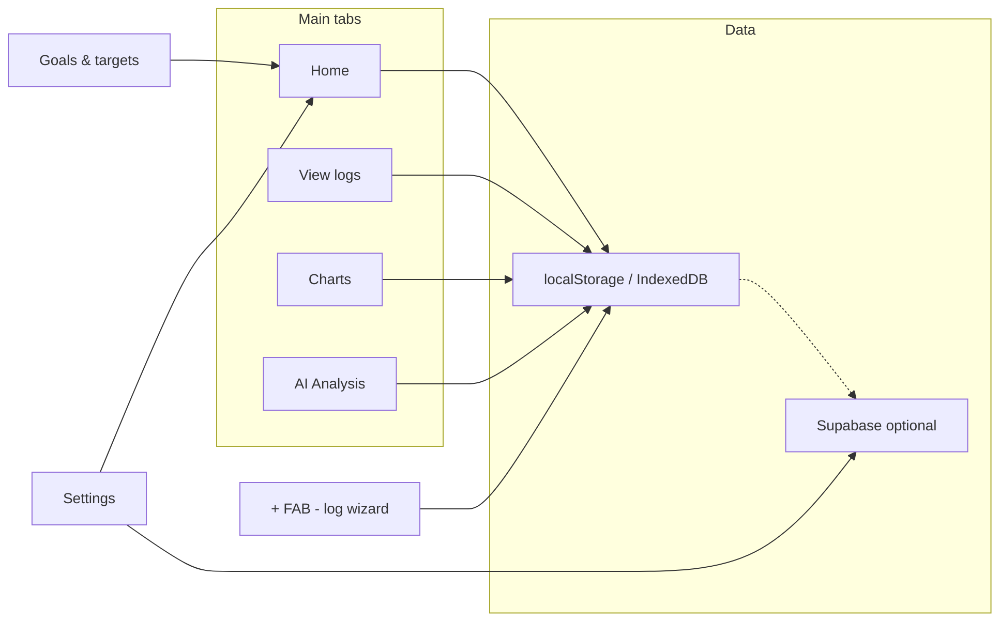

## 🏠 App overview

```mermaid
%%{init: {'themeVariables': {'fontSize': '14px'}, 'flowchart': {'useMaxWidth': false, 'nodeSpacing': 50, 'rankSpacing': 45}}}%%
flowchart LR
  subgraph tabs [Main tabs]
    Home[Home]
    View[View logs]
    Charts[Charts]
    AI[AI Analysis]
  end
  subgraph data [Data]
    Local[localStorage / IndexedDB]
    Cloud[Supabase optional]
  end
  FAB["+ FAB - log wizard"]
  Home --> Local
  View --> Local
  Charts --> Local
  AI --> Local
  FAB --> Local
  Local -.-> Cloud
  Goals[Goals & targets] --> Home
  Settings[Settings] --> Home
  Settings --> Cloud
```

## ✨ Features

### v1.115.0 PWA boot shell (DOM placement)

- **`#appShell`** is a direct child of `<body>`, sibling of `#settingsOverlay` - never nested inside the settings overlay (hidden overlay collapses shell to 0×0).
- **Runtime:** `ensureAppShellDomPlacement()` in `app.js`; boot logs via `logBootState()` / `window.__rianellBootLog`.
- **Verify:** `npm run audit:probe-shell:layout`; `tests/unit/pwa-boot-shell.test.mjs`.

### v1.121.0+ Cycle period-start anchor (log wizard step 1)

- **Primary action:** **Period started today** sets day 1 and `cycle.periodStart` on the log date.
- **Auto day:** `suggestCycleForDate` counts from the latest period start (explicit flag or backward-compat day 1 + menstrual/bleeding).
- **UI:** Day pills **1-35** by default; **Longer or irregular cycle** reveals **36-45**. Readout shows days since period start and a late hint above day 35.
- **Phase hints:** Unchanged simplified ~28-day template; not fertility prediction or medical advice.

### v1.120.0+ Theme accent tokenization (PWA)

- **Problem solved:** Switching global theme from Mint left hardcoded green in modals, AI Analysis, Mood tab, and chart prediction chrome.
- **CSS:** `--accent-*` token family derived from `--primary-color`; `body.theme-*` overrides `--ui-icon-color` / `--home-checkin-icon-color`.
- **JS:** `getThemePrimaryColor()` reads computed style from **`document.body`**; charts and AI inline HTML use theme helpers at render time; theme change refreshes charts and AI output.
- **Unchanged by design:** Per-metric chart line colours (e.g. fatigue orange, BPM green) and food/exercise tile category colours remain semantic data hues.

### v1.119.0+ Cycle tracking (log wizard step 1)

- **Enable:** Settings → Data options → Cycle tracking module, or first-run tutorial slide **Cycle tracking**.
- **UI:** **Period started today** button; cycle day scroll row (days 1-35, expandable to 45), phase tiles with theme SVG icons, optional flow level; labels from i18n (not raw keys).
- **Suggest:** When fields are empty, day + phase pre-fill from last **period start** (or legacy cycle anchor) and the wizard date.
- **Day 45 cap:** Irregular storage ceiling; typical range messaging uses 21-35 days (ACOG-cited); phase hints use a simplified ~28-day pattern (not medical diagnosis).

### v1.119.0+ Home card polish

- **Recent patterns:** Icon + white summary text in hero inset when streak card visible.
- **Weekly Health Review:** **Start review** when on-device LLM is loaded; **Enable AI** opens model download when not ready.

### v1.118.0+ Smartlook session recording (default-on after disclosure)

- **Purpose:** Optional EU session analytics (Smartlook) - **on by default after onboarding disclosure**; opt out during first-run or in Settings anytime.
- **Gate:** `shouldActivateSessionRecording()` - pref alone does not start SDK until disclosure or Settings enable timestamp.
- **First-run:** Shared `sessionRecording` step after cookies; toggle default on.
- **Controls:** Settings → Privacy & region → **Session recording**; **Consent dashboard** (Privacy pane) to revoke; blocked in **local-only mode**.
- **Implementation:** PWA (`smartlook.js`).
- **Docs:** [privacy/smartlook-session-recording.md](privacy/smartlook-session-recording.md), [subprocessors.md](privacy/subprocessors.md), RoPA **PA-10**.

### v1.61.0 README documentation icons

- **README** documentation table uses **`docs/icons/*.svg`** instead of emoji (GitHub `` references).

### v1.60.0 UI localization (13 locales)

- **Languages:** en-GB (default), en-US, en-AU, pt-BR, fr-FR, de-DE, es-ES, it-IT, pl-PL, nl-NL, pt-PT, **Arabic (ar)**, **Hebrew (he)** - picker in Settings → Privacy & region.
- **RTL:** Arabic and Hebrew set `dir=rtl`; chart time axes stay LTR.
- **UGC policy (B1):** Log notes, symptoms, and meds stay exactly as typed - never auto-translated. Export localizes column headers only; LLM prompts wrap user notes in `---USER_NOTE---` delimiters.
- **LLM locale (B2):** On-device and proxy LLM requests include explicit client `locale`; output language follows UI locale (ar/he use rule-based + motd fallback only).
- **Policy (B3):** Machine-translated `policy.*` strings ship with disclaimer banner; en-GB remains authoritative.

### v1.53.1 privacy/settings UI fixes

- **Settings carousel:** Nine panes (includes Privacy & region); scrollable dot strip; carousel re-inits on open and locale change.
- **Policy viewer (PWA):** HTML policy summaries render in the alert modal; confirm-dialog argument order fixed for region change and policy updates.
- **CI:** Web benchmark settings step no longer throws **`global is not defined`**.

### v1.53.0 On-device LLM download gates

- **On-device LLM weights:** Downloaded from **Hugging Face Hub** (onnx-community `*-ONNX` repos) and cached locally. See **`apps/pwa-webapp/models/README.md`**.
- **Download UX:** Desktop PWA shows progress **bottom-right under + FAB**; the **installed mobile PWA** uses a **blocking** progress modal until the model is cached; **mobile web** can skip with **Not now**.
- **Host priority (PWA):** Hugging Face only.
- **Operator scripts:** `npm run models:download`, `models:verify`. Supabase upload is deprecated/disabled.

### v1.70.3 documentation sync (PWA logs & settings)

- **Settings (v1.70.0):** Gear opens without main-thread freeze; locale refresh no longer recurses through `applyDocumentI18n` + `notifyLocaleChange`.
- **Locale refresh (v1.87.0):** Changing UI language re-renders all tabs (Home, Logs, Charts, AI, Settings) without reload; home date uses `formatUiDate()`.
- **On-device model (v1.85.0):** Settings → Performance - always-visible **Clear and redownload model** wipes caches and restarts download.
- **View logs (v1.70.1):** Tapping a day card expands vitals, symptoms, food, exercise, and notes (action bar + detail body).
- **Share (v1.70.3):** Per-entry share is a circular green action button matching delete/edit; uses `icon-share` SVG sprite.

### v1.52.0 privacy region and UI localization

- **Health data consent (GDPR Art. 9):** PWA modal before first cloud use. See [privacy/data-subject-rights.md](privacy/data-subject-rights.md).
- **Unified cloud deletion:** **Delete cloud data** removes rows from **`health_data`**, **`user_keys`**, **`user_privacy_profile`**, **`user_achievements`**, **`anonymized_data`**, and **`bug_reports`** for the signed-in user.
- **XSS (P0):** Import preview in **`import-utils.js`** escapes user-derived HTML before display.

### v1.49.0 shared packages

- **Shared packages:** `@rianell/shared`, `@rianell/ai-engine`, `@rianell/cloud-sync`, `@rianell/llm` - the PWA vendor bundles consume the shared merge/analysis logic.

### v1.46.24 documentation sync

- **Bug report:** Web modal supports optional **More detail** (steps / expected / actual), close button, and bug icon. Server accepts **`page_url`** from **`url`** or **`page_url`**. See [CHANGELOG.md](CHANGELOG.md) v1.46.24.

### v1.116.0 documentation sync

- **Screening (X14.5):** Stepped PHQ-9/GAD-7 follow-up when PHQ-2 or GAD-2 score ≥ 3; severity bands on full instrument; PHQ-9 item 9 triggers prominent crisis UI; answers ephemeral (not persisted).
- **Flow:** Multi-phase modal flow (`initial` → `followup` → `result`) in `weekly-review.js`.
- **See:** [CHANGELOG.md](CHANGELOG.md) v1.116.0; [plan-14 security-performance](plans/plan-14-cross-cutting/security-performance.md).

### v1.114.0 documentation sync

- **Security lock (Settings tab 10):** Passcode setup with masked fields; caregiver/proxy logging moved here from Privacy; tab icon shows locked vs unlocked state.
- **Home:** Hero status card includes streak nudge text when relevant; energy-budget/pacing card removed.
- **Charts:** Correlation/forecast/compare/pacing insights panel removed.
- **Screening:** PHQ-2/GAD-2 slider UX and friendlier copy.
- **Logging modules:** Cycle wizard fields when enabled; barcode food logging optional (camera + Open Food Facts).
- **See:** [CHANGELOG.md](CHANGELOG.md) v1.114.0.

### v1.113.0 documentation sync

- **Mood tab:** Fifth primary tab (between Charts and AI) - mood metrics from log answers, recent feelings, AM/midday/PM micro-check-in, PHQ/GAD shortcuts, link to Charts mood series.
- **Home:** Opt-in weather inline in the welcome/date header (standalone weather card removed); micro-check-in and Upcoming visit cards removed from Home (check-in lives on Mood tab; CL1 appointment PDF prep remains in clinician flows).
- **i18n:** Settings cross-cutting sections and PHQ/GAD screening modals resolve locale keys after catalogs load; em-dash cleanup in UI copy.
- **See:** [CHANGELOG.md](CHANGELOG.md) v1.113.0.

### v1.45.25 documentation sync

- **npm workspaces:** install from repository root with **`npm ci`** / **`npm install`**; a **single** **`package-lock.json`** applies to **`packages/*`** and **`benchmarks`** (plus **`apps/pwa-webapp`** tooling via root scripts).

### v1.45.3 documentation sync

- Expanded unit-test scope in `tests/unit/app-functionality.test.mjs` to cover key runtime behaviour contracts (theme no-reload path, Home-only MOTD guard, voice permission gate, and CSS/UI wiring checks).
- Continue running from root with `npm run test:unit` (Node test runner).

### v1.45.2 documentation sync

- Added CI app functionality unit-test coverage (`npm run test:unit`) with workflow gating before build/release/deploy jobs.

### v1.45.1 documentation sync

- Global theme switching now applies instantly in place without forcing an app restart/reload.
- Settings section mini-icon navigation remains on one line on mobile; no final icon wrap/drop.
- Dashboard MOTD quote display is now Home-tab only; other tabs keep the standard title.

### v1.45.0 documentation sync

- Added in-app bug report flow (top-right `?` button + modal + server submission) with Supabase-backed storage and per-IP daily rate limit.
- Theme parity cleanup continued: notification/install states and rainbow theme visuals now follow active theme tokens more consistently.
- Voice input now enforces microphone permission checks before listening and surfaces clearer permission/support errors.

### Health data tracking
- **Daily log entry**: Record per-day health metrics: resting heart rate (BPM), weight, fatigue, stiffness, back pain, sleep quality, joint pain, mobility, daily function, joint swelling, mood, irritability, weather sensitivity, steps, hydration (glasses).
- **Structured data**: Flare (yes/no), stressors, symptoms, pain location, notes; food log (meals with items); exercise log (activities with duration).
- **Medical condition**: Optional label stored in settings and used for anonymised data aggregation and AI context; user can change or clear it.

### App shell and log experience (web UI)

- **Home / Today**: Default tab with greeting, locale-aware date, optional **inline weather** (opt-in geolocation + Open-Meteo), logging status, and goals snippet when enabled. When you have logged today and at least three recent days of data with AI enabled, Home shows up to **three contextual AI question chips** (symptoms, flares, trends, etc.); tapping a chip opens a focused answer modal powered by the **`homeQuestion`** LLM feature. With no log today or insufficient history, Home shows only the status hint and the **+** FAB - no duplicate Log/Charts/AI navigation buttons. **Micro-check-in** (AM/midday/PM) and mood metrics live on the **Mood** tab, not Home. Use the floating **+** button (with **Beta** badge) to open the log entry wizard from any main tab (Home, Logs, Charts, Mood, AI). The cluster is **fixed** bottom-right with **safe-area** padding and extra **inset from the screen edge** on mobile for comfort.
- **Log entry wizard**: Step-by-step flow (date & flare → vitals → symptoms & pain → energy & day → food → exercise → medication & notes → review) with step indicator, **Back** / **Skip** / **Next**, **Save minimal log** (date + flare only), and **Save entry** on the last step. The bottom nav row keeps three equal slots (hidden steps use invisibility, not `display:none`) so **Next** does not stretch full width on early steps. Drafts are debounced to `sessionStorage`; URL hash `#log/step/<1-based step>` restores step when opening the log flow. The **+** is hidden while the wizard is active; on mobile the **bottom tab bar** is hidden during the wizard.
- **Navigation**: Top tab strip on wider screens; **bottom navigation bar** on viewports ≤768px (**Home**, **Logs**, **Charts**, **Mood**, **AI** - no separate Log tab). On phones, **`html`/`body` do not scroll**; **`.app-shell`** fills the viewport and **`.container.app-main-scroll`** is the only vertical scroll area so every tab behaves the same. The **+** button is **`position: fixed`**, overlays the main content, and sits just above the tab bar (not in the scroll flow). The tab bar lives in **`.app-mobile-bottom-chrome`** as a flex footer below the scroll region. Only one nav chrome shows per breakpoint.
- **Layout**: Extra horizontal padding in the log wizard on small screens; **`--card-content-padding-x`** in `styles.css` sets consistent horizontal inset inside bordered cards (`.form-section` / `.section-content`), including wizard vitals and other steps, log date/flare blocks, and review-so labels, inputs, and controls (e.g. weight unit toggle) are not flush to the card edge. **Tile pickers** (energy & mental clarity, stressors, symptoms, food by meal, exercise by category) open in a **full-screen `<dialog>` bottom sheet** on phones and a centred max-width sheet on wider viewports; chip content is moved into the sheet and restored on close (same IDs and handlers as before). **Add** actions for symptom / energy / stressor use **compact pill** triggers (not full-width bars). **Selected** tiles show a **checkmark** in the corner. Optional **per-section search** filters chips on the client. Sticky wizard actions use a flat bar (no heavy drop shadow behind the button row). **Selected items** (stressors, symptoms, edit-entry lists) use a **glass** sticky strip on mobile and **row chips** (`.item-tag`) that match the card surfaces-not a flat black panel. **Settings** uses a horizontal **carousel** of sections with shared **modal surface** styling (see **[styling.md](styling.md)**).
- **Icon style**: PWA UI icons in settings, chart controls, log filters/cards, AI analysis cards, empty states, and modal buttons use the shared inline SVG sprite plus **`--ui-icon-*`** theme tokens (via `svgIcon()` for generated markup), replacing colored emoji glyphs so icons follow the selected global theme.

- **View logs**: Date range shortcuts (Today / 7 / 30 / 90 days) or custom dates, **Filter** and **Oldest** / **Newest** sort; **Your entries** lists per-day cards - tap a card header to expand **vitals, symptoms, wellbeing, food, exercise, and notes**; expanded cards show a circular **delete / edit / share** action bar.

### Charts and visualisation
- **Combined chart**: Multi-metric line chart with date range filter; optional AI-powered trend predictions (when AI enabled); metric selector; balance and single-chart views.
- **Individual metric charts**: Per-metric ApexCharts (e.g. fatigue, stiffness, BPM, sleep, steps, hydration) with lazy loading and device-based point caps.
- **Chart view modes**: Use **Balance**, **Combined**, or **Individual** in the Charts tab. Only the active mode’s layout is shown (combined, balance radar, or per-metric charts). Saved preference uses **`chartView`** as the source of truth; legacy **`combinedChart`** is kept in sync when settings load.
- **Select metrics to display** (combined / balance): On small screens the full metric list **scrolls with the main chart column** (no separate inner scroll panel on narrow phones).
- **Chart behaviour**: Date range (7/30/90 days) and prediction range; predictions can be toggled off; empty state when no data; animations respect reduced-motion and device class. Charts tab opens in balance view; View Logs tab opens with last 7 days.
- **Tier 5 / GPU-accelerated charts**: On tier 5 (or tier 4 with a good GPU), chart containers use GPU-friendly compositor layers and maximum point limits; critical chart and AI preload run with high scheduler priority when supported.
- **Loading behaviour**: App reveals the shell after DOM + logs load; combined chart build, summary LLM preload, and heavy chart work run on **`requestIdleCallback`** so first paint is not blocked by AI/chart preload.

### Performance (optimisation stack)

- **Logs**: Central reads via `getAllHistoricalLogsSync()` (avoids repeated `JSON.parse` of `healthLogs` on hot paths); optional **IndexedDB** mirror in `apps/pwa-webapp/logs-idb.js` (async backup; localStorage remains primary); cache invalidation on save/import.
- **Charts**: In-place **ApexCharts** updates when view/data signatures match (combined, balance, individual); chart-specific styles load on demand from **`styles-charts.css`** when opening the Charts tab (or when the chart section is shown on load).
- **AI**: In-flight **deduplication** of `analyzeHealthMetrics`; guarded AI preload and chart **precompute** (idle / debounced; slower when the tab is hidden).
- **View logs**: For very large histories, **IntersectionObserver** loads additional entries as you scroll (windowed append).
- **Scripts**: **`summary-llm.js`** loads with `requestIdleCallback` on non-low devices (no `document.write`); Font Awesome remains deferred.
- **Build**: Root **`npm run build:web`** runs **`apps/pwa-webapp/build-site.mjs`**: AST instrumentation (function trace hooks) for first-party scripts into **`apps/pwa-webapp/.trace-build/`**, then esbuild minifies **`app.js`** and renames the output to **`app.<hash>.min.js`** with **`asset-manifest.json`** (both gitignored). **`npm run build:web:min`** (**`--skip-trace`**) also builds **`apps/pwa-webapp/.web-dist/`** with hashed **`styles.<hash>.css`**. **GitHub Pages** uses **`build-site.mjs --site`** on the copied **`site/`** tree so **`index.html`** references the hashed bundle and stylesheet (see [GitHub Pages](setup-and-usage.md#github-pages-app-at-repo-root)).
- **Web Workers**: `apps/pwa-webapp/workers/io-worker.js` - large JSON **parse** / **stringify** when the optimisation profile has **`useWorkers`** (import / export paths).
- **Service worker**: **On** for **rianell.com**, **www.rianell.com**, and **\*.github.io** (PWA updates and offline-friendly caching via `apps/pwa-webapp/sw.js`). Other origins: opt-in with `localStorage.setItem('rianellEnableStaticSW','1')` or **`?sw=1`**. A full **page reload** after a deploy happens only when you confirm **Update** in the app’s modal - not from the Python dev server’s SSE reload (that path is **loopback-only**).
- **Python server**: **gzip** for compressible static files when the client sends `Accept-Encoding: gzip`; **Cache-Control** tuned for common static extensions (`server/main.py`).
- **Observability**: Optional **Long Task** logging via `localStorage.setItem('rianellPerfLongTasks','1')` or debug mode; `performance.mark('rianell-init')` during init.

### Browser console (what is and is not Rianell)

- **Expected `DEBUG` messages**: Empty charts or an empty AI range are logged at **debug** level (enable *Verbose* in DevTools if you want to see them). They are not errors.
- **Extension noise**: Messages from **`vendor.js`**, **`tabs:outgoing.message.ready`**, **`serviceWorker.js`** (when the filename is not this app’s `sw.js`), or **`Frame with ID … was removed`** usually come from **browser extensions** (password managers, Grammarly, devtools helpers), not from Rianell. The app includes handlers to ignore common extension promise rejections where possible.
- **Tab reloads / “crashes” on mobile PWA**: Usually **not** leftover Python dev reload behaviour (that SSE is **disabled** on production hosts). See **[Troubleshooting → PWA / web](project-reference.md#nav-troubleshooting)** for extension noise, **service worker** update flow, **memory** (LLM + charts + large logs), and the **iOS standalone launch debug panel** (opt-in with **`?debug=1`**, on-screen errors + Copy report).
- **Third-party / browser**: **SES / lockdown** lines, **Grammarly / i18next** tips, **WebGPU `powerPreference` on Windows**, and **PWA** DevTools notes about `beforeinstallprompt` are outside app control or informational.
- **Hugging Face / CDN**: If the on-device LLM fails to download model shards (`ERR_CONTENT_LENGTH_MISMATCH`, `ERR_CONNECTION_RESET`), the app falls back to a smaller model or rule-based text; that is usually **network or CDN** related, not a bug in the repo.

### AI analysis

- **Optional AI**: Settings toggle "Enable AI features & Goals" hides or shows the AI Analysis tab, chart predictions, and Goals.
- **Five-chapter layout (v1.134.0)**: Results are grouped into **Overview** (wellbeing score ring, coaching insight card, quick stats with sparklines), **Trends & vitals** (all metric trend cards including HRV, flare arc gauge, anomalies), **Lifestyle** (nutrition macro sparklines, exercise timeline, medication adherence heatmap), **Mind & mood** (stressor chips, PHQ/GAD cards when available, gratitude themes), and **Body & pain** (pain map, gut/Bristol trend, correlations). Mobile uses the existing horizontal slide pager (one chapter per slide).
- **Loading**: Skeleton shimmer cards per chapter replace the legacy brain-pulse spinner while analysis runs.
- **Neural-style pipeline**: Trend regression, correlations, patterns, risk factors, flare prediction, cross-section (food/exercise/stressors/symptoms), clustering, time series, actionable advice, prioritised insights, and extended inputs (medication adherence, Bristol, subEntry intraday patterns, gratitude word frequency, wellbeing score).
- **Plain language & accessibility**: An **At a glance** strip summarises key points in simple terms; short **intros** precede dense blocks. **Trend** cards use text labels (**Typical / Latest / Outlook**) and **named status chips** (e.g. Getting better) so direction is not conveyed by colour alone. **Correlations** use real **buttons** (keyboard and screen-reader friendly) to expand charts. The **pain-by-body-part** table has a screen-reader **caption** and column **`scope`**. On **wide desktop** viewports, a **vertical timeline** with coloured segments and dots lets you jump between sections; the main scroll can **snap** between sections (disabled when the user prefers reduced motion).
- **Summary note**: In-browser LLM (Transformers.js chat models: **Llama-3.2-1B-Instruct** tier 3-5, **SmolLM2-360M-Instruct** tier 1-2) or rule-based fallback; context from analysis and logs; value highlighting in the UI.
- **Dashboard title (MOTD)**: Main header shows a **message of the day** only (no user name). Preset lines are loaded from **`apps/pwa-webapp/motd.json`** at startup (**simple healthy-lifestyle quotes**); **one line is chosen at random on each full page load** (stable for that session until the LLM may replace it). Curated quotes are the **primary** source: when AI is enabled, the on-device LLM attempts a replacement on **~30% of page loads**, with **`isUsableMotdText`** lifestyle relevance gate. LLM persona targets plain healthy-living wording (sleep, water, movement, rest). Browser tab title stays **Rianell**. Edit **`motd.json`** to change copy without editing **`app.js`**. On Home (dark theme), the title strip supports **tap / drag spin** (see **`docs/styling.md`**).
- **GPU-accelerated LLM**: When the benchmark detects WebGPU/WebGL, the chat pipeline loads with **q4f16** GPU weights; WASM/CPU uses **q4**. Falls back automatically on failure. Transformers.js 3.3.2.
- **On-device AI model selection**: Settings → Performance → **On-device AI model** (tier 1-5). Tier 1-2 → SmolLM2 (~200 MB); tier 3-5 → Llama 3.2 1B (~670 MB). **Download consent** modal on first use; **progress banner** during shard download; models cached in browser **Cache API**; **Remove downloaded AI model** clears cache. **`navigator.storage.persist()`** requested after successful download.
- **Suggest note**: LLM or rule-based suggestion for the day’s log note; "Generating…" state on button. Transformers.js pipeline load and inference are **serialized** through a single queue (v1.46.31+) so overlapping ONNX sessions do not collide.
- **Chart predictions**: Combined (and balance) chart can show predicted series from the analysis pipeline; "Calculating predictions…" overlay when computing; cache by date range and log count.
- **Responsiveness**: Analysis yields to the main thread between layers; loading states ("Analysing…", "Calculating predictions…"); optional Web Worker for AI preload on multi-core devices.

### Goals and targets
- **Goals modal (v1.117.0):** Opens a **2-pane carousel** from Home **Goals & targets** - pane 0 sets steps, hydration, sleep quality, and good-days/week targets; pane 1 shows **Achievements** for progressive logging unlocks.
- **Achievements:** Food (day 7), exercise (day 14), and medication (day 21) badges derived from `trackingProfile.configuredAt`; theme-tokenized icons; one-shot unlock notification when notifications are enabled; wizard lock steps link to Achievements pane.
- **Goals**: Targets stored in settings (`rianellGoals`) and synced to cloud when signed in.
- **Medications**: Optional medications list in settings (stored locally and in cloud with settings).

### Data management
- **Export**: CSV and JSON export of health logs from Settings.
- **Import**: Restore from JSON backup; handles compressed (gzip) format.
- **Print**: Print-friendly view of logs and reports.
- **Clear/reset**: Option to clear all local data (with confirmation).

### Cloud sync (Supabase)
- **Anonymised contribution**: Optional "Contribute anonymised data" in Settings; GDPR-compliant consent; data anonymised before upload; inserts into **`anonymized_data`**; medical condition used for server-side aggregation only.
- **Health data consent**: Art. 9 modal required before cloud backup or anonymised upload.
- **Cloud erasure**: Settings → delete encrypted backup, anonymised contribution, or **all cloud data** (`health_data`, `user_keys`, `user_privacy_profile`, `user_achievements`, `anonymized_data`, `bug_reports`).
- **Auth**: Sign in / sign out; session state; auth state reflected in sync and settings sync.
- **Settings sync**: Goals and app settings synced to Supabase when signed in (e.g. app_settings table).
- **Deploy**: On GitHub Pages, Supabase URL and anon key are injected at deploy time from repository secrets (`SUPABASE_URL`, `SUPABASE_ANON_KEY`); no credentials in the repo.
- **Database hardening**: The app uses PostgREST (supabase-js) only, not GraphQL. Run [../supabase/Schema.sql](../supabase/Schema.sql) to apply RLS and clear Security Advisor **`pg_graphql_*_table_exposed`** warnings - see [SECURITY.md](SECURITY.md).

### Notifications and reminders
- **Daily reminder**: Configurable time; system notification when the app is in the background.
- **Sound**: "Enable sound notifications" controls system notification sound and an in-app heartbeat-style sound when the app is in the foreground (including on mobile).

### Install and run options
- **PWA / Install web app**: Add to home screen from Settings (globe icon); runs standalone and works offline.
- **Add to Home Screen (iOS Safari / Android Chrome)**: Install the PWA from Settings or the Install modal for an app-like standalone experience.

### Tutorial and onboarding
- **First-run wizard**: One modal stepper on first launch combines privacy region, health data consent (EEA/UK), cookie consent, session recording disclosure, tutorial slides, on-device AI download consent, and install options. **v1.120.0:** Footer shows one unified **step X of Y** across wizard panes and each tutorial slide (shared `unifiedOnboardingProgress.mjs`).
- **Tutorial**: First-run slides (Welcome, Log entry, View & AI, Settings & data, Data options, Goals, You're all set); first card "Enable AI & Goals?" (Enable / Skip); skipping hides AI-related slides.
- **Install modal**: Post-tutorial modal (once) with PWA install options; can be retriggered from God mode.

### Settings and UI
- **Settings layout**: The settings dialog is split into **sections** (e.g. AI & Goals, Personal, Display, Cloud sync). On **wide screens**, **‹** and **›** on the sides of the modal move between sections; on **narrow screens**, **swipe** horizontally. The header shows the current section index (e.g. `1 / 8`) and name.
- **Settings**: Weight unit (kg/lb), medical condition, date filters, chart visibility, AI & Goals toggle, contribution toggle, reminder time, sound notifications, cookie/consent; **Demo mode** toggle (sample “John Doe” data for exploration; export/cloud contribution disabled); when demo mode is **on**, demo health logs are **regenerated on each full page load** so sample values and dates stay fresh (desktop: procedural generation; mobile: premade dataset with dates shifted to the recent window). **Share link for demo**: anyone can open the app with **`#Demo`** in the URL (case-insensitive, e.g. `https://rianell.com/#Demo`); the app enables demo mode and reloads, or reloads with fresh demo data if demo was already on. **First visit via this link only** (once per browser profile, tracked in `localStorage`): after reload, **Goals & targets** are filled with random non-zero values and the **first-run tutorial** opens if it has not been seen yet-this does **not** run when demo mode is turned on from Settings alone. **Donate** (Support Rianell): opens a modal. If you set a PayPal **REST Client ID** (`<meta name="paypal-client-id" content="…">` in `apps/pwa-webapp/index.html`, or `window.__PAYPAL_CLIENT_ID__` before load), the **PayPal JavaScript SDK** renders **Smart Payment Buttons** in-app (PayPal, card, **Apple Pay** / **Google Pay** when the browser and PayPal account support them); choose an amount, then pay. If no Client ID is set, a **hosted donate link** opens PayPal in a new tab. Dismiss with **×**, backdrop, or **Escape**. CSP in `index.html` allows `https://www.paypal.com` for script and the API calls the SDK needs. **God mode** (backtick `` ` `` with **demo mode** on): test UI, install modal, etc. **Developer** (God mode): **Function trace** - optional checkbox to log every **instrumented** function to the browser console (`console.debug` only; **no** network; production uses the built site from `npm run build:web` / CI); **Clear performance benchmark cache** / **View last benchmark details**.
- **Keyboard**: On desktop, **Escape** key opens or closes Settings when no other modal is open.
- **Theme**: Dark mode by default; light mode optional. Global themes (Mint, Red/Black, Mono, Rainbow) apply across modals, AI Analysis, Mood tab accents, and chart prediction chrome (**v1.120.0** PWA pass); per-metric chart line colours and food tile group hues stay semantic.
- **Bug report modal**: Top-right **`?`** button opens a bug report form. Reports include summary/details fields plus a recent console snapshot and are posted to the server endpoint for Supabase storage.
- **Responsive**: Layout and charts adapt to viewport and device; device-based optimisation (chart points, animations, AI preload).
- **Device performance (benchmark)**: On first load a short CPU benchmark classifies the device as mobile or desktop and assigns a performance tier (1-5). **v2.2.15+:** desktop first-boot uses a lighter suite with **one adaptive batch per timer tick** (no while-packed CPU work) so cold Chrome stays responsive through “Measuring performance… · CPU arithmetic”. A **GPU detection and benchmark** (WebGPU/WebGL) runs after the CPU suite with stability samples (5 runs) for a **GPU stability graph**; the result is cached and used to accelerate the on-device AI (Transformers.js) when a GPU is available, with fallback to CPU. **Tier 5** is maxed for resources: highest chart point limits, fastest preload delays, and full UI/chart animation; devices with a good GPU and tier 4 are treated as effective tier 5 for charts and AI. The result is cached in localStorage and drives expansive optimisation profiles (chart points, AI preload, DOM batching, demo data size, **recommended on-device AI model**, etc.). **During the benchmark**, the loading overlay shows a **progress bar** and percentage (e.g. "Measuring performance… 45% · CPU arithmetic"). When the benchmark runs (first run or after cache clear), a **Performance & AI benchmark** modal shows a **brief** result (device, tier, class, recommended AI model, **GPU status**) with an optional **"See detailed benchmark results"** section (test bars, Stability (CPU) and Stability (GPU) sparklines with stats, OS/device/CPU/memory, full profile JSON). Settings → Performance includes **On-device AI model** (Use recommended / Small / Base) with a recommendation hint from the benchmark. God mode (` key) Developer tools: “Clear performance benchmark cache” and "View last benchmark details" let you re-run or inspect the last result. **Note:** Browsers do not expose CPU frequency or turbo boost; the app uses tier + GPU (high-performance preference where supported) to maximise performance and optionally the Scheduler API for critical-path prioritisation.

### Server (testing and development)
- **Local server**: Python HTTP server for local testing (`python -m server`); serves **`apps/pwa-webapp/`** at root; optional file watching and auto-reload.
- **Windows launcher**: From the repo root, `powershell -ExecutionPolicy Bypass -File .\server\launch-server.ps1` (or `pwsh -File .\server\launch-server.ps1`) runs the same server; optional `$env:PORT` / `$env:HOST` before invoking.
- **Supabase integration**: Server can use Supabase for anonymised data, app settings, and bug report ingestion (`public.bug_reports`); credentials from **`security/.env`** (or legacy root `.env`).
- **Tkinter dashboard**: GUI for server controls: start/restart server, view URL and status, Supabase search/delete/export, real-time database viewer, server logs. **Console** uses ANSI-coloured **`[LEVEL]`** tags when stdout is a TTY (blue for `[INFO]`, red for `[ERROR]`, etc.; respects `NO_COLOR` / `FORCE_COLOR`). **Log files** keep per-level **emoji** prefixes (no escape codes). The dashboard **Server Logs** pane uses ASCII **`[LEVEL]`** tags with Tk colour tags-see [Logging](project-reference.md#logging).

## 📁 Project structure

- **`apps/pwa-webapp/`** - Static PWA: HTML, CSS, JavaScript, icons, and assets (the web UI). The server serves this directory at the root URL.
- **`server/`** - Python server package (main server logic in `main.py`, plus config, encryption, Supabase client, sample data, requirements checks). Run from repo root: **`python -m server`**, or on Windows **`server/launch-server.ps1`** (see [Running the Server](#running-the-server)).

