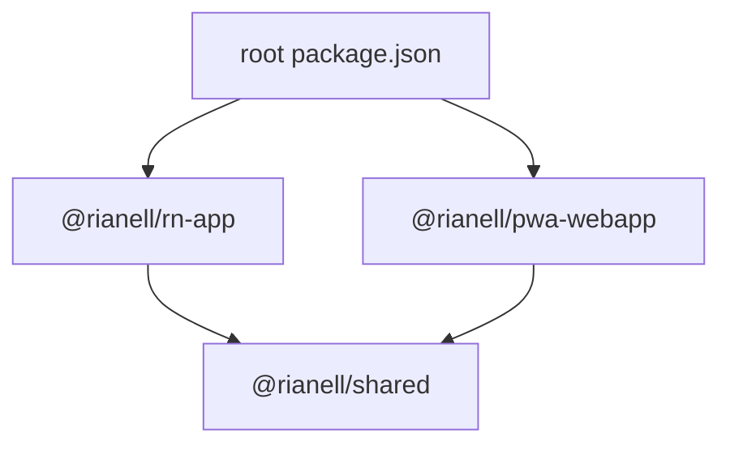

# Rianell architecture standard

Canonical layout contract for the Rianell monorepo. Changelog-style history lives in [CHANGELOG.md](CHANGELOG.md); feature detail in [project-reference.md](project-reference.md).

## Purpose and principles

- **`apps/`** = deployable surfaces (PWA, React Native)
- **`packages/`** = shared libraries consumed via `@rianell/*`
- **Root `package.json`** orchestrates npm workspaces and automation scripts
- **Incremental moves** — one phase per concern; verify gates between phases
- **Python `server/`** stays top-level (not a JS workspace)
- **`i18n-packs/`** remains canonical locale source at repo root (not moved into `packages/`)

References: [Turbo structuring](https://turbo.build/repo/docs/crafting-your-repository/structuring-a-repository), [Nx folder structure](https://nx.dev/docs/concepts/decisions/folder-structure).

## Directory map

```
apps/
  pwa-webapp/          @rianell/pwa-webapp — vanilla JS PWA + esbuild
  rn-app/              @rianell/rn-app — Expo / React Native
packages/
  shared/              @rianell/shared
  ai-engine/           @rianell/ai-engine
  cloud-sync/          @rianell/cloud-sync
  llm/                 @rianell/llm
  tokens/              @rianell/tokens
  build-tools/         @rianell/build-tools (Phase 10+)
  benchmarks/          @rianell/benchmark-runner (workspace root benchmarks/)
scripts/
  build/               PWA build, tokens, icons, orchestrators
  i18n/                locale sync, MT batches, pack generation
  verify/              parity, CSP, privacy, doc-links, migration checks
  ci/                  README, deps doc, deploy probes
  audit/               boot audit, security headers, deploy HTML
  wiki/                sync-wiki, verify-wiki
  models/              LLM weight download/upload/verify
  dev/                 cross-platform dev:web launcher
  lib/                 deprecated shims → @rianell/build-tools
artifacts/             CI binaries + latest.json (was App build/)
docs/                  developer documentation (authoritative for devs)
wiki/                  GitHub Wiki source (user-facing)
server/                Python HTTP + launch-server.ps1
i18n-packs/            canonical locale/policy/MOTD packs
supabase/              schema + edge functions
security/              runbooks, header audits
tests/                 Node unit tests (tests/unit/)
.github/               CI workflows + composite actions
```

### Generated (never source of truth)

| Path | Role |
|------|------|
| `.server-dist/` | Local server bundle from launch-server.ps1 |
| `ci-minified/` | CI minified site staging |
| `apps/pwa-webapp/app.*.min.js` | esbuild output — rebuild after app.js changes |

## Workspace graph



Root workspaces: `apps/rn-app`, `apps/pwa-webapp` (Phase 3+), `packages/*`, `benchmarks`.

## Dependency rules

1. **`packages/*` must not import from `apps/*`**
2. Apps import shared code via `@rianell/*` or synced assets (tokens, i18n JSON)
3. Scripts may import `@rianell/*` and `@rianell/build-tools` (formerly `scripts/lib/`)
4. No nested `package-lock.json` under workspaces (CI guard Phase 13)

## Documentation layers

| Layer | Path | Audience |
|-------|------|----------|
| Architecture | `docs/architecture-standard.md` | All devs + agents |
| Dev reference | `docs/project-reference.md`, `docs/testing-and-configuration.md` | Developers |
| User wiki | `wiki/` | End users |
| Generated | `docs/dependencies.md`, `docs/security-inventory.md` | CI-maintained |

## Naming conventions

- Directories: **kebab-case**, no spaces (`artifacts/` not `App build/`)
- npm scope: **`@rianell/`**
- Script categories under `scripts/<concern>/`

## Adding new code

| Need | Location |
|------|----------|
| New deployable UI | `apps/<name>/` + workspace entry |
| Shared library | `packages/<name>/` + `@rianell/<name>` |
| Build/verify automation | `scripts/<concern>/` |
| User-facing doc | `wiki/` |
| Dev/security doc | `docs/` |

## Artifact and release policy (Phase 14+)

- Git tracks **`artifacts/**/latest.json`** and small metadata only — **not** APK/EXE/zips
- CI job **`commit-app-build`** commits README + manifest JSON; binaries ship via **GitHub Releases** (`publish-release` job)
- Same-origin download links in the PWA resolve via manifest `file` fields pointing at release assets or historical paths
- Legacy Capacitor paths under `artifacts/Legacy/` retained for historical links (see legacy audit below)

## Legacy artifact audit (Phase 15)

| Path | Status | Notes |
|------|--------|-------|
| `artifacts/Legacy/` | **Retain** | Capacitor-era manifests; linked from old docs |
| `artifacts/Android/` | **Retain** | Pre-RNCLI Android manifest only (`latest.json`) |
| `artifacts/Expo/dist-expo-prod/` | **Not in git** | CI artifact only; manifests optional |
| Stale `run-*.md` under `security/securityheaders-runs/` | **Prune** | Keep last 10 (Phase 9) |

No binary blobs removed in Phase 15 — repo already manifest-only under `artifacts/RNCLI-Android/`, `artifacts/iOS/`, `artifacts/Server/`.

## Retention policies (Phase 9+)

- **`security/securityheaders-runs/`** — keep `securityheaders-rianell.com.md` + last 10 per-run files
- **`docs/migration-deploy-observe.log`** — archived in migration signoff after Phase 22

## Cloudflare redirect (Phase 4)

After `App build/` → `artifacts/` deploy, operator applies **301** rule:

- `/App%20build/*` → `/artifacts/*` on rianell.com

Documented in [security/cloudflare-headers-recommended.md](../security/cloudflare-headers-recommended.md).

## doc-links.mjs spec (Phase 5)

Tool: `scripts/verify/doc-links.mjs`

**Checks:**
- Relative links in `docs/**/*.md`, `wiki/**/*.md`, `README.md`, `security/**/*.md`
- Forbidden stale paths in `package.json`, `.github/**/*.yml`, `scripts/**/*.mjs`, `apps/**/*.{js,ts,tsx}`, `server/*.ps1`
- Forbidden: `App build/` (except CHANGELOG history), flat `scripts/*.mjs` post–Phase 7
- Broken `#anchor` cross-refs in architecture-standard

**Usage:** `node scripts/verify/doc-links.mjs --strict` (exit 0 required)

## Migration log

| Phase | Scope | Status | Date |
|-------|-------|--------|------|
| 0 | Standard doc + AGENTS.md + baseline | verified | 2026-06-16 |
| 1 | Empty packages, dev:web, parity | verified | 2026-06-16 |
| 2 | Script nest | verified | 2026-06-16 |
| 3 | PWA workspace | verified | 2026-06-16 |
| 4 | App build → artifacts | verified | 2026-06-16 |
| 5 | doc-links tooling | verified | 2026-06-16 |
| 6 | Docs/wiki realignment | verified | 2026-06-16 |
| 7 | Shim removal | verified | 2026-06-16 |
| 18 | Foundation verify | verified | 2026-06-16 |
| 8–13 | Optimize (orchestrators, build-tools, i18n-all, dev:web, CI guards) | verified | 2026-06-16 |
| 14 | Manifest-only releases | verified | 2026-06-16 |
| 19 | Release verify | verified | 2026-06-16 |
| 15–17 | Scale (legacy, server, PWA/turbo) | verified | 2026-06-16 |
| 20 | Final sign-off | verified | 2026-06-16 |
| 21 | Temp tests teardown | verified | 2026-06-16 |
| 22 | Deploy-observe loop | verified (local stages) | 2026-06-16 |

**Epic status:** local verification complete (Phases 0–22 local stages); merge to `main` + CI green + Cloudflare 301 remain operator tasks — see [migration-signoff.md](migration-signoff.md)
