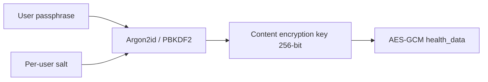

# Cryptography roadmap

**Product:** Rianell  
**Last updated:** 2026-06-13  
**Related:** [SECURITY.md](SECURITY.md) · [threat-model.md](threat-model.md) · [dpia-health-sync.md](privacy/dpia-health-sync.md) · [security-hardening-execution-log.md](security-hardening-execution-log.md)

---

## 1. Current state (v1.49.x)

### 1.1 Cloud backup

| Component | Implementation | Risk |
|-----------|----------------|------|
| Payload encryption | AES-GCM via Web Crypto (`@rianell/cloud-sync`) | Strong at rest **if** key is secret |
| IV | Random 12 bytes per encryption | Good |
| Key storage | Random hex in `user_keys.encryption_key` — **plaintext in Postgres** | **Critical** — DB admin or service-role breach decrypts all backups |
| Key generation | Client-generated on first sync | No user entropy |

Reference schema:

```sql
-- supabase/Schema.sql (excerpt)
CREATE TABLE public.user_keys (
  user_id uuid NOT NULL,
  encryption_key text NOT NULL,  -- plaintext hex today
  ...
);
```

### 1.2 Anonymized contribution

- Separate encryption path; may use operator `ENCRYPTION_KEY` when Python server participates.
- Fail-closed: encryption errors throw rather than upload plaintext ([SECURITY.md](SECURITY.md)).

### 1.3 Local device storage

- **No** app-level encryption for `localStorage` / AsyncStorage health logs.
- Cloud sync optional; local plaintext is accepted environmental risk.

---

## 2. Problem statement

**`user_keys` plaintext** means Supabase operators, anyone with the service role, or a broken RLS policy can decrypt `health_data` without user credentials. Marketing cloud backup as "end-to-end encrypted" is **inaccurate** until the user holds the sole key material.

DPIA R-DPIA-01 tracks this as **high** residual risk ([dpia-health-sync.md](privacy/dpia-health-sync.md)).

---

## 3. Target architecture — passphrase-derived keys

### 3.1 Goals

1. **User-held secret** — passphrase or biometric-gated secret never stored server-side.
2. **Zero plaintext key in DB** — remove `user_keys.encryption_key` column or store only public metadata (salt id, KDF params, optional wrapped key).
3. **Cross-device** — same passphrase derives same key on PWA and RN.
4. **Recovery honesty** — lost passphrase = lost cloud backup (document clearly).

### 3.2 Proposed KDF chain



| Parameter | Proposal |
|-----------|----------|
| KDF | Argon2id (preferred) or PBKDF2-SHA256 (Web Crypto fallback) |
| Salt | 16 bytes random, stored in `user_keys.salt` (non-secret) |
| Iterations / memory | OWASP 2023 mobile-friendly profile; benchmark on low-end Android |
| CEK | 256-bit AES-GCM key derived per sync session |

### 3.3 Migration phases

| Phase | Scope | User impact |
|-------|-------|-------------|
| **Spike (Jun 2026)** | POC in `packages/cloud-sync`; unit tests only | None |
| **Dual-read** | New users passphrase; old users keep hex key until rotate | Opt-in migration wizard |
| **Cutover (v1.50+)** | Stop writing plaintext hex; deprecate column | Required passphrase for new cloud enable |
| **Cleanup** | Drop `encryption_key` column after migration window | SQL migration |

Tracked: [security-hardening-execution-log.md](security-hardening-execution-log.md) SH-05.

---

## 4. Alternative and complementary options

| Option | Pros | Cons | Decision |
|--------|------|------|----------|
| **Supabase Vault** | Managed secrets | Does not remove operator trust; cost | Evaluate for service secrets only |
| **Enclave / OS keystore wrapped key** | Good on mobile | Web parity hard | RN complement post-passphrase |
| **Client-side only key in IDB** | No server key | Lost on device wipe without backup | Insufficient alone |
| **True E2EE with key backup QR** | Power users | UX friction | Backlog |

---

## 5. Supabase HIPAA Projects path

For organisations requiring **HIPAA** compliance:

| Step | Action |
|------|--------|
| 1 | Upgrade to **Supabase HIPAA Projects** (paid; includes BAA) |
| 2 | Select **US region** dedicated HIPAA project |
| 3 | Disable public features not in compliance matrix |
| 4 | Implement passphrase-derived keys **before** claiming HIPAA alignment |
| 5 | Execute **BAA** with Supabase; subprocessors review |
| 6 | Enable audit logging, MFA on operator accounts, rotation runbook |
| 7 | Update [subprocessors.md](privacy/subprocessors.md) and privacy notice |

**Current position:** Rianell consumer deployment is **not** HIPAA-compliant. Document in [other-jurisdictions.md](privacy/other-jurisdictions.md).

### 5.1 HIPAA technical checklist (future)

- [ ] BAA with Supabase
- [ ] Passphrase-derived CEK (no plaintext `user_keys`)
- [ ] Access audit trails
- [ ] Automatic session timeout
- [ ] Minimum necessary RLS policies verified
- [ ] Encrypted backups + key rotation procedure
- [ ] Workforce security training (if team > 1)

---

## 6. Local at-rest encryption (post-cloud)

| Priority | Item |
|----------|------|
| P2 | Optional passphrase for local logs (same CEK or separate) |
| P2 | RN: Android Keystore / iOS Keychain wrap |
| P3 | PWA: Web Crypto + user gesture derived key cache in session |

Depends on cloud passphrase UX learnings from spike.

---

## 7. Open questions

1. **Argon2id in browser** — wasm library size vs PBKDF2 native in Web Crypto?
2. **Passphrase reset** — only via destructive cloud delete + re-upload?
3. **Anonymized pool** — derive separate key for contribution to limit backup key reuse?
4. **Biometric unlock** — RN Face/Touch ID wraps CEK in secure enclave?

Document decisions in this file when spike completes (target **2026-06-30**).

---

## 8. Success criteria

| Criterion | Measurement |
|-----------|-------------|
| No plaintext CEK in Postgres | Schema review + penetration test |
| Cross-platform derive parity | Same ciphertext decrypt on PWA + RN |
| Performance | KDF < 2s on mid-tier Android |
| UX | Clear loss-of-passphrase warning |
| DPIA | R-DPIA-01 closed or downgraded to low |

---

## 9. References

- OWASP Password Storage Cheat Sheet — https://cheatsheetseries.owasp.org/cheatsheets/Password_Storage_Cheat_Sheet.html
- NIST SP 800-132 (PBKDF) — https://csrc.nist.gov/publications/detail/sp/800-132/final
- Supabase HIPAA — https://supabase.com/docs/guides/platform/hipaa-projects
- Rianell cloud-sync crypto — `packages/cloud-sync/src/index.mjs`
