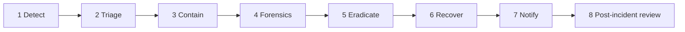

# Incident response plan

**Product:** Rianell  
**Last updated:** 2026-06-13  
**Related:** [threat-model.md](threat-model.md) · [SECURITY.md](SECURITY.md) · [rotation-runbook.md](../security/rotation-runbook.md) · [privacy/eu-gdpr.md](privacy/eu-gdpr.md)

---

## 1. Purpose

This plan defines how the Rianell project detects, classifies, contains, investigates, and notifies stakeholders after a security or personal-data incident. It aligns with GDPR Articles 33–34, UK GDPR, and the Australian Notifiable Data Breaches (NDB) scheme where applicable.

**Incident commander (default):** Project maintainer.  
**Contact:** Private channel per [SECURITY.md](SECURITY.md) — do not disclose active incidents in public GitHub issues.

---

## 2. Severity definitions

| Level | Name | Criteria | Response target | Examples |
|-------|------|----------|-----------------|----------|
| **P0** | Critical | Active exploitation; mass data exposure; service role or DB dump | **15 min** acknowledge; **4 h** containment start | Service role key in public repo; RLS disabled; live DB credentials leaked |
| **P1** | High | Confirmed breach of personal/special-category data; limited scale | **1 h** acknowledge; **24 h** containment | `user_keys` exfiltration; auth bypass reading `health_data` |
| **P2** | Medium | Attempted attack; single-user impact; no confirmed exfiltration | **4 h** acknowledge; **72 h** remediation plan | Bug-report spam; suspicious Supabase auth anomalies |
| **P3** | Low | Near-miss; policy deviation; third-party advisory without exploit | **Next business day** | Dependabot critical with no reachable path; failed Gitleaks on template file |

Escalate severity if scope grows (e.g. P2 → P1 when forensics confirm data access).

---

## 3. Roles

| Role | Responsibility |
|------|----------------|
| **Incident commander** | Declares severity, coordinates timeline, approves external notices |
| **Technical lead** | Containment, forensics, patch, rotation |
| **Privacy lead** | GDPR/NDB assessment, regulator/user notifications |
| **Communications** | User-facing notice drafting (if needed) |

For a solo-maintainer project, one person may hold all roles; document time-stamped decisions in the execution log.

---

## 4. Response phases

### 4.1 Detect

Sources: user report, Gitleaks/OSV CI failure, Supabase Security Advisor, Cloudflare alerts, maintainer observation.

### 4.2 Triage

1. Assign P0–P3.
2. Record UTC timestamp, reporter, initial hypothesis.
3. Determine if **personal data** or **special-category health data** involved.

### 4.3 Contain

| Asset | Containment action |
|-------|-------------------|
| Supabase service role | Rotate immediately — [rotation-runbook.md](../security/rotation-runbook.md) |
| Supabase anon key | Rotate; redeploy PWA/RN with new publishable key |
| Compromised user session | Force password reset via Supabase Auth admin |
| Malicious release | Revert GitHub Pages deploy; invalidate Cloudflare cache |
| Python dev server exposure | Stop process; bind `127.0.0.1` only |

### 4.4 Forensics

Preserve evidence before destructive recovery:

- Supabase **Logs** (API, Auth) — export JSON for incident window
- GitHub Actions run logs for suspect deploy
- Cloudflare firewall events
- Local `logs/` from dev server (redact before sharing)
- Git commit SHAs and diff for suspect changes

**Chain of custody:** store exports in encrypted archive with SHA256 manifest; restrict access.

### 4.5 Eradicate & recover

- Patch vulnerability; re-enable RLS; run `supabase/Schema.sql` policy verification
- Rebuild and redeploy clients
- Confirm [security-hardening-execution-log.md](security-hardening-execution-log.md) entry

### 4.6 Notify

See §5 (GDPR) and §6 (Australia NDB).

### 4.7 Post-incident review

Within **14 days**: root cause, timeline, what worked, backlog items for [threat-model.md](threat-model.md).

---

## 5. GDPR breach notification

### 5.1 Assessment (Art. 33(1))

Notify the **supervisory authority** within **72 hours** of becoming aware, unless the breach is **unlikely to result in a risk** to rights and freedoms.

**Special-category data** (`health_data`, health-derived AI) generally **increases likelihood of risk** — assume notification threshold is low.

### 5.2 Art. 33 — supervisory authority template

Copy and complete within 72 hours of awareness. Send to the lead authority for your establishment (EU: typically where main establishment is; sole maintainer without EU establishment: document analysis and consult legal counsel for lead authority).

---

**GDPR Article 33 — personal data breach notification to supervisory authority**

| Field | Content |
|-------|---------|
| **1. Organisation** | Rianell / [legal entity name if incorporated] |
| **2. Contact** | [DPO or maintainer name, email, phone] |
| **3. Date/time of breach** | [UTC] |
| **4. Date/time awareness** | [UTC] |
| **5. Description of breach** | [What happened: e.g. unauthorised access to Supabase `health_data` / `user_keys` via …] |
| **6. Categories of data** | Health logs (symptoms, vitals, medications, notes); app settings; optional AI state; email (Auth); bug-report metadata |
| **7. Categories of data subjects** | Approximate number: [N] registered users; [M] possibly affected |
| **8. Likely consequences** | [e.g. confidentiality loss of health records; risk of embarrassment, discrimination, phishing] |
| **9. Measures taken / proposed** | [Containment: key rotation, RLS fix, forced reset]; [Recovery: redeploy vX.Y.Z]; [Mitigation: crypto-roadmap item M-01] |
| **10. Cross-border processing** | Supabase region: [e.g. eu-west-1]; subprocessors: [subprocessors.md](privacy/subprocessors.md) |
| **11. Delay justification** | [If >72h: reason and evidence of timely investigation start] |

**Attachments:** forensic timeline, affected tables, sample notification to users (if Art. 34 triggered).

---

### 5.3 Art. 34 — communication to data subjects

Required when breach is **likely to result in a high risk** to rights and freedoms **unless**:

- Appropriate technical/organisational protection (e.g. encryption) rendered data unintelligible to attacker — **note:** `user_keys` plaintext storage may weaken this argument for cloud backups; assess per incident.
- Subsequent measures eliminated high risk.
- Disproportionate effort → public communication or equivalent measure.

#### User notice template (Art. 34)

**Subject:** Important security notice about your Rianell account

Dear [User / Rianell user],

We are writing to inform you of a security incident that may have affected your personal health data stored with Rianell.

**What happened:**  
[Plain-language description, e.g. on [date], we identified unauthorised access to our cloud database backup service.]

**What information was involved:**  
[Health logs, settings, email address, etc. — be specific to incident.]

**What we are doing:**  
[Rotated credentials, patched access controls, engaged forensic review.]

**What you can do:**  
1. Change your Rianell account password.  
2. Review health logs for unexpected changes.  
3. Enable device lock on phones/computers where you use Rianell.  
4. Contact us at [private security contact] with questions.

We regret this incident and are committed to protecting your privacy.

[Date]  
Rianell Team

---

## 6. Australia — Notifiable Data Breaches (NDB)

Under the **Privacy Act 1988** (Cth), eligible data breaches must be assessed under the **NDB scheme**. If serious harm is likely:

1. **Notify affected individuals** as soon as practicable.
2. **Notify the OAIC** using the **NDB form** — https://www.oaic.gov.au/privacy/notifiable-data-breaches

**30-day assessment guideline:** OAIC expects assessment within **30 days** (reasonable period). Document:

| Milestone | Target |
|-----------|--------|
| Awareness | Day 0 |
| Preliminary assessment complete | ≤ 30 days |
| OAIC notification (if required) | As soon as practicable after conclusion |
| Individual notification | Concurrent with or after OAIC (per guidance) |

Use the same forensic packet as GDPR; map fields to OAIC form sections (identity of entity, description, kinds of information, recommendations).

---

## 7. Other jurisdictions (summary)

| Region | Trigger | Authority / users | Doc |
|--------|---------|-------------------|-----|
| UK | UK GDPR Art. 33–34 | ICO within 72h | [other-jurisdictions.md](privacy/other-jurisdictions.md) |
| US state | Varies (e.g. CA 72h) | State AG + users | [other-jurisdictions.md](privacy/other-jurisdictions.md) |
| Brazil LGPD | Risk to subjects | ANPD + users | [other-jurisdictions.md](privacy/other-jurisdictions.md) |

---

## 8. Forensics checklist

- [ ] Establish incident UTC window `[start, end]`
- [ ] Export Supabase API/Auth logs for window
- [ ] List affected `user_id` values (if determinable)
- [ ] Identify attacker IP / user-agent (bug_reports, CF logs)
- [ ] Verify RLS policies active post-incident
- [ ] Check GitHub secret scanning / Gitleaks history
- [ ] Preserve CI workflow definitions at incident commit
- [ ] SHA256 hash all evidence archives
- [ ] Secure delete local copies after retention period (define in RoPA)

---

## 9. Communication rules

| Audience | Channel | Timing |
|----------|---------|--------|
| Regulator | Official portal / email | ≤72h (GDPR/UK) |
| Users (high risk) | In-app banner + email if available | Without undue delay after assessment |
| Public | GitHub security advisory **after** private fix | Coordinated disclosure |
| Press | No comment unless commander approves | — |

---

## 10. Tabletop exercise

**Recommended:** annual 90-minute tabletop covering service-role leak scenario.

| Step | Inject |
|------|--------|
| T+0 | CI emails: Gitleaks found `SUPABASE_SECRET_KEY` in fork PR |
| T+15 | Confirm key valid; unusual `health_data` SELECT in logs |
| T+60 | Decision: P0, rotate, Art. 33 draft |
| T+90 | Post-mortem actions → threat-model backlog |

Log exercise date in [security-hardening-execution-log.md](security-hardening-execution-log.md).
