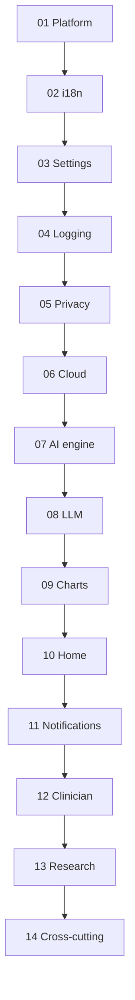

# Rianell execution plans - index

Master index for dependency-ordered agentic execution plans. **Do not change a plan's `execution_order` frontmatter without updating this file.**

**Source of truth:** [MASTER.md](./MASTER.md) · [`SECURITY-PERFORMANCE-INDEX.md`](SECURITY-PERFORMANCE-INDEX.md) · [`FREE-TIER-POLICY.md`](FREE-TIER-POLICY.md) · [`EXTERNAL-SETUP.md`](EXTERNAL-SETUP.md)

---

## Execution order (run plans in this sequence)

| Exec # | Plan file | MASTER § | Title | Feature IDs | Count |
|--------|-----------|----------|-------|-------------|-------|
| 01 | [plan-01-platform-architecture/plan.md](plan-01-platform-architecture/plan.md) | 13 | Platform & architecture | T1, T2 | 2 |
| 02 | [plan-02-accessibility-i18n/plan.md](plan-02-accessibility-i18n/plan.md) | 10 | Accessibility & i18n | I1-I5 | 5 |
| 03 | [plan-03-settings-onboarding/plan.md](plan-03-settings-onboarding/plan.md) | 6 | Settings & onboarding | S1-S8 | 8 |
| 04 | [plan-04-logging-data-capture/plan.md](plan-04-logging-data-capture/plan.md) | 2 | Logging & data capture | L1-L3, L5-L9, L11 | 9 |
| 05 | [plan-05-privacy-compliance/plan.md](plan-05-privacy-compliance/plan.md) | 7 | Privacy & compliance | P1-P7 | 7 |
| 06 | [plan-06-cloud-sync/plan.md](plan-06-cloud-sync/plan.md) | 8 | Cloud sync & portability | D1-D7 | 7 |
| 07 | [plan-07-ai-engine/plan.md](plan-07-ai-engine/plan.md) | 4 | AI engine (deterministic) | A1-A8 | 8 |
| 08 | [plan-08-llm-nlp/plan.md](plan-08-llm-nlp/plan.md) | 5 | On-device LLM & NLP | N1-N7, N9-N11 | 10 |
| 09 | [plan-09-charts-analytics/plan.md](plan-09-charts-analytics/plan.md) | 3 | Charts & analytics | C1-C10 | 10 |
| 10 | [plan-10-home-dashboard/plan.md](plan-10-home-dashboard/plan.md) | 1 | Home & dashboard | H1-H7 | 7 |
| 11 | [plan-11-notifications/plan.md](plan-11-notifications/plan.md) | 9 | Notifications & engagement | R1-R6 | 6 |
| 12 | [plan-12-clinician-sharing/plan.md](plan-12-clinician-sharing/plan.md) | 11 | Clinician & sharing | CL1, CL2, CL4, CL5 | 4 |
| 13 | [plan-13-research-community/plan.md](plan-13-research-community/plan.md) | 12 | Research & anonymized pool | RE1, RE4 | 2 |
| 14 | [plan-14-cross-cutting/plan.md](plan-14-cross-cutting/plan.md) | 14 | Cross-cutting concepts | X14.1-X14.5 | 5 themes |

**Total:** 85 feature IDs + 5 cross-cutting themes - **all shipped** (v1.111.0, CI [green](https://github.com/Metaheurist/Rianell/actions/runs/27845245487))

---

## Dependency graph

---

## Parallel work hints

| Can run in parallel with | Notes |
|--------------------------|-------|
| Plan 01 T2 (Storybook) | Plan 02 I1 (locale pack gaps) - different directories |
| Plan 05 P1-P7 | Plan 06 D1 (CSV) - after plan 04 if schema-stable |
| Plan 07 A1 | Plan 02 I2-I5 - after plan 02 I1 baseline |

Do **not** start plan 14 until plans 01-13 completion gates pass (or items explicitly deferred). **Status (2026-06-19):** Plans 01-14 complete.

---

## Excluded (NR) - not in any plan

H8, L4, L10, L12, I6, N8, CL3, RE2, RE3, T3, T4, T5, T6 - see [`MASTER.md` §Excluded(../MASTER.md#excluded-nr).

---

## Rollout gate (all plans)

Every plan ends with **[`ROLLOUT-GATE.md`](ROLLOUT-GATE.md)**: local test via `server/launch-server.ps1` → commit + CHANGELOG → watch `ci.yml` until green. Stop on error; fix; loop.

---

## Agent instructions

1. Read [MASTER.md](./MASTER.md), [`FREE-TIER-POLICY.md`](FREE-TIER-POLICY.md), [`UI-UX-STANDARDS.md`](UI-UX-STANDARDS.md); pick next `pending` plan whose dependencies are `done`.
2. Open plan folder: **plan.md**, **security-performance.md**, **scope.md**; complete any [`EXTERNAL-SETUP.md`](EXTERNAL-SETUP.md) steps for that plan before manual smoke.
3. Set MASTER **Plan status** → `in_progress`; plan frontmatter `status: in_progress`.
4. Execute **Agent execution** phases; run `node docs/plans/plan-NN-*/scripts/verify-plan.mjs` during work.
5. After each feature: update MASTER **Status**; tick plan checklist.
6. [ROLLOUT-GATE](ROLLOUT-GATE.md): `npm run projects:gate` → CHANGELOG → commit → push → `npm run projects:ci-watch` until `CI_GREEN`. **Stop on error; fix; loop.**
7. Set plan **done**; record CI URL in MASTER §Section rollup.
