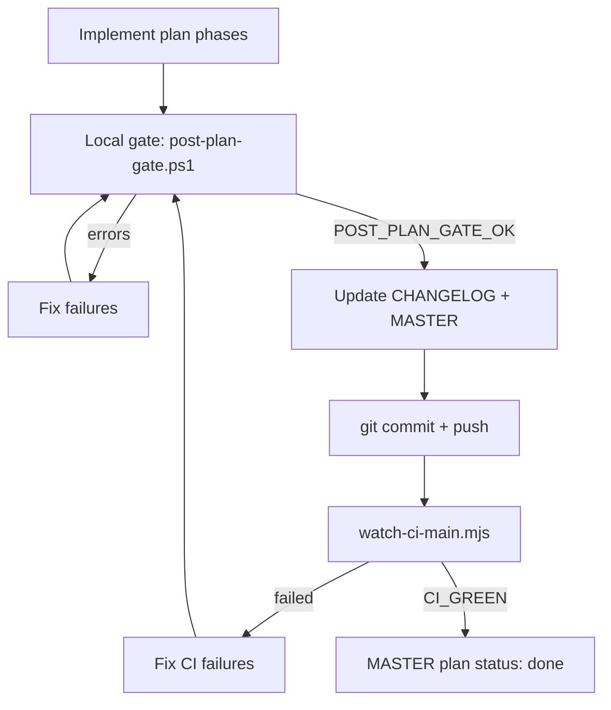

# Execution plans - post-plan rollout gate

**Required after every plan (01-14)** before marking the plan `done` in [`MASTER.md`](./MASTER.md).

Roll out work **by MASTER section** (one plan = one section). Within a plan, land features in phase order (A → B → C); optional smoke after each feature ID, **mandatory full gate before commit**.

---

## Loop (stop on error, fix, repeat until green)



---

## Step 1 - Local gate (must pass with zero boot errors)

From repo root (Windows):

```powershell
powershell -ExecutionPolicy Bypass -File .\scripts\projects\post-plan-gate.ps1
```

Or via npm:

```bash
npm run projects:gate
```

**What it runs:**

1. `npm run test:unit`
2. Plan-specific verify (set `PROJECTS_EXTRA_VERIFY`, e.g. `verify:i18n` for plan 02)
3. `server/launch-server.ps1` - **CI-parity compiled** `.server-dist` (use `-NoCompile` only for fast inner loops)
4. `PROBE_URL=http://127.0.0.1:8080/ npm run audit:boot:strict`
5. Stops the server; prints `POST_PLAN_GATE_OK` on success

**Stop flow if:** unit tests fail, build fails, boot audit reports page errors, or `latest-boot-audit.json` has failures.

Fast inner loop (no minify build):

```powershell
powershell -ExecutionPolicy Bypass -File .\scripts\projects\post-plan-gate.ps1 -NoCompile
```

---

## Step 2 - Changelog + MASTER

Only after `POST_PLAN_GATE_OK`:

1. Add a **`docs/CHANGELOG.md`** entry under a new patch version (plan scope summary, bullet per major feature ID shipped).
2. Bump `package.json` `version` if releasing a user-visible slice.
3. Update [`MASTER.md`(../MASTER.md): feature rows → `done`, section rollup → `done`, progress summary counts.
4. Tick plan **Completion gates** and feature checklist in the plan file.

---

## Step 3 - Commit + push

One commit per completed plan (unless user asks to split):

```bash
git add -A
git commit -m "feat(projects): plan NN - <section title> (<feature IDs>)"
git push origin HEAD
```

Use a body referencing MASTER § and plan file. Do not skip hooks.

---

## Step 4 - CI monitor (stop on failure, fix, loop)

After push:

```bash
npm run projects:ci-watch
```

Or with explicit run id:

```bash
node scripts/projects/watch-ci-main.mjs <run-id>
```

**Green** = workflow `ci.yml` conclusion `success` (prints `CI_GREEN`).

**On failure:**

1. `gh run view <id> --log-failed` for the failing job
2. Fix in repo
3. Re-run **Step 1** local gate
4. Commit fix + push
5. Re-watch until `CI_GREEN`

Gate jobs that cancel downstream work on failure: **unit-tests**, **prepare-minified-assets**, **deploy-pages**, **audit-boot-post-deploy**.

---

## Plan-specific `PROJECTS_EXTRA_VERIFY`

| Plan | Extra npm script |
|------|------------------|
| 01 | `verify:root-hygiene` (optional) |
| 02 | `verify:i18n` |
| 05 | `verify:privacy-docs` |
| 06 | `parity:inventory:check` |
| 08 | `verify:llm-security` |
| default | (none) |

Example:

```powershell
$env:PROJECTS_EXTRA_VERIFY = "verify:i18n"
npm run projects:gate
```

---

## Agent rules

- **Do not** mark a plan `done` in MASTER without local gate + green CI (or documented deferral with user approval).
- **Do not** push without passing local gate first.
- **Do** stop immediately on errors; fix before retrying.
- **Do** one plan per commit cycle unless user directs otherwise.
