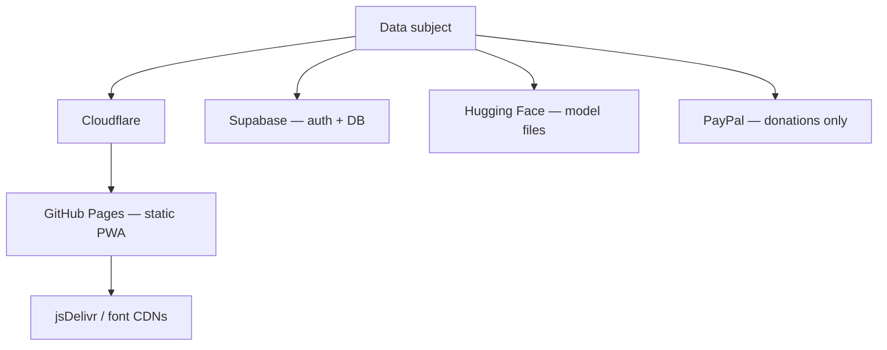

# Subprocessors and infrastructure providers

**Product:** Rianell  
**Last updated:** 2026-06-13  
**Related:** [global-baseline.md](global-baseline.md) · [ropa.json](ropa.json) · [eu-gdpr.md](eu-gdpr.md) · [infrastructure-and-security-edge.md](../infrastructure-and-security-edge.md)

---

## 1. Purpose

This register lists third parties that process personal data on behalf of Rianell when users use cloud sync, visit the website, download on-device models, or submit bug reports. It supports GDPR Art. 28 due diligence and transparency schedules in the privacy policy.

**Controller:** Rianell project operator (sole maintainer unless otherwise incorporated).  
**DPA status key:**

| Status | Meaning |
|--------|---------|
| **Signed** | Written Data Processing Agreement or equivalent in place |
| **Standard terms** | Relies on provider's GDPR DPA incorporated into Terms (unsigned but accepted) |
| **N/A** | No personal data processed by this party for Rianell |
| **Planned** | DPA review scheduled |

---

## 2. Subprocessor register

| Subprocessor | Role | Data categories | Location / transfer | DPA status | Notes |
|--------------|------|-----------------|---------------------|------------|-------|
| **Supabase, Inc.** | Auth, Postgres hosting, PostgREST API | Email, auth identifiers, encrypted health backups, encryption key material (`user_keys`), anonymized research blobs, bug reports | Region selected at project creation (e.g. EU/US); SCCs for non-EEA | **Standard terms** — [Supabase DPA](https://supabase.com/legal/dpa) | RLS enforced in app schema; not HIPAA BAA by default |
| **GitHub, Inc. (Microsoft)** | Source repo, GitHub Pages static hosting, Actions CI | Deploy secrets metadata; no user health in repo; committer identity | US / global | **Standard terms** — [GitHub DPA](https://docs.github.com/en/site-policy/privacy-policies/github-privacy-statement) | Production bundle contains only publishable Supabase key |
| **Cloudflare, Inc.** | DNS, reverse proxy, TLS, caching, bot mitigation | IP address, HTTP headers, request paths | Global edge | **Standard terms** — [Cloudflare DPA](https://www.cloudflare.com/cloudflare-customer-dpa/) | See [cloudflare-headers-recommended.md](../security/cloudflare-headers-recommended.md) |
| **Hugging Face, Inc.** | Model weight and tokenizer CDN for on-device LLM | IP, download URLs; no direct health payload in API calls | US / EU infra | **Standard terms** — review [Privacy Policy](https://huggingface.co/privacy) | User device fetches weights; prompts stay local |
| **PayPal Holdings, Inc.** | Optional donation checkout (if enabled on site) | Payment identifiers, email if user provides | Global | **Standard terms** — PayPal DPA for merchants | Health data not sent to PayPal |
| **jsDelivr / Prospect One** | CDN for JavaScript libraries (e.g. Transformers.js, pinned Supabase UMD) | IP, referer | Global CDN | **Standard terms** | Subresource Integrity on fixed scripts where applicable |
| **Google Fonts / Font CDN providers** | Web fonts (if loaded from CDN) | IP, referer | Global | **Standard terms** | Consider self-hosting to reduce disclosure |
| **Font Awesome** | Icon webfont/CSS CDN | IP | Global | **Standard terms** | Loaded per CSP in PWA |
| **Expo / EAS (if used)** | RN build and OTA updates when enabled | Developer account data; minimal end-user PII in default self-build flow | US | **Standard terms** | End-user data stays in app + Supabase path |
| **Apple / Google** | App store distribution (if published) | Store account metadata | Per store policy | **Platform terms** | App does not use store IAP for health features today |

---

## 3. Data flows by subprocessor

---

## 4. International transfers

When subprocessors process data outside the EEA/UK:

1. Rely on provider **Standard Contractual Clauses (SCCs)** or UK IDTA where offered.
2. Document transfer mechanism in [eu-gdpr.md](eu-gdpr.md) Art. 44–49.
3. **Supabase region:** select EU region for new projects when primary audience is EEA.

---

## 5. Due diligence checklist (Art. 28)

Before adding a new subprocessor:

- [ ] Processing necessary and proportionate?
- [ ] Written instructions documented in RoPA?
- [ ] Provider DPA / SCC available?
- [ ] Security whitepaper or SOC 2 reviewed?
- [ ] Subprocessor listed here and in `ropa.json`?
- [ ] User-facing privacy notice updated?

---

## 6. Change log

| Date | Change |
|------|--------|
| 2026-06-13 | Initial register for v1.49.x stack |

---

## 7. Contact

Subprocessor questions: maintainer private channel per [SECURITY.md](../SECURITY.md).  
User rights requests: [data-subject-rights.md](data-subject-rights.md).
