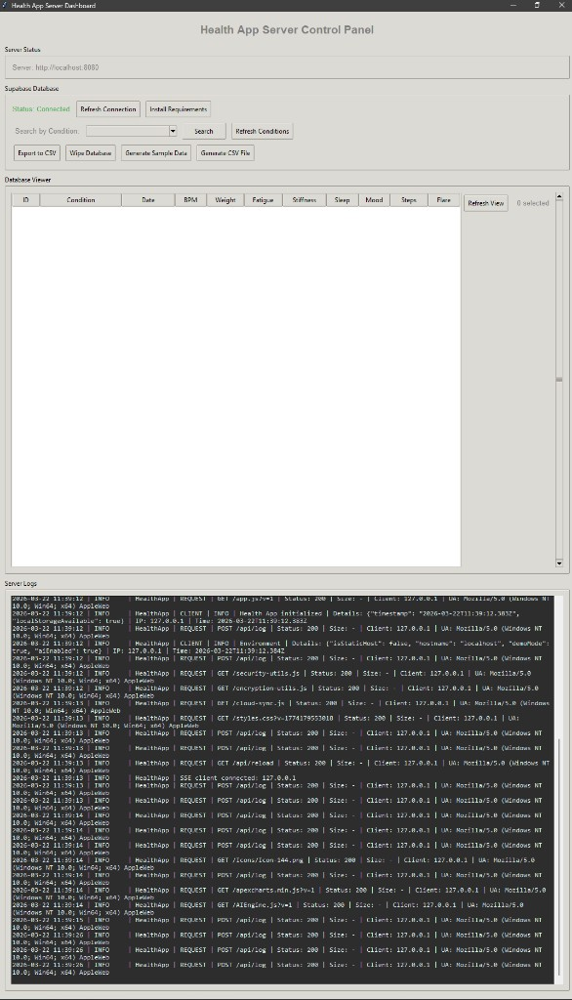

<a id="nav-installation"></a>

## ⚙️ Installation

### v1.90.0 architecture layout (scripts, artifacts, workspaces)

Canonical layout: **[architecture-standard.md](architecture-standard.md)** and **[AGENTS.md](../AGENTS.md)**.

- **Build (PWA):** `npm run build:web` or `npm run build:web:min` - orchestrated by `scripts/build/run-web.mjs` (sync i18n → vendor → esbuild).
- **Local web dev:** `npm run dev:web` (cross-platform; Windows runs `launch-server.ps1`, Unix runs minify + `python -m server`).
- **CI artifacts:** binaries and manifests under **`artifacts/`** (renamed from the legacy spaced artifact directory). Git tracks **`latest.json`** only; APK/EXE/zips ship via GitHub Releases.
- **Verify gates:** `npm run verify:migration:foundation` (after layout changes), `npm run verify:migration` (full sign-off), `node scripts/verify/doc-links.mjs --strict`.
- **Scripts:** nested under `scripts/{build,i18n,verify,ci,audit,wiki,models,dev}/` - not flat `scripts/*.mjs`.

### v1.60.0 i18n asset sync (esbuild)

- **`node scripts/i18n/sync-i18n-assets.mjs`** copies canonical **`i18n-packs/`** (locale, prompt, motd, policy) into the PWA and **`packages/shared/`**; regenerates **`promptPackData.mjs`** and runs **`sync-policy-pack.mjs`**. Used by **`build:web`** and CI before the vendor bundle.
- **Language switch:** Settings → Privacy & region → Language; UI refreshes via `onLocaleChange`. **13 shipped locales:** en-GB (default), en-US, en-AU, pt-BR, fr-FR, de-DE, es-ES, it-IT, pl-PL, nl-NL, pt-PT, **ar**, **he** (RTL, ui-only LLM).
- **Build order:** edit canonical JSON under **`i18n-packs/`** → `sync-i18n-assets.mjs` → verify with `node scripts/verify/verify-locale-packs.mjs`.

### v1.53.1 validation

- **Web benchmarks:** `node benchmarks/scripts/run-web-benchmarks.mjs` (opens Settings in Playwright).

### v1.53.0 On-device LLM weights (HF-only)

On-device weights download from Hugging Face Hub only (onnx-community `*-ONNX` repos). No Supabase Storage bucket is required.

### v1.50.0 documentation sync (consent and erasure UX)

- **Health data consent (GDPR Art. 9):** Before first cloud sync or anonymised contribution, the PWA shows a **Health data processing consent** modal (`#healthDataConsentOverlay`). Decline keeps data local-only.
- **Cloud erasure (Art. 17):** Settings → **Delete cloud data** runs unified deletion across **`health_data`**, **`user_keys`**, **`anonymized_data`**, and **`bug_reports`** (`deleteAllUserDataFromCloud`). Separate actions can remove encrypted backups or anonymised contribution only. See [data-subject-rights.md](privacy/data-subject-rights.md).

### v1.46.24 documentation sync

- **Dependency inventory:** After changing **`package.json`** (any workspace), **`requirements.txt`**, or PWA CDN URLs in **`apps/pwa-webapp/index.html`**, run **`npm run docs:dependencies`** and commit **`docs/dependencies.md`** so pull-request CI passes. Pushes to **`main`** can auto-commit via **`commit-dependencies-doc`** if the file drifted.

### v1.46.14 documentation sync

- **Repository performance benchmarks** (Lighthouse, history/compare Markdown) live under **`benchmarks/`** (npm workspace **`@rianell/benchmark-runner`**). From the repo root: **`npm ci`**, then **`npm run benchmark`** (see **`benchmarks/README.md`**). CI writes the same tree on **`main`** via **`commit-benchmarks`**.

### v1.44.2 documentation sync

- Local server startup keeps CI-parity web preprocessing (`server/launch-server.ps1`) so runtime theme and UI behaviour matches built artifacts more closely.
- Theme persistence now applies from first paint, including loading overlay visuals, when `rianellSettings.globalTheme` is present.

### v1.45.2 documentation sync

- Unified CI now includes a dedicated app functionality unit-test stage (`npm run test:unit`) before server build and Pages deploy jobs.

### v1.45.3 documentation sync

- Unit tests now cover behaviour-level contracts in addition to markup wiring (theme apply flow, MOTD tab scoping, voice-input permission checks, and selected CSS contracts).
- Run locally from repo root:
  ```bash
  npm run test:unit
  ```

### Prerequisites
- Python 3.8 or higher
- Modern web browser (Chrome, Firefox, Edge, Safari)
- Supabase account (for cloud sync features)

### Setup

1. **Clone the repository**
   ```bash
   git clone https://github.com/Metaheurist/Rianell.git
   cd Rianell
   ```

2. **Install Python dependencies**
   ```bash
   pip install -r requirements.txt
   ```

3. **Configure environment variables**
   - Copy [`security/.env.example`](../security/.env.example) to **`security/.env`** (see [SECURITY.md](SECURITY.md#local-secrets-directory-security)). If that file is missing, the server still loads a legacy `.env` at the repo root.
   - Edit **`security/.env`** and add your Supabase credentials:
     ```env
     PORT=8080
     HOST=127.0.0.1
     SUPABASE_URL=your_supabase_url_here
     SUPABASE_PUBLISHABLE_KEY=your_publishable_key_here
     # Legacy: SUPABASE_ANON_KEY=… still works if PUBLISHABLE is unset
     ```

4. **Configure Supabase (for frontend)**
   - **`apps/pwa-webapp/supabase-config.js`** uses placeholders (`YOUR_PROJECT_REF`); CI replaces them on GitHub Pages deploy from repository secrets.
   - For local dev, replace placeholders or use the Python server Supabase interception on localhost.
   - ⚠️ **Important**: Use the **Publishable** key only in the client, never a **Secret** key (e.g. service_role).


<a id="nav-usage"></a>

## 🚀 Usage

### Running the Server

Start the development server from the **repository root** (so the `server` package resolves correctly):

```bash
python -m server
```

On **Windows**, you can use the helper script (same behaviour as `python -m server`):

```powershell
powershell -ExecutionPolicy Bypass -File .\server\launch-server.ps1
```

If you use PowerShell 7+:

```powershell
pwsh -File .\server\launch-server.ps1
```

For local **non-compiled** mode (serve **`apps/pwa-webapp/`** directly), use:

```powershell
powershell -ExecutionPolicy Bypass -File .\server\launch-server.ps1 -NoCompile
```

In `-NoCompile` mode, the launcher runs unit tests (`tests/unit/app-functionality.test.mjs`) before starting the server. To skip this gate:

```powershell
powershell -ExecutionPolicy Bypass -File .\server\launch-server.ps1 -NoCompile -SkipUnitTests
```

Optional port:

```powershell
$env:PORT = "9000"
powershell -ExecutionPolicy Bypass -File .\server\launch-server.ps1
```

The server will:
- Start on `http://localhost:8080` (or your configured PORT)
- Open your browser automatically
- Display a Tkinter dashboard for server controls
- Enable file watching for auto-reload (if watchdog is installed)

### Accessing the App

1. **Local Development**: Open `http://localhost:8080` in your browser
2. **Network Access**: The server defaults to **loopback** (`127.0.0.1`). To open the app from another device on your LAN, set **`HOST=0.0.0.0`** in **`security/.env`** (or legacy root `.env`) and use your PC’s LAN IP (see [SECURITY.md](SECURITY.md)). For sensitive dev APIs from non-loopback clients, set **`HEALTH_APP_SENSITIVE_APIS_ON_LAN=1`** (trusted networks only). Optional **`HEALTH_APP_SENSITIVE_APIS_LAN_SECRET`**: when set, clients must send **`X-Rianell-LAN-Secret`** for those APIs. Server logs use **rotation** (size-capped); see [SECURITY.md](SECURITY.md).
3. **Production**: Deploy files to a web server (no local server needed)

<a id="github-pages-app-at-repo-root"></a>

### GitHub Pages (app at repo root)

The app lives in **`apps/pwa-webapp/`**, so GitHub Pages will not see `index.html` if the source is the repo root. The public site is **[rianell.com](https://rianell.com/)**; GitHub Actions can also deploy the same build to Pages (e.g. `https://<user>.github.io/Rianell/`).

1. In the repo: **Settings → Pages**
2. Under **Build and deployment**, set **Source** to **GitHub Actions**
3. The unified workflow [`.github/workflows/ci.yml`](../.github/workflows/ci.yml) runs the **`deploy-pages`** job on push to `main`/`master` and deploys a prepared **`site/`** folder as the site root (copy of **`apps/pwa-webapp/`** plus `artifacts/` if present), so `index.html` is served correctly. The **`prepare-minified-assets`** job runs **`node apps/pwa-webapp/build-site.mjs --site ci-minified/site`**: instrument first-party JS (optional function trace hooks), esbuild minify, then **content-hash** the main bundle to **`app.<hash>.min.js`**, fingerprint **`styles.css`** → **`styles.<hash>.css`**, write **`asset-manifest.json`**, and patch **`index.html`** (preload, links, script). This replaces stable **`app.min.js`** / query-string-only cache busting for production deploys.

**Custom domain (`rianell.com`):** In **Settings → Pages**, set the custom domain and keep **Enforce HTTPS** on. At your DNS provider, use GitHub’s documented records (apex: four **A** records to `185.199.108.153`-`185.199.111.153`; **www**: **CNAME** to `<user>.github.io`). This repo includes **`apps/pwa-webapp/CNAME`** (contents: `rianell.com`) so each deploy publishes the domain hint at the site root, alongside the GitHub UI setting.

If the site works elsewhere but your PC shows **`ERR_CONNECTION_REFUSED`**, DNS is often fine globally while your machine still has a stale cache, a bad **AAAA**, or a firewall/VPN path. Run **`powershell -ExecutionPolicy Bypass -File .\scripts\check-rianell-dns.ps1`** from the repo to verify **A**/**AAAA**/**www**, then try **`ipconfig /flushdns`**, another network (e.g. phone on cellular), or remove incorrect **AAAA** records for the apex.

**Cloud sync on the live site:** To use Supabase (login, cloud backup, anonymised data) on the GitHub Pages site, add **Repository secrets** (or **Environment secrets** for the `pages` environment): **`SUPABASE_URL`** (your project URL, e.g. `https://xxxx.supabase.co`) and **`SUPABASE_ANON_KEY`** (your **Publishable** key from the Dashboard; the workflow variable name is legacy). The deploy workflow injects these into the built site at deploy time so they are never committed. If these secrets are not set, the site still deploys; cloud features will work only after you add them.

After the first push (or a manual **Run workflow**), the deployed site will show **Rianell** instead of the README.

### CI: artifacts on each commit

- CI jobs in [`.github/workflows/ci.yml`](../.github/workflows/ci.yml) build the Server EXE and deploy the GitHub Pages web app.

### Using Rianell

1. **Add Daily Entries**:
   - Click "Add Entry" button
   - Fill in health metrics for the day
   - Add food items and exercises
   - Save the entry

2. **View Analytics**:
   - Navigate to the Analytics section
   - View charts showing trends
   - Analyse correlations between metrics

3. **Manage Data**:
   - Export data: Settings → Export Data
   - Import data: Settings → Import Data
   - Clear all data: Settings → Clear All Data

4. **Cloud Sync**:
   - Accept the **Health data processing consent** modal (GDPR Art. 9) before first sync
   - Enable "Contribute anonymised data" in Settings if desired
   - Data will be anonymised and synced to Supabase
   - **Delete cloud data** in Settings removes all user-linked rows from Supabase (see v1.50 note above)

<a id="server-dashboard-features"></a>

### Server Dashboard Features



The Tkinter dashboard (`server/dashboard_ui.py`) provides a **responsive** layout:

- **Landscape:** left sidebar navigation (Home · Data · Tools · Logs)
- **Portrait / narrow:** bottom tab bar with the same four sections

**Overview tab** - status cards for local server URL, Supabase connection, live reload, and Clean Chromium; quick actions to search data or open logs.

**Data tab** - connection refresh, condition search, record count badge, export / wipe / sample-data actions, and a database viewer (last 100 rows, multi-select).

**Tools tab** - live reload pause/start, push reload to browsers, Chromium download, pip `requirements.txt` install.

**Logs tab** - colour-coded stream with level filter (All / Info+ / Warning+ / Errors only), clear, and auto-scroll toggle. Lines use **`[LEVEL]`** brackets (file/console logs still use emoji - see [Logging](project-reference.md#logging)).

**Supabase DNS errors:** if the dashboard shows “DNS failed” or “host unreachable”, update `SUPABASE_URL` in `security/.env` with your live project URL from the Supabase dashboard.
