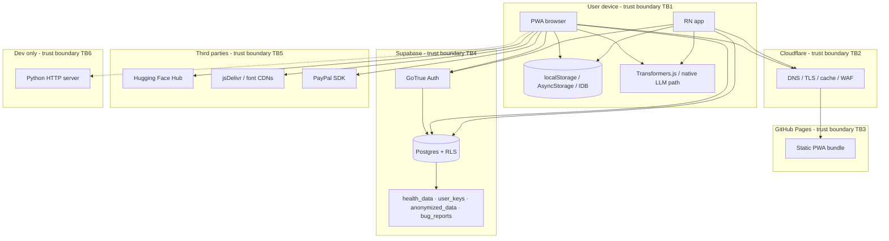
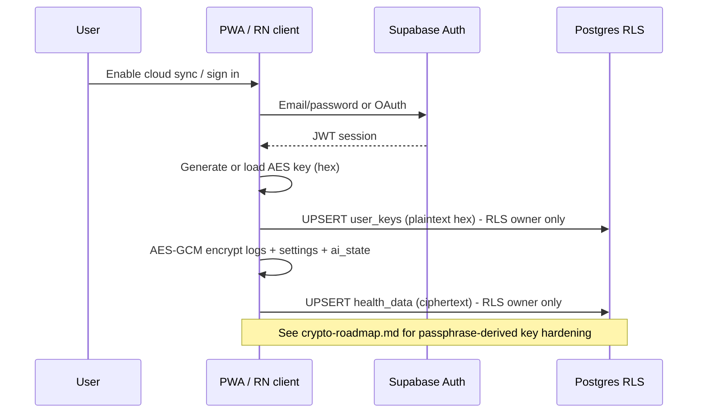
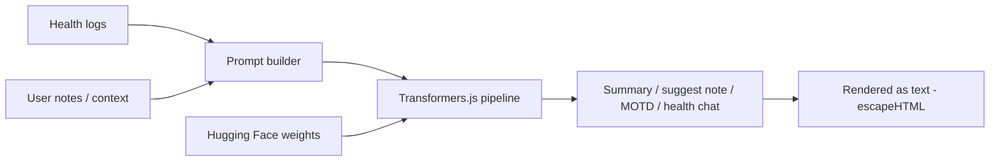
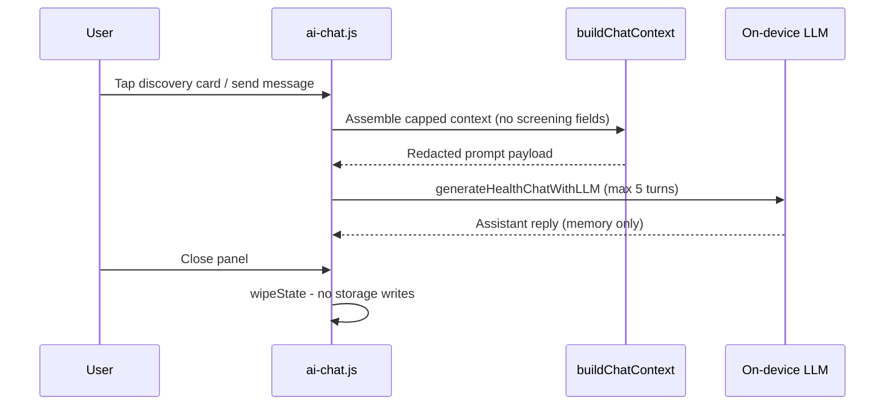

# STRIDE threat model - Rianell PWA / React Native / Supabase

**Product:** Rianell personal health dashboard  
**Version baseline:** v1.49.x  
**Last updated:** 2026-06-23  
**Owner:** Project maintainer  
**Related:** [SECURITY.md](SECURITY.md) · [ai-security.md](ai-security.md) · [crypto-roadmap.md](crypto-roadmap.md) · [incident-response.md](incident-response.md) · [compliance/launch-checklist.md](compliance/launch-checklist.md)

---

## 1. Purpose and scope

This document applies STRIDE (Spoofing, Tampering, Repudiation, Information disclosure, Denial of service, Elevation of privilege) to Rianell across:

- **PWA** (`apps/pwa-webapp/`) - static assets on GitHub Pages behind Cloudflare
- **React Native** (`apps/rn-app/`) - Expo / RN CLI builds for Android and iOS
- **Supabase** - Auth, Postgres (RLS), PostgREST API
- **Optional Python dev server** (`server/`) - local operator tooling only
- **Third-party edges** - Hugging Face (model weights), jsDelivr/CDNs, PayPal (donations)

Out of scope: clinical regulated deployments (HIPAA BAA not in place today), enterprise MDM policies, and end-user device compromise beyond documented mitigations.

---

## 2. System context



---

## 3. Assets

| ID | Asset | Classification | Storage / transit | Owner |
|----|-------|----------------|-------------------|-------|
| A1 | Daily health logs (symptoms, vitals, meds, notes) | **Special category** (health) | Device plaintext; cloud AES-GCM ciphertext in `health_data` | End user |
| A2 | App settings & goals | Personal data | Device + optional encrypted cloud backup | End user |
| A3 | AI prediction state (`ai_state`) | Personal / inferred health | Device + optional cloud backup | End user |
| A4 | Per-user AES key (`user_keys.encryption_key`) | **Cryptographic secret** (stored plaintext server-side today) | Supabase `user_keys` | End user |
| A5 | Anonymized research payloads | Pseudonymous health-derived | Supabase `anonymized_data` (encrypted blob + condition label) | Project / research pool |
| A6 | Supabase session (JWT, refresh token) | Authentication credential | Device secure storage / browser storage | End user |
| A7 | Supabase anon / publishable key | Public client credential | Embedded in client bundles | Operator |
| A8 | Supabase service role key | **Critical secret** | CI secrets, `security/.env`, never in clients | Operator |
| A9 | Bug reports (UA, IP, console, optional user_id) | Personal / technical | Supabase `bug_reports` | Operator |
| A10 | On-device LLM model weights | Supply-chain artifact | Cache (IDB / filesystem) from Hugging Face | Third party |
| A11 | Operator encryption key (anonymized pipeline) | Secret | `security/.encryption_key` or env | Operator |
| A12 | Source repository & CI secrets | Operational | GitHub | Operator |

---

## 4. Trust boundaries

| Boundary | Crosses | Assumption | Failure mode |
|----------|---------|------------|--------------|
| **TB1** Device ↔ network | Health logs, auth tokens, API calls | User controls device; OS patch level reasonable | Malware, shoulder surfing, unencrypted local storage |
| **TB2** User ↔ Cloudflare | HTTPS static assets | Cloudflare config matches [cloudflare-headers-recommended.md](../security/cloudflare-headers-recommended.md) | Misconfigured CSP, cache poisoning |
| **TB3** Cloudflare ↔ GitHub Pages | Built JS/CSS | CI integrity; no secret in artifacts | Compromised Actions workflow |
| **TB4** Client ↔ Supabase | CRUD via PostgREST + Auth | RLS enforces `auth.uid()`; anon key is public | RLS misconfiguration, service role leak |
| **TB5** Client ↔ third parties | Model downloads, fonts, PayPal | Pin versions; SRI where static | CDN/HF compromise, supply-chain |
| **TB6** Browser ↔ Python server | Dev APIs (`/api/encryption-key`) | Loopback or LAN+secret only | LAN exposure without secret |

---

## 5. Data flow diagrams

### 5.1 Cloud backup (authenticated)



### 5.2 Anonymized contribution (optional)

```mermaid
sequenceDiagram
  participant U as User
  participant C as Client
  participant DB as anonymized_data

  U->>C: Opt in to anonymized contribution
  C->>C: Strip direct identifiers; encrypt payload
  C->>DB: INSERT row (user_id, anonymized_log, medical_condition)
  Note over DB: user_id links row to account until erasure workflow runs
```

### 5.3 On-device LLM inference



### 5.4 Ephemeral health chat (PWA Home)



---

## 6. STRIDE analysis

### 6.1 Spoofing

| Threat | Description | Likelihood | Impact | Mitigations |
|--------|-------------|------------|--------|-------------|
| S1 | Attacker signs in as victim using stolen credentials | Medium | High | Supabase Auth; user password hygiene; optional MFA (roadmap) |
| S2 | Fake static site serving malicious bundle | Low | Critical | HTTPS + HSTS; monitor DNS; pin releases to GitHub Pages origin |
| S3 | Bug report insert with forged `user_id` | Low | Low | RLS: authenticated inserts must match `auth.uid()` when user_id set |

### 6.2 Tampering

| Threat | Description | Likelihood | Impact | Mitigations |
|--------|-------------|------------|--------|-------------|
| T1 | Modify another user's `health_data` via API | Low | High | RLS owner-only policies in [Schema.sql](../supabase/Schema.sql) |
| T2 | Tamper with local logs on device | Medium | Medium | No app-level integrity MAC on local storage; device security |
| T3 | MITM on Supabase TLS | Low | High | HTTPS only; certificate pinning not implemented (accepted risk) |
| T4 | Poisoned model weights from CDN/HF | Low | High | Pin model IDs; monitor HF; see [ai-security.md](ai-security.md) |

### 6.3 Repudiation

| Threat | Description | Likelihood | Impact | Mitigations |
|--------|-------------|------------|--------|-------------|
| R1 | User denies consent to cloud processing | Low | Medium | In-app GDPR Art. 9 consent modals; local consent flags |
| R2 | Operator cannot prove incident timeline | Medium | Medium | [incident-response.md](incident-response.md); Supabase audit logs (paid tier) |

### 6.4 Information disclosure

| Threat | Description | Likelihood | Impact | Mitigations |
|--------|-------------|------------|--------|-------------|
| I1 | `user_keys` plaintext readable by DB admin | Medium | Critical | Documented risk; [crypto-roadmap.md](crypto-roadmap.md) |
| I2 | XSS exfiltrates localStorage health logs | Medium | High | `escapeHTML` / `sanitizeHTML`; CSP (residual `unsafe-inline`) |
| I3 | GraphQL schema introspection exposes table names | Low | Low | `pg_graphql` dropped in schema; see SECURITY.md |
| I4 | Bug report leaks console PII | Medium | Medium | User education; truncate console capture |
| I5 | Anon key in bundle enables enumeration | Low | Medium | RLS; revoke anon on sensitive tables |
| I6 | LLM prompt includes sensitive notes in memory | Medium | Medium | On-device only; no server upload of prompts today |

### 6.5 Denial of service

| Threat | Description | Likelihood | Impact | Mitigations |
|--------|-------------|------------|--------|-------------|
| D1 | Flood `bug_reports` insert | Medium | Low | RLS length checks; rate limits (Supabase dashboard) |
| D2 | Large cloud sync payload | Low | Medium | Client-side batching; operator DB limits |
| D3 | Bot traffic on static site | Medium | Low | Cloudflare Bot Fight Mode |
| D4 | On-device LLM exhausts memory | Medium | Low | Model tier selection; consent + progress UI |

### 6.6 Elevation of privilege

| Threat | Description | Likelihood | Impact | Mitigations |
|--------|-------------|------------|--------|-------------|
| E1 | `anon` role reads `health_data` | Low | Critical | REVOKE anon; RLS; CI `verify-rls-baseline.mjs` |
| E2 | Service role key in client bundle | Low | Critical | Build-time checks; Gitleaks in CI |
| E3 | LAN dev APIs without secret | Low | High | `HEALTH_APP_SENSITIVE_APIS_LAN_SECRET` required when LAN mode on |
| E4 | Overly permissive RLS on `anonymized_data` | Low | Medium | Owner CRUD only |

---

## 7. Threat actors

| Actor | Capability | Primary targets |
|-------|------------|-----------------|
| Opportunistic attacker | Network, public anon key | RLS bypass attempts, bug_report spam |
| Malicious insider (operator) | Supabase dashboard, service role | `user_keys`, all backups |
| Compromised dependency | Supply chain | npm/CDN/HF payloads |
| Physical device thief | Device access | localStorage / AsyncStorage plaintext |
| Curious researcher | Valid account | Own data only unless RLS fails |

---

## 8. Mitigation backlog (tracked)

| ID | Item | Priority | Status | Link |
|----|------|----------|--------|------|
| M-01 | Passphrase-derived keys; stop plaintext `user_keys` | P0 | Planned | [crypto-roadmap.md](crypto-roadmap.md) |
| M-02 | Local at-rest encryption (keystore / passphrase) | P1 | Planned | [SECURITY.md](SECURITY.md#future-hardening-not-implemented) |
| M-03 | Tighten CSP - remove `unsafe-eval` where possible | P1 | In progress | [security-hardening-execution-log.md](security-hardening-execution-log.md) |
| M-04 | Supabase MFA for operator accounts | P1 | Open | [rotation-runbook.md](../security/rotation-runbook.md) |
| M-05 | Rate limiting on `bug_reports` (edge or RPC) | P2 | Open | This doc §6.5 D1 |
| M-06 | SRI / pinning for all static third-party scripts | P2 | Partial | [SECURITY.md](SECURITY.md) |
| M-07 | Supabase HIPAA Projects evaluation | P2 | Spike | [crypto-roadmap.md](crypto-roadmap.md) |
| M-08 | Prompt-injection guardrails for on-device LLM | P2 | Documented | [ai-security.md](ai-security.md) |
| M-09 | Automated RLS verification against live project | P3 | Open | `scripts/verify/verify-rls-baseline.mjs` (doc-only today) |
| M-10 | `security.txt` on production host | P3 | Open | [infrastructure-and-security-edge.md](infrastructure-and-security-edge.md) |

---

## 9. Review cadence

- **Quarterly** STRIDE refresh or after major architecture change (new data store, server-side LLM, payment flow).
- **Per release** when touching `supabase/Schema.sql`, cloud-sync crypto, or auth flows.
- Record outcomes in [security-hardening-execution-log.md](security-hardening-execution-log.md).

---

## 9.1 Launch audit cross-reference (Phases 3-8)

| Phase | Threat focus | Mitigation doc |
|-------|--------------|----------------|
| 3 - SRI/CSP | Tampering, disclosure via compromised CDN | `verify-sri-integrity.mjs`, `security.txt` |
| 4 - Compliance | Regulatory misrepresentation | `docs/compliance/*` |
| 5 - Performance | DoS via heavy boot | `docs/performance-budget.md` |
| 6 - Accessibility | Exclusion, focus escape | `verify-a11y-tokens.mjs`, app lock trap |
| 7 - RN hardening | Device extraction | `logsAesGcm.ts`, [android-hardening.md](compliance/android-hardening.md) |
| 8 - Ops docs | Incident handling gaps | [launch-checklist.md](compliance/launch-checklist.md) |

---

## 10. References

- OWASP Top 10:2025 - https://owasp.org/Top10/2025/
- Microsoft STRIDE - https://learn.microsoft.com/en-us/azure/security/develop/threat-modeling-tool-threats
- Rianell schema - [supabase/Schema.sql](../supabase/Schema.sql)
