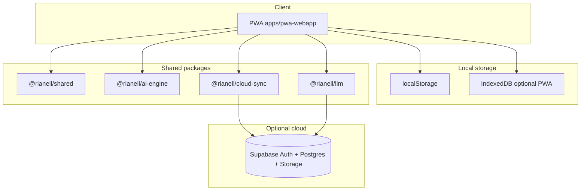

# Architecture Overview

High-level view of how Rianell components fit together. For layer-by-layer AI detail, see the repo doc linked below.

---

## System diagram

---

## Data flow

1. User logs via **log wizard** → entry normalised by `@rianell/shared`.
2. Stored locally (plaintext in browser storage).
3. **Charts** and **AI Analysis** read local logs.
4. If cloud sync enabled → encrypt with per-user AES key → upload ciphertext to `health_data`.
5. Optional LLM → download ONNX weights from Hugging Face → cache locally → generate summaries on device.

---

## PWA key modules

| File | Role |
|------|------|
| `app.js` | Core UI |
| `AIEngine.js` | Bundled analysis engine |
| `summary-llm.js` | Transformers.js LLM |
| `model-chunk-loader.js` | Chunked model download |
| `cloud-sync.js` | Encrypted sync |
| `i18n-pwa.js` | Locale runtime |
| `build-site.mjs` | esbuild + content hashing |

---

## i18n pipeline

Canonical strings: `i18n-packs/` → `scripts/i18n/sync-i18n-assets.mjs` → PWA and `packages/shared`.

Verify before PR: `npm run verify:i18n`.

---

## Server

Python package in `server/` serves the PWA, optional Tk dashboard, and dev APIs. Packaged as Windows EXE via CI (PyInstaller).

---

## Read more (technical)

- [Design token contract](https://github.com/Metaheurist/Rianell/blob/main/docs/design-token-contract.md) - `@rianell/tokens` runtime authority (v2.1.6+)
- [AI architecture](https://github.com/Metaheurist/Rianell/blob/main/docs/ai-architecture.md)
- [Data model](https://github.com/Metaheurist/Rianell/blob/main/docs/data-model.md)
- [Server API](https://github.com/Metaheurist/Rianell/blob/main/docs/server-api.md)
