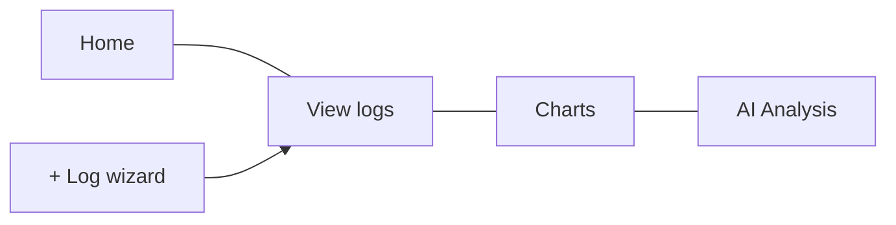

# Features Guide

Rianell helps you log daily health metrics, spot trends, and optionally run AI-assisted analysis — all from a simple tabbed interface.

---

## Main navigation

| Tab | Purpose |
|-----|---------|
| **Home** | Today’s summary, goals progress, streak patterns, weekly review card, optional AI suggestion chips |
| **View logs** | Browse, expand, edit, share, or delete past entries |
| **Charts** | ApexCharts visualisations with optional predictions |
| **AI Analysis** | Rule-based insights plus optional on-device LLM summaries |

The green **+** floating button opens the **log wizard** from any tab.

---

## Log wizard

Step through date, vitals, symptoms, food, exercise, medications, and notes. You can **quick-save** after date + flare only; missing numeric scores get sensible defaults so charts still work.

When **cycle tracking** is enabled (Settings → Data options or first-run tutorial), step 1 includes **Period started today**, cycle day (1–35, expandable to 45), phase, and optional flow — with suggested values from your last period start.

**First-run:** The onboarding footer shows a single step counter across wizard screens and tutorial slides (same on web and native).

Detailed field reference: [[Logging-Data]].

---

## Goals and targets

Open **Goals & targets** from Home or Settings. The modal has two panes:

- **Targets** — steps, hydration, sleep quality, good-days per week
- **Achievements** — badges for progressive logging unlocks (food day 7, exercise day 14, medications day 21)

Swipe or use arrows to move between panes. Locked wizard steps link here when a category is not yet unlocked.

---

## Settings carousel

Open the gear icon for a scrollable settings carousel:

- **Display** — theme, colour-blind mode, notifications
- **Data options** — demo mode, export/import, clear data, **cycle tracking module**
- **Performance** — on-device AI model download and benchmarks
- **Privacy & region** — language, region gate, policy documents, consent
- **Cloud** — sign-in, sync, delete cloud data

Full list: [[Settings-and-Languages]].

---

## Export, print, and share

- **Export** health logs as JSON (portable across web and mobile).
- **Password-protected export** — encrypt your export file with a passphrase (minimum 12 characters); the file cannot be opened without it.
- **QR handoff** — generate a short-lived encrypted QR code to share a view-only log summary with a clinician in-office (passphrase required, min 12 characters).
- **Hosted share links** (cloud) — create a time-limited encrypted link you can send to a clinician or carer. Choose a date range, whether to include free-text notes and condition name, and set a password. The link is encrypted before upload; Rianell cannot read your data.
- **Print** summary views where supported (web/PWA).

Import preview sanitises user content before display.

---

## App lock

Protect Rianell with a local passcode. Two modes:

| Mode | Requirement |
|------|-------------|
| **Passphrase** | 12+ characters, mixed case + number + special recommended |
| **PIN** | 4–8 digits; simple sequences (1234, 0000) are blocked |

Settings → Security lock. The passcode is stored only on your device.

---

## Notifications and MOTD

Optional reminders and a message-of-the-day on Home. MOTD quotes are localised; your log notes are never auto-translated.

---

## Platforms

| Platform | Notes |
|----------|-------|
| **Web / PWA** | Primary surface at [rianell.com](https://rianell.com); installable |
| **Android / iOS** | React Native (Expo) apps; CI alpha builds in [[Downloads]] |

Feature parity between web and native is tracked in [[Platforms-and-Parity]].

---

## Read more (technical)

- [App overview & features](https://github.com/Metaheurist/Rianell/blob/main/docs/app-and-features.md)
- [Data model](https://github.com/Metaheurist/Rianell/blob/main/docs/data-model.md)
