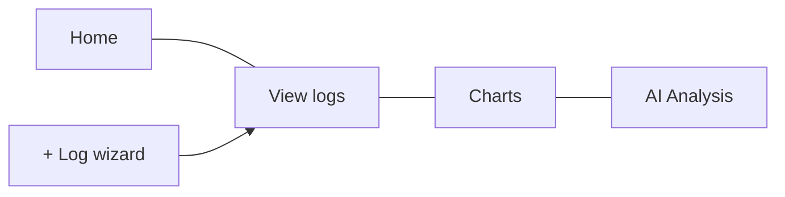

# Features Guide

Rianell helps you log daily health metrics, spot trends, and optionally run AI-assisted analysis — all from a simple tabbed interface.

---

## Main navigation

| Tab | Purpose |
|-----|---------|
| **Home** | Today’s summary, goals progress, streak patterns, weekly review card, optional AI suggestion chips |
| **View logs** | Browse, expand, edit, share, or delete past entries |
| **Charts** | ApexCharts visualisations with optional predictions |
| **AI Analysis** | Rule-based insights plus optional on-device LLM summaries |

The green **+** floating button opens the **log wizard** from any tab.

---

## Log wizard

Step through date, vitals, symptoms, food, exercise, medications, and notes. You can **quick-save** after date + flare only; missing numeric scores get sensible defaults so charts still work.

When **cycle tracking** is enabled (Settings → Data options or first-run tutorial), step 1 includes **Period started today**, cycle day (1–35, expandable to 45), phase, and optional flow — with suggested values from your last period start.

**First-run:** A guided questionnaire modal asks one friendly multichoice question at a time (appearance, **profile companion**, region, coach tone, helper level, consents, optional AI download). Progress dots and a step counter match on web and native. Tutorial is opt-in from the finish card or Settings replay; tutorial slides use side arrows with **Finish** on the last slide only.

**Sliders:** Every symptom and wellness metric uses the same scale — **Bad (0)** on the left, **Good (10)** on the right. Symptom scores (fatigue, pain, etc.) are stored in their original semantics but displayed on the unified scale.

Detailed field reference: [[Logging-Data]].

---

## Goals and targets

Open **Goals & targets** from Home or Settings. The modal has two panes:

- **Targets** — steps, hydration, sleep quality, good-days per week
- **Achievements** — badges for progressive logging unlocks (food day 7, exercise day 14, medications day 21)

On web, the header **target** button gently glows until you save at least one non-zero target (respects reduced-motion settings).

Swipe or use arrows to move between panes. Locked wizard steps link here when a category is not yet unlocked.

---

## Profile companion (v2.1.2)

During first-run setup (or later in **Settings → Display**), pick one of **20 abstract profile companions** from a **scrollable carousel** (arrow buttons or swipe). Each companion has a unique silhouette (orb, tide, leaf, prism, moon, ember, and more) with the same friendly two-dot style and soft glow.

Your companion appears in the **header** and **log wizard**. Achievement badges use **animated icons** matched to each badge type (not the companion portrait). **Metric companions** (small animated glyphs) sit beside wellness sliders on capable devices. Low-tier phones skip metric companions to save GPU budget.

---

## Settings carousel

Open the gear icon for a scrollable settings carousel:

- **Display** — theme, colour-blind mode, notifications
- **Data options** — demo mode, export/import, clear data, **cycle tracking module**
- **Performance** — on-device AI model download and benchmarks
- **Privacy & region** — language, region gate, policy documents, consent
- **Cloud** — sign-in, sync, delete cloud data
- **Integrations** — Strava, Withings, Google Sheets connectors; migration import wizard

Full list: [[Settings-and-Languages]].

---

## Third-party connectors

Settings → **Integrations** pane (requires cloud sign-in; blocked in local-only mode):

1. **Connect** opens provider OAuth (Strava activities, Withings vitals, Google Sheets).
2. **Sync now** imports into daily logs using date-aware merge (existing fields are preserved).
3. **Google Sheets** — configure spreadsheet URL plus import/export ranges; export appends recent logs.
4. **Disconnect** revokes integration metadata and server-side tokens.

Developer/operators: [docs/connectors/SETUP.md](https://github.com/Metaheurist/Rianell/blob/main/docs/connectors/SETUP.md).

---

## Export, print, and share

- **Export** health logs as JSON (portable across web and mobile).
- **Password-protected export** — encrypt your export file with a passphrase (minimum 12 characters); the file cannot be opened without it.
- **QR handoff** — generate a short-lived encrypted QR code to share a view-only log summary with a clinician in-office (passphrase required, min 12 characters).
- **Hosted share links** (cloud) — create a time-limited encrypted link you can send to a clinician or carer. Choose a date range, whether to include free-text notes and condition name, and set a password. The link is encrypted before upload; Rianell cannot read your data.
- **Print** summary views where supported (web/PWA).

Import preview sanitises user content before display.

---

## App lock

Protect Rianell with a local passcode. Two modes:

| Mode | Requirement |
|------|-------------|
| **Passphrase** | 12+ characters, mixed case + number + special recommended |
| **PIN** | 4–8 digits; simple sequences (1234, 0000) are blocked |

Settings → Security lock. The passcode is stored only on your device.

---

## Ambient UI (Oasis)

Rianell uses gentle, GPU-friendly motion to make logging feel calmer — especially for chronic-illness users who may use **brain fog** or **reduced motion** modes.

| Effect | Where | Respects reduced motion? |
|--------|-------|--------------------------|
| Ambient blobs | Home, Logs, Charts, Mood, AI tabs (web) | Yes — hidden on low-tier devices and when reduced motion is on |
| Mood Control Deck | Mood tab check-in + quick actions (web) | Parallax/aurora disabled when reduced motion is on |
| Mood day detail | Tap a compact history card on Mood tab | Modal shows that day’s log, check-ins, and average |
| Ask Rianell (Home) | Bottom-sheet chat from discovery pills / + AI | Opens only when AI is enabled and the on-device model is ready (otherwise enable/download prompts). Topic-aware offline / generic replies when the LLM cannot run |
| Calm-glow metrics | Improving vitals/metrics (web) | Static glow remains in brain-fog mode; pulse disabled |
| Neural trace | AI tab (web + mobile) | Hidden when reduced motion is on |
| Milestone confetti | After achievements / milestones (web) | Skipped when reduced motion or brain fog |
| Welcome pulse ring | Home welcome card (mobile) | Stopped when OS or in-app reduced motion is on |

Toggle **Reduced motion** in Settings → Display. Brain fog mode further reduces visual noise while keeping readable status colours.

Developer blueprint: [UI_OASIS_PLAN.md](https://github.com/Metaheurist/Rianell/blob/main/docs/plans/UI_OASIS_PLAN.md).

---

## Notifications and MOTD

Optional reminders and a message-of-the-day on Home. MOTD quotes are localised; your log notes are never auto-translated.

---

## Platforms

| Platform | Notes |
|----------|-------|
| **Web / PWA** | Primary surface at [rianell.com](https://rianell.com); installable |
| **Android / iOS** | React Native (Expo) apps; CI alpha builds in [[Downloads]] |

Feature parity between web and native is tracked in [[Platforms-and-Parity]].

---

## Read more (technical)

- [App overview & features](https://github.com/Metaheurist/Rianell/blob/main/docs/app-and-features.md)
- [Data model](https://github.com/Metaheurist/Rianell/blob/main/docs/data-model.md)
