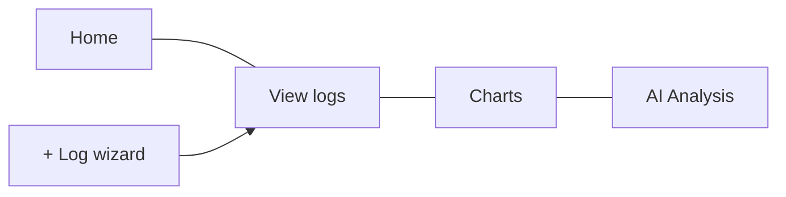

# Features Guide

Rianell helps you log daily health metrics, spot trends, and optionally run AI-assisted analysis — all from a simple tabbed interface.

---

## Main navigation

| Tab | Purpose |
|-----|---------|
| **Home** | Today’s summary, goals progress, optional AI suggestion chips |
| **View logs** | Browse, expand, edit, share, or delete past entries |
| **Charts** | ApexCharts visualisations with optional predictions |
| **AI Analysis** | Rule-based insights plus optional on-device LLM summaries |

The green **+** floating button opens the **log wizard** from any tab.

---

## Log wizard

Step through date, vitals, symptoms, food, exercise, medications, and notes. You can **quick-save** after date + flare only; missing numeric scores get sensible defaults so charts still work.

Detailed field reference: [[Logging-Data]].

---

## Goals and targets

Set personal targets (e.g. steps, hydration) in **Settings**. Home shows progress against active goals.

---

## Settings carousel

Open the gear icon for a scrollable settings carousel:

- **Display** — theme, colour-blind mode, notifications
- **Data options** — demo mode, export/import, clear data
- **Performance** — on-device AI model download and benchmarks
- **Privacy & region** — language, region gate, policy documents, consent
- **Cloud** — sign-in, sync, delete cloud data

Full list: [[Settings-and-Languages]].

---

## Export, print, and share

- **Export** health logs as JSON (portable across web and mobile).
- **Print** summary views where supported (web/PWA).
- **Share** individual log entries (web).

Import preview sanitises user content before display.

---

## Notifications and MOTD

Optional reminders and a message-of-the-day on Home. MOTD quotes are localised; your log notes are never auto-translated.

---

## Platforms

| Platform | Notes |
|----------|-------|
| **Web / PWA** | Primary surface at [rianell.com](https://rianell.com); installable |
| **Android / iOS** | React Native (Expo) apps; CI alpha builds in [[Downloads]] |

Feature parity between web and native is tracked in [[Platforms-and-Parity]].

---

## Read more (technical)

- [App overview & features](https://github.com/Metaheurist/Rianell/blob/main/docs/app-and-features.md)
- [Data model](https://github.com/Metaheurist/Rianell/blob/main/docs/data-model.md)
